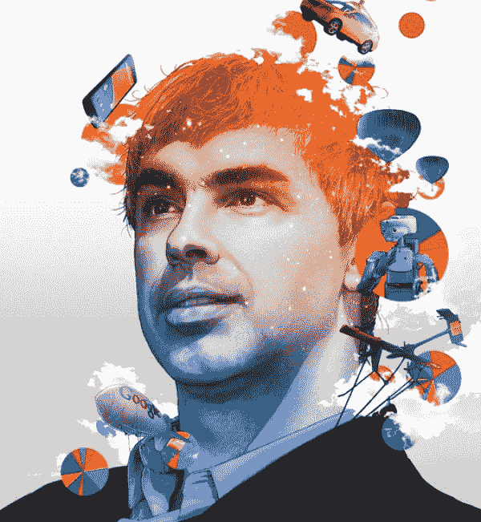

# 约翰·巴特利的搜索博客谷歌:信息第一的企业集团

> 原文：<http://battellemedia.com/archives/2014/11/google-information-first-conglomerate.php?utm_source=wanqu.co&utm_campaign=Wanqu+Daily&utm_medium=website>

[

<noscript></noscript>](http://fortune.com/2014/11/13/googles-larry-page-the-most-ambitious-ceo-in-the-universe/) 

Larry Page on the cover of Fortune, Nov. 13 2014

上周，谷歌首席执行官拉里·佩奇[获得了《财富》杂志的封面待遇](http://fortune.com/2014/11/13/googles-larry-page-the-most-ambitious-ceo-in-the-universe/)，这是试图量化谷歌不断扩张的业务的众多此类文章中的最新一篇。商业媒体热衷于回答这个问题，即我们是否已经到达了“T2 的巅峰，谷歌的 T3”(显然《财富》杂志的观点是我们没有，因为他们把他命名为“年度商业人物”。)

“巅峰谷歌”是我喜欢称之为“传染性误解”的东西——它似乎有道理，因此值得考虑。毕竟，我们已经看到 IBM、微软和其他公司达到了巅峰，但在面临创新者的困境时，它们却落后了。搜索已经过了它的全盛时期，谷歌是一家搜索公司，因此是巅峰谷歌。

但正如《财富》杂志的文章所言(是的，我是被引用的，因为这很有价值)，谷歌在搜索之外还有很多事情要做。虽然它继续榨取数十亿美元的季度利润中心，但它又建立了五项数十亿美元的业务——其中一些与其搜索帝国直接相关，但其他则没有。Google Apps/Cloud、YouTube/Play、Android、Ventures 和 Adtech 已经突破了 10 亿美元大关。等待着的巨大业务包括家庭自动化(Nest)、医疗保健(Calico)、交通运输(司机/自动驾驶汽车)和连接(光纤)。除此之外，还有十几个潜在的重磅炸弹，涉及能源、机器人、人工智能、可穿戴设备，以及谷歌背后不为人知的登月计划。

正是这种惊人的广度——《财富》杂志称之为该公司看似无限的雄心——引起了围绕谷歌使命宣言的长期内部辩论:

> "组织世界上的信息，并使其普遍可用和有用."

近两年来，佩奇一直在试探扩大谷歌使命宣言的可能性。2013 年 1 月，当 Nest 首席执行官托尼·法德尔(Tony Faddell)向他的员工宣布谷歌收购时，佩奇走上舞台，回答了目瞪口呆的观众的提问。一名员工问佩奇，谷歌为什么对一家家庭自动化公司感兴趣——这似乎与谷歌对搜索、应用和移动的关注完全吻合。据活动中的消息人士透露，佩奇回答说，谷歌的使命宣言可能不够大，不足以遏制他的公司的野心。

自第一次承认以来，佩奇一直在测试扩大任务的想法，并在《财富》杂志上公开表达了他的矛盾心理，告诉米格尔·赫尔夫特“这可能有点太狭隘了。”乍一看，这似乎是对的——恒温器与组织世界信息有什么关系呢？

其实还挺多的。

当你透过我称之为“信息优先”业务的镜头来看待谷歌时，事情开始变得更有意义了。按照这个标准，谷歌不仅是一家信息优先的公司，它还是世界上第一家信息优先的*企业集团*——在经历从“物质第一”到“信息第一”转变的每一个市场开创或收购业务

例如，我们看到运输业务首先转向信息。目前备受指责但仍非同寻常的优步就是证明，Zip Car、特斯拉和整个自动驾驶汽车行业也是如此。这些新型企业的真正价值在于它们如何理解运输市场中的信息流，然后用新方法解决老问题(我如何从这里到那里？)使用基于信息技术的新颖和/或更有效的方法。优步没有把汽车(商品)或司机(生产资料)放在第一位——它把信息处理放在第一位。然后，汽车和司机重新组织新的信息流，然后——*瞧*！–170 亿美元的公司在四年内诞生。优步证明，如果你在传统市场解决了困难的信息处理问题，你就能创造出超越世界的价值。Airbnb、DocuSign、Lending Club 等等都是同一论点的进一步例证。

那么，哪些市场向信息优先框架过渡的时机已经成熟？好吧，让我们来分析一下什么是“成熟”的市场。我认为，市场有两个关键属性随时可能被信息优先的方法彻底改变。首先，在一个市场中，组织和处理不当的信息具有流动性。换句话说，有大量的数据，但是没有很好地组织或计算。例如，想想 1998 年的万维网。大量的信息，组织混乱，缺乏处理层。谷歌进来了，瞧，一家价值数十亿美元的公司在短短五年内诞生了。第二，寻找一个目前由**集中控制点**控制的市场，但是如果**消费者获得控制权**，这个市场有可能被迅速重组。再来看看搜索——在谷歌之前，像美国在线和雅虎这样的门户网站统治着网络。每个人都去堵塞点“看看互联网上有什么。”谷歌之后，消费者掌控了自己的网上冲浪。

那么……哪些市场既有数据流动性，目前又被集中的瓶颈所控制？好吧，让我们看看移动。大量的数据，组织得很糟糕，被运营商和操作系统供应商控制着。检查！或者，医疗保健怎么样？哦，太好了！能量？没错。连通性？当然可以！还没有信息流动性，但即将有流动性的市场——家庭自动化、食品、零售——也是重塑的时机。

世界正在转变为信息，而这些信息需要被组织、访问和使用。我认为谷歌的使命根本不需要改变。不管他们当时是否知道，谷歌创造了一个宣言，我相信在经济向信息优先范式转变的背景下，这个宣言将被证明是正确的。当这个时代的历史被书写时，我敢打赌，谷歌将被视为第一个信息优先的企业集团，既识别又利用这种转变。