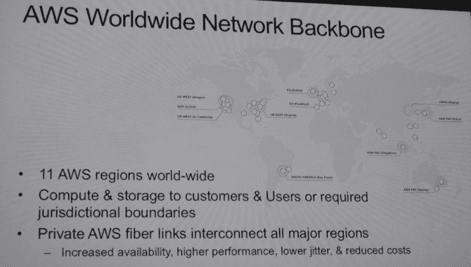
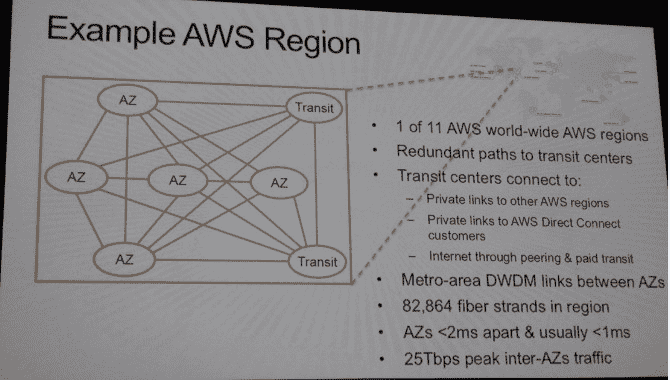
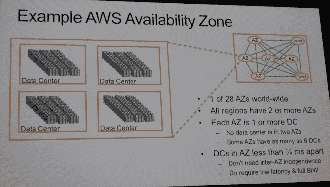
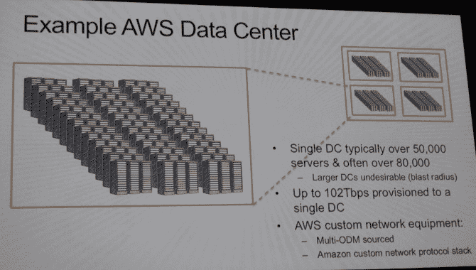
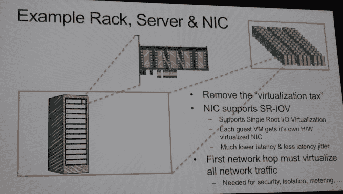
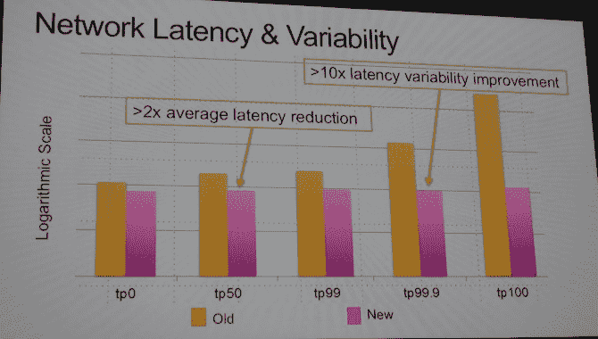

# 对 AWS 庞大规模的罕见一瞥

> 原文：<http://www.enterprisetech.com/2014/11/14/rare-peek-massive-scale-aws/?utm_source=wanqu.co&utm_campaign=Wanqu+Daily&utm_medium=website>

# 对 AWS 庞大规模的罕见一瞥

正如先锋亚马逊网络服务公司(Amazon Web Services)在 8 年前推出其首款实用计算和存储产品时所认为的那样，云计算背后的理念是抽象出底层硬件，并向程序员提供原始资源，供应用程序运行。这种硬件对 AWS 来说是一种竞争优势，就像对其母公司在线零售商一样，这也是 AWS 很少谈论其数据中心和系统的原因。但是，随着谷歌、微软和 IBM 都在谈论他们在云领域的投资和创新，亚马逊必须揭开面纱。

原因很简单。亚马逊在线零售业务可能是一个 700 亿美元的庞然大物，但它不会产生大量现金。亚马逊创始人兼首席执行官杰夫·贝索斯对利润的兴趣不如他对改变周围世界的兴趣大，但云计算业务是世界上资本最密集的业务之一。由于其在在线搜索领域近乎垄断的地位，谷歌可以在数据中心上花费数百亿美元，而且毫不犹豫。由于微软在桌面软件上近乎垄断的地位以及在数据中心软件上的主导地位，它也有非常雄厚的财力，可以花同样多的钱。

没有人质疑谷歌或微软的投资能力，即使我们都想知道它们如何能够提供与亚马逊相匹敌的广泛的基础设施和平台服务。但人们开始质疑亚马逊是否能在谷歌和微软的长期竞争中保持同步。(Andy [Jassy，亚马逊负责云部门的高级副总裁，在本周的 re:Invent 大会上面对这样的问题。)因此，AWS 副总裁兼杰出工程师詹姆斯·汉密尔顿(James Hamilton)透露了 AWS 云的规模和范围，只是为了提醒大家，它具有先发优势，亚马逊绝对致力于建设这项业务和支持它的基础设施。](https://www.enterpriseai.news/2014/11/12/enterprises-gravitate-amazons-cloud/)

规模也许是最重要的事情，没有人需要向亚马逊这样的在线零售商传授这方面的知识。对于亚马逊，很少有人谈论*公有* *云*，这是因为亚马逊认为，就其本质而言，云意味着它不能是私有的。从长远来看，亚马逊认为公共云的大规模将意味着很少有组织会运行自己的数据中心。

句号。句号。仔细想想。

詹姆斯·汉密尔顿，AWS 杰出工程师

本周在拉斯维加斯举行的 AWS re:Invent 大会上，Jassy 一次又一次地说，这是他和亚马逊首席技术官沃纳·威格尔自云部门创建以来一直倡导的一个主题。(尽管他们根据一份为期十年、价值 6.6 亿美元的合同，为美国中央情报局构建了一个特殊版本的 AWS 云，但这显然是云手段公共规则的一个例外。)贾西和沃格尔斯认为这一点的原因很简单:那些在大多数地区拥有最多云容量和最丰富功能的人将赢得业务，除了少数例外(如金融服务云或利用率接近 100%的大型超级计算中心以及特殊需求的硬件和软件)，公共云的资源不仅足够好，而且比许多组织自己构建和支持的还要好。

Amazon Web Services 从程序员那里抽象出了集群的底层计算、存储和网络功能，因此他们可以专注于创建应用程序，无论是在原始基础架构上，还是在平台服务上，平台服务之上都有另一个抽象层，以进一步自动化中间件、数据库和其他支持应用程序的服务的部署和管理。但这并不意味着底层基础设施不重要。事实上，亚马逊已经花了一大笔钱来设计和建造自己的数据中心，优化从内存芯片到数据中心墙壁的一切。基础设施绝对重要，这绝对是一个竞争优势。

***网络是比服务器更大的痛点***

像许多超大规模数据中心运营商一样，亚马逊开始从大型一线服务器制造商那里购买服务器，并最终成为 Rackable Systems(现在是 SGI 的一部分)机器的最大买家。但随着时间的推移，像谷歌、脸书、百度及其同行一样，该公司决定设计自己的系统，以根据自己的工作负载进行精确调整，更重要的是，与数据中心及其电力和冷却系统紧密结合。数据中心随着时间的推移而发展，系统也随之发展。

在过去，亚马逊希望暗示其基础设施的规模，而不是非常具体，所以他们提出了这个指标。从 2004 年开始，AWS 每天都会安装足够的服务器基础设施来托管整个亚马逊电子零售业务，当时零售商亚马逊的年收入为 70 亿美元，是目前规模的十分之一。

“在过去的一年里发生了什么变化，”汉密尔顿反问，然后讽刺道:“我们已经做了 365 次。”

这是另一种说法，在过去的一年中，AWS 增加了足够的能力来支持 2.55 万亿美元的在线零售业务，如果允许存在的话。

那么 AWS 有多大的容量呢？答案超出了许多人的想象，AWS 云的架构是亚马逊在 20 世纪 90 年代末完善的，以赋予其自身的运营弹性。

这是服务器数学。亚马逊在全球有 11 个地区拥有数据中心容量。这些区域中的每一个都至少有两个可用性区域，所有区域总共有 28 个可用性区域。(这包括两周前在德国法兰克福启动的新区域。)这些可用性区域在本地级别为工作负载提供隔离和冗余，就像一种仅在数据中心和服务级别类似于 Tandem 或 Stratus 的容错系统，而不是通过在两个系统之间移动时完全锁步。每个可用性区域至少有一个数据中心，有些区域有多达六个数据中心。(在 2013 年 1 月的 re:Invent 上，Hamilton 说美国东部地区拥有超过 10 个数据中心，但在他在 re:Invent 2014 上的演示中，他说没有一个地区拥有超过 6 个数据中心。)其理念是，客户将其应用程序设计为跨不同的可用性区域运行以实现本地数据保护，然后跨多个区域运行以实现更高级别的可用性。Amazon 通过添加全新的数据中心来扩大每个可用性区域的容量。

像企业客户加机架，基本上。事实上，数据中心是 AWS 这样的公司的新机架。

总之，有趣的是。Hamilton 表示，每个 AWS 区域至少有两个可用性区域和至少一个数据中心，如果不是更多的话，然后补充说，典型的数据中心至少有 50，000 台服务器，有时超过 80，000 台服务器。他补充说，数据中心的经济规模大约在这个较高的水平上耗尽，在某个点之后，该数据中心的增量成本会上升，而不是下降，因为增加了更多的铁，更重要的是，在某个数量上，数据中心故障的“爆炸半径”太大，不允许这么多工作负载被灾难性故障中断。

让我们在这里做一些数学。假设 AWS 有 28 个可用性区域，每个区域有一个数据中心，每个数据中心只有 50，000 台服务器。这是 AWS 基础设施可以拥有的最小容量。这相当于全球 140 万台服务器。如果您将它归类，并说所有区域都有 80，000 台机器(我们知道这不是真的，但只是放一个误差线在上面)，那将是 224 万台机器。为了更好地猜测 AWS 基础设施的规模，您需要估计这些可用性区域内数据中心数量的分布情况。我碰巧想到有一些只有一个数据中心，一大堆有两个数据中心，然后随着数据中心数量的增加而逐渐减少，直到每个可用性区域达到最多六个数据中心。我摆弄了一下数字，得出在这 28 个可用性区域中有 87 个数据中心，平均每个区域有三个多一点的数据中心。如果假设每个数据中心平均有大约 65，000 台服务器，那么您会得到这个巨大的数字:564 万台服务器。如果每个数据中心的平均服务器数量接近 50，000 台，那么全球范围内的机器数量将降至 420 万台，如果假设每个可用性区域的数据中心数量更少(比如平均两个)，那么机器数量将降至 280 万台。因此，答案是 AWS 的基础架构中可能有 280 万到 560 万台服务器。我意识到这些是相当大的误差线，但这是我们必须处理的数据。

关键是规模是巨大的。但更重要的是，亚马逊已经完成了创建定制网络设备和私有网络的艰苦工作，并在此基础上将其整合成一个庞大的全球集群。这是汉密尔顿非常兴奋的话题，因为网络是计算的一个巨大瓶颈。

“网络对我们来说是一个红色警报，”汉密尔顿解释说。“相对于所有其他设备的成本，网络的成本正在不断攀升。它是反摩尔的。我们所有设备的成本都在下降，我们正在降低价格，网络正在走向错误的方向。这是一个超级大的问题，我喜欢展望几年，我看到网络问题的规模在不断恶化。在网络走向反摩尔的同时，网络与计算的比率也在上升。”

汉密尔顿说，这在一定程度上是由于这样一个事实，即由于摩尔定律，每一代 CPU 的计算量都在增加，而且每单位计算的成本也在下降。由于物有所值，越来越多的人进行更多的分析，分析工作负载对网络非常密集，这给网络带来了更大的压力。(这是因为分析工作负载，如超级计算工作负载，在节点之间有大量的聊天，这被称为“东西流量”，与“南北流量”不同，在“南北流量”中，Web 应用程序需要一点数据，并从服务器上获取数据以在互联网上显示。)

因此，大约五年前，当这个问题变得明显时，AWS 设计了自己的网络路由器，并找到原始设计制造商来构建硬件，并组建了一个团队来编写网络软件栈。汉密尔顿笑着说，这是一个行动过程，人们“会给你找一个医生，把你放在一个漂亮的小房间里，在那里你是安全的，你不会伤害任何人。”

亚马逊从其定制网络设备中学到的第一件事是很久以前它从服务器和存储中学到的:如果你以极简主义的态度自己构建它，并且只使用你需要的功能，它会便宜很多。"仅网络设备的支持合同就花费了数千万美元."

但令人惊讶的是，即使对汉密尔顿来说，网络可用性上升了，而不是下降了。这是因为 AWS 交换机和路由器只有 AWS 在其网络中需要的功能。商业网络操作系统必须用难以维护的数千万行代码覆盖所有可能的使用场景和协议。“我们的设备更可靠的原因是我们没有处理这个更难的问题。任何赢的方式都是好的赢的方式。”

亚马逊和 AWS 特别喜欢做的另一件事是测试和收集关于某样东西如何工作和不工作的大量指标。因此，当它第一次测试自己开发的网络时，它是在一个 3 兆瓦的数据中心进行的，该数据中心有 8000 台服务器，建造成本约为 4000 万美元。即使是最大的网络设备提供商也做不到这一点，但 AWS 可以，而且确实以几十万美元的价格从自己那里租用了容量，以这种巨大的规模进行了几个月的测试。(这是规模以及如何利用规模的另一个例子。)今天，所有的 AWS 网络都在使用这种定制的网络堆栈。拥有堆栈并彻底测试它同样重要，Amazon 不断开发代码并将其投入生产。“即使开始时没有更好，但它会不断变好。”

简而言之，这就是 hyperscale 与众不同的地方。当一个新的想法被注入到这个过程中时，它会以一种稳定的、进化的方式从一般到足够好再到更好。

AWS 目前有 11 个地区，而两年前只有 9 个，它将增加更多地区，以更接近客户，并满足政府对开展业务的司法要求。(德国地区的建立正是因为德国企业和政府不能在爱尔兰存储数据。)以下是它们的位置:

[T2】](https://www.enterpriseai.news/wp-content/uploads/2014/11/aws-hamilton-one.jpg)

这些区域通过专用光纤链路而不是从第三方购买的容量连接在一起，原因很简单:这样，你就不会在运营商争吵时陷入带宽短缺，并且你确切知道预期的性能，因为你拥有网络。正如你所料，一旦你达到亚马逊的规模，拥有一个网络的每比特成本也会更低，而且速度也会更快，因为亚马逊不会像运营商那样在超额订购时缓冲自己的流量。正如 Hamilton 所说，“这是一条更可靠、更便宜、延迟更低的链路”。

[T2】](https://www.enterpriseai.news/wp-content/uploads/2014/11/aws-hamilton-two.jpg)

上面显示的是弗吉尼亚州阿什本的美东地区。它有五个可用性区域，这些区域是受保护的区域，彼此相隔几公里，并通过高速、低延迟的网络连接在一起，在这些区域中可以进行同步复制，但由于地理上的隔离，两个可用性区域(包含您的数据和应用程序的多个拷贝)的可能性非常小。AZ 单元通过光纤连接，光纤使用密集波分复用(DWDM)在区域内的 AZ 之间传输数据包，在美国东部，有 82，864 根光纤。就延迟而言，az 之间的间隔通常小于 1 毫秒，并且总是小于 2 毫秒；这一速度支持同步数据复制，因为将数据提交到固态硬盘需要 1 到 2 毫秒的时间。

如果您像企业通常为关键应用程序所做的那样进行正常的地理规模复制，最糟糕的情况可能是一个数据中心在纽约，另一个在洛杉矶，延迟大约为 74 毫秒。在这种延迟下，您无法进行同步复制，这意味着在出现故障时，您会丢失在备份系统提交之前正在传输的数据，然后您需要使用日志来恢复这些数据，这可能需要几天时间。

这就是零售商亚马逊(Amazon)在 2000 年发明可用区的原因。这种方法在某些方面更昂贵，但故障转移更快——美国东部地区的 AZs 之间的带宽为 25tb/秒——也更容易，所以只要您确实需要应用程序可用，这种方法是值得的。如果你是一个在线零售商，你会的。想象一下，如果你开车去一家沃尔玛超市，整个商店都突然消失了。(好吧，这是一场更酷的灾难。)如果发生了一些愚蠢的错误，比如负载均衡器失败了，其中一个 az 只是拾取负载并继续运行，您稍后再进行同步。

[T2】](https://www.enterpriseai.news/wp-content/uploads/2014/11/aws-hamilton-three.jpg)

现在，深入到一个可用性区域。美国东部可用性区域内的数据中心在网络上相距大约四分之一毫秒，并且没有数据中心跨越一个以上的区域。事实上，如上所述，一个 AZ 可以有多个数据中心，事实上，US East 似乎有十个数据中心，尽管上图显示一些 AZ 有多达六个数据中心。可用性区域中有冗余的中转中心。因此，亚马逊可以失去一个转运中心和多个 az，一切都保持正常工作。

[T2】](https://www.enterpriseai.news/wp-content/uploads/2014/11/aws-hamilton-four.jpg)

深入了解 AZ，您会发现一个数据中心，正如我们在上面已经说过的，它有 50，000 多台服务器，有时有 80，000 多台机器。AWS 数据中心的额定功率为 25 兆瓦到 30 兆瓦，这意味着目前我预计 AWS 的 87 个数据中心的总容量在 2.17 千兆瓦到 2.6 千兆瓦之间。Hamilton 表示，亚马逊可以建设 60 兆瓦的数据中心，但问题是，从 2，000 个机架移动到 2，500 个机架并不能降低太多的增量成本，而且在某些时候，他所谓的爆炸半径过大。“在某种程度上，价值下降，成本上升，在我们看来，这大约是正确的数字，”汉密尔顿谈到 AWS 选择的数据中心规模。

记下来，竞争者们。

单个数据中心有高达 102 Tb/秒的带宽分配给它，是整个美国东部地区 AZ 间总带宽的四倍，Hamilton 补充说，数据中心内的带宽“远远高于”这 102 Tb/秒。

[T2】](https://www.enterpriseai.news/wp-content/uploads/2014/11/aws-hamilton-five.jpg)

现在，让我们深入到机架中，深入到服务器及其虚拟化网络接口卡。网络接口卡支持单根 I/O 虚拟化(SR-IOV)，这是对 PCI-Express 协议的扩展，允许虚拟化物理网络设备上的资源。SR-IOV 避开了在操作系统中运行的普通软件堆栈及其网络驱动程序和它们所在的虚拟机管理程序层。这个软件从应用程序到网卡需要几毫秒的时间。穿过网卡本身只需要几微秒，而穿过光导管到达另一台服务器的另一个网络接口则需要几纳秒。“这是另一种说法，唯一重要的是两端的软件延迟，”Hamilton 解释道。SR-IOV 的重量要轻得多，它为虚拟机上的每个来宾分区提供了自己的虚拟网络接口卡，该接口卡位于物理卡上。

那么，亚马逊为什么花了这么长时间才到达那里？将安全、隔离、计量、封顶和性能指标添加到您已经基本移除的网络堆栈中是相当困难的，并且需要一段时间来弄清楚如何做到这一点。AWS 中较新的实例类型具有这种 SR-IOV 功能，它最终将在所有实例类型上可用。

以下是 AWS 创建的本土网络的结果:

[T2】](https://www.enterpriseai.news/wp-content/uploads/2014/11/aws-hamilton-six.jpg)

这是对数标度，所以记住这一点。新网络经过虚拟化和提升后，与旧网络相比，在数据传输延迟的第 50 个百分点时，延迟降低了约 2 倍，在第 99.9 个百分点时，延迟降低了约 10 倍。对于极端异常值——这些事务可能会在最糟糕的时候导致应用程序发生疯狂的事情——延迟会降低几个数量级，因此对应用程序的损害会小得多。

所以如果你想知道为什么你的网络性能最近在 AWS 上有所提高，现在你知道了。

### *相关*