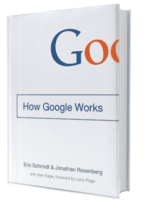
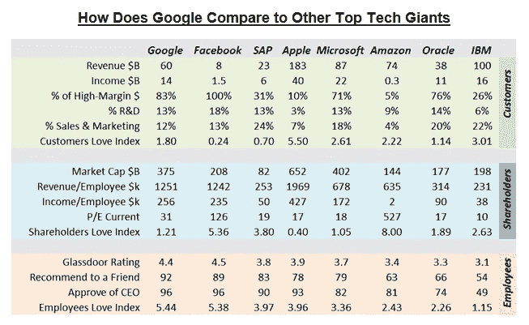

# 为什么埃里克·施密特不知道谷歌是如何工作的

> 原文：<http://venturebeat.com/2014/11/30/why-eric-schmidt-doesnt-know-how-google-works/?utm_source=wanqu.co&utm_campaign=Wanqu+Daily&utm_medium=website>

*查看来自低代码/无代码峰会的点播会议，了解如何通过提升和扩展公民开发者的技能来成功创新和实现效率。* [*现在看*](https://attendees.bizzabo.com/427958/agenda?date=1667952000000) *。*

* * *

谷歌是一家伟大的公司——从 2004 年创纪录的 230 亿美元 IPO(当时纳斯达克指数还不到 2000 点！)到它占主导地位的移动操作系统。我和我的同事们对谷歌非常钦佩，以至于我们用谷歌的技术建立了我们最新的网络会议平台。

[

<noscript></noscript>](https://venturebeat.com/wp-content/uploads/2014/11/How-Google-Works.jpg?strip=all) 但我们也知道，埃里克·施密特和谷歌的其他主要高管从早期就通过稳定的管理层为这一成功做出了贡献。作为他的粉丝，我关注了大多数关于他的新书*Google 如何工作*的文章、采访和幻灯片，并最终阅读了这本书。这是一本读起来像故事一样有趣的书。我强烈推荐这本书，但不是像作者似乎定位的那样作为一本管理书籍，因为它可能会把科技初创公司引向错误的方向。事实上，我认为施密特和罗森博格对谷歌工作方式的理解完全错误。原因如下:

首先，作者混淆了因果关系和相关性。施密特指出了谷歌作为一家公司的一系列特点，并将其作为谷歌成功的原因提出，但在我看来，它们都是谷歌成功的*后果*。

例如，作者写道:“他们创造伟大的搜索引擎和所有其他伟大服务的计划同样简单:雇佣尽可能多的有才华的软件工程师，并给他们自由。”这很有效，因为搜索已经足够成功，可以为自由提供资金。我希望有一家公司不在没有现金流入的市场中占据主导地位，而在没有严格的纪律、敏锐的注意力、努力工作和亲自管理的情况下取得成功。

如果这种管理风格是谷歌成功的原因，那么为什么谷歌的大多数举措要么失败了，要么财务效率低下，无利可图？如果他们是独立的创业公司，他们很可能已经死了。

谷歌的另一个特点是它的销售队伍。当我与谷歌的销售人员交流时，我震惊地发现他们是如此的缺乏训练和效率低下。如果说有一些知名公司拥有伟大的销售文化，比如甲骨文，或者 IBM 或施乐等一些老型号，可以销售他们产品组合中的几乎任何产品，谷歌则是另一个极端，销售代表的篮子里有出色的产品，但却卖不出去。谷歌的真相是，他们的产品卖不出去，他们被买走了！

施密特和罗斯伯格知道，谷歌 90%的收入来自广告(由于谷歌在搜索领域事实上的垄断)。根据该公司 2013 年的财务文件，谷歌 83%的收入来自广告，约 7%来自摩托罗拉(现已消失)，10%来自其他所有收入。换句话说，当你把谷歌应用程序(Gmail、Docs、Drive、Maps 等)的所有收入加起来。)加上 Android 和其他移动业务，然后再加上 Chromebooks、Chromecast、Chrome box 以及一切硬件和一切 Chrome、谷歌开发者网络、谷歌+、谷歌汽车、谷歌机器人和无人机、谷歌眼镜和其他可穿戴设备、谷歌云以及谷歌世界中的一切，你就获得了 50 亿美元或谷歌收入的 10%。花生！谷歌没有披露不同业务部门之间的成本分配，但不难想象如果它们是独立的实体，它们的盈利水平会如何。

[

<noscript></noscript>](https://venturebeat.com/wp-content/uploads/2014/11/how-does-google-stack-up.jpg?resize=653%2C401&strip=all?strip=all) 

上图:八位科技领袖的对比。所有的财务数据都来自公司的公开报表。员工赞赏数据包括从 Glassdoor 公共评级中提取的数据。“爱情指数”是作者创造的一种从不同角度量化和比较数字的方法。高利润=软件、订阅、广告、一切既不是硬件也不需要人工计费的东西(支持、咨询等)。).

尽管谷歌被员工视为天堂，但股东的观点却有所不同。我并不是说谷歌的股东不高兴，而是该公司对其利润和资本的使用没有优化。

我们来对比一下 Google 和 IBM 的效率。IBM 可能不再被认为是一家热门公司，但你可能会对财务和管理业绩的比较感到惊讶:IBM 的业务只有 26%是软件(或由高利润美元组成的收入，即不需要劳动力交付或支持或制造的美元)；对于其余的，公司必须交付人/天的费用。谷歌；的业务利润率高达 83%(2014 年为 90%)。这就是为什么 IBM 的业务从本质上来说利润要低得多:每名员工的收入为 3.8 万美元，而谷歌的每名员工收入为 25.6 万美元。谷歌的业务利润是它的 7 倍。然而，谷歌的单位收入价格只有 IBM 的三倍。谷歌的市盈率相对很低；它比脸书少四倍，是微软在 90 年代的一半。更不用说亚马逊，尽管几乎没有盈利，但其市值超过 1400 亿美元。

谷歌的财务表现与创新水平和“创意人员的聪明程度”不相称。更糟糕的是，谷歌的股票价值与其财务表现并不相称。也许投资者对长期结果不满意。是因为浪费太多，技术探索，不连贯的多样化吗？也许吧。

亚马逊和 IBM 更有效地利用了他们的资金，也更受投资者的喜爱，尽管他们在员工中没那么受欢迎。

那么有什么不同呢？谷歌是如何工作的？

### 垄断！

关键是市场支配地位。如果你在你的市场上拥有事实上的垄断地位，金钱就会涌入，你甚至可以给你的员工 20%以上的空闲时间。

谷歌的搜索业务处于垄断地位。在上表中，脸书和亚马逊市盈率高的原因是投资者认为它们处于或接近垄断地位，而 IBM 以及在较小程度上的甲骨文正在竞争，必须努力保持领导地位。(亚马逊在图书出版领域的垄断已经实现，但亚马逊在其他市场面临真正的挑战)。

此外，谷歌的垄断是一个非常有利可图的高利润业务:全自动广告，销售成本最低。

上个月，在斯坦福大学的一门课程中，PayPal 的创始人彼得·泰尔建议企业家寻求垄断，称“竞争是失败者的专利”只要谷歌在搜索领域拥有垄断地位，谷歌员工就可以享受免费食物，不必担心销售技巧，还可以休假 20%或更多。但当这种情况发生变化时，该公司需要做好应对冲击的准备。

总之，每家公司都需要找到适合自身情况的文化、方法和流程。很少有放之四海而皆准的概念，确实存在的都是老一套:创新和质量、客户满意度、员工发展和教育以及财务绩效。其他一切都是基于上下文的。

【本故事中表达的观点纯属我个人观点，不代表我公司的观点或看法。]

Darius Lahoutifard 是 SaaS 的一名企业高管和企业家，是 Google Hangouts on Air 的企业应用程序 [Business Hangouts](https://Business-Hangouts.com) 的创始人。你可以[在 LinkedIn 这里关注他](https://www.linkedin.com/profile/view?id=136189)或者在 Twitter 这里关注他的公司。

**VentureBeat 的使命**是成为技术决策者获取变革性企业技术知识和进行交易的数字城市广场。[发现我们的简报。](https://info.venturebeat.com/website-preference-center.html)