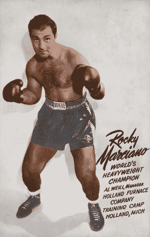
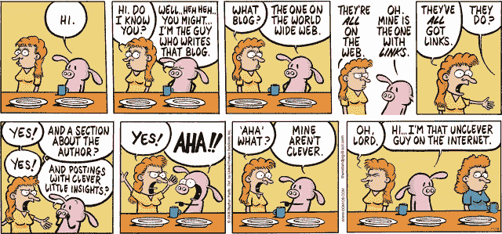

# 如何在一个简单的步骤中获得最终的博客成功

> 原文：<http://blog.codinghorror.com/how-to-achieve-ultimate-blog-success-in-one-easy-step/?utm_source=wanqu.co&utm_campaign=Wanqu+Daily&utm_medium=website>

[总是被戳](http://web.archive.org/web/20070715113357/http://www.knowing.net/PermaLink,guid,e5aadb98-0a69-44e3-94cb-0afa583b0c0e.aspx)。[永远是航运](http://www.codinghorror.com/blog/archives/000809.html)。[永远被击发](http://www.joelonsoftware.com/articles/fog0000000339.html)。同样的建议，针对不同的受众以不同的方式陈述。

> 我的理论是，领先一代来源于谷歌排名，提高谷歌排名的最佳方式是成为一名职业拳击手:光是猛击或干草制造者是不够的。你必须经常打针，还必须定期扔干草。持续写博客以保持高点击率和高链接流量，偶尔写些更长的文章，包含与你的领域相关的高价值的词。

当人们问我关于写博客的建议时，我总是用同样的建议的另一种形式来回应:**选择一个你能忍受的时间表，然后*坚持它*。在你做到这一点之前，我能给你的其他建议都没有意义。我不在乎你[的写作](http://www.codinghorror.com/blog/archives/000516.html)有多烂。我不在乎是否没人读你的博客。我不管你有没有[没什么有趣的话要说](http://www.codinghorror.com/blog/archives/000297.html)。如果你能表现出写作的意愿和不断提高写作水平的愿望，你最终会成功。**

但是成功需要时间——大量的时间。我认为至少一年。这是淘汰许多没有耐心的人的因素。我默默无闻地写了一年这个博客，但我坚持写下去，因为我喜欢它。在个人发展的旗帜下，我对自己做出了承诺，并计划实现这个目标。我的时间表是每周六个帖子，而**我一直在戳，一直在发货，一直在发**。不是每个帖子都那么好，但我在每个帖子上都投入了合理的努力。每写一次，我的写作水平就提高一点。每次我写作，我都学到了更多关于主题的知识，如何有效地研究主题，哪里是最好的信息来源。每次我写作的时候，我都会更加关注我周围丰富的软件开发社区。每次我写东西的时候，我都会得到一些反馈或者评论，我会把这些反馈或者评论放到以后的帖子里。每次写作，我都试图比上次写得更好一点点*。*

对我来说，这些变化几乎察觉不到。但是从一个很小的开始——2004 年职业发展的新年决心——我要说写这个博客毫无疑问是我整个职业生涯中最重要的事情。

我不会说我在 2005 年[回到](http://www.codinghorror.com/blog/archives/000280.html)在《迷魂记》得到了我的工作，因为这个博客，但它绝对是一个因素。我在[接受采访。网石](http://www.codinghorror.com/blog/archives/000847.html)，我在网上面试过不是[一次](http://www.dailyblogtips.com/interview-with-jeff-atwood-from-coding-horror/)而是[两次](http://scribesonic.com/Blog/Archive/2007/10/04/Coding-Horror-Interview.aspx)。我被邀请在会议上发言。每隔几个月就会有人来找我谈图书交易。我经常和史蒂夫·麦康奈尔(Steve McConnell)交换电子邮件，他是我年轻时的编程偶像之一，他曾经问我关于写博客的建议。乔尔·斯波尔斯基真的认出了我，并在我参加他世界巡回演唱会的埃默里维尔站时邀请我聊天。查尔斯·佩佐德主动寄给我一本他最新著作的签名本。人们会定期给我送一些非常酷的免费赠品。

据我所知，在 RSS 统计和日志统计之间，**每天大约有 10 万人阅读这个博客**。我只是[不情愿地拿走了](http://www.codinghorror.com/blog/archives/000893.html)的广告收入，现在已经足够可观了，以至于在我比较虚弱的时候，我真的有了成为一名全职博客写手的想法。*那个*就是它变得有多疯狂。我永远也不会预测到这个结果，像这样写下来实际上让我有点害怕。

我提到这些事情并不是因为我是一个爱炫耀的人(或者至少这不是唯一的原因)，而是因为我在没有特别天赋的情况下取得了所有这些成就(T2)。它是一次一个小帖子完成的，没有真正的计划或战略，除了简单的增量[每年少吸](http://www.codinghorror.com/blog/archives/000530.html)种。这个博客的成功让我不断感到惊讶和谦卑。它所需要的只是一个基本的承诺，即*保持*攻击、*保持*运输、*保持*开火。

如果有什么不同的话，我学到的是:**如果我能通过我的博客取得这样的成功，你也能**。所以如果你想知道为什么我见到你的第一件事就是“你有博客吗？”或者“你为什么不经常在博客上发帖？”或者“你能把它变成一篇博文吗？”，现在你知道为什么了。这不仅仅是因为我是那个讨厌的博客家伙；因为我希望我遇到的每一个人都能获得惊人的成功。

[T2】](http://comics.com/pearls_before_swine/2008-11-16/)

我只是想分享我的简单一步计划来获得最终的博客成功:找到一个你可以接受的发布时间表，并坚持一年。大概几年吧。好吧，也许这一步真的没有我想象的那么简单。但每个人都必须从某个地方开始，而且越快越好。

那么你最后一次写博客是什么时候？

