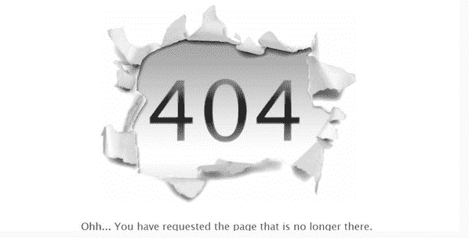

# 找不到页面-新域

> 原文：<http://anewdomain.net/2014/12/11/dont-hire-anyone-30-ageism-silicon-valley/?utm_source=wanqu.co&utm_campaign=Wanqu+Daily&utm_medium=website>

<main id="main" class="main-box main-box-single">

#### 404 错误:找不到页面

# 404 错误:再试一次，朋友。

原谅我的困惑。试着从 URL 中删除日期信息，看看是否能找到它。

</main>