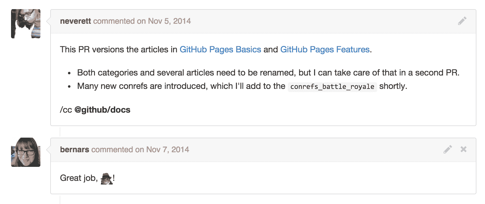

# GitHub 如何使用 GitHub 记录 GitHub | GitHub 博客

> 原文：<https://github.com/blog/1939-how-github-uses-github-to-document-github?utm_source=wanqu.co&utm_campaign=Wanqu+Daily&utm_medium=website>

<main role="main" id="post-30656" class="col-12 col-lg-7 post__content col-md-8 post-30656 post type-post status-publish format-standard hentry category-engineering">

提供写得好的文档有助于人们理解、利用和反馈你的项目，但这只是文档等式的一半。用于提供文档的底层系统可以使编写文档的人的生活变得更加轻松——无论是您还是您的团队。

关于文档最难的部分应该是决定使用哪些单词，而不是配置工具或弄清楚如何部署更新。GitHub 文档团队的成员来自基于原始 XML 的创作工具和复杂的 CMS 是标准的背景。我们不想在这里使用这些工具，所以我们花了大量的时间来配置我们自己的文档工作流程和设置。

我们之前已经讨论过如何使用 GitHub 来*构建*GitHub；下面看看我们如何使用 [GitHub 页面](https://pages.github.com/)为[每月数百万读者提供我们的 GitHub 帮助文档](https://help.github.com)。

## 我们之前的设置

几个月前，我们将帮助站点从定制的 [Rails 应用](http://rubyonrails.org/)迁移到 GitHub 页面上的静态 [Jekyll 站点](http://jekyllrb.com/)。我们以前的帮助站点由两个独立的存储库组成:

*   一个 Rails 应用程序，负责管理站点、资产和搜索实现。
*   实际内容只是一组降价文件。

我们的 Rails 应用托管在第三方服务上；随着代码的更新，我们用 Hubot 和 Chatops 部署了它们[，就像我们对 GitHub 的其他部分所做的一样。](https://hubot.github.com/)

我们典型的写作工作流程是这样的:

*   文档团队注意到了新特性何时发布。
*   我们将创建一个新的问题来跟踪该功能。
*   当我们准备好了，我们会打开一个 pull 请求，开始迭代内容。
*   当内容处于一个好的位置时，我们会@提及团队(`@github/docs`)并让同行编辑审查我们的文字。
*   当特性准备好发布时，我们将合并拉请求。一个 webhook 将从内容存储库触发到我们托管的 Rails 应用程序；webhook 的有效负载更新了包含文章原始降价的数据库行。

下面是来自 [@neveret](https://github.com/neverett) 和 [@bernars](https://github.com/bernars) 的对话示例，展示了我们正常的编辑工作流程:



处理拉取请求非常棒，因为它直接匹配了我们在整个公司使用的 GitHub 流程。我们喜欢用 Markdown 编写，因为它的语法使我们能够立即有效地描述新功能。

然而，我们的 Rails 实现是一个相当复杂的设置:

*   我们对外部主机的依赖要求我们的工程、运营和安全团队中有专门的员工来监控站点，并在事件发生时做出响应。
*   我们的文档团队无法轻松查看内容的本地更改。即使我们用 Markdown 编写，我们仍然需要设置一个 Rails 应用程序的本地实例，并运行一个脚本来将内容导入到一个数据库中，只是为了看看它在站点上会是什么样子。
*   我们不断调整 Rails 服务器，但注意到读者对网站的每个请求仍然很慢。HTML 是动态生成的，需要调用数据库并不断迭代更强的缓存策略。

我们知道我们可以做得更好。

## 我们的新设置

当 [Jekyll 2.0 发布](https://github.com/blog/1867-github-pages-now-runs-jekyll-2-2-0)时，我们看到了一个用静态站点替换现有设置的机会。新的[集合文档类型](http://jekyllrb.com/docs/collections/)允许您定义符合您需求的文件结构。此外，Jekyll 2.0 引入了对 [Sass](http://sass-lang.com/) 和 [CoffeeScript](http://coffeescript.org/) 资产的支持，简化了前端代码的编写。

开源很棒，因为它是开放的。随着我们迁移到 Jekyll，[我们向 Jekyll 的组件发出了几个 pull 请求](https://github.com/search?utf8=%E2%9C%93&q=author%3Ajglovier+author%3Abenbalter+author%3Agjtorikian+user%3Ajekyll+is%3Amerged+created%3A2014-04-01..2014-12-15)，使它成为 GitHub 页面用户的一个更好的工具。

我们最初的工作流程几乎没有改变。我们仍然在 Markdown 中写文章，我们仍然打开 pull 请求进行编辑审核。当 pull 请求被合并时，GitHub Pages 站点会在几秒钟内自动构建和部署。

这里有一个关于我们如何使用核心 Jekyll 特性和一些插件来实现帮助站点的简要介绍。

### 我们使用的宝石

我们有意尽可能依赖核心 Jekyll 代码，以最小化我们对维护自定义插件的依赖。

Jekyll 2.0 引入了一种叫做[转换器](http://jekyllrb.com/docs/plugins/#converters)的新插件类型，可以将任何标记转换成 HTML。这使得作者可以随心所欲地撰写内容，Jekyll 将只提供最终的 HTML。例如，你可以[用 AsciiDoc](https://github.com/asciidoctor/jekyll-asciidoc) 写你的文章，如果那是你的事情的话。

为此，我们编写了 [jekyll-html-pipeline](https://github.com/gjtorikian/jekyll-html-pipeline) ，这是我们自己的开源 [html-pipeline](https://github.com/jch/html-pipeline) 的一个实现。这确保了我们的帮助网站上的内容看起来与 GitHub 上任何地方的内容一样。我们还编写了[我们自己的 Markdown 过滤器](https://github.com/gjtorikian/extended-markdown-filter)来提供一些语法扩展，使得编写文档更加容易。

### 搜索

在之前的 Rails 站点中，我们使用了一个 [ElasticSearch](http://www.elasticsearch.org/) 提供者来索引我们的数据库，并为我们的帮助站点实现了一个搜索系统。

现在，我们使用 [lunr-js](http://lunrjs.com/) 来提供更快的客户端搜索体验。在筛选我们的分析时，我们发现绝大多数用户依赖外部搜索提供商来获取我们的文档。在迁移期间或之后，在服务器端搜索解决方案上花费太多精力是没有意义的。

### 内容参考

当编写文档时，Docs 团队真的想使用“内容引用”，或*contrefs*。一个内容引用允许你写一段文字，然后在整个网站上重复使用。(这个想法是从[DITA 标准](http://dita.xml.org/arch-conref)借鉴来的。)

旧的 Rails 应用不允许我们编写可重用的内容，但现在我们可以借助 Jekyll 的[数据文件](http://jekyllrb.com/docs/datafiles/)的力量。例如，我们定义了一个名为 *conrefs.yml* 的文件，并有一组如下所示的键值字符串:

```
repositories:
  create_new:
    1\. In the upper-right corner of any page, click {{ octicon-plus Plus symbol }}, and then click **New repository**.
      
```

我们的键是按特异性(`repositories.create_new`)分组的；它们包含的值只是简单的降价(“在右上角……”)。现在，我们可以通过编写适当的流动语法，在涉及创建新存储库的几页内容中重用这一步:

```
To start the process:

{{ site.data.conrefs.repositories.create_new }}
2\. Do something else.
3\. You're done!
```

随着 GitHub UI 的发展，我们可能需要改变图像或重写方向指针。有了 conref，我们只需在一个位置进行变更，而不是十几个。

### 版本化文档

此举的另一个目标是能够提供版本化的帮助文档。随着[Enterprise 2 . 0 . 0](https://github.com/blog/1918-a-faster-more-flexible-github-enterprise)的发布，我们开始为[之前的 11.10.340](https://help.github.com/enterprise/11.10.340/user/) 和[当前的 2.0](https://help.github.com/enterprise/2.0/user/) 版本提供不同的内容集。为了做到这一点，我们使用特殊的受众标志构建 Jekyll 站点，并将生成的 HTML 作为页面存储库的一部分进行签入。

例如，在我们的 *config.yml* 文件中，我们将一个名为`audience`的键设置为`11.10.340`。如果某个功能在 Enterprise 2.0 中可用，但在 11.10.340 中不可用，我们可以使用 Liquid 标签来划分该部分，如下所示:

```


This new feature...


```

同样，这只是利用了 Jekyll 的核心特性；我们不需要构建或维护它的任何方面。

### 测试我们的网站

仅仅因为站点是静态的并不意味着我们应该避免测试驱动的开发。

我们测试内容的第一道防线一直是 [html 验证器](https://github.com/gjtorikian/html-proofer)。该工具通过快速验证我们构建的网站中的每个 URL 来帮助验证我们的链接和图像没有被破坏。

Rubyists 熟悉在他们的测试中使用[水豚](https://jnicklas.github.io/capybara/)来模拟网站互动。用我们的静态站点实现类似的想法会不会很疯狂？没有。我们自己的 [@bkeepers](https://github.com/bkeepers) 在四年前写了一篇博文[谈论这个问题。有了它，我们就能够编写覆盖我们的内容和网站行为的更强大的测试。例如，我们检查引用的 conref 是否有效(通过在 YAML 文件中查找键)或者我们的 JavaScript 是否正常运行。](http://opensoul.org/2010/05/11/capybaras-eating-cucumbers/)

我们的帮助文档与 CI 一起运行，以确保我们的读者不会看到任何损坏的内容:


### 速度

如上所述，我们新的 Pages 实现比旧的 Rails 应用程序要快得多。这部分是因为网站是一堆静态的 HTML 文件——没有任何东西是从数据库中提取的。更重要的是，[我们已经花了很多时间来配置我们的页面服务器，使其对每个人来说都非常快](https://github.com/blog/search?q=github+pages)。每个 GitHub 用户都可以享受我们拥有的优势，比如从 CDN 中提供服务。


## 让 GitHub 页面为您服务

GitHub 的文档团队可以利用 GitHub Flow、Jekyll 2.0 和 GitHub 页面来制作高质量的文档。任何运行 GitHub Pages 站点的用户都可以使用 GitHub Pages 为我们的文档团队带来的好处。

随着我们转向 Pages，我们没有重新构建任何新的组件。我们花更少的时间来构建任何东西，花更多的时间来讨论对我们的团队和公司有意义的工作流。通过承诺使用我们提供给每个 GitHub 用户的相同托管功能，我们能够更快地提供更好的文档。我们的内部工作流程提高了我们的工作效率，并使我们能够提供以前无法提供的功能，如版本化内容。

如果您对我们的设置有任何疑问，无论是过去还是现在，[我们很乐意帮助](https://github.com/contact?form%5Bsubject%5D=I+have+a+question+about+your+amazing+Help+site)！

</main>