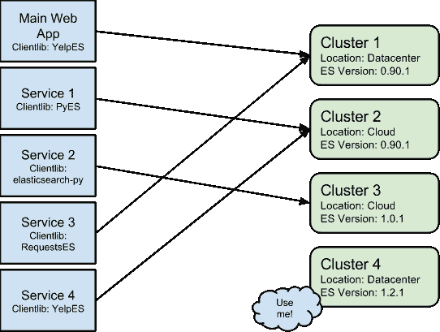
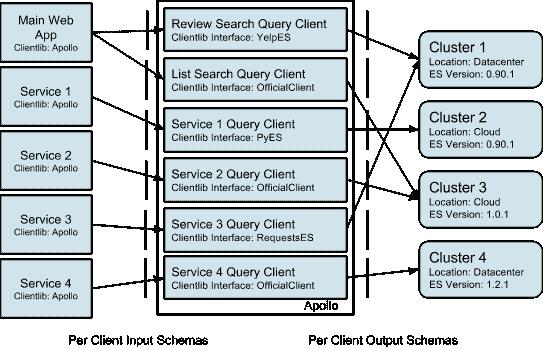
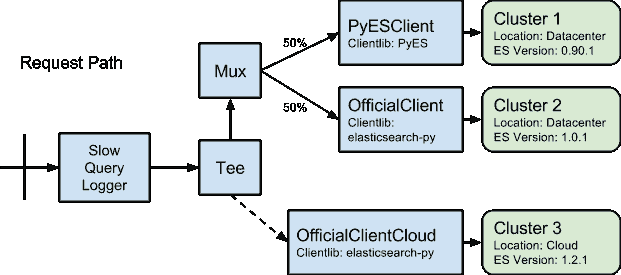

# 将 Elasticsearch 扩展到数百名开发者

> 原文：<https://engineeringblog.yelp.com/2014/11/scaling-elasticsearch-to-hundreds-of-developers.html?utm_source=wanqu.co&utm_campaign=Wanqu+Daily&utm_medium=website>

Yelp 使用 Elasticsearch 来快速原型化和推出新的搜索应用程序，以我们的规模快速前进带来了挑战。特别是，我们经常遇到在不影响用户的情况下更改查询逻辑的困难，以及发现客户端库错误、多租户问题和一般的可靠性问题。随着 Yelp 编写新的 Elasticsearch 查询的工程师数量的增长，我们的搜索基础设施团队很难支持工程师向我们的 Elasticsearch 集群发送查询的多种方式。我们为单个团队与单个集群通信而设计的基础架构无法扩展到数十个团队和数十个集群。

## 我们在 Yelp 的弹性搜索中遇到的问题

Elasticsearch 是一个了不起的分布式搜索引擎，但它也是一个相对年轻的数据存储，具有不成熟的生态系统。直到 2013 年 9 月，还没有官方的 Python 客户端。Elasticsearch 1.0 在 2014 年 2 月才推出。与此同时，Yelp 自 2012 年 9 月以来一直在使用 Elasticsearch 扩大搜索规模，作为早期采用者，我们一路上遇到了困难。

我们有数百名开发人员在开发数十种服务，这些服务与数十个集群通信。不同的服务使用不同的客户端库，不同的集群运行不同版本的 Elasticsearch。从历史上看，这类似于:

### 

<small>图 1: Yelp 弹性搜索基础设施</small>

### 有哪些问题？

*   开发人员使用许多不同的客户端库，我们必须支持这一点。
*   我们运行多个版本的 Elasticsearch，主要是 0.90.1、1.0.1 和 1.2.1 集群。
*   多租户对于业务关键型客户来说通常是不可接受的，因为 Elasticsearch 不能提供机器级的资源控制，而且它的 JVM 级隔离仍在开发中。
*   让客户机代码分布在多个服务和应用程序上，使得审计和更改客户机代码变得很困难。

这些问题都源于 Elasticsearch 不可避免的宽界面。Elasticsearch 开发人员明确选择了一个由于缺乏访问控制而难以防御的宽接口，考虑到他们试图用 HTTP 接口表达的复杂性，这是有意义的。然而，这意味着将 Elasticsearch 视为面向服务架构中的另一项服务很快变得难以维护。Elasticsearch API 在不断发展，有时是以向后不兼容的方式发展，构建在该 API 之上的客户端库也在不断变化，这最终意味着迭代速度受到影响。

## 改变是艰难的

随着我们在 Yelp 扩大 Elasticsearch 的使用范围，改变现有代码变得越来越难。为了说明这些问题，让我们考虑开发人员对图 1 中提到的基础设施的请求的两个例子:

### 转换主 Web 应用程序以使用 RequestsES 客户端库

这包括在我们的主 web 应用程序中查找所有查询代码，然后对每一个代码:

1.  创建使用请求者的辅助路径
2.  设置[请求桶](http://engineeringblog.yelp.com/2014/02/introducing-requestbucketer-a-system-for-putting-http-requests-in-named-buckets.html)组。
3.  编写重复的测试。
4.  部署变更。
5.  删除重复的测试。

我们可以很容易地修改代码，但部署我们的主要 web 应用程序需要几个小时，而且我们有许多查询代码需要移植。由于部署我们的主 web 应用程序的复杂性，这将花费开发人员大量的时间。更改这些代码的高开发成本超过了基础设施带来的好处，这意味着这种更改是不可取的。

### 将服务 4 转换为 elasticsearch-py，并将它们移动到集群 4

服务 4 的 SLA 变得更加严格，他们再也不能容忍服务 1 偶尔昂贵的[方面查询](http://www.elasticsearch.org/guide/en/elasticsearch/reference/current/search-facets.html)所导致的停机时间。Service 4 的开发者也想要 Elasticsearch 1.0 带来的令人敬畏的可靠性特性，例如[快照和恢复](http://www.elasticsearch.org/guide/en/elasticsearch/reference/current/modules-snapshots.html)。不幸的是，我们的 YelpES 客户端库版本不支持 1。X clusters，但是官方 Python 客户端有，这没问题，因为搜索基础设施的工程师是将 YelpES 代码移植到官方 Python 客户端的专家。唉，我们对服务 4 一无所知。这意味着我们必须与拥有服务 4 的团队合作，让他们建立并行路径，并告诉他们如何与新集群通信。由于我们团队之间的协调开销，这花费了开发人员大量的时间。

显而易见，随着开发人员数量的增长，这些开发模式无法扩展。开发人员不断地在各种服务中添加新的查询代码，使用各种客户端库，使用各种编程语言。此外，由于漫长的部署时间和业务风险，开发人员害怕更改现有代码。基础设施和运营工程师必须维护多租户集群，这些集群承载着运行时间要求和使用模式完全不同的客户。

这一切都不好。这对开发人员、基础设施工程师和运营工程师来说是不利的，并导致以下教训:

当查询代码与业务逻辑分离时，使用 Elasticsearch 的系统更易于维护

## 我们的解决方案

Yelp 的搜索基础设施一直在使用一种我们称之为 **Apollo** 的代理服务，将开发人员的关注点与实现细节分开，所以现在我们的基础设施看起来是这样的:

### 

<small>图二:阿波罗</small>

## 关键设计决策

### 隔离基础架构复杂性

Apollo 的首要目的是将我们搜索基础设施的复杂性与开发者隔离开来。如果开发者想从他们的服务中搜索评论，他们发布一个 json blob:

```
{"query_text": "chicken tikka masala", "business_ids": [1, 2, 3] } 
```

到一个阿波罗网址:

```
apollo-host:1234/review/v3/search 
```

开发人员永远不需要知道这是在使用 elasicsearch-py 客户端库对运行在我们的数据中心的 Elasticsearch 集群进行 Elasticsearch 查询，该集群恰好运行 Elasticsearch 版本 1.0.1。

使用 json-schema 对所有传入和退出的 json 对象进行验证，可以确保接口得到尊重，并且因为这些模式与我们的客户端库一起提供，所以我们能够在调用代码中检查接口，即使调用代码是用 Python 编写的。

### 使迭代查询代码变得容易

在 Apollo 中，每个查询客户机都被隔离在自己的客户机模块中，每个客户机都需要提供一个输入和输出模式，来控制客户机应该接受和返回什么类型的对象。每个这样的接口都绑定到一个查询客户机的单个实现，这意味着为了编写一个非向后兼容的接口更改，必须编写一个绑定到接口新版本的全新客户机。例如，如果审查搜索的界面发生变化，开发人员编写一个单独的模块并将其绑定到`/review/v4/search`，同时继续将旧模块绑定到`/review/v3/search`。不再有“如果”的实验，只是专注于做好一件事的独立模块。

每个模块版本控制的一个关键特性是，开发人员可以独立地迭代他们的查询客户端，并且持续提供 Apollo 服务，确保新的查询代码在几十分钟内投入生产。如果每个客户端在生产中造成问题，也可以有选择地关闭或重定向到另一个群集。

至于语言，我们选择 Python 是因为 Yelp 成熟的 Python 基础设施以及消费者可以快速定义简单和复杂查询客户端的便利性。对于像 Apollo 这样的高吞吐量服务，Python(或者至少是 Python 2)通常是错误的选择，因为资源使用率高，并发支持差，但是通过使用优秀的 [gevent](http://www.gevent.org/) 库进行并发，以及高度优化的 json 解析库 [ujson](https://github.com/esnme/ultrajson) ，我们能够将 Apollo 扩展到极高的查询负载。此外，这些库都是插件，因此客户端不必在查询逻辑中设计并发性，这是免费的。在峰值负载时，使用 gevent 的 Apollo 可以在单个 uwsgi 工作进程上执行数千个(如果不是数万个)并发 Elasticsearch 查询，这与普通 Python uwsgi 工作进程可以实现的单个并发查询相比是相当不错的。

### 使基础设施的迭代变得容易

因为唯一存在于 Apollo 中的是创建弹性搜索查询的代码，所以很容易在几分钟内将客户机移植到新的库或将它们的客户机移动到不同的集群。界面保持不变，端到端测试确保功能不被破坏。

另一个关键功能是，从一开始我们就设计了这些模块来实现一个可组合的简单接口。这种可组合优先的架构允许我们提供如下包装器:

*   `SlowQueryLogger`:一个一元包装器，它将任何缓慢的请求记录到日志中，用于审计和监控。
*   一个二进制包装器，允许我们向两个客户端发出请求，但只等待其中一个客户端的结果。这对于暗启动新客户端或负载测试新集群非常有用。
*   `Mux`:一个 n 元包装器，在许多客户端之间引导流量。这对于新查询代码或基础设施的逐步推广非常有用。

作为一个例子，让我们假设有两个查询客户端，它们的区别仅在于它们使用的客户端库和它们期望的 Elasticsearch 版本:ReviewSearchClient 和 OfficialReviewSearchClient。此外，假设我们的运营工程师刚刚提供了一个运行 Elasticsearch 1.2.1 的新集群，它位于云中，可以进行负载测试。Apollo 中这些客户端的示例组合可能是:

<noscript><pre># Create base clients PyESClient = ReviewSearchClient(query_timeout_s=0.300) OfficialClient = OfficialReviewSearchClient(query_timeout_s=0.300) OfficialClientCloud = OfficialReviewSearchClient( service_name='elasticsearch-cloud', query_timeout_s=0.300 ) # Compose base clients together ComposedReviewSearchClient = SlowQueryLogger( log_threshold_ms=500, client=Tee( toggle='toggles.reviews.enable_dark_launch', client=Mux( fallback=ClientWithToggle( client=PyESClient, toggle='toggles.reviews.use_pyes_client' # set to 0.50 ), client_configs=[ ClientWithToggle( client=OfficialClient, toggle='toggles.reviews.use_official_client' # set to 0.50 ) ]) tee_client=OfficialClientCloud ) )</pre></noscript>

这映射到以下请求路径:

### 

<small>图 Apollo 中请求的生命周期</small>

在这段简短的 Python 代码中，我们实现了以下目标:

1.  如果任何查询花费的时间超过 500 毫秒，请将其记录到我们的慢速查询日志中以供检查
2.  将所有流量发送到旧的 PyES 实现和我们新的官方客户端实现之间的复用器`Mux`。我们可以在运行时改变`Mux`的权重，而无需代码推送
3.  分别向我们想要进行负载测试的云集群发送流量。不要等待结果。

最重要的是，我们从来不用担心哪些消费者会提出评论搜索请求，因为有一个定义明确、经过充分测试的界面。此外，由于 Apollo 使用 Yelp 成熟的 Python 服务堆栈，我们可以监控该客户端的性能和质量指标，这意味着我们不必害怕做出这些改变。

## 重新审视开发人员的要求

现在，Apollo 已经存在，进行更改需要几周到几天，这意味着我们的组织可以继续敏捷地面对不断变化的开发人员需求和向后不兼容的 Elasticsearch 版本。现在我们有了 Apollo，让我们重新审视一下开发人员的要求:

### 转换主 Web 应用程序以使用 RequestsES 客户端库

我们必须在 *Apollo* 中找到主 Web 应用程序查询的所有客户端，并使用 RequestsES 客户端库实现它们的接口。然后，我们为每个客户端连接一个`Mux`,允许我们在接口的两个实现之间切换，部署我们的代码(大约 10 分钟),并使用配置更改逐步推出新代码。根据经验，像这样的查询代码可以在**一个下午**移植。将 minute long 部署到生产环境中非常重要，因为这意味着您可以在一天内而不是一周内将多个产品推向生产环境。此外，因为 elasticsearch 查询制作代码独立于所有其他业务逻辑，所以更容易对变化进行推理并感到自信。

### 将服务 4 转换为 elasticsearch-py，并将它们移动到集群 4

我们可以使用新的客户端库实现 Service 4 的接口，重用现有的测试来确保两个实现之间的功能等价。然后，我们设置一个到新集群的`Tee`,以确保我们的新代码能够工作，并且集群能够处理服务 4 的负载。最后，我们等待几天以确保一切正常，然后我们更改查询客户机以指向新的集群。如果我们真的想要安全，我们可以设置一个`Mux`并逐渐滚动它。整个过程只需要开发人员几天**或不到**的时间。

## 基础设施胜出

现在 Yelp 工程师可以利用 Apollo，以及我们的实时索引系统和动态弹性搜索集群供应，他们可以比以往任何时候都更快地开发搜索应用程序。以前，搜索基础设施习惯于告诉工程师“很遗憾，我们还做不到”，而今天，我们甚至可以灵活地支持最雄心勃勃的项目。

自从几个月前发布 Apollo 以来，我们已经将 Elasticsearch 上运行的所有主要 Yelp 搜索引擎移植到 Apollo 上，并启用了其他团队开发的几十个新功能。此外，由于 Apollo 的强大功能，我们能够无缝升级到 Elasticsearch 1。x 对于我们的许多客户来说，考虑到我们的正常运行时间要求，在此之前这几乎是不可能的。

至于性能，我们发现运行这个代理的轻微开销在部署、集群重新配置和开发人员迭代时间方面证明是值得的，使我们能够通过部署提高性能的大 win 重构来弥补请求开销。

最终，Apollo 给了我们灵活性、快速部署、新的弹性搜索版本、高性能查询、容错和复杂性隔离。一个小小的抽象和正确的接口最终成为一个巨大的胜利。

[回到博客](/)