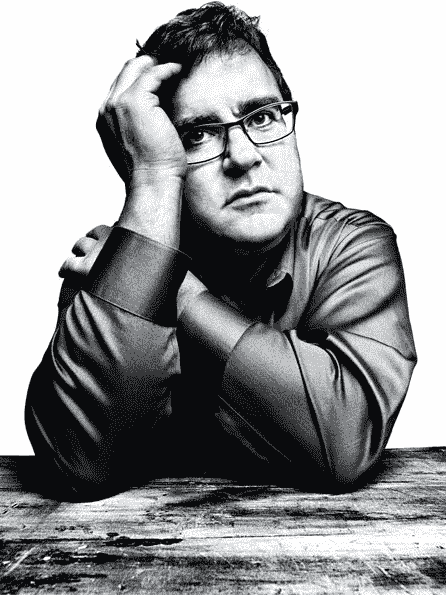
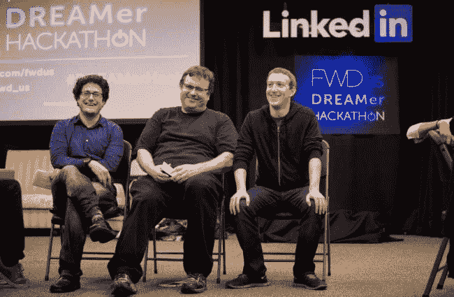
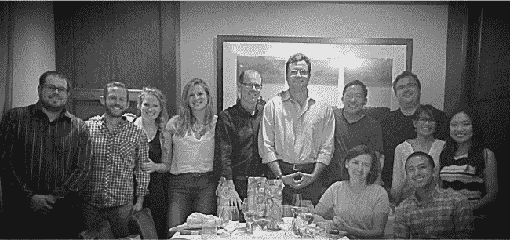

# 与雷德·霍夫曼相处 10000 小时:我所学到的——本·卡斯诺查

> 原文：<http://casnocha.com/reid-hoffman-lessons?utm_source=wanqu.co&utm_campaign=Wanqu+Daily&utm_medium=website>

(Credit: Wired magazine. )

*阅读时间:50 分钟*

我们三个小时前才在拉斯维加斯着陆，但在 2012 年 12 月一个寒冷的冬日，我们已经回到飞机上，飞往圣何塞的家。在机场不必通过安检节省了很多时间。

除了前面的两名飞行员之外，里德和我独自一人，在他刚刚演讲的技术活动中汇报了哪些有效，哪些无效。对于他提出的关于领英愿景的问题，我给出了一些快速的反馈。他重复了自己对格雷洛克与其他风险投资公司有何不同的回答。我做了笔记。

然后，话题转移到了另一个问题上，就像那些日子里越来越多的那样:这次拉斯维加斯之行推进了一个重要的专业项目吗？他玩得开心吗？还是两者都有？

每个决定都有权衡:当你选择做一件事，就意味着你选择不做另一件事。当你选择在一个因素上优化一个选择时，就意味着必然在另一个因素上次优。里德一生中面临的权衡比你我面临的都要沉重。想象一下，你可以见到任何人，从美国总统开始。几乎做任何你能想到的事情——从拯救濒临破产的当地歌剧公司到去地球上最偏远的地方旅行。一小部分人的决策几乎没有任何约束，里德就是其中之一。当里德选择飞往拉斯维加斯并在这个活动上发言时，他选择了*而不是*来做的事情的清单非常非常长。

里德经常在这些权衡中挣扎。作家埃尔文·布鲁克斯·怀特曾经抓住了为什么的本质。**怀特说:“我早上醒来时不确定我是想品味世界还是拯救世界，这让我很难计划一天。”**

对一些人来说，品味是规划生活任务的简单答案。对于那些没有约束的人来说，计划通常很简单:他们把自己的名字印在母校的几栋建筑上，买下一家职业体育俱乐部，然后就此收工。对于 99%有资源限制的人来说，他们可能会找一份朝九晚五的工作，尽可能勤奋地积累假期，提前退休，也许会为朋友的抗癌步行捐款。里德喜欢品味，尽管不是享乐主义。对他来说，品味意味着获得智慧的顿悟；这意味着花时间和朋友在一起。

但他真正想做的是*拯救*。他想用自己的才能、关系网和金钱来让世界变得更好，并解决一些人类最大的问题。他是我一生中见过的最无私、最慷慨的人之一。

当你两者都想做的时候，做决定就变得困难了。今天是什么:储蓄还是品味？通常你必须做出选择。这是一个非常罕见的项目，涉及亲密的朋友和持续的智力刺激，*和*改变世界的影响。

那天晚上，当我在飞机上坐在他对面的时候，他看起来筋疲力尽。他刚刚做的演讲活动属于“拯救”或“改变世界”类别——它有望激励其他企业家，扩展 Greylock 品牌，并帮助与业内人士建立一些关系。这不是特别有趣或刺激，也没有亲密的朋友参与。那一刻，我觉得他应该为自己做更多的事情。他如此努力地取得成功，为什么不放松一下，一边在法国南部喝着上好的威士忌，一边扮演卡坦的定居者呢？然而，在其他时候，在他遇到一个拯救数百万人生命的非盈利组织后，我理解他为什么会承诺提供帮助，即使这会让他在周末的马拉松会议结束时筋疲力尽。

保存/品尝的困境是他仍在解决的，而且可能永远都是。

当然，他并不孤单。我们所有在这个世界上享受特权的人都在不同程度上与这种困境作斗争。就我自己而言，我想知道我应该花多少精力在世界上每天靠一美元或不到一美元生活的十亿人身上，而不是去关心和享受我自己微不足道的生活。我应该做多少志愿者，给慈善机构捐多少钱？过比自我更有意义的生活意味着什么？这是我需要关心的事情吗？如果我在泰国的一个度假胜地挥霍金钱，而几个小时之外的人却在挨饿，我应该感到内疚吗？

里德喜欢指出错误的选择。例如，有人问企业家是应该制定计划，还是只是准备好适应。里德说，这是错误的选择:他们需要双管齐下。你应该有少量亲密的朋友还是大量松散的关系？都是。事实上，里德最喜欢引用的一句话来自伟大的犹太圣人希勒尔:“如果我不为自己，谁为自己呢？当我为自己时，我是什么？如果不是现在，什么时候？”对这句话的一种解释是，你必须爱自己，但你不应该仅仅为了自己的利益而活着。你也应该帮助别人。拒绝在自爱和爱他人之间选择:两样都做。

所以我同意保存/品味困境的宏观正确答案是:*两者都是*。但在实践中，在个人决策的微观层面，我们往往不得不选择其中之一。我相信权衡比错误的选择更重要。

这是我在过去四年与里德共事时思考了很多的一个主题。在接下来的几页中，我将详细阐述我从他身上学到的许多其他经验。但我想我应该先解释一下:为什么我会在从拉斯维加斯回来的飞机上？

# 40%的问题

《纽约时报》的伊芙琳·鲁斯里(Evelyn Rusli)在 2011 年对雷德·霍夫曼的简介中，直接引用了里德的话作为结尾:“我的工作效率只有 60%，”他说。这是一个令人吃惊的最终承认，因为这篇文章记录了让里德成为“技术之王”的一长串活动和成就考虑到他在过去十年的成功，你会认为他的工作效率达到了 150%。

但我知道里德不是在开玩笑。我刚刚花了两年时间和他一起写了我们的第一本书 [*《你的创业》*](http://www.thestartupofyou.com) ，这让我了解了他的生活。除了担任 LinkedIn 的执行主席之外，Reid 还在 Greylock 担任风险投资家，在几家私营和上市公司的董事会任职，支持一系列慈善活动，并制作了各种智力产品，如我们的书。我们只能说，他的雄心和想法并没有完全放缓。

这对任何人来说都是很大的负担。最重要的是，由于 LinkedIn 的首次公开募股，他现在是福布斯富豪榜上的常客。亿万富翁的身份给你的生活带来了各种各样的社会问题，尤其是对一个没有预料到这一点的人来说。里德小时候玩过《龙与地下城》,高中时开过牛，大学毕业后打算作为专业学者学习哲学。如果在通往莫古登的路上有*而不是*一些“缩放”问题，那才奇怪。

40%的问题。这就是我 2012 年 7 月在 Reid 家发表的演讲的标题。这个思维实验很简单:怎样才能连接他自我认定的最后 40%的能力，使他的 100%的气缸都在工作？世界会有什么不同，他的生活会有什么不同？

随着《你的创业》的完成和出版，我有了一些空闲时间，所以我们构想了一个任务之旅，让我全职帮助解决这个问题。它最初被设定为为期 6 个月的临时演出，因为我们都不知道我会做什么。结果变成了两年。我们选择了“幕僚长”作为职位名称，尽管还没有幕僚长，尽管这个名称在不同的背景下有不同的含义。

以下是我现在在 LinkedIn [个人资料](https://www.linkedin.com/profile/view?id=659753)上列出的职位:

我帮助构思、建立并运营了一个新的组织，以扩大和延伸雷德·霍夫曼的战略重点。

在 LinkedIn 和 Greylock 办公室工作了近两年，作为办公室主任，我参与了里德在不同工作领域做出的许多决定:LinkedIn(他是 LinkedIn 的联合创始人/执行董事长)、Greylock(他是风险投资公司的合伙人)、他的慈善工作、各种公共知识项目以及政治/公民倡议。

*我还策划并执行了新的积极主动的计划，以增加 Reid 在硅谷、华盛顿特区及其他地方的影响力。*

我雇佣并管理了一个员工团队，他们负责上述所有工作。

我喜欢与 LinkedIn 和 Greylock 的同事一起工作，也喜欢与 Reid 的投资组合公司和组织(营利性、非营利性和政治性)的广泛网络一起工作。但这份工作中我最喜欢的部分是深夜与里德一对一的谈话，就像从拉斯维加斯起飞的飞机上的那次，在那里，我对他的想法提出了最好的坦诚建议，在那里，当他思考影响他生活的大大小小的问题时，我给人留下了一个顾问兼对话者的最佳印象。

随着我们的第二本书《在一起》( [The Alliance](http://www.theallianceframework.com) )的出版，我已经从参谋长的职位上退下来几个月了。因此，现在似乎是总结我在三次任职期间从里德那里学到的关于生活和商业的几个重要教训的恰当时机:与人合作创办《你》(Start-up of You)，担任参谋长，以及与人合作创办《联盟》(The Alliance)。

请注意，出于隐私和保密的考虑，我不会详细谈论里德在 Linkedin 和 Greylock 的工作以及他的慈善事业等。相反，我将把重点放在一些概括的要点上。我挑了 16 个；当然还有几十个！(此外，如果你对构思、写作、编辑、出版、然后营销一本商业书籍的过程感兴趣，这里有我的详细课程和从你的过程开始的见解。)

# 16 个经验教训(其中有很多！)

1.  人是复杂的，有缺陷的。支持他们更好的天使。
2.  引起忙碌的人注意的最好方法:帮助他们。
3.  在构思策略和做出决策时，保持简单和快速。
4.  每个弱点都有相应的优势。
5.  真正塑造一种文化的价值观既有积极的一面，也有消极的一面。
6.  了解某人的“阿尔法”倾向，以及这种倾向是如何驱动他们的。
7.  [自欺表:即使是那些说自己不需要或者不想要奉承的人，有时候还是需要的。](#selfdeception)
8.  明确你在项目中的具体参与程度。
9.  为一个项目勾勒出三种可能的结果:可能的好结果、可能的“正常”结果和可能的坏结果。
10.  建立良好伙伴关系的关键是:识别并强调任何不恰当的激励。
11.  [原因是方向盘。情感是油门。](#reasonemotion)
12.  即使这意味着你要放弃能力，也要放弃信任。
13.  [说实话。不要条件反射地拍有权有势的人的马屁。](#truth)
14.  [尊重影子的力量。](#shadows)
15.  让人们成为真正的伙伴，他们会更加努力工作。
16.  [最后:你周围的人以无数种无意识的方式改变着你](#change)

### **1。人是复杂的，是有缺陷的。支持他们更好的天使。**

太多时候，人们用非黑即白的术语来划分某人的能力或性格。他要么很聪明，要么就是个白痴。她有一颗金子般的心或者她是个混蛋。他是一个有道德的王子，或者是一个不择手段的骗子。这是一种不幸的趋势。专长永远是相对的。正如奥斯卡·王尔德所说，每个圣人都有过去，每个罪人都有未来。人是复杂的。

Reid 被广泛认为是终极连接器。里德在这方面的一个被低估的天赋是，他保存着他所认识的人的非常复杂的画像。他欣赏一个人所有的优点和缺点。他会评论一个朋友的性格缺陷——比如说，自我中心——但接下来他会指出他们独特的优点之一。对里德来说，导致他人完全脱离的缺陷是“可导航的”(用里德主义的话来说)，通向他们更好的一面。

沿着这些思路，里德原谅了朋友们的错误。如果你犯了一个(或三个)错误，或者你的弱点暴露了——对他来说，你还没死。这只是长期关系中丰富多彩的数据点。他的一个好朋友曾经说服他专程去纽约参加一个活动。后来，我问他怎么样了。“这是愚蠢的浪费时间，”他回答说。然而，就在下一周，他还在和朋友通电话，谋划未来的行动。他很少会让一个失败或缺点掩盖你的成功或崇高的理想。他会永远支持你更好的天使。难怪他的朋友对他如此忠诚。

这种哲学让我想起了我已故的朋友塞思·罗伯茨，他提倡“感恩”的生活方式。当评估一个人时，不要从他的弱点开始，先问问他有什么独特的优点。当评估一项研究时，首先要问我们能从中学到什么，而不是急于批评这项研究的缺陷。让欣赏的观点贯穿你所做的一切。

### **2。获得一个有权势的人的注意的最好方法:主动帮助他们。**

作为办公室主任，我审查了数以千计的对 Reid 的时间/注意力/金钱的请求。令人震惊的是，几乎没有人主动提出在某件事情上帮助他。有趣的是，许多请求都被框定了，好像提出请求的一方是在帮里德一个忙，给了他帮助他们的机会:“得到你对我正在做的事情的反馈会很有趣。”里德是如此的慷慨和好奇，以至于有时候他简单地帮助你对 T2 来说是很有趣的。但是为什么不弄清楚他在做什么，然后发一篇相关的文章呢？或者主动分享一个有用的观点？

大多数人认为没有办法帮助像里德或比尔·盖茨这样著名和富有的人。让我们进行思维实验。你怎么能帮助比尔·盖茨？捐给他最喜欢的慈善机构没用。你不可能把他介绍给一个他还没见过的人。购买微软的产品不会对大计划产生影响。但事实是，盖茨渴望的，你可能有的，是*信息*。独特的视角。对你所在的宇宙角落正在发生的事情的洞察力。他买不到现成的。如果你能把你知道的信息与盖茨*需要的东西*联系起来——假设你 10 岁的表弟痴迷于一个可能揭示计算新趋势的新应用——他会发现它很有价值，你也更有可能与他建立关系。至少，这是一个强有力的第一个手势，与“给我”相反

先帮忙。先帮忙。先帮忙。这是建立关系的关键——即使是和超级成功人士。

### **3。保持简单，在构思策略和做决定时快速行动**

里德是个战略家。但他不是那种能一字不差地背诵克莱·克里斯滕森或迈克尔·波特的人。事实上，里德从未正式研究过战略，他也很少参考那些著名的大师。相反，他对战略的看法是通过经验来之不易的，并具体到创业背景:整体战场是模糊的，你脚下的地面正在移动，如果你的下一步不是正确的，死亡是必然的。当然，在“不可想象的时代”(他最喜欢的一本书的标题)，这越来越多地描述了所有组织都在战斗的战场*，而不仅仅是初创公司。*

***速度***

他的首要原则是速度。他在推特上引用最多的一句话是，“如果你对你的产品的第一个版本不感到尴尬，那你就发货太晚了。”他的第二大推特名言是，“在创建一家初创公司时，你把自己从悬崖上扔下去，然后在下落的过程中造了一架飞机。”

实际上，他采用了一些决策技巧，将速度作为选择最佳的一个因素，并加快决策本身的*过程*。当面对一系列选择时，他经常会本能地根据当前的信息做出临时决定。然后，他会记下他需要哪些额外的信息来证明他的临时决定是错误的，并去获取这些信息。相反，许多人所做的——自担风险——是遇到信息有限的情况，在收集到更多信息之前不做决定，并忍受比预期更长的信息收集过程。与此同时，世界在变化。

如果你动作太快，就会因匆忙而犯错误。如果你是一名经理，并且非常关心速度，你需要告诉你的员工你愿意接受折衷。里德和我一起做的。我们一致同意，我将在不征求他同意的情况下，代表他对一系列问题做出判断。他告诉我，“为了跑得更快，我想你会犯一些脚的错误。我可以接受 10-20%的错误率——在特定情况下，我会做出不同的决定——如果这意味着你可以快速行动的话。”我觉得有能力在考虑这个比例的情况下做决定——这是一种难以置信的解放。

在创业环境中，速度无疑是至关重要的。大公司不一样。Reid 曾经向我反映，像 LinkedIn 这样的大公司的关键是*而不是*追求最快至关重要的战略——采用纯粹依赖速度之战的战略的大公司总是会失败。相反，他们需要制定策略，让他们的缓慢变成优势。

***简约***

他的第二个原则是简单——简单能提高速度。在有许多路径的情况下，他经常将可能的选项分为“轻、中、重”或“容易、中、难”例如，我们正在讨论发布和推广我们创建的 LinkedIn[B 轮推介平台](http://reidhoffman.org/linkedin-pitch-to-greylock/)的不同方式。我们可以简单地点击发布，在 LinkedIn 和 Twitter 上分享，看看它是如何传播的。我们可以提前联系记者，给某人一个独家的早期视角。我们可以写一系列与甲板同时出现的补充文章。我们可以录下他对每张幻灯片的口头评论。里德将选项分为三类:初级、中级和高级。“在此之后，我们还想进行多深入的研究？”我们决定了强度级别，并执行了相关的一系列行动。

当有一个复杂的利弊清单来驱动一个可能昂贵的行动时，里德会寻找一个单一的决定性理由来采取行动，而不是一个混合的理由。例如，我们曾经讨论过他去中国是否有意义。LinkedIn 在中国开展了扩张活动；一些有趣的智力事件正在发生；《创业的你》中文版的推出。各种可能的好理由去，但没有一个证明旅行本身是正当的。他说，“需要有一个决定性的原因。然后旅行的价值需要根据这个原因来衡量。如果我去了，那么我们可以把所有其他次要的活动重新安排到日程中。但如果我是因为一个混合的原因去的，我几乎肯定会回来，觉得这是在浪费时间。”他没有去旅行。纳西姆·塔勒布曾写道，如果你列出一系列做某事的理由，你是在试图说服自己——如果没有一个明确的理由，就不要做。(里德对消费者互联网商业模式也有类似的看法:通常只有一种主要的商业模式。列出各种可能的收入来源让投资者感到紧张。LinkedIn 是证明这个规律的例外！)

化繁为简并不意味着忽视复杂性。Reid 是一个细致入微的思想家，他不回避细节、二阶效应、例外情况等等。但是特别是在一个有各种观点的群体决策过程中，领导者用简单的方式提炼和构建选项集是很重要的。是的，与复杂性搏斗，但是制定并承诺一个足够简单的决定，让每个人都能理解并执行。

简单也可以转化为专注。他曾经告诉我，他与一个初创公司的人进行了一次令人沮丧的对话，这个人为一个持续几年的项目绘制了一个多阶段愿景。“他没有得到它，”里德告诉我，“如果你没有得到第一阶段的权利，你死了。其他都不重要。其他的都不重要。他应该完全专注于钉钉第一期。”到处都会着火。保持简单:只关注一个，最重要的火。

***赋能:让那些接近地面的人修改策略***

许多战略家(和首席执行官)认为他们的工作是构思战略，然后交给下属去执行。他们可能承认授权很重要，但通常是作为一个执行问题，而不是战略问题。

里德不同意。他曾经告诉我，“无论是谁，只要真正投入到战略的实际执行中，就应该总是想办法让战略变得更好。”这是对人才的试金石:你如何知道你的项目团队中是否有一流的人才？如果他们不接受你给他们的策略，你就知道了。他们应该根据对细节的了解程度对计划提出修改建议。当他们执行时，他们应该继续调整策略，你(所有者)不应该觉得需要微观管理或事后批评——如果你这样做，你就找错了人。

### **4。每个弱点都有相应的优势**

有一天，我和 Reid 坐在一起，分享了我对自己的工作、目标和优缺点的自我评价。当我讨论如何弥补某些弱点时，他告诉我，“大多数优点都有相应的弱点。如果你试图管理或减轻一个既定的弱点，你也可能会消除相应的优势。”

他分享了一个关于自己的个人例子。他不是特别有条理。但也许他日复一日的混乱部分地激发了他的创造力。创造力包括连接不同的想法。这个人是一个不停产生想法的人——也许他生活中无组织的节奏是一种积极的推动力量。你的组织能力和创造力可能是一枚硬币的两面。

另一个例子:他对朋友的忠诚和慷慨是一种力量。朋友对他是如此重要，他对他的朋友也是如此，他与朋友合作的出色成果有目共睹。但有时他给的太多，有时他的朋友拿的太多，这让他无法照顾好自己。

这种两面硬币的想法是 Reid 的经典柔术策略之一:把你的弱点变成优势。例如，如果你是一家初创公司，担心自己缺乏业绩记录是一个不利因素，与其希望它消失，不如想想如何在向客户营销时将你的新鲜感转化为优势。

个人层面:不是好作家？在镜头前和视频中表现出色。你不是一个思维敏捷的人？被认为是深思熟虑的，仔细的，注重细节的。诸如此类。这里有一篇关于如何将其他限制重新框定为优势的[好文章](http://zenhabits.net/attack-your-limitations-turn-your-weaknesses-into-strengths/)。

Reid and Mark Zuckerberg spent a lot of time in 2013/2014 focused on immigration reform. There were ups and downs and the fight for real reform continues, but a highlight was Linkedin hosting a hackathon for “DREAMer” immigrants. They were inspiring.

### **5。实际上塑造一种文化的价值观既有积极的一面，也有消极的一面**

很多公司都有一系列甜蜜而轻松的价值观:正直、卓越、努力工作等等。里德说，这些价值观可以贴在海报上，挂在公司餐厅里，但它们并不是真正定义文化的东西。重要的价值观提供了明确的利弊，明确的优势和劣势。正如没有风险就没有好机会一样，也没有没有缺点的决定性文化塑造价值。

举例来说，在 LinkedIn 的早期，并没有什么饮料。内心的叙述是*而不是*啊啊啊，我们注定要伟大。当事情进展不顺利时，里德会与高管和员工讨论这个问题。这种诚实第一的方法的好处是它导致了有益的自省。整个公司可以围绕关键挑战集体解决问题。这种方法的不利之处与士气有关。事实上，一些非常有才华的人很早就卖掉了他们的股票，离开了公司，因为他们认为企业没有未来。一个决定性的文化特质:对整个公司的好坏都完全透明。

在 PayPal，一个文化特征是:“让最好的想法胜出。”PayPal 的任何回答或想法都不会被信以为真。相反，这个想法的所有者不得不进行激烈的辩论，并经受住同事们的批评。好处:分析的严谨往往比“这是一贯的做法”或“首席执行官这么说的”更能产生好主意。坏处:对抗性的人际文化会给工作关系带来压力，破坏可能的合作。此外，这种文化潜流实际上是“反经验的”:对有经验的人来说，这是一个更难操作的地方，因为他们必须重新证明自己。

PayPal 例子的一个更普遍的例子是，一家公司在决策过程中是独裁还是民主。这往往是一种定义性的文化特征，尽管你永远不会在一家公司的“关于我们”网页上看到它。

除了显而易见的之外，我不认为有“好”或“坏”的企业价值观。许多不同类型的文化造就了成功的公司。重要的是理解*实际上*塑造你公司行为的工作价值观，并理解其中的权衡。如果你在申请其他公司的工作，确保你了解你将要工作的*真正的*文化。

### **6。了解某人的“阿尔法”倾向，以及这种倾向是如何驱动他们的**

里德有时会根据人们的“阿尔法”程度来分析他们——换句话说，他们对传统地位/权力标志的关注程度以及从中获得的乐趣。他们完全是阿尔法吗？他们有阿尔法条纹吗？他们是被压抑的阿尔法吗？我听说 Reid 把男人和女人放在这三个桶里。如果你想有效地与商业伙伴合作，了解他们在这个光谱中的位置是很有用的。

一个“完全的阿尔法”是指那些需要成为老大，并表现出所有典型的阿尔法男性/阿尔法女性行为的人。传统上，完全的阿尔法需要成为首席执行官或最高的职位，即使这些职位并不最适合他们。在向这一阵营中的人推销机会时，强调他们的权力角色。请记住，有时他们对地位的原始渴望会压倒他们的想法，他们会忽略更好地服务于他们长期自身利益的途径。

“阿尔法条纹”的人有阿尔法倾向，但能够控制他们。他把我放在这个营地，我想他也会把自己放在这里。他管理阿尔法条纹的能力部分解释了为什么他和杰夫·韦纳在 LinkedIn 的合作一直很好。里德承认他需要聘请一位首席执行官来代替自己，这不是每个创始人都能接受的。杰夫很乐意让一个聪明、有影响力的创始人担任公司的执行主席，这不是每个首席执行官都能忍受的。两人都极具天赋；两人都以这样一种方式管理他们的阿尔法倾向，使他们史诗般的伙伴关系蓬勃发展。

“受压抑的阿尔法”是渴望地位，但*认为*自己没有的人。经典的行善者有时属于这一类。对于这种性格的人，记住要适应他们无意识的阿尔法本能。如果他们觉得没有得到应有的尊重，他们有时会做出过激行为。他们可能会直截了当、出人意料地试图维护权力或地位，而不涉及任何特定的东西——这让人们感到惊讶，但这是被压抑的阿尔法倾向的短暂、混乱的表现。

### **7。自欺欺人表:即使是那些说不想要或者不需要奉承的人，有时候还是需要奉承。**

我已经在别处写了[关于为什么要警惕依赖某人自己对其动机和能力的描述。那是因为自欺欺人是人性的一部分。我们在自己的人生故事中把自己塑造成英雄。我们围绕发生在自己身上的事情进行自我服务的叙述。我们夸大了自己的优势。](https://casnocha.com/2010/04/distrusting-selfanalyses.html)

里德是一名研究自我欺骗行为的学生，他为特定的人和他们的自我认知与现实之间往往存在差距的领域建立了心理模型。一个常见的例子与奉承有关。

Reid 曾经给我讲过一个我们称之为 Robert 的人的故事。罗伯特正努力与一个我们称之为“强有力的保罗”的人建立关系——两人都是里德的朋友。强大的保罗确实是当今软件行业非常强大的人。罗伯特和保罗在做一个项目，但他们意见相左。他们相处得不好。罗伯特不明白为什么。

许多超级成功的阶层认为，就获得表扬和奖励而言，他们已经“不在乎”了。里德解释说，保罗，现在是业内的传奇人物，有这种自我概念。保罗说，赞美对他不再有任何作用；他一生中已经听够了关于他智慧的好话。开始奉承他，他会说，“哦，别说了，你不需要说我的好话。拜托，我们是同龄人！”其实保罗是在自欺欺人。保罗希望人们亲吻他的戒指。保罗希望在他准备好与地位较低的专业人士合作之前，他的优越地位能得到一定程度的尊重或应有的认可。

罗伯特没有亲吻戒指，里德告诉我。罗伯特表面上接受了保罗所说的谦逊。许多大男子主义者说他们不需要奉承或尊重，但事实上他们需要。

(现在，我应该注意到，很多人认为奉承天生就具有操纵性。但不一定非要这样。正如戴维·福斯特·华莱士曾经说过的，“有一种东西是原始的、纯粹的、没有议程的善良。”里德就是其中之一，他可以实践这样的善举，有时包括不求回报地给予赞扬。奉承有时是你必须用来完成某事的工具；其他时候，这是一种无议程的行为，源于纯粹的善意。)

### **8。明确你参与项目的具体程度**

这里有一种简便的方法来对给定项目的不同参与类型进行分类。里德用了这种简写法。

1.  负责人–你在推动这个过程。你是让事情发生的人。你有控球能力。
2.  董事会成员——你可能是一名投资者。你定期和校长见面。即使没有正式的计划，你也在考虑这个项目。您将不断了解最新最棒的产品。
3.  投资者——你是一个支持者(财务上或周期性突发事件)，但你并没有积极参与项目。你会偶尔见到校长。如果你被叫去做某件事，你有足够的背景知识，这样你就可以在被动的基础上提供帮助，但是你没有最新的知识。
4.  朋友。你喜欢和校长谈话。但是当你离开早餐或午餐的时候——就是这样。你不再想它了。

当然，对一个项目最低级的参与就是不参与。

下次你决定参与一个想法时，你会承诺哪一层的参与？澄清这一点对你自己和相关的另一方都非常有帮助。

### **9。为一个项目勾勒出三种可能的结果:** **可能的上升、可能的“常规”和可能的下降场景。**

如果一切顺利，你甚至有点幸运，你的项目可能会有什么结果？统治世界？成功的产品发布会？畅销书？如果这种“有利”的情况不是很有说服力，你可能一开始就不想着手这个项目——或者至少你可以调整一下投资水平。你正在做的事情的有利方面需要令人兴奋。

如果事情进展顺利但不顺利，那么“正常”的情况是什么样的？用一个高尔夫球的比喻来说，如果你努力打到球道——不是果岭，不是果岭，只是球道——会发生什么？

如果你的项目停滞不前或者偏离了方向，那么不利的情况会是怎样的？它是致命的吗？例如，你死了吗(名誉上，经济上，等等？)或者说下行是不是挺有生存能力的？

当里德、克里斯和我对联盟图书项目进行头脑风暴时，我们讨论了这些情景。这本书需要大量投资。有利的情况会是什么样的(对采用管理框架的真实公司的广泛影响)，我们对此会有什么感觉？球道场景会是什么样的(昙花一现的影响，没有真正的实施)，我们对此会有什么感觉？负面影响会是什么样的(负面评价、声誉受损)？

当你围绕三个简单的场景，作为一个团队，你可以相应地校准你的期望和投资论点。

A group shot with my colleagues who worked for Reid. I have no idea what I’m doing with my fingers.

### **10** 。

Reid 和我一起领导的第一次谈判是和我们的出版商为你的启动进行的。里德提醒我，要思考我们的激励措施哪里与交易对手一致，哪里不一致。即使在广泛互利的交易中，通常也会有特定的不一致之处。例如，在我们的兰登书屋合同中，他们的动机是卖书，而我们的兴趣更广泛:以任何可能的形式，以或多或少任何价格，向世界传播一个想法。因此，我们比他们对免费赠送电子书更感兴趣。这种错位并没有破坏这笔交易。但意识到这一点有助于我们更好地驾驭正在进行的关系。

向你自己和对方明确表示不一致，这样当他们抬起头时，双方都不会感到惊讶。

### **11。原因是方向盘。情感是油门。**

在正式与里德共事之前，我曾在犹他州农村与他共进晚餐。那是一次理智的静修，我们两个碰巧坐在同一张桌子上。我们围着桌子转了一圈，每个人都分享了对这个世界的不同看法——按照晚餐的说明。(彼得·泰尔是会议的共同主办国。)在里德说出自己的观点后，桌子上的另一个人——一位广告界的高管——转向了里德。“这根本不是一个大胆的观点，”他冷笑道。“多么令人难以置信的无聊预测。”然后，他把身体从桌子旁移开，在黑莓手机上打了几封电子邮件。可悲的是，人们对他的粗鲁并不感到意外——这家伙整晚都像个傻瓜一样。里德平静地回答道:“我完全愿意接受。”我们都继续前进。当一个人受到侮辱时，不是每个人都能保持镇静的。

当然，测试通常不是你如何应对被当面侮辱，因为这在礼貌业务中很少见。通常，在一系列恼人的电子邮件或脑残会议中，情绪上令人愤怒的情况会逐渐增加。有一天，众所周知的稻草压断了骆驼的背，你发送了那封不明智的电子邮件，或者在一次小组电话会议上发表了讽刺性的评论，让线路安静下来。

里德天生就是冲动的对立面。称之为故意的。还是有思想的。或者在面对波动时保持克制。所以很多人让这些情绪渗透到他们的推理过程中。里德将他的情绪反应融入推理过程。他的激情是理性的奴隶，对一个人来说也是如此。(值得注意的是，这种倾向与史蒂夫·乔布斯相反——这显示了有多少种不同的成功模式。)

我喜欢说，做决定的时候，把理智当成方向盘，把情绪当成油门。正如各种研究表明的那样，你需要情绪来果断地做出一个伟大的决定，但你也需要以正确的方式引导这种情绪上的果断。里德和其他人一样擅长把方向盘转向正确的方向，然后在这个有意识的方向上部署适量的情绪能量。

我不确定学习如何转向和踩油门是一种可以学习的技能还是一种可以培养的气质。或者是更先天的原因。

### **12。放弃信任，即使这意味着你放弃能力。**

该不该和朋友一起开公司？在同等条件下，里德说是的，因为你可以更快地与值得信赖的朋友交往，因为你已经了解了对方的想法和谈话方式。行动迅速吗？这在创业初期至关重要。

但是如果所有的事情都不平等呢？如果你要在与一个信任的朋友和一个能力满分为 7 分的人一起工作和一个能力满分为 9 分的陌生人一起工作之间做出选择，你会选择谁？回答:如果信任的朋友学得很快，就选信任的朋友。

*提升信任，即使这意味着你不得不稍微降低能力*。换句话说，选择和你认识的学得很快的人一起工作，而不是和你不认识的更有资格的人一起工作。假设你认识并信任的人处于永久测试阶段，他或她可以在短时间内弥补他们在技能或经验上的差距。

我个人从里德的哲学中获益匪浅。对于一些任务，我不是世界上最有资格的人，甚至在他自己的网络中也不是最有资格的。但是考虑到我们 a)完全信任对方，b)我对他的优先事项、价值观和偏好有很好的感觉，他对我自己的优先事项、价值观和偏好也有很好的感觉，c)我是一个快速的学习者，我们可以在项目上以闪电般的速度一起前进。

就像这么多课一样，我必须继续重新学习这一课。我第一次得到这个教训是在我早期的一家公司，当时我们雇佣了一个在理论上看起来很有行业成就的人，但我们没有人真正了解或信任他。当我们遇到一些地雷时，缺乏信任摧毁了任何有成效的团队解决问题的希望。我第二次艰难地认识到这一点是在我共同创立的另一家公司，在那里，当我带来一名团队成员时，我也大大降低了能力。信任无处不在，这家伙学得很快，但必要的专业知识的折衷不值得，项目陷入困境。

### **13。说实话。不要条件反射地拍有权有势的人的马屁。**

在我开始办公室主任的工作后不久，里德和我在帕洛阿尔托为一些朋友举办了一次晚宴。之后，我开车把其中一位客人查理·桑赫斯特送回了他的酒店。我认识并尊敬查理多年了。当时，他作为微软公司战略主管和史蒂夫·鲍尔默的顾问，即将结束他的任期。当我告诉查理我是如何试图帮助里德时，他告诉我一些我没有忘记的事情:“我的工作基本上就是告诉史蒂夫真相。你需要为里德做同样的事情。”我牢记在心。里德说他很感激。

毫不奇怪，你拥有多少权力和多少人拍你的马屁有直接的关系。像里德这样追求真理和智慧的公共知识分子被无休止的拍马屁逼疯了。处于永久测试阶段的专业人士——那些寻求不断的专业和个人成长的人——也知道只有当他们得到建设性的反馈时，他们才会有所提高。然而，大多数人会不假思索地称赞你(“你太棒了！”).唯唯诺诺的应声虫是没有用的。

所以像里德这样的人最终会依赖那些在关系中感到足够安全的朋友和同事，他们会说出自己的真实想法。如果你有勇气向一个有影响力的人提供诚实的反馈，你会赢得尊重和关注。有一次，一位顾问给里德和他的一位格雷洛克合伙人发电子邮件，告诉他们，他认为他们在一次会议上的联合表演质量是 C。这引起了他们的注意——他们已经很久没有得到 C 级了！我认为他们因此更加尊重他。

现在，根据前面的观点，每个人都喜欢被奉承，事实上许多成功的高管仍然渴望被喜欢。你需要建设性地提供反馈，不要假设某个有权势的人缺乏基本的感受。

### **14。** **尊重影子力量**

里德和时任微软首席执行官的史蒂夫·鲍尔默(Steve Ballmer)将在丘吉尔俱乐部(Churchill Club)主办的炉边谈话中一起登台发言。事先在后台，我们在回顾当晚的流程和谈话要点。当我走进会议室参加会前会议时，史蒂夫站起来伸出手，“本，史蒂夫·鲍尔默。很高兴认识你。”他完全在场。我被他对我的好吸引住了。

当年晚些时候，里德主持了一次类似的炉边谈话，邀请了一位硅谷知名人士。这个人由一名记者陪同。那个人亲自向我问好，并一如既往地友好地和我聊天。他的高射炮没有承认我——她假装我不存在。活动结束后，她向里德道别，然后迅速和老板一起离开了大楼。我发现主要的家伙比他的高射炮更尊重我。

这与我无关——我没有因为某个公关人员不认可我而夜不能寐。对于那些寻求与便便打交道的人来说，不要低估影子权力的影响——顾问、助手、咨询师，尤其是配偶。对他们无礼意味着你注定失去与圈子中心的男人或女人取得进展的机会。越强大的人，圈子越广，阴影越多。

### **15。让人们成为真正的伙伴，他们会更加努力工作**

在《你的创业》一书中，我们写到了生活是一项团队运动，你生活中的任何伟大的事情都只会通过他人发生。里德是一位将人们聚集在一起从事共享项目的大师。尽管他经常扮演一个独特的关键角色，无论是作为主要召集人或资助人，还是最初的远见者，甚至是承担一些执行工作，他都慷慨地分享荣誉。

这并不意味着他会在项目结束时发出强制性的感谢；这意味着他让他的搭档成为完全可信的副驾驶。当人们注意到他这样做的次数时，他们称他慷慨，他确实如此。或者他们称他为有道德的，因为他确保努力工作的人得到赞扬。也是真的。

但他真正的聪明之处在于。他是包容性的，因为他知道当人们亲自投入到项目的公共成功中时，他们会更加努力，更加关心，最终产品可能会受益(这也有利于他的声誉)。我在 Greylock 的合伙人、LinkedIn 的高管和我合著的两本书中看到过 Reid 这样做。作为一名合著者而不是代笔人，我觉得自己比其他人更致力于这个项目，质量也相应提高了。

沿着这些思路，当公司创始人回避向早期创始团队成员提供联合创始人头衔时，我经常感到惊讶。他们的自我意识让他们沉迷于成为“创始人”的真正意义，他们忘记了只要方向正确，你就能从获得头衔的人那里获得大量的动力和承诺。分享功劳。让人们成为真正的伙伴。你会走得更远更快。

### **16。最后一课和反思:你周围的人以无数种无意识的方式改变着你**

我上面描述的课程都很好，很有教育意义，但是它们是分散的，很容易描述。它们是有限的。

然而，当我评估过去四年半的时候，我从里德那里学到的东西比一系列具体的教训更全面。学习感觉更加*无限*。当你完全融入另一个人的生活时，当你的工作一度是每天从他的角度看世界时——那个人对你的影响变得如此重要，以至于很难理清他的影响始于何处，止于何处。

我想起了对职业运动员的采访，他们在反思他们最重要的教练时表示，除了学习如何击球、投球或接球，他们还学会了如何正确地进行比赛。

所以，还有最后一个教训:和你相处时间最长的人会以你无法预料或事后无法完全理解的方式改变你。最重要的选择是你选择和谁在一起。

我感到非常幸运，从这样一个特别的人身上学到了这么多。愿我们都有机会与生命中特别的人成为伙伴，并向他们学习。愿我们都花时间去品味这个神奇的世界。愿我们都有智慧去尝试拯救它。

(感谢 Greg Beato、Shannon Stubo、John Lilly、Ray Batra、Jessie Young、Brett Bolkowy、Stephen Dodson 和 David Sanford 对本文的反馈。您可以通过[【电子邮件保护】](/cdn-cgi/l/email-protection)给我发送任何反馈、问题或请求的电子邮件。我总是喜欢收到从事有趣工作的有趣的人的来信。)