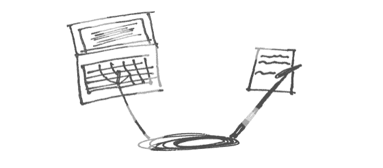

# 软件工程师应该写| Shubhro Saha

> 原文：<http://www.shubhro.com/2014/12/27/software-engineers-should-write/?utm_source=wanqu.co&utm_campaign=Wanqu+Daily&utm_medium=website>

# 软件工程师应该写

在小学，有“数学孩子”，也有“英语孩子”。你是根据其他孩子对你每门学科能力的印象来分类的。

我是个数学天才。所以我主修计算机科学，并开始成为一名软件工程师。然而，一路走来，“数学孩子”/“英语孩子”的称号从未真正消失。如果有的话，它变得更强了。我今天遇到的工程师一想到写论文就畏缩不前。我遇到的作家一想到写代码就畏缩不前。

太可惜了！一个写代码的工程师也应该写论文。

软件工程师应该写作，因为它促进了许多编程所需的技能。这两个学科的核心技能是清晰思考的能力。最好的软件工程师是伟大的作家，因为他们的文章就像他们的代码一样有逻辑和优雅。

代码和文章有很多共同之处。两者都是从一张白纸和一个想法开始，然后作为面向目标受众的离散产品而结束。产品是一系列逻辑语句，被捆绑成模块化单元——无论是函数还是段落。像好的散文一样，好的代码是[简洁](http://www.folklore.org/StoryView.py?story=Negative_2000_Lines_Of_Code.txt)(认为“[富有表现力](https://robinwinslow.co.uk/2013/11/22/expressive-coding/)”)。坏代码浪费 CPU 周期；糟糕的论文浪费大脑循环。

当接近一个成品时，工程师和疲惫的作家一样感到不安。就像论文一样，软件永远不会感觉“完成”了。它需要工程师更多的时间:另一个需要构建的特性，另一个需要重构的模块。他/她担心这不是他/她的作品的最佳表现。哦好吧。装运它。

软件工程师应该写作，因为我们的工作越来越具有协作性。开源项目邀请全球参与，而行业产品通常需要一大批工程师。(谷歌地图有 [1100 名全职员工](http://www.businessinsider.com/to-do-what-google-does-in-maps-apple-would-have-to-hire-7000-people-2012-6)！)好的写作——无论是在 GitHub 注释、代码评审还是技术文档中——都有助于清晰、简洁的交流，从而推动项目向前发展。

即使一个项目不需要交流，写软件也能促进学习和重要的讨论。多亏了其他工程师写的教程，我们不必学习 RFC 规范和技术手册。在技术讨论中，一条黑客新闻评论或一条推文中只能塞进这么多观点。其余的请求被引导到一篇博客文章中。

关于博文的话题，花点时间在上面。好的写作[需要时间](http://goinswriter.com/the-difference-between-good-writers-and-bad-writers/)。很自然的，写一份“潦草的稿子”，然后通过[的几次修改](http://www.paulgraham.com/writing44.html)来提高质量。如果你觉得太忙而没有时间写博客，对话题不知所措，或者担心你的观点被公开记录，给史蒂夫叶格的 [*你应该花十分钟时间写博客*](https://sites.google.com/site/steveyegge2/you-should-write-blogs) 。即使它不能说服你，我想你会喜欢这本书的。

软件工程师应该写作，因为他们可能真的喜欢写作。我们中的许多人都被我们的软件具有“影响力”的潜力所激励，去改变人们的生活。

同样，写作是产生影响的有力工具。关于管理的博客文章有助于管理者激励他的团队。编程教程激发了学生对计算机科学的兴趣。这篇关于职业建议的文章激励毕业生去追求新的职业道路。

即使没人读你的文章，写出来也会对你产生影响。它会澄清你对某个话题的看法，增强——甚至削弱——你的信念。将杂乱的思想转化为具体的语言的过程本身就是有价值的。

写作提供了与激励工程师写软件相同的冲击感。将这一点与它如何促进软件工程中有用的技能和促进协作结合起来，那么突然之间，写作似乎成了一项有价值的活动。

即使是对“数学小孩”来说。

2014 年 12 月

[黑客新闻](https://news.ycombinator.com/item?id=8810382) ⋅ [Reddit](https://www.reddit.com/r/programming/comments/2qpy4g/software_engineers_should_write/) ⋅ [葡萄牙](http://andersonnnunes.org/?p=338)