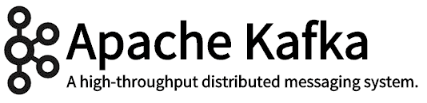

# LinkedIn 的卡夫卡:现在和未来

> 原文：<https://engineering.linkedin.com/kafka/kafka-linkedin-current-and-future?utm_source=wanqu.co&utm_campaign=Wanqu+Daily&utm_medium=website>

LinkedIn 工程团队开发并构建了一个强大的开源解决方案来管理信息流。我们使用 Kafka 作为消息传递主干，帮助公司的应用程序以松散耦合的方式协同工作。LinkedIn 在很大程度上依赖于 Kafka 的可扩展性和可靠性，以及由开源和内部组件组成的周围生态系统。我们将继续在 Kafka 上投资，以确保我们的消息主干保持健康，因为我们对它的要求越来越高。

## LinkedIn 的使用案例

如今，LinkedIn 中利用 Kafka 的一些常见场景包括:

1.**监控:**LinkedIn 上的所有主机都通过 Kafka 发出有关其系统和应用程序健康状况的指标。然后收集并处理这些信息，以创建监控仪表板和警报。更深入的阅读可以在[这里](https://engineering.linkedin.com/52/autometrics-self-service-metrics-collection)找到。除了标准指标之外，更丰富的[调用图分析](http://engineering.linkedin.com/samza/real-time-insights-linkedins-performance-using-apache-samza)也通过利用 [Apache Samza](http://samza.incubator.apache.org/) 实时处理事件来完成。

2.**传统消息传递:**LinkedIn 的各种应用程序利用 Kafka 作为标准排队和发布订阅消息传递的传统消息传递系统。这些应用包括搜索、内容提要和相关性，它们将处理过的数据发布到在线数据服务商店，如 Voldemort 等。

3.**分析:** LinkedIn 跟踪数据，以更好地了解我们的成员如何使用我们的产品。诸如哪个页面被浏览，哪个内容被点击等信息被发送到每个数据中心的 Kafka 集群中。这些事件都被集中收集并推送到我们的 Hadoop 网格上，以便进行分析和生成每日报告。

4.**作为各种分布式应用/平台中的构建模块(日志):** Kafka 也被其他产品用作核心构建模块(分布式日志)，如我们的大数据仓库解决方案 [Pinot](https://engineering.linkedin.com/analytics/real-time-analytics-massive-scale-pinot) 。我们还致力于使用 Kafka 作为分布式数据库 Espresso 的内部复制和变更传播层。

## **LinkedIn 上的 Kafka 生态系统**

Apache Kafka 必须增加一组组件，以支持多种使用场景。在 LinkedIn，除了 Apache Kafka 之外，Kafka 生态系统还包括以下组件。

**1。** [**MirrorMaker**](https://cwiki.apache.org/confluence/pages/viewpage.action?pageId=27846330) :这是一个开源项目，用来在 Kafka 集群之间移动数据。在许多情况下，我们需要业务逻辑来操作多个数据中心中生成的事件。MirrorMaker 用于跨数据中心聚合这些事件。

**2。一个 REST 接口:**这个接口允许非 java 应用程序使用瘦客户端模型轻松发布和使用来自 Kafka 的消息。

**3。一个模式注册中心:在 LinkedIn，我们已经在很大程度上根据 T2 AVRO 的事件模式进行了标准化。在核心的 KAFKA APIs 之上，我们有一个分层的 API 来发送和接收 AVRO 事件。这个 API 隐式地使用一个模式注册服务来序列化和反序列化从 Kafka 发送和接收的事件。**

**4。审计服务**:事件在一个 LinkedIn 数据中心生成。但是，他们通常会被转移到不同的数据中心进行大量离线处理。在此移动过程中，重要的是使用应用程序(例如，map reduce 作业)要了解何时收到了特定时间窗口内生成的所有事件，以便开始离线处理。同样构建在 Kafka 之上的审计服务就是用来解决这个问题的。

**5。将数据从 Hadoop 推送到 Kafka 的桥梁**:使用将数据从 Hadoop 推送到 Kafka 的桥梁，我们的 map-reduce 集群(Hadoop)中获得的大部分数据被推回到我们的服务数据库(如 Voldemort)。

## **卡夫卡在 LinkedIn 的未来**

随着 LinkedIn 的发展，我们知道我们需要走在增长曲线的前面，并确保我们的消息主干保持健康。随着公司的发展，我们预计使用 Kafka 的团队和应用程序的数量以及他们需求的多样性将会增加。此外，随着用户(开发人员和网站可靠性工程师)数量的增加，我们预计 Kafka 的用户对 Kafka 的理解程度会有更大的提高。因此，我们需要确保可以避免简单的错误。

我们计划在 2015 年重点发展以下关键领域:

**1。** **安全性**:我们需要为 Kafka 代理添加基本的认证和授权功能。这必须涵盖管理和运行时操作。即使在安全的网络中，这对于某些类型的数据也是必要的，以避免人为错误。开源社区已经开始了很多这样的工作。

**2。** **配额**:假设我们有各种各样的应用程序利用同一个 Kafka 集群，确保一个应用程序不会意外地使用所有系统资源并对 Kafka 集群上的所有应用程序产生负面影响是很重要的。在 Kafka 中，我们必须担心每个代理主机上的网卡以及架顶式交换机的饱和。当应用程序从 Kafka 日志的开头开始读取，或者只是在长时间的暂停后赶上时，它们会使网络饱和。这种情况会给共享网络的许多其他应用程序带来意想不到的后果。这将是我们关注的一个重要领域。

**3。** **可靠性和可用性** **:** 我们从开源的主干中拾起卡夫卡。在开源领域，有很多贡献者。正如任何有很多工程师的项目一样，在我们将这些部分投入生产之前，在升级、故障转移和压力测试方面需要一定程度的严格性。我们将继续在这方面投资。此外，大量的时间花在寻找和解决我们日常使用卡夫卡时发现的问题上。

**4。** **核心功能** **:** 在过去的一年里，我们在 Kafka 中创建了一组[新的 API](https://cwiki.apache.org/confluence/display/KAFKA/Client+Rewrite)，允许流水线发布操作，从而为将事件发布到 Kafka 提供更好的性能。在接下来的一年里，我们希望也能致力于一个新的消费者 API。新的消费者 API 将从本质上消除 Kafka 客户端对 Zookeeper 的依赖。这也使我们能够拥有一个完整的安全模型。

除了对胖客户端的这些改进，我们还在 Kafka 的瘦客户端上进行了大量投资。基本上，我们想让 Kafka 的 REST 接口成为一流的，支持 SLA 和监控的核心设置。

**5。** **具有成本效益:**随着公司规模的扩大，确保 Kafka 经纪人集群能够扩展显然非常重要。我们目前每天处理多达 5500 亿个事件，同时达到每秒 800 万条传入消息和每秒 3200 万条传出消息的峰值。卡夫卡就是为此而设计的。但是，我们需要做一些工作来确保我们不会通过投入越来越多的硬件来解决规模问题。

**6。** **新计划:**我们的数据基础设施部门有一些新计划，将在新的场景中利用 Kafka。具体来说，我们的分布式数据库 [Espresso](http://data.linkedin.com/projects/espresso) 将开始利用 Kafka 在主 Espresso 存储节点及其辅助节点之间进行复制。目前 LinkedIn 大多使用 Kafka 进行吞吐。这些额外的使用情形也将要求更低的延迟。我们还必须更仔细地测量 Kafka 代理主服务器的故障转移时间，并有可能对其进行调整。

**7。** **提高可操作性:**我们目前有很多 Kafka 的手工流程。我们的站点可靠性工程师(SREs)已经创建了许多很酷的工具来帮助解决这个问题。但是我们需要在卡夫卡身上解决一些问题。例如，当我们移动分区时，我们必须小心不要使网络饱和。今天，这是由 SREs 精心完成的。我们需要软件来解决这个问题，以减少人为错误。当添加一个节点时，如果 Kafka 在保持集群平衡的同时自动移动适当的分区集，那就太好了。

## 与开源社区的合作

几个月前，Apache Kafka 的一些原始工程师离开 LinkedIn，创办了专注于 Kafka 的初创公司 [Confluent](http://confluent.io/) 。我们祝愿他们一切顺利，并对卡夫卡社区的扩大感到兴奋。我们将继续与 Apache Kafka 的所有贡献者密切合作，使之更上一层楼。