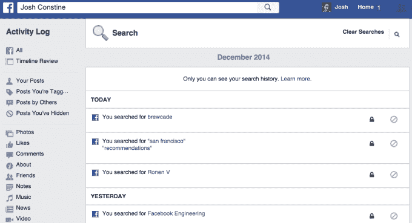
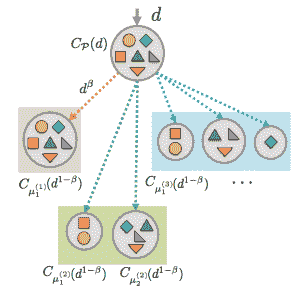

# 脸书索引我们 1 万亿条帖子的巨大影响 TechCrunch

> 原文：<http://techcrunch.com/2014/12/28/mining-the-hive-mind/?utm_source=wanqu.co&utm_campaign=Wanqu+Daily&utm_medium=website>

互联网的整个翅膀刚刚加入到我们的集体良知中，就像谷歌的网站或之前维基百科的知识一样。

然而，新闻随着

[analysis](http://www.techmeme.com/141208/p16#a141208p16)

仅仅关注什么

[Facebook’s new keyword post search](https://beta.techcrunch.com/2014/12/08/facebook-keyword-search/)

今天有。是的，你或你朋友的任何帖子现在都可以被挖掘出来

[a quick search from mobile](https://beta.techcrunch.com/2014/12/08/every-post-is-an-opinion/)

。但我不认为人们意识到这对明天有多重要。脸书刚刚从数据丰富的人变成了数据丰富的吝啬鬼。

对广告、开发商和脸书本身的影响很难理解。我们最生动的二重身，我们的数字回声现在可以被追踪。他们不仅说我们是谁，还说我们要去哪里，我们下一步想要什么。

第一，万亿岗位指数给了我们群体记忆。每个人只能从他们的朋友和周围的网络中搜索故事，但是[马克·扎克伯格最近说](https://www.facebook.com/video.php?v=846549162069527&set=vb.823440467713730&type=2&theater)这些加起来超过 1 万亿条帖子。

如果你的朋友把他们的生命放在脸书，你现在也可以记住他们。你可以说这些只是褪色的快照，离真实的东西很远，但是我们自己的生活中有多少是我们完全忘记的呢？搜索你自己和几乎任何词，你可能会发现你自己过去的场景，你觉得不值得保存在本地。

如果我们知道存在对我们来说太丰富了，以至于无法记录我们脑海中的一切，并且接受脸书的帖子仅仅是对逝去的时光的暗示或触发，我们可以增加我们的记忆，而不会因为我们正在取代它们而感到内疚。

但这不是脸书时间线。自 2011 年以来，我们能够深入一位朋友的宏大叙事。但是除了我们当中最令人毛骨悚然的人，很少有人会漫无目的地挖得这么深。Post search 通过选择描述不同生活的词语，将它们编织在一起。从我们人际网络的不同角度来看,“快乐”、“爱”或“担心”意味着什么？这是一个我们可以突然回答的问题。

*参见我在脸书邮报搜索的[实践，了解使用该功能的八种有用方式](https://beta.techcrunch.com/2014/12/08/every-post-is-an-opinion/)*

第二，你可以说脸书以前很了解我们，但直到现在才理解，就像一个学生记住了事实，最终知道了他们是如何拼凑成历史的。

脸书的产品依赖于根据我们是谁来猜测我们想要什么。以前，这意味着我们说我们是谁，我们与哪些朋友交流，我们喜欢什么，我们在哪里浏览。现在，对脸书来说，我们也是我们所说的，这说明了很多。

索引我们的帖子可以改善脸书的活动建议

最明显的是，新闻提要可以学习模仿我们的外部对话，向我们显示与我们传播的内容相似的帖子。从不谈论运动或婴儿？脸书最终会把这些从你的信息中过滤掉。刚刚分享了你对叙利亚，名人八卦，或警察国家的想法？该算法可以发出声音，向你展示更多相关新闻。

建议朋友。建议的活动。建议喜欢的页面。脸书之前对你的身份进行了一些窃听和高层观察。现在它对我们是谁有了更亲密的印象。

开发者最终也能更好地理解我们。想象一个脸书邮报搜索 API。一个可以将你的帖子至少召回到其他应用程序的功能。现在它还不存在，但是脸书渴望给开发者配备个性化工具，希望他们会购买或托管它的广告。

有了我们写的大量内容，一切都会变得更加相关。

尤其是广告。我不得不想象在一个光鲜亮丽的广告公司会议室的某个地方，两个广告公司的兄弟正对着如此多的目标数据挥拳相向。脸书说，帖子搜索没有新的广告选择，但关键的遗漏是“还没有”这个词。

脸书在广告方面的最大弱点是它不像谷歌搜索那样知道你现在在想什么。所有这些简介和有趣数据使脸书成为大品牌广告的王牌。但它缺乏迫切的购买意图，让搜索引擎收取丰厚的广告费，将相机广告放在“最佳相机”的搜索结果之上。

脸书关键词广告可以改变这一点。相关广告不会出现在搜索结果中，而是会在你发布后立即出现在你的订阅源中。所有那些“我应该看什么电影？”，“等不及明天去波特兰了！”“我的车刚刚熄火了”的帖子已经有了购买意向，广告商们很乐意利用这种优势。

2012 年，脸书在旧搜索栏的下拉建议上尝试了关键词搜索广告，但在 Graph Search 推出之前放弃了这个想法

不仅仅是在脸书。通过[收购视频广告中间商 LiveRail](https://beta.techcrunch.com/2014/12/04/beyond-the-click-economy/) 和[推出其移动广告网络](https://beta.techcrunch.com/2014/10/07/facebook-audience-network-ads/)，该公司的[广告定位触角](https://beta.techcrunch.com/2014/12/10/defenders-of-the-adiverse/)现已延伸至网络和移动领域。脸书在第三方网站和应用上发布的营销信息也会变得更加智能。

20 个月前，我建议[谷歌应该担心，因为如果脸书发现了关键词广告，它对购买意图的束缚可能会削弱](20%20months%20ago%20I%20suggested%20that%20G)。很快，这两家公司，还有 Twitter，实际上可能会为“搜索广告”美元而战。

在阅读这篇文章的某个时候，你的皮肤应该已经开始蠕动了一点点，想想脸书索引 1 万亿个帖子的隐私含义。

默默无闻的隐私基本上是死的。以前，如果你曾经发布了一些愚蠢的东西，你是安全的，除非有人费力地一篇接一篇地浏览你的时间线，然后把它挖出来。

现在，任何人只要掌握了正确或错误的关键词，就可以调出你最糟糕的时刻，然后悄悄地评判或公开羞辱你。不信？只要搜索一些诋毁，看看你的朋友出现了。

求职者和公众人物要小心了。现在可能是时候对自己进行一些搜索，并为你说过的任何愚蠢的话做出补偿。从技术上讲，你的隐私设置没有改变，但脸书上的隐私功能发生了变化。

除了人际关系，有些人可能会对脸书知道他们这么多感到不舒服。万亿邮政指数肯定不会减轻人们的老大哥偏执。我们比以往任何时候都更被迫相信脸书是我们信息的仁慈管家。不是每个人都乐意含蓄地签署那份合同。

脸书甚至记录你搜索的内容，尽管活动日志是私人的，可以编辑。

如果你认为广告已经令人毛骨悚然，就等着瞧吧。那些跟随你在网上销售你之前检查过的东西的重定向广告仅仅是个开始。你在 5 分钟或 5 年前说的话可能很快就会影响到你看到的广告，悄悄暗示他们如何能像你一样说话，以显得更有吸引力。

广告不可避免。我宁愿它们是我真正想要的东西。他们的收入为每个人的免费服务买单，而不仅仅是那些付得起钱的人。尽管如此，他们变聪明的速度之快还是让人有点不安。

甚至很聪明。现在，脸书比以往任何时候都更有理由向其人工智能项目投入资金。人工智能将让脸书破译大规模的意义，挖掘万亿条帖子来提高一切的相关性，而不需要人类员工窥探任何人的内容。

扎克伯格对此并不避讳。他多次表示，除了 Oculus 的虚拟现实和 Internet.org 的信息无障碍，人工智能是脸书三大长期目标之一。

脸书的人工智能研究实验室正在寻找从我们的帖子中挖掘意义的方法

在收购 Oculus 后的投资者电话会议上，他说，为了追求脸书“理解世界”的目标，我们在 T2 成立了雄心勃勃的人工智能研究小组(T3)，试图建立一个统一的模型来描述世界上每个人之间的联系。近期来看，我们在搜索和新闻订阅方面的努力，将帮助你的网络向你提供更多有用的信息。”

扎克在 7 月的财报电话会议上说了类似的话，[在 7 月的财报电话会议上把搜索和人工智能联系起来](http://files.shareholder.com/downloads/AMDA-NJ5DZ/3773900379x0x771026/6A17FE2B-316C-432A-8C76-008A52FA744D/FB%20Q214%20Earnings%20Conference%20Call%20transcript.pdf)，早在 1 月时[他解释说人工智能将帮助脸书“理解人们写的帖子的意思”](http://files.shareholder.com/downloads/AMDA-NJ5DZ/3773908794x0x721893/5D1F707A-D5E6-4E05-960C-FF4345641D2E/FB_Q4andYearEnd2013EarningsTranscriptPreparedRemarks.pdf)

脸书花了 8 年时间收集我们写的帖子。首先是在新闻提要中显示它们，然后让它们可以通过时间轴浏览，现在终于有了搜索。接下来会发生什么很难预料，但这将清楚地表明，脸书一直坐在一座金矿上。

因为不在于你的数据有多大。而是你用它做什么。