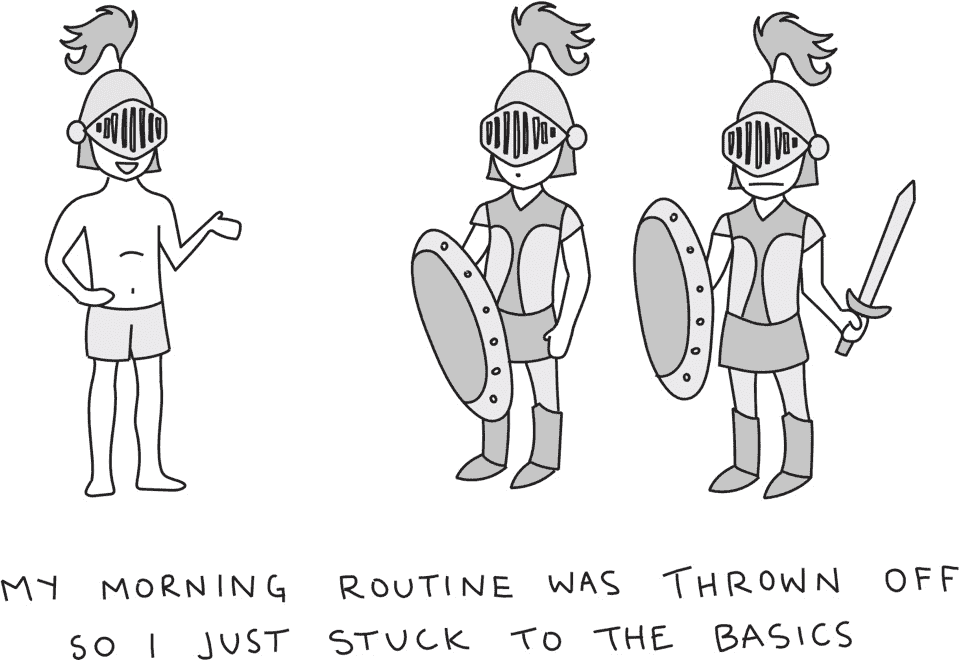

# 我的晨间惯例——鼓舞人心的晨间惯例

> 原文：<http://mymorningroutine.com/?utm_source=wanqu.co&utm_campaign=Wanqu+Daily&utm_medium=website>

被选为亚马逊 2018 年最佳商业书籍之一，英国《金融时报》本月最佳书籍之一，以及 Business Insider 今年夏天最佳商业书籍之一。

玛丽·近藤在离开家之前做了一个快速的整理仪式来让自己平静下来。皮克斯和华特迪士尼动画工作室的总裁艾德·卡姆尔将三份浓缩咖啡与三勺可可粉和两种甜味剂混合。健身专家吉利安·迈克尔斯没有设置闹钟，因为她五岁的女儿每天早上都会跳到床上抱着她，把她从睡梦中吵醒。

一部分是指导手册，一部分是别人的日记，《我的早晨惯例》的作者采访了 64 位当今最成功的人——包括三次奥运会金牌得主丽贝卡·索尼、Twitter 的联合创始人比兹·斯通和斯坦利·麦克里斯特尔将军——并提供了关于创建自己的惯例的永恒建议。

有些套路都是晨练，斯巴达式的生活；其他的比较悠闲，自我放纵。他们的共同点是他们不觉得自己是个苦差事。一旦你进入正确的日常生活，你就会期待醒来。

<noscript>T3】</noscript>

这份全面的指南将告诉你如何进入一个适合你的日常生活，这样你就可以养成前进的习惯。就像积木一样，我们一天中所做的选择取决于我们早上设定的目标。不管喜欢与否，我们早上的习惯构成了我们一整天的基础。

无论你是想提高你的工作效率，进行锻炼或冥想，还是只是想在早上学会逆来顺受，这本书都能满足你。