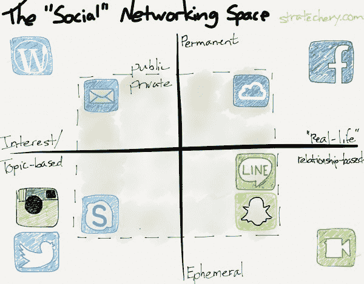

# 本·汤普森的《众多的社会策略》

> 原文：<https://stratechery.com/2013/multitudes-social/?utm_source=wanqu.co&utm_campaign=Wanqu+Daily&utm_medium=website>

***我是否自相矛盾？
很好，那我就自相矛盾，
(我很大，我包含众多。)**
——沃尔特·惠特曼，自我之歌*

据报道，上周 Snapchat 拒绝了脸书 30 亿美元的全现金收购。显然，脸书担心失去青少年用户，或者也许他们被 Snapchat 声称每天处理的 3 . 5 亿张照片吓坏了。然而，有一点似乎很清楚，那就是脸书打算“拥有社交网络”

这种策略的唯一问题是，拥有 social 的想法是徒劳的。正如惠特曼所写，社交就是做人，而做人就是包容大众。对我来说，是众多的应用程序。

在过去的两天里，我使用了 10 款你可以称之为“社交”的应用。排名不分先后:

*   Twitter，用于关注新闻，评论技术和战略
*   脸书，用于发布个人状态更新和登记
*   线，用于和我在台湾的妻子和朋友发短信
*   Snapchat，用来和我妻子交换照片
*   Skype，用于与同事发送即时消息
*   Facetime，用来和我的妻子和孩子聊天
*   Instagram，用于发布很酷的照片
*   电子邮件，适用于所有类型的内容，包括工作和个人内容
*   Photostream，用于与家人分享照片
*   发布到这个博客的 [1](#fn1-597 "Disclosure: I work for Automattic, which owns WordPress.com. This article represents my personal views")

在马克·扎克伯格的世界里，我的行为往好里说是荒谬和低效的，往坏里说是在零和社交对抗中对脸书的威胁。毕竟，这不是脸书第一次尝试统一通信——早在 2010 年 11 月，这就是脸书信息的目的。从[连线](http://www.wired.co.uk/news/archive/2010-11/16/facebook-modern-messaging-system):

> 脸书正寻求用其所谓的“现代信息系统”取代电子邮件，该系统将人们发送信息的所有方式——包括电子邮件、即时消息和短信——整合到一个单一的界面中…
> 
> 这个名为脸书信息的新系统于周一公布。它允许你简单地点击一个朋友的脸，输入一条信息，然后按回车键。脸书处理其余的。它还有一个可选的“facebook.com”电子邮件地址。但新的电子邮件地址不是重点。相反，它是各种通信手段的统一。

统一，在 2010 年。鉴于此后发生的现实，这是一个非常古怪的想法。然而，对于脸书的投资者来说，30 亿美元一点也不稀奇:对于一个事实上根本无法与脸书竞争的应用来说，这是一笔巨大的资金浪费。

再看看我的应用列表:每个都有自己的位置。一些是为了与朋友和家人交流，另一些是为了以我的兴趣为中心的不同受众。有些更有意义和永久，有些短暂且很快被遗忘。有些是供公众消费的，有些是私人的。有些是以照片为中心的，有些是关于文字的。事实上，几乎没有任何重叠——与脸书也没有重叠:

[T2】](https://i0.wp.com/stratechery.com/wp-content/uploads/2013/11/photo-1.jpg)

脸书做出了他们的选择:它们是你生活的公共记录，也是与你的朋友和家人联系的最佳方式。Snapchat 可以和朋友一起工作，但在其他方面，它是完全相反的产品。

脸书最好继续投资改善他们的广告信号。正如我之前[写的](http://stratechery.com/2013/mobile-makes-facebook-just-an-app-thats-great-news/)，脸书坐在一个展示广告的金矿上；他们只需要目标匹配。这就是为什么 Waze 在[如此失败的原因。如果他们想收购一个竞争对手，最好专注于威胁他们的公共永久空间的竞争对手，或者像 Instagram 这样非常适合他们展示业务的竞争对手。](http://stratechery.com/2013/waze-winners-and-losers/)

然而，最重要的是，脸书需要认识到，他们在 PC 上的社交主导地位是 PC 缺乏移动性和日常生活应用有限的产物。智能手机几乎无处不在，我们的内心比任何一个社交网络都要丰富得多。

### *相关*