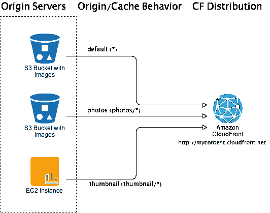
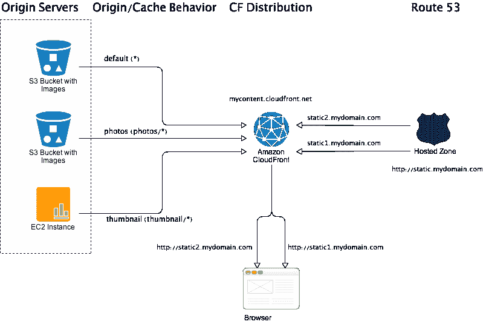
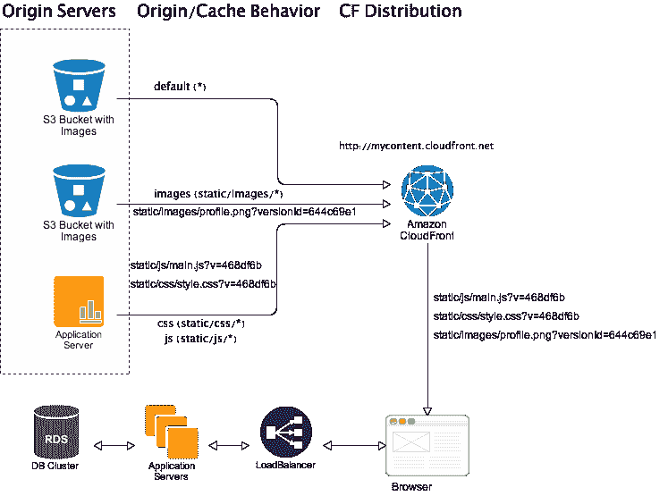
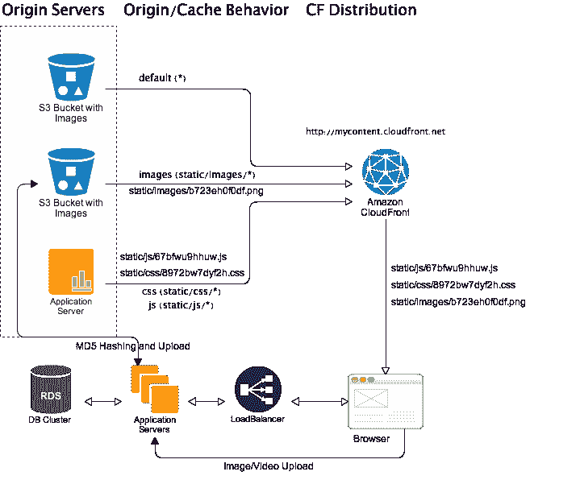
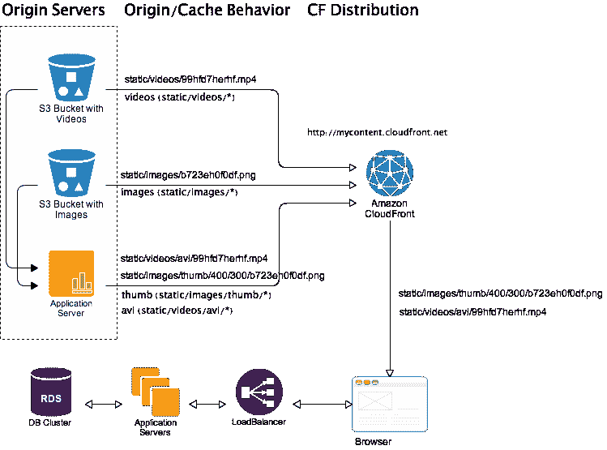
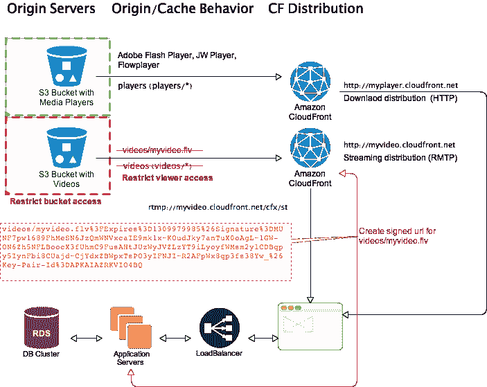
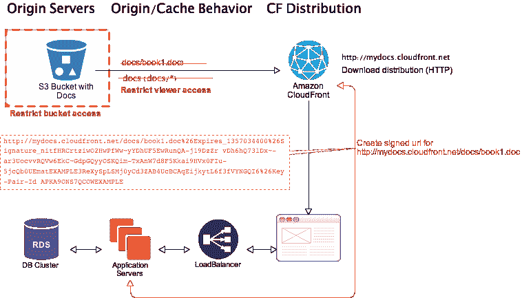
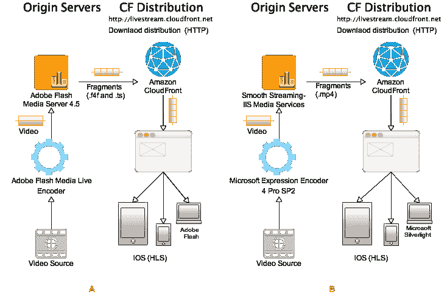

# CloudFront 设计模式和最佳实践

> 原文：<http://abhishek-tiwari.com/post/CloudFront-design-patterns-and-best-practices?utm_source=wanqu.co&utm_campaign=Wanqu+Daily&utm_medium=website>

CloudFront 是亚马逊网络服务(AWS)提供的内容交付服务。CloudFront 使用超过 28 个边缘位置的全球网络提供静态内容(图像、音频、视频等)。使用这些边缘位置，CloudFront 通过从最近的边缘位置提供内容对象的缓存副本来加速内容的交付。服务是高度可靠的，旨在与亚马逊 S3 或任何其他自定义源服务器一起使用。

CloudFront 也可以提供动态或交互式内容，但与 Akamai 等类似服务相比，目前的支持非常有限。鉴于 CloudFront 比 Akamai 更具成本效益，并且服务在功能方面发展非常迅速，我强烈推荐 CloudFront。

围绕 CloudFront 开发了一些有趣的使用模式和最佳实践。在我们深入研究 CloudFront 设计模式和最佳实践之前，最好熟悉一些基本的 CloudFront 概念。

### 云锋分布

CloudFront (CF)分发基本上将内容对象识别、分发或缓存到边缘位置。CloudFront 发行版由一组源服务器和定义源或缓存行为的规则组成。原始服务器是内容的原始来源，它可以是像亚马逊 S3 这样的静态文件存储，也可以是动态内容服务器。目前，对于每个 CloudFront 发行版，CloudFront 只支持 10 种缓存行为。请注意，每个缓存行为都是唯一的，并且只能与一个源服务器相关联。将一个高速缓存行为关联到多个原始服务器能力目前是不可用的。当然，您可以将一个源服务器关联到多个缓存行为。CloudFront 发行版还支持使用查询字符串对内容对象进行版本控制。

根据内容的不同，CloudFront 分发可以是下载或流式分发。流分发通常用于点播视频/音频流。下载分发用于提供其他形式的非流内容，如图像、CSS、JavaScripts、HTML 页面等。假设浏览器中的媒体播放器插件是活动的，视频/音频内容也可以通过下载分发来提供。下载和流式分发都支持 HTTP/HTTPS 协议。根据媒体服务器，流媒体分发可能支持其他协议。

### Cloudfront 是如何工作的？

当一个文件被请求到 CloudFront 发行版时，

1.  CloudFront 首先确定最近的 CloudFront 边缘位置。
2.  然后，CloudFront 会检查最近的边缘位置的缓存，以获取所请求的文件。如果文件在缓存中，边缘位置将为其服务。
3.  如果文件不在缓存中，CloudFront 会将请求模式与源或缓存行为进行匹配，并从相应的源服务器获取文件，然后将其分发到边缘位置。

### 模式 1:域分片

所有的网络浏览器都能够并行下载 CSS、JavaScripts、图片等资源。传统上，web 浏览器限制一个浏览器可以同时连接到一个域的数量。例如，Internet Explorer 7 只允许每台服务器并行下载两次。

大多数现代浏览器已经取消了每个服务器只能并行下载两次的限制。事实上，Firefox desktop 每台服务器可以建立 8 个连接，而对于 Google Chrome 和 Internet Explorer 8/9，现在的限制是每台服务器 6 个连接。

仍然有很多改进的机会。例如，一个普通的[电子商务网页](http://shop.cottonon.com/shop/women/)在一次页面浏览中下载了 80 多种资源——最终降低了页面加载时间。这就是域分片技术派上用场的地方。

域分片使用两个或更多的主机名或 CNAME 别名来提供来自单个服务器的内容。浏览器将它们视为不同服务器，因此我们看到并行下载的限制增加了。例如，跨 2 个 CNAME 别名的分片将使并行下载能力加倍。一般来说，使用两个 CNAME 别名是最好的。超过四个 CNAME 别名会降低浏览器性能，导致大量 CPU 和内存使用。

使用 CloudFront 别名功能，您可以在给定的 CloudFront 发行版上映射多个 CNAME(最多 10 个 cname)。对于 CNAME 别名，我们可以使用亚马逊路线 53。在应用程序端，您必须启用域分片逻辑，这基本上需要过滤视图/模板中的所有静态/媒体 URL 引用，并随机映射到一个 CNAME 别名。例如，在 Django 中，你可以编写一个 Django 中间件或模板处理器，它将把模板中的任何`MEDIA_URL`或`STATIC_URL`元素替换为一个 CNAME 别名。

请注意，由于 SSL 证书不匹配问题，目前 HTTPS 请求无法进行域分片。为了绕过这个限制，您可以使用两个不同的 CloudFront 发行版，它们具有相同的原始服务器和规则。

### 模式 2:版本控制

在 CloudFront 中，缓存失效是一个有各种限制的高成本操作。首先，在任何给定的时间，您只能运行 3 个失效请求。其次，在每个验证请求中，您最多可以包含 1000 个文件。第三，失效需要时间传播到所有边缘位置(5~10 分钟)。CloudFront 分布的变化最终将是一致的，但不是立即的。就成本而言，在给定的一个月内，1000 个文件的失效是免费的，此后，您必须为您的失效请求中列出的每个文件付费。

内容版本控制是避免无效相关问题的最佳方式之一。CloudFront 支持使用查询字符串进行版本控制。要启用基于查询字符串的版本控制，您必须为给定的缓存行为打开“转发查询字符串”。之后，CloudFront 会将完整的对象路径(包括查询字符串)传递给源服务器。CloudFront 将使用完整的对象路径来唯一地标识缓存中的内容对象。因此，对于版本化对象的失效，您必须提供完整的对象路径，如`/static/profile.png?versionID=123`。在原始服务器端，服务器将解释查询字符串并提供内容对象的最终版本。

建议关闭“正向查询字符串”时，CloudFront 缓存性能会更好。如果基于查询的版本化不适合您，那么您可以使用基于版本的文件命名，而不会影响 CloudFront 缓存性能。对于版本控制，您可以使用以下方法之一或组合:

1.  文件名加上版本为`/static/profile.png?versionID=123`的查询字符串。

2.  带有版本前缀/后缀`/static/profile_v123.png`的文件名。

3.  基于文件内容`712vds57tr18929812312enb.png`作为唯一关键字的文件名。

#### 文件名加上带有版本的查询字符串

这对于所有的内容类型都适用，包括 CSS、JavaScript、图像、视频等等。对于应用程序内容类型，如从应用程序服务器等自定义来源提供的 CSS/JavaScript，您可以使用应用程序代码的 Git/Hg `HEAD`散列作为版本 id。对于存储在亚马逊 S3 的图像/视频等媒体内容类型，您可以使用`x-amz-version-id`头作为版本 id。

例如，在下图中，所有应用程序服务器都运行相同版本的应用程序代码。`468df6b`是应用程序代码的 Git `HEAD`散列的前 7 个字符。当然，您的视图/模板将需要从 Git `HEAD`中提取这个版本 id，并在引用 CloudFront 内容 URL 时使用。此外，在部署新版本的应用程序代码时，确保作为 CloudFront 定制源的应用服务器总是首先更新。此外，当存储对 CloudFront 对象的引用时，对于版本化的对象，您必须在应用程序数据库中存储完整的对象路径和版本字符串。

#### 带有版本前缀/后缀的文件名

这与第一种方法非常相似，但是没有查询字符串，并且改进了缓存。这更适合应用程序内容类型(CSS/JavaScript)。新对象路径看起来像，

1.  `static/js/main_v468df6b.js`

2.  `static/css/style_v468df6b.css`

#### 文件名作为基于文件内容的唯一键

在这种方法中，文件名是从文件内容生成的唯一哈希密钥。这适用于应用程序和媒体内容类型。

对于图像/视频内容，在上传到亚马逊 S3 之前，您可以为给定文件生成 MD5 哈希，并将其用作上传内容的文件名。使用这种方法还可以避免内容重复，因为可以使用 MD5 散列来比较内容。

对于应用程序内容，您可以使用管道来缩小和合并 CSS/JavaScript 文件，然后为 CSS/JavaScript 生成一个文件，文件名使用文件内容的 MD5 哈希生成。

### 模式 3:动态缩略图和编码

使用自定义源，有可能做动态图像缩略图和视频编码。下图描述了一个工作流示例。

假设用户的浏览器请求的文件`statimg/thumb/400/300/b723eh0f0df.png`基本上是存储在 S3 桶中的图像`statimg/b723eh0f0df.png`的大小为`400x300`的缩略图。现在，如果这个图像已经在 CloudFront 缓存中，那么 CloudFront 将提供缓存的缩略图。否则，CloudFront 将用匹配的缓存行为将请求传递给源服务器(`statimg/thumb/*`)。在这种情况下，application server origin 将接受调用，从 S3 bucket 下载原始图像`statimg/b723eh0f0df.png`，生成所需大小的缩略图，并将其返回给 CloudFront distribution 以提供服务。现在，根据原始图像的大小和缩略图的质量，整个过程可能需要 50-500 毫秒。一旦生成，我们可以为缩略图设置更长的到期时间，以便在不久的将来 CloudFront 不会再次请求。由于原始图像被版本化，缩略图也受版本控制。

有人可能会争辩说，预先生成预定义大小的缩略图并存储在亚马逊 S3，但鉴于现在一天的内容是由不同屏幕大小和分辨率的设备消费的，实际上不可能批量生成缩略图。更不用说缩略图大小的微小变化将需要大量重新生成缩略图。动态缩略图可以动态生成针对设备优化的缩略图，并将其缓存在 CloudFront 上。

相同类型的工作流程可用于动态视频/音频编码。唯一的区别将是完成往返所需的时间，这将比图像缩略图更长。不幸的是，动态编码可能只适用于非常小的文件。使用亚马逊弹性代码转换器和亚马逊 SQS 与定制的原始服务器，我们可以提高整体性能，但它仍然不如批量编码有效。

### 模式 4:压缩

Amazon CloudFront 可以根据查看者或浏览器的请求提供压缩和未压缩版本的文件。要接收压缩内容，浏览器必须在请求头中包含`Accept-Encoding: gzip`。如果压缩内容可用，那么它将被提供，否则 CloudFront 将提供文件的未压缩版本。

压缩内容提供速度更快，使用的带宽更少。不幸的是，对于压缩，CloudFront 依赖于原始服务器。亚马逊 S3 也不执行压缩。虽然亚马逊 S3 可以在同一个桶中存储 gzip 和非 gzip 版本的文件。当上传 gzip 文件到亚马逊 S3 时，我们需要将`Content-Encoding`设置为`gzip`。建议使用自定义源服务器来动态压缩内容。像 Nginx、Apache 等大多数服务器都支持动态 gzip 压缩。

如果我们使用自定义源服务器来提供版本化内容(HTML、CSS 和 JavaScript ),它可以同时执行压缩。一般来说，媒体文件(图像/视频)已经被压缩，所以没有太多的压缩空间。对于媒体文件，可以通过在缩略图或编码期间降低内容质量来实现额外的压缩。

### 模式 5:音频/视频流

使用 CloudFront，音频/视频内容的点播流非常容易。使用 CloudFront 签名的 URL，我们还可以支持付费点播流。

使用 CloudFront 的音频/视频流需要两个 CloudFront 发行版——一个用于媒体播放器的常规下载发行版(HTTP 协议),一个流发行版(RMTP 协议)。

> 当您配置 CloudFront 分发媒体文件时，CloudFront 使用 Adobe Flash Media Server 3.5 作为流媒体服务器，并使用 Adobe 的实时消息协议(RTMP)传输您的媒体文件。CloudFront 通过端口 1935 和端口 80 接受 RTMP 请求。

为了给媒体播放器配置正确的文件路径，我们必须提供`streamer` URL 和`file`路径。Streamer URL 是 base CloudFront URL 加上`cfx/st`。对于`rmtp://myvideo.cloudfront.net/cfx/st/videos/myvideo.flv`

*   流光:`rmtp://myvideo.cloudfront.net/cfx/st`

*   文件:`videos/myvideo.flv`

*   流 URL : `rmtp://myvideo.cloudfront.net/cfx/st/videos/myvideo.flv`

请注意，对于公开的流媒体内容，我们使用亚马逊 S3 的网址，而不是 CloudFront 签名的网址。

### 模式 7:私人内容

CloudFront 可以限制对下载和流媒体分发提供的私有内容的访问。要访问私有内容，最终用户需要特殊的已签名的 CloudFront URLs，这些 URL 可以手动或自动生成。

#### 签名的 URL

已签名的 CloudFront URL 限制对 CloudFront 对象的访问。它根据几个参数来控制访问，如过期日期和时间、过期日期和时间、签名 URL 中包含的 IP 地址等。

为下载分发内容对象生成签名的 CloudFron URL 时，必须使用完整的 CloudFron URL 作为资源。然而，对于流式分发内容对象，我们仅使用媒体文件的对象路径，其他详细信息来自流 URL。

一个完整的签名 URL 包含一个基本 URL、策略声明、签名和 CloudFront 密钥对 id 以及可选的参数，比如截止日期和时间。当 CloudFront 收到对内容对象的请求时，它会匹配签名的 URL 模式。如果签名的 URL 请求是有效的，则它给予最终用户对内容对象的访问权。对于下载分发对象，CloudFront 还将到期日期和时间与 HTTP 请求的日期和时间进行比较。对于流式分发对象，它将到期日期和时间与播放事件的日期和时间进行比较。

可以使用自定义策略或预设策略创建已签名的 URL。使用预设策略创建的签名 URL 只能提供对一个文件的访问。使用自定义策略创建的签名 URL 允许使用模式匹配或通配符访问一个或多个文件。

#### 用例

假设您正在流式播放一部电影(如上图所示)。要 24 小时访问内容，最终用户需要支付流媒体费用。为了保护您的视频内容，您已经限制了存储桶访问和查看器访问。这可以防止任何人绕过 CloudFront 签名的 URL。最终用户完成支付步骤后，您的应用服务器将为视频内容创建 CloudFront 签名 URL，并重定向最终用户，以在浏览器中下载和加载媒体播放器，该播放器已预先配置为使用签名 URL 传输视频内容。现在这个视频内容可以 24 小时访问。24 小时后，签署的网址将是无效的，最终用户不能播放视频。当然，在 24 小时内，他们可以多次播放内容。

如下所述，可以为付费内容下载创建类似的工作流程。

### 模式 8:直播

目前，CloudFront 支持 Adobe 的 Flash Media Server 4.5 和 IIS 媒体服务(平滑流)的实时流。这两种解决方案都通过苹果的 HTTP 直播流媒体(HLS)格式，通过 HTTP/HTTPS 向苹果 iOS 设备直播流媒体。此外，Adobe 的 Flash Media Server 4.5 可以通过 Adobe 的实时消息协议(RTMP)将点播内容流式传输到 Adobe Flash 客户端。CloudFront 通过端口 1935 和端口 80 接受 RTMP 请求。CloudFront 支持 RTMP 协议的以下变体:

*   RTMP—实时消息协议

*   RTMPT—RMTP 隧道(通过 HTTP/HTTPS)

*   RTMPE—RMTP 加密

*   RTMPTE—RMTP 隧道加密

类似的平滑流 IIS 媒体服务的扩展可以通过 HTTP/HTTPS 向 Microsoft Silverlight 客户端进行实时流传输。

#### 它是如何工作的？

每个解决方案都依赖于编码器和媒体服务或服务器，如上图所示(A: Adobe 的 Flash Media Server 4.5 和 B: IIS 媒体服务)。编码器将实时视频作为输入，并将视频转换成正确的格式。然后视频被推送到源服务器(媒体服务或服务器)。然后，Origin server 将视频分成一系列较小的文件(称为片段或片断),缓存在 CloudFront 网络中。这一切都是实时发生的。现在，每个片段都可以以不同的比特率进行编码，根据客户端的网络条件，CloudFront 会提供具有最佳比特率的适当片段流。