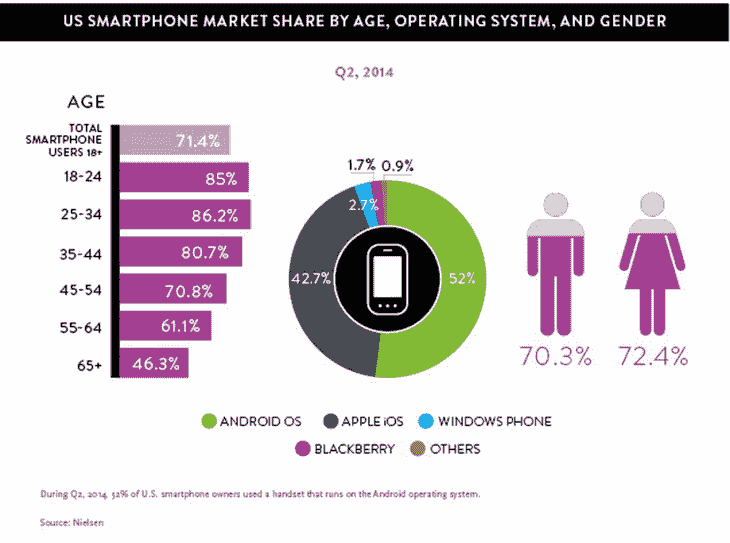
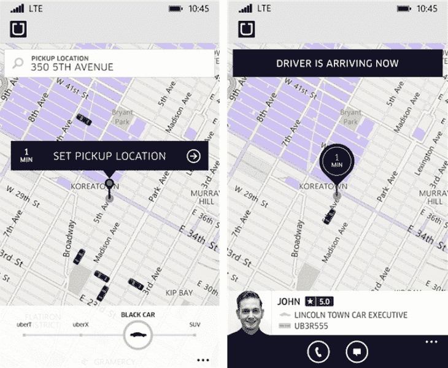
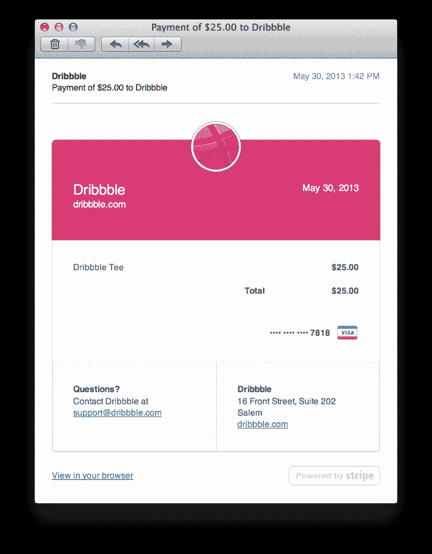
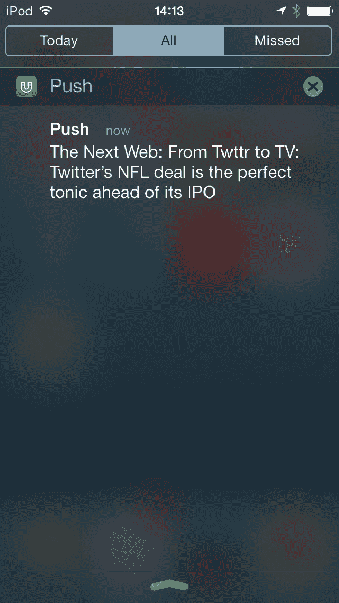
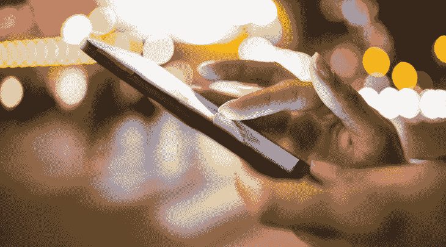

# 短信 vs .推送 vs .电子邮件:什么时候该用哪个？

> 原文：<http://thenextweb.com/future-of-communications/2015/02/09/sms-vs-push-vs-email/?utm_source=wanqu.co&utm_campaign=Wanqu+Daily&utm_medium=website>

许多公司主要关心的是评估增加客户参与的最佳沟通技术。你如何说服客户以最贴近背景的方式与你的产品互动？

电子邮件、推送通知和短信都是与客户沟通的流行方式，但要在正确的时间传递正确的信息，同时又不让人觉得垃圾邮件，要想辨别何时使用什么，可能很难。

由于过去五年的快速增长，移动通信已经成为最具影响力的通信平台，仅 Y 一代就达到了令人印象深刻的 85%的渗透率。只要客户的设备处于开机状态，通过他们的[智能手机](https://editorial.thenextweb.com/vocabulary/smartphone-2/ "smartphones")直接联系客户的能力有助于提高知名度。

[

<noscript></noscript>](https://thenextweb.com/wp-content/blogs.dir/1/files/2015/02/nielsen-mobile-users.png) 

为了让客户回到你的应用，你的沟通方式必须在任何时候提供最大的价值。那么每种媒介的好处是什么呢？

以下是关于何时使用短信、推送通知和电子邮件的一些建议。

## 短信通知

大约 90%的短信是在发送的前三分钟内阅读的。此消息传递渠道应该用于传递业务关键型信息，以便为您的客户提供卓越的用户体验。

当快递到达或你的物品准备好提货时，发送短信让顾客了解情况，让他们感觉更轻松。例如，当乘客的乘车请求被接受，司机到达时，优步会向乘客发送短信，让客户有时间准备和留意他们的乘车。该短信还提示客户浏览应用程序，以查看司机的当前位置、照片、汽车品牌和车牌。

[

<noscript></noscript>](https://thenextweb.com/wp-content/blogs.dir/1/files/2014/07/Uber1.jpg) 

除了重要的上下文信息之外，SMS APIS 还可以用于在舒适、轻松的环境中实现公司与其用户之间的双向通信。通过提供一个用户熟悉的沟通渠道，公司可以按照他们的条件与客户交流。

高参与度(开放阅读)和全球覆盖的结合，也使 SMS 成为用户身份验证的一个有吸引力的选择。诸如号码验证和双因素之类的场景是 SMS 的主要用途，因为它可以以一种熟悉的方式到达任何地方的任何人。

谷歌、脸书和苹果等公司在这方面做得很好，它们允许用户选择接收包含 PIN 验证码的自动短信。一旦客户收到代码，他们可以通过另一个渠道(如网络表单或应用程序)输入代码来确认他们的身份。

**什么时候不该用？**

SMS 不应该用于用户稍后需要参考的信息，例如收据或确认码。与电子邮件相比，短信更容易删除，也更难搜索。通过 SMS 发送的任何信息都应该可以在短时间内执行。

最后，SMS 最多只能包含 160 个字符，这限制了您向用户传达的信息量。SMS 应该主要用于需要用户采取行动的关键信息，例如通知、警报、双因素身份验证等。

有什么特殊考虑吗？

尽量避免在新兴国家的手机短信中嵌入链接，这些国家的用户可能没有数据套餐或 Wi-Fi 来访问链接，因为这可能会让您的客户感到沮丧。沮丧的顾客不是一件好事。

如果一个链接对信息至关重要，确保登陆页面是手机友好的。

最后，如果您的用户分散在全球各地，请确保您的活动提供商能够在全球范围内发送短信——没有延迟且处于正确的时区。同样，由于短信是最具时效性的渠道，所有与海外用户群的通信都应在用户醒着的时候发送。

## 电子邮件通知

[

<noscript></noscript>](https://thenextweb.com/wp-content/blogs.dir/1/files/2013/05/stripe-email-screenshot2.png) 

当交流对时间不敏感的基本信息时，应使用电子邮件。对于用户需要在某个时间点返回的东西，使用电子邮件。这包括成功的注册、确认、参考代码、订单和收据。

任何与账户相关的信息和服务变更也应通过电子邮件进行沟通。用户的成就或里程碑也可以通过电子邮件发送，因为他们可能希望将它们作为荣誉徽章。

当有疑问时，问自己这样一个问题，“用户将来会需要它作为参考吗？”如果答案是肯定的，那就发邮件吧。

**什么时候不该用？**

电子邮件不应用于紧急的可操作项目。 [Zipstripe](http://www.zipstripe.com/text-vs-email-sms-marketing/) 发现收件人查看一封邮件的平均时间长达 6.4 小时。

考虑到这一点，通过电子邮件通知人们他们的食品交付或运输方式已经到达是不合适的，因为他们可能无法及时看到通知。兑换时间很紧的促销活动，例如几个小时，也不应该通过电子邮件发送，因为用户可能无法及时看到消息。

有什么特殊考虑吗？

发送电子邮件时，确保你的应用/公司被正确标记为发件人，这样用户就不会认为这是垃圾邮件。如果你想让它来自一个特定的人，总是包括应用程序的名称，如来自 CoolApp 的 James，这样用户就可以识别发送者。

如果你的电子邮件中有链接，确保它可以在移动设备上查看，因为你的用户可以随时查看。

## 推送通知

推送通知通过向用户智能手机的通知中心或状态栏发送消息来工作，是智能手机上应用程序的默认通信方式。

与 SMS 相比，它被认为更少干扰，因为它可以在用户的屏幕上传送，而不会中断他们当前的活动，并且它永远不会给用户带来任何费用。这也让应用程序开发人员更容易下载应用程序，因为用户在下载应用程序时会自动选择推送通知。

<noscript></noscript>

然而，发送推送通知时仍应小心，因为用户可能会撤销应用程序权限推送通知。

当应用程序中发生需要用户执行操作的重大事件或活动时，或者是对用户有益的时间敏感信息时，应该使用推送通知。示例包括来自其他用户的消息、特定任务的提醒、新的应用内内容和特别优惠。

**何时不宜使用？**

像短信一样，推送通知不应该用于用户以后需要参考的信息。推送通知的短暂性意味着一旦用户向左滑动或清除通知，它们就会消失。这是三种媒介中最容易在阅读后删除的。

推送通知也不应该用于推广第三方产品，即使是那些与你的应用程序合作的产品，因为它会被视为过于侵入和不相关。

有什么特殊考虑吗？

保持推送通知简短。请记住，用户可能正在进行其他活动时，会在他们的手机顶部看到通知闪烁，所以保持简单会更好地引起用户的共鸣。

推送通知允许您与客户建立个人关系。您可以使用它们来添加强烈的行动号召，以提高用户参与度。例如，不要说“天气预报有雨”，你可以通过提示用户“带把伞来”来增加个性。今天会下雨。

最后，不要过头。推送不会打断用户活动的事实并不意味着可以过度使用。只需要几个恼人的、无关紧要的通知，就能促使他们完全禁用该功能。

## 不同之处在于时机

[

<noscript></noscript>](https://thenextweb.com/wp-content/blogs.dir/1/files/2014/11/smartphone.jpg) 

最终，时间在三个消息传递渠道中扮演着最重要的角色。如果你想给现有客户发送产品信息，推送通知和电子邮件是不错的选择。

但是对于更大的受众范围、及时性和重要信息的传递，SMS 提供了紧迫性和灵活性，以便在最精确的时间为客户提供有价值的内容。

**阅读下一篇:** [测试你设计的 20 种创意方法](https://thenextweb.com/news/20-creative-ways-test-design)