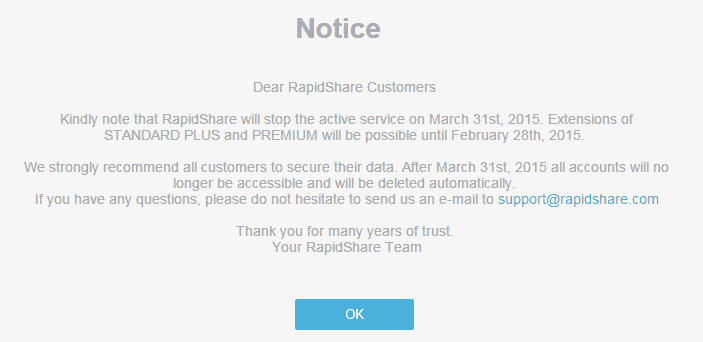

# 文件共享图标 RapidShare 关闭* TorrentFreak

> 原文：<https://torrentfreak.com/file-sharing-icon-rapidshare-shuts-150210/?utm_source=wanqu.co&utm_campaign=Wanqu+Daily&utm_medium=website>

[首页](https://torrentfreak.com "Go to TorrentFreak.")>[新闻 ](https://torrentfreak.com/category/news/ "Go to the News category archives.")   >

RapidShare，曾经是互联网上最受欢迎的文件托管服务，已经宣布将在下个月关闭。该公司没有给出令人惊讶的关闭原因，但在实施严厉的反盗版措施后，近年来失去了大部分用户可能与此有关。

[img/rapidsharelogo.jpg) 总部位于瑞士的 RapidShare 成立于 2002 年，是第一批和最受欢迎的互联网一键式文件托管服务公司之一。

像大多数这类网站一样， [RapidShare](http://rapidshare.com) 经常被人们用来分享侵犯版权的材料。正是这种关系让该公司多次陷入困境。

RapidShare 与娱乐公司打了许多法律战，试图让该公司为其用户的行为负责，并且该网站被美国政府称为“臭名昭著的市场”

为了澄清自己的形象，该公司付出了巨大的努力与版权所有者合作，限制侵犯版权。除此之外，该公司采用了[最严格的](https://torrentfreak.com/rapidshare-publishes-anti-piracy-manifesto-for-cyberlockers-120419/)共享政策之一，同时(重新)将自己标榜为个人云存储服务。

反盗版措施似乎奏效了，但结果是 RapidShare 的访客数量[骤降](https://torrentfreak.com/rapidshare-traffic-and-piracy-dipped-after-new-business-model-kicked-in-130109)。日益减少的收入最终让[rapid share 的大部分员工](https://torrentfreak.com/rapidshare-fires-75-of-its-staff-after-rogue-site-revamp-bites-130519/)丢掉了工作。

今天标志着 RapidShare 充满争议的历史的最后一章的开始。该公司刚刚宣布，它将在 3 月底关闭，并建议用户将他们的文件存储在其他地方。

“敬请注意，RapidShare 将于 2015 年 3 月 31 日停止现役服务。RapidShare 在其主页上写道:“STANDARD PLUS 和 PREMIUM 的延期将可能持续到 2015 年 2 月 28 日。

“我们强烈建议所有客户保护他们的数据。该公司补充道:“2015 年 3 月 31 日之后，所有账户都将无法访问，并将被自动删除。”。

TF 要求该公司提供有关计划停工的进一步细节，但我们尚未得到回复。最有可能的解释是，RapidShare 无法在用户数量减少的情况下维持其业务。

RapidShare 的消亡标志着一个时代的结束。五年前，RapidShare 被列为互联网上访问量最大的 50 个网站之一，每月有数亿的页面浏览量，但仅仅几周之后，它就将消失。

**3 月 31 日更新:** RapidShare 已经关闭。

