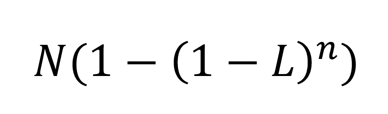
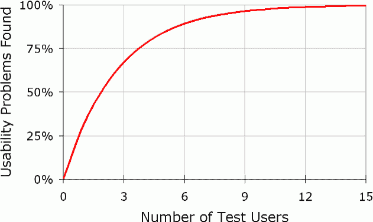

# 为什么您只需要测试 5 个用户

> 原文：<http://www.nngroup.com/articles/why-you-only-need-to-test-with-5-users/?utm_source=wanqu.co&utm_campaign=Wanqu+Daily&utm_medium=website>

有些人认为可用性是非常昂贵和复杂的，用户测试应该保留给有着巨大预算和充裕时间表的罕见的网页设计项目。不是真的。复杂的可用性测试是对资源的浪费。最好的结果来自于测试不超过 5 个用户，并运行尽可能多的小测试。

在早期的研究中，汤姆·兰道尔和我表明，在有 *n* 个用户的可用性测试中发现的可用性问题的数量是:

其中 *N* 是设计中可用性问题的总数， *L* 是测试单个用户时发现的可用性问题的比例。在我们研究的大量项目中， *L* 的典型值是 31%。绘制 *L* =31%的曲线得出以下结果:

曲线最显著的事实是**零用户给出零洞察**。

一旦你从**单个测试用户**那里收集到数据，你的洞察力就会迅速增长，你已经了解了关于设计可用性的三分之一。零数据和哪怕一点点数据之间的差异都令人咋舌。

当你测试**第二个用户**的时候，你会发现这个人做的一些事情和第一个用户是一样的，所以你学到的东西有一些重叠。人肯定是不一样的，所以也会有第二个用户做的一些你和第一个用户没有观察到的新东西。所以第二个用户增加了一些新的洞察力，但是没有第一个用户多。

第三个用户会做很多你已经在第一个用户或者第二个用户身上观察到的事情，甚至一些你已经看过两遍的事情。当然，第三个用户会产生少量的新数据，即使没有第一个和第二个用户那么多。

随着你添加越来越多的用户，你学到的越来越少，因为你会一次又一次地看到同样的东西。没有必要多次观察同一个东西，你会非常积极地回到绘图板，重新设计网站，以消除可用性问题。

在第五个用户之后，你重复观察同样的发现，却没有学到多少新东西，这是在浪费你的时间。

## 迭代设计

该曲线清楚地表明，你需要对至少 15 个用户进行**测试，以发现设计中的所有可用性问题**。那么，为什么我建议用少得多的用户进行测试呢？

主要原因是，最好将你的预算分配给许多小测试的[用户测试，而不是将一切都花在一个单独的、精心设计的研究上。假设你有资金招募 15 个有代表性的客户，让他们测试你的设计。太好了。**将这笔预算用于 3 项研究，每项研究有 5 名用户！**](/articles/parallel-and-iterative-design/ "Alertbox: Parallel & Iterative Design + Competitive Testing = High Usability")

你想要运行多个测试，因为可用性工程的真正目标是改进设计，而不仅仅是记录它的弱点。在有五个参与者的第一次研究中发现了 85%的可用性问题后，你会想在重新设计中修复这些问题。

创建新设计后，您需要再次**测试**。即使我说重新设计应该“修复”在第一次研究中发现的问题，事实是你*认为*新设计克服了问题。但是因为没有人能设计出完美的用户界面，所以不能保证新的设计确实解决了问题。第二次测试将发现修复是否有效。此外，在引入一个新的设计时，总是有引入一个新的可用性问题的风险，即使旧的问题得到了解决。

此外，有 5 个用户的第二项研究将发现第一轮测试中没有发现的剩余 15%的原始可用性问题。(仍然会有 2%的原始问题存在——它们必须等到第三次研究时才能被识别。)

最后，第二项研究将能够**更深入地探究网站基础结构**的可用性，评估诸如信息架构、任务流以及与用户需求的匹配等问题。在最初的研究中，这些重要的问题经常被掩盖，用户被愚蠢的表面可用性问题难住了，这些问题阻碍了他们真正深入了解网站。

因此，第二项研究既可以作为第一项研究结果的质量保证，也有助于提供更深入的见解。第二次研究总是会产生一个新的(但更小的)可用性问题列表，以便在重新设计中修复。同样的观点也适用于这次重新设计:不是所有的修正都能奏效；在清理界面之后，一些更深层次的问题将被发现。因此，还需要第三次研究。

3 项各有 5 名用户的研究比一项有 15 名用户的大型研究对最终用户体验的改善更大。

## 为什么不用单个用户测试呢？

您可能会认为只有一个用户的 15 项研究甚至会比有 5 个用户的 3 项研究更好。曲线确实表明，我们从第一个用户身上学到的比从任何后续用户身上学到的都多，那么为什么还要继续下去呢？两个原因:

*   总是存在被一个人的虚假行为误导的风险，这个人可能偶然或以不具有代表性的方式执行某些操作。即使只有 3 个用户，也足以了解用户行为的多样性，洞察哪些是独特的，哪些是可以归纳的。
*   用户测试的[成本效益分析](/articles/guerrilla-hci/ "Jakob Nielsen paper: 'Guerrilla HCI: Using Discount Usability Engineering to Penetrate the Intimidation Barrier'")根据测试方式，提供了 3 到 5 个用户左右的最佳比例。与规划和运行研究相关的初始成本总是固定的:最好在多个用户的调查结果中对这一启动成本进行折旧。

## 何时测试更多用户

当一个网站有**几个高度不同的用户组**时，你需要测试额外的用户。该公式只适用于以相似方式使用网站的可比用户。

例如，如果你有一个孩子和父母都使用的网站，那么两组用户的行为将会有很大的不同，因此有必要对两组用户进行测试。对于旨在连接采购代理和销售人员的系统来说，也是如此。

即使用户群差异很大，两个用户群的观察结果仍然有很大的相似性。毕竟，所有的用户都是人。此外，许多可用性问题与人们与网络互动的基本方式以及其他网站对用户行为的影响有关。

在测试多组不同的用户时，您不需要像在单个用户组的单个测试中那样包括每个组的许多成员。观察之间的重叠将确保从每组中测试较少数量的人得到更好的结果。我建议:

*   如果测试两组用户，每个类别 3-4 个用户
*   如果测试三个或更多的用户组，每个类别 3 个用户(您总是希望至少有 3 个用户，以确保您已经涵盖了组内行为的多样性)

### 参考

[Nielsen，Jakob，and Landauer，Thomas K .:“可用性问题发现的数学模型”，](https://dl.acm.org/citation.cfm?id=169166)<cite>ACM INTERCHI’93 会议记录</cite>(荷兰阿姆斯特丹，1993 年 4 月 24-29 日)，第 206-213 页。

## 后续文章

