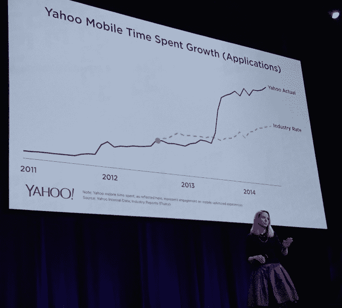
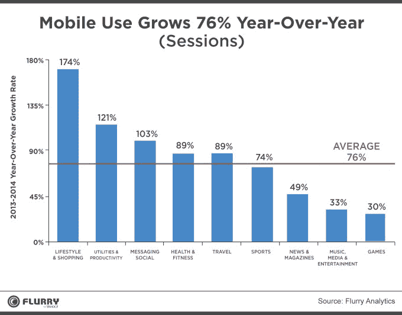
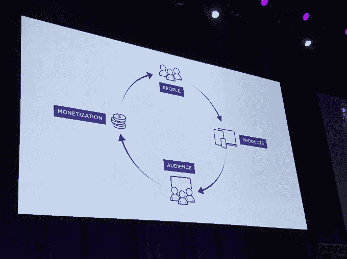

# 新的雅虎移动开发套件用分析、搜索、广告吸引应用程序制造商 TechCrunch

> 原文：<http://techcrunch.com/2015/02/19/mobile-is-not-yahoos-hobby-anymore/?utm_source=wanqu.co&utm_campaign=Wanqu+Daily&utm_medium=website>

今天，在雅虎第一届[移动开发者大会](http://yahoomobiledevcon.tumblr.com/)上，科技巨头[发布了](http://yahoo.tumblr.com/post/111490551169/yahoo-introduces-new-mobile-developer-suite-at)其新的[雅虎移动开发套件](https://developer.yahoo.com/)，该套件将雅虎应用发布货币化、应用搜索和应用营销与其去年收购的[Flurry Analytics](https://beta.techcrunch.com/2014/07/21/yahoo-is-buying-mobile-analytics-firm-flurry-for-north-of-200m/)相结合。这是雅虎的“开发人员服装中的广告”策略，以说服应用程序制造商购买和托管其广告。

Flurry 的平台上现在有 20 万名应用程序开发人员，他们开发了 63 万个应用程序，覆盖 16 亿台设备。与此同时，雅虎现在每月有 5.75 亿移动访客访问其网站，正如其预测的那样，2014 年移动收入达到 12 亿美元。

“今天的主题是构建创新的、改变游戏规则的应用程序，”首席执行官玛丽莎·梅耶尔(Marissa Mayer)上台时说道。现在，雅虎不仅仅是自己开发应用程序，而是为开发者提供工具来构建、发展和赚钱。

## 移动趋势

继梅耶尔之后，Flurry 首席执行官西蒙·卡拉夫(Simon Khalaf)上台介绍了移动业务的最新情况。他表示，目前移动领域有三大趋势:

1.  移动购物的大幅增长
2.  消息应用成为完整的平台，如微信的打车集成、Line 的游戏和 Snapchat 新的 Snapcash 支付功能，证明人们希望从他们喜欢的应用中获得更多服务
3.  平板手机推动媒体消费大幅增长

# 移动开发人员套件

雅虎移动开发套件的每一部分都有自己的更新，并且被捆绑在一起。

## 疾风浏览器和脉冲

Flurry 宣布了新的 [Flurry Explorer 分析工具](https://developer.yahoo.com/analytics/)，一位高管表示，这是一个“特别的查询分析工具”，可以让你“对你的数据提出复杂的问题，并在几秒钟内获得答案。”该产品在任何规模下都是免费的，这使得它的价格低于 Mixpanel，而 Mixpanel 是业内最受欢迎的分析工具，不幸的是，根据应用程序内事件的数量，它可能非常昂贵。

Flurry 还推出了 [Flurry Pulse](https://developer.yahoo.com/flurry-pulse/) ，开发者可以轻松安全地与合作伙伴分享他们的任何数据。不需要编写额外的代码。例如，提供广告的移动应用程序出版商可以将他们的移动受众数据直接发送给 comScore(Flurry Pulse 的发布合作伙伴)。

以前，开发人员必须将另一个 comScore SDK 集成到他们的应用程序中。这缩小了应用程序的大小，由于最大限度地减少了代码，增加了应用程序的稳定性，并消除了额外更新的需要。雅虎计划很快向 Flurry Pulse 添加更多合作伙伴，目前正在进行开发者预览，并将在未来几周和几个月内推出。

## 通过广告赚钱

为了给移动开发者一个更好的赚钱方式，雅虎今天推出了[雅虎应用发布](https://developer.yahoo.com/monetize/)。

现在，通过 Flurry SDK，开发人员可以集成适合不同应用馈送的雅虎双子原生广告，无论它们是垂直流还是水平卡。无论一个应用程序看起来像什么，雅虎的 Gemini 系统都可以改变标准广告以匹配应用程序的设计。

去年，雅虎收购了视频广告技术初创公司 BrightRoll。现在，开发者可以通过 Flurry SDK 将 BrightRoll 广告引入他们的应用程序。因此，如果一个应用程序以视频内容为特色，他们可以通过 BrightRoll 轻松地将其货币化，而无需自己的销售团队。“这不是很棒吗？雅虎产品管理高级总监詹姆斯·凯尔姆说:“你的应用程序中有暴躁的猫和巨无霸，你可以从中赚钱。”

## 雅虎应用搜索

开发者不希望用户在需要运行网络搜索时从他们的应用中跳出来。因此，今天雅虎推出了应用程序中的雅虎搜索，一个移动应用程序的集成搜索工具。这个想法是，如果用户可以从开发者的应用中搜索，他们不仅会留在那里，而且如果用户点击搜索广告，开发者也可以分享广告收入。

应用程序中的雅虎搜索现在集成在雅虎的主要应用程序、雅虎新闻摘要、雅虎邮件和安卓启动器 Yahoo Aviate 中。在外部，Dodol launcher 和 Solo launcher 应用程序现在在应用程序中集成了雅虎搜索。雅虎的 Jon Paris 举了一个例子，有人使用新闻应用程序，想了解更多关于文章主题的信息。雅虎允许他们在不退出应用程序的情况下进行搜索。

## 雅虎移动营销

雅虎正在为开发者整合[三个移动广告选项:雅虎网站上的 Gemini 原生广告、第三方网站上的视频广告以及 Tumblr 上的赞助帖子社交广告。现在，开发者可以利用雅虎的身份数据和自助工具，在这些渠道中的任何一个投放广告。这包括人们在雅虎和 Tumblr 上浏览的内容，以及由于 Flurry 的巨大足迹，他们在网络上做的事情。](https://developer.yahoo.com/advertise/)

## 良性循环

总的来说，雅虎的平台是一个明智之举，因为它提供免费的分析和货币化工具来吸引开发者使用其广告产品。由于这些产品的推出，截至美国东部时间下午 3 点 15 分，投资者给雅虎带来了 1.42%的小幅上涨。这个[“平台战略”](https://beta.techcrunch.com/2014/11/30/like-advertising-a-needle-in-a-haystack/)是我写的脸书和 Twitter 去年积极开发的。

因此，雅虎的新平台将使其与脸书和 Twitter 展开更直接的竞争，后者也提供分析、广告和盈利工具。开发者将寻找哪个平台的广告能够带来最有价值的用户，为他们托管广告支付最高的费用，并通过分析让他们最好地了解他们的应用程序中正在发生的事情。期待脸书在下个月的 f8 开发者大会上改进它的产品。

在主题演讲后的新闻发布会上，梅耶尔称该套件创造了一个“良性循环”，在应用生命周期的各个阶段帮助开发者。“你从创造伟大产品的人开始，产品带来流量，流量带来收入，你可以再投资。”这与脸书谈论其平台的[建设-增长-盈利循环](https://beta.techcrunch.com/2013/09/11/facebooks-platform-mission-help-you-build-grow-and-monetize/)非常相似。

当我问雅虎将如何推动开发人员沿着这个周期前进时，梅耶尔说这很自然，因为一旦有人开发出一个产品，他们就会想把它做得更好，让它成长，并从中赚钱。这是雅虎赚钱的最后两个阶段，因此让开发者参与其中至关重要。

Khalaf 指出，“我们最大的竞争对手是 Sand Hill Road。他们是在给开发商钱，而不是让他们赚钱。”风险投资家只想要现在的增长和以后的收入，但 Khalaf 说，在移动游戏和像脸书这样的大平台在小屏幕上赚大钱的引领下，这种情况现在已经改变了。货币化正在融入应用程序体验，因此开发者更早地考虑到了这一点。

雅虎移动业务的 SVP 亚当·卡汉告诉我，由于从一开始就关注这一点，开发人员意识到“销售机构是一头昂贵的野兽”他们宁愿把它外包给雅虎这样的平台。此外，Cahan 表示，由于新的原生格式和定位，广告“不那么糟糕”，因此开发人员不太愿意内置它们。和 Flurry 首席产品官 Prashant Fuloria 认为，这个循环的各个部分具有协同效应。Flurry analytics 可以告诉开发者谁是他们的用户，这样他们就可以向雅虎的广告商出售人口统计数据，并通过雅虎应用营销获得更多像他们一样的用户。

梅耶尔还回答了我关于雅虎移动开发套件未来机会在哪里的问题，他说“我们看到最大的需求是围绕跨平台识别用户。我们正在与 comScore 合作的一些 cookie 匹配。”她指的是能够根据用户在智能手机、平板电脑或网络上的行为，在这些设备上投放广告。

谷歌和脸书在广告定位方面备受瞩目，但梅耶尔似乎打算尽雅虎所能缩小差距。它可能没有顶级的搜索引擎或人们自愿提供个人数据的社交网络，但雅虎确实通过三角测量人们使用的产品来了解他们的兴趣。

几年前，很难想象雅虎会为自己做好移动业务，更不用说帮助其他人了。但该公司看到了行业的发展方向，并调整了方向。梅耶尔在会议结束时说:“雅虎手机从只有 50 人的爱好发展到去年占我们业务的四分之一。”