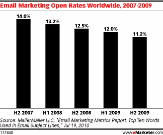

# 安德鲁森的劣质点击率定律

> 原文：<http://andrewchen.co/the-law-of-shitty-clickthroughs/?utm_source=wanqu.co&utm_campaign=Wanqu+Daily&utm_medium=website>

 
*有史以来第一个横幅广告，1994 年在 HotWired 上首次亮相，点击率高达 78%(感谢@ottotimmons)*

先是成功，然后失败
经过几个月不同营销策略的反复尝试，你终于找到了成功的方法。然而，当你开始扩大规模的时候，你的营销效果就会停滞不前。听起来熟悉吗？

欢迎来到**劣质点击率定律:**

久而久之，所有的营销策略都会导致糟糕的点击率。

这里有一个真实的例子——让我们比较一下 1994 年和 2011 年脸书热线首次推出的横幅广告的平均点击率:

这是 1500 倍的差距。虽然有许多因素影响这种差异，但基本前提是合理的——横幅广告、电子邮件邀请和许多其他网络营销渠道的点击率自发明以来每年都在下降。

这是另一个渠道，根据 eMarketer 的数据，这是一段时间内的电子邮件打开率:

[T2】](http://andrewchen.co/wp-content/uploads/2012/04/open-rate.gif)

虽然这个图表显示下降，但另一个图表(我手边没有)显示每天发出的电子邮件数量增加了 300 多亿封。

随着时间的推移，所有这些渠道都在衰退，拯救我们的是新的营销渠道也在不断涌现。由于缺乏竞争，这些新渠道提供了高性能，为新颖的营销技术提供了巨大的机会，而且这些天来，最先进的是优化您的移动通知，而不是您的横幅广告位置。

劣质点击率的规律有几个驱动因素，这里总结了几个最重要的因素:

*   顾客对新鲜感有反应，但新鲜感不可避免地会消退
*   第一个上市的永远不会长久
*   更大的规模意味着更少的合格客户

让我们更详细地检查每一个，然后讨论在营销中对抗这种引力的选择。

毫无疑问，参与营销的关键驱动力之一是顾客对新奇事物的反应。当 HotWired 有史以来第一次展示横幅广告时，人们点击只是为了体验一下。第一个通过电子邮件向网站发送邀请的网络产品也是如此——它会工作一段时间，直到你的客户习惯了这种效果，并开始忽略它。

你拥有的最重要的工具之一是你在营销中使用的创意和行动号召——这可能是“X 邀请你去 Y ”,也可能是你在横幅广告中使用的标题。最近，Retargeter 发布了一份关于轮换创意的[重要性的有趣分析，显示了保持相同的广告创意如何随着时间的推移导致点击率下降:](http://www.retargeter.com/retargeting/the-importance-of-rotating-creatives)

[T2】](http://andrewchenblog.com/wp-content/uploads/2012/04/Creative_CTR_Decline_Graph_2012.jpeg)

出版商经常有一个类似的问题，消费者忽略了他们网站上的广告，这降低了他们双方的点击率(对 CPM 不利)。这个问题通常被描述为横幅失明，你可以在雅各布·尼尔森的眼球追踪研究中清楚地看到这一点:

[T2】](http://andrewchenblog.com/wp-content/uploads/2012/04/banner-blindness-examples.jpeg)

你可以在这里看到用户是如何滑稽地避免看任何横幅的。

关键是，人类追求新奇，但却是模式识别机器。当你的用户第一次尝试时，你最初的营销策略会非常有效，但之后，他们会学会过滤掉你的营销努力，除非它们真的有用(后面会详细介绍)。

**抢先上市的日子不会长久**
你自己的营销努力压低了渠道业绩，这已经够糟糕了，但通常一旦你的营销努力奏效，你的竞争对手就会迅速跟进。有一整个家庭手工业的公司，在他们的竞争者如何做广告的领域提供竞争研究，并且给你需要的信息快速跟随他们的营销努力。

例如，通过快速查询，我可以知道 Airbnb 在搜索营销上花了多少钱(结果是每年几百万)，他们在哪些关键词上购买广告，以及他们的竞争对手是谁。而且这还只是免费服务！每个成熟的营销渠道都有更复杂的产品:

**Airbnb 搜索引擎营销**

*   每日广告预算:10，638 美元
*   关键词:62，729
*   广告示例:寻找 20 美元/天起的经济型客房。立即在线浏览和预订！
*   主要竞争对手:Expedia.com、booking.com、hotels.com、Marriott.com

他们业务的任何克隆都可以快速跟进他们的营销努力，在相同的营销渠道中使用相同的广告。随着新鲜感逐渐消失，点击率直线下降，这很快降低了营销渠道的表现。

任何首先进入市场的产品都有一个有限的窗口，在这个窗口中，他们将享受不自然的高营销业绩，直到竞争进入，在这种情况下，每个人的营销努力都将下降。

**更大的规模意味着更少的合格客户**
另一个考虑产品可用市场的重要方式是根据流行的[技术采用生命周期](http://en.wikipedia.org/wiki/Technology_adoption_lifecycle)，早期采用者积极寻找你的产品，而主流市场的其余部分需要大量的说服工作。从定量营销的角度来看，早期采用者对任何给定指标(注册率、点击率、注册会计师)的营销工作的反应都比后期客户群更好。在 TAL 框架中，早期市场寻求新奇，而主流市场只关心你是否为他们解决了问题。

因此，专注于早期用户的营销策略一定会比你后来得到的更好看。你可以从公共关系中获得一些有限的流量，并从利基社区和媒体资产中获得有针对性的广告。然而，一旦你过了这个组，点击率就会大幅下降。

如果你是一家 SaaS 或电子商务公司，通过获得有限的几批客户来测试你的营销策略，问题是，无论你基于这个基础做出什么假设和预测，最终都是完全错误的。如果你的模型表明你可以以 10 美元的价格获得客户，并在 6 个月内达到收支平衡，那么 CAC 增加 30%, LTV 减少 30 %,实现盈利的时间就会翻倍。对于一家公司来说，这可能是生死之交。

给投资者的教训是:当心在小范围内完成的营销指标，当心在没有更大愿景的情况下促进瞬间营销机会的营销科技公司。这些套利机会会随着时间的推移而消失。

**如何对抗劣质点击率**
我称之为定律，当然，因为我真的相信它对所有网络营销都有强大的引力。你无法避免，而且从很多方面来说，尝试是适得其反的。

通过采取游牧策略，你总是可以从你的营销中获得越来越好的表现——总是不断开发新的创意，测试新的出版商，等等。这很容易，但主要是保持一些基本的性能水平。这可以推动劣质点击率的规律在几年内发挥作用，而不是在几个月内降低你的营销努力。

同样，这条定律也为广告和信息之间的区别提供了一个试金石。当你用有用的信息进行营销时，点击率就会很高。包装在新的营销渠道中的新奇和噪音广告的保质期是有限的。

**真正的解决方案:发现下一个未开发的营销渠道**
解决劣质点击率定律的 10 倍解决方案，即使是暂时的，就是发现下一个未开发的营销渠道。除了加倍利用横幅、搜索和电子邮件等传统形式的在线广告之外，在没有竞争的情况下努力进入下一个营销渠道也很重要。

有时我会被问到“你见过有人做 XYZ 来获得客户吗？”结果，我能给出的最高信任票是，“不，我没有，这很好——这意味着它工作的可能性更大。你应该试试。”

如今，这些(相对)无争议的营销渠道是 Open Graph、移动通知等。如果你能让这些渠道在强大的产品支持下运作，那就太好了。很有可能，在他们也慢慢屈服之前，你会享受几个月甚至几年的强劲市场表现。

**PS. Get new updates/analysis on tech and startups**

我写一份高质量的每周时事通讯，报道硅谷发生的事情，关注创业、营销和移动领域。

在本网站链接的“内容”(包括帖子、播客、视频)中或在社交媒体和其他平台(统称为“内容分发渠道”)中发表的观点是我自己的，并不是 AH Capital Management、l . l . c .(“a16z”)或其各自附属公司的观点。AH 资本管理公司是一家在证券交易委员会注册的投资顾问公司。注册为投资顾问并不意味着任何特殊技能或培训。这些帖子不针对任何投资者或潜在投资者，也不构成出售或购买任何证券的要约，不得用于或依赖于评估任何投资的价值。

内容不应被解释为或以任何方式依赖于投资、法律、税务或其他建议。您应该向您自己的顾问咨询有关任何投资的法律、商业、税务和其他相关事宜。这些材料中表达的任何预测、估计、预测、目标、前景和/或观点可能会在不通知的情况下发生变化，并且可能与他人表达的观点不同或相反。此处提供的任何图表仅供参考，在做出任何投资决策时不应依赖。此处包含的某些信息来自第三方来源。虽然这些信息来自据信可靠的来源，但我并未独立核实这些信息，也未对这些信息的持久准确性或其在特定情况下的适当性做出任何陈述。该内容仅在所示日期有效。

在任何情况下，本网站或相关内容分销渠道上提供的任何帖子或其他信息都不应被解释为 a16z 人员发起、讨论或提及的任何集合投资工具中的任何证券或权益的购买或销售要约。也不应被理解为提供投资咨询服务的要约；投资 a16z 管理的集合投资工具的要约将单独提出，并且仅通过特定集合投资工具的保密要约文件提出，这些文件应完整阅读，并且仅提供给符合联邦证券法规定的特定资格的人。这些投资者被定义为合格投资者和合格购买者，通常被认为有能力评估潜在投资和财务事项的优点和风险。不能保证 a16z 的投资目标会实现或投资策略会成功。对 a16z 管理的投资工具的任何投资都包含很高的风险，包括损失全部投资金额的风险。提及、提及或描述的任何投资或投资组合公司并不代表 a16z 管理的所有投资工具，也不能保证这些投资将会盈利，也不能保证将来进行的其他投资会有类似的特征或结果。a16z 管理的基金所做的投资清单可在 https://a16z.com/investments/.获得。该清单不包括发行人未允许 a16z 公开披露的投资，以及对公开交易的数字资产的未宣布投资。Andreessen Horowitz 投资、集合投资工具或投资策略的过去结果不一定代表未来结果。请参见[https://a16z.com/disclosures](https://a16z.com/disclosures)了解更多重要信息。