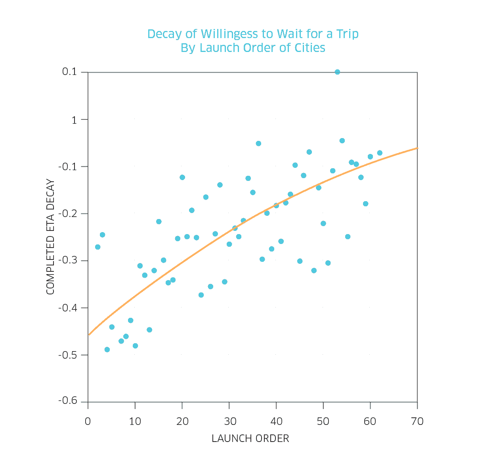
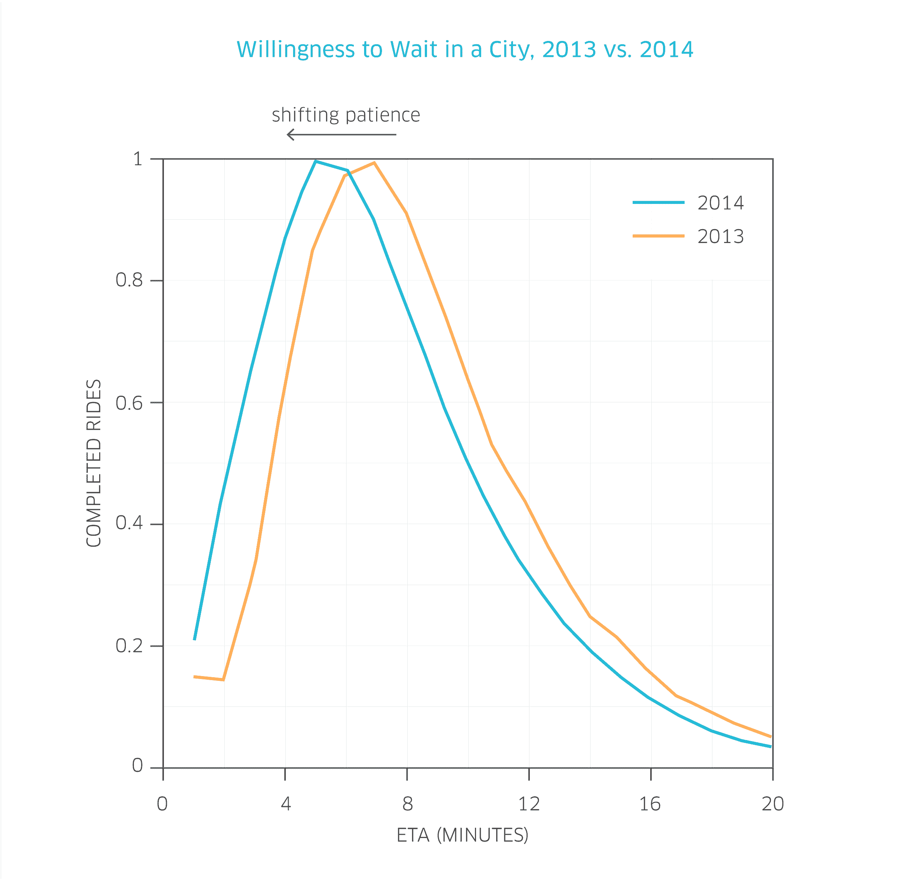
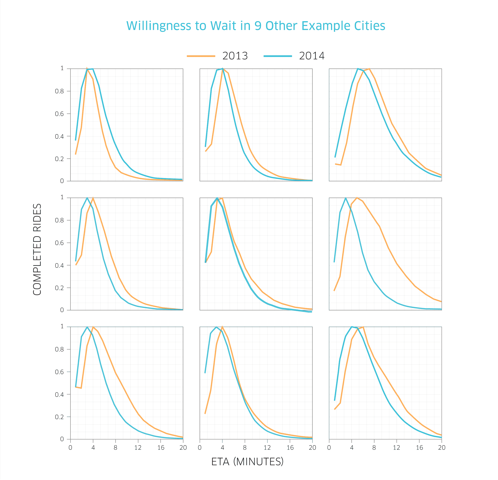

# 优步对我们成长的期望|优步新闻编辑室

> 原文：<https://newsroom.uber.com/eta-expectations?utm_source=wanqu.co&utm_campaign=Wanqu+Daily&utm_medium=website>

几年前的 2011 年 3 月，当我们只在三藩市运营时，我们自豪地宣称，如果你和优步一起乘车，你有 80%的机会在 10 分钟内被接走。94%的乘客在 15 分钟内出现。

自 2011 年以来，很多事情都变了。我们现在在 5 大洲 53 个国家的 277 个城市，除了 UberBLACK 还有多种选择，比如 uberX 和 uberTAXI。让你了解一下变化有多大，即使仅仅是旧金山的**，2014 年超过 97%的行程在 10 分钟内到达**，超过 99.5%的行程在 15 分钟内到达。

这让 [#UberData 团队](https://twitter.com/uberdata)感到好奇:这种效率的提高是否会导致我们平台上的乘客的期望增加？

在本帖中，我们来看看人们愿意等待优步奖多长时间，这种耐心如何因城市而异，以及它如何随着时间的推移而变化。

让我们开始吧。下图显示了 2014 年上半年旧金山已完成行程(蓝色)与已取消行程(灰色虚线)的相对比例，它是最近的汽车到达客户处所需时间(预计到达时间，简称 ETA)的函数:

[T2】](https://ubernewsroomapi.10upcdn.com/wp-content/uploads/2014/11/Voytek-01.png)

你会发现，一旦最近汽车的预计到达时间达到 15 分钟，人们就会放弃搭车。请注意，至少对于旧金山来说，ETA > = 15 分钟是极其罕见的(不到 1%)。但即使排除这种罕见情况，当 eta 如此之长时，人们仍然不太可能完成一次旅行，更有可能取消尝试。

我们可以扩展这一分析，逐个城市地研究这一现象。

在一些城市，如果用户看到最近的优步在 2-3 分钟之外，他们就不太可能要求用车，而在其他城市，长达 10 分钟的等待时间是完全可以接受的。在一些城市，如果预计到达时间*太短* (1-2 分钟)，人们就不太可能*完成他们的旅行*！

看看上面那张图中已完成的旅行的形状。你会看到完成一次旅行的概率(蓝线)在 2 分钟时达到峰值，然后很快下降。我们可以通过拟合指数衰减函数(y= *ae bx* )来量化下降的速率，其中 *b* 是衰减的锐度。b*b*越负，衰减越快(你越不愿意等车)。

让我们对每个城市都这样做。如果我们把这种衰退的锐度*看作是优步在城市*启动的函数，我们会得到这样的结果:

[T2】](https://ubernewsroomapi.10upcdn.com/wp-content/uploads/2014/11/Voytek-02.png)

结论:我们最古老的优步城市显示出等待汽车意愿的最大衰退。

优步只是碰巧首先在最没有耐心的城市推出，还是人们适应了优步的便利，从而缩短了他们愿意等待的时间？

为了更好地了解这一点，我们决定看看这是如何随着时间的推移在一个城市内发生变化的。这里有一个来自一个城市的例子。这显示了 2013 年上半年(橙色)与 2014 年上半年(蓝色)完成旅行的概率:

[T2】](https://ubernewsroomapi.10upcdn.com/wp-content/uploads/2015/01/CityETA_2013vs2014.png)

看看从 2013 年到 2014 年，整个分布如何向后移动(移至图表的左侧)？这表明，每个人都越来越不愿意等车。

但那只是一个城市。我们的其他一些主要市场是什么样子的？

[T2】](https://ubernewsroomapi.10upcdn.com/wp-content/uploads/2015/01/CityETAs_2013vs2014.png)

你可以从世界各地的城市子样本中看到，除了一两个城市外，所有城市都显示了这种随时间的向后转移(以 eta 表示，这导致了完整的行程)。

本质上:

优步在一个城市呆的时间越长，每个人就越不愿意等车。

在我们所有的城市中，我们进入后看到的总体模式是 eta 下降，原因是我们的供应有所改善(感谢我们的合作伙伴！)以及我们优化调度算法的方式(工程效率)。然而，随着这些改进而来的是对更短等待时间的更高期望。

底线是，我们意识到我们必须不断提高标准，让你从酒吧回家。从技术和人的角度来看，我们都意识到了这一挑战，并正在尽我们所能完成我们的使命，为所有需要的人带来可靠的乘坐体验。感谢您参与这一运动，我们对我们平台的下一步发展感到兴奋。