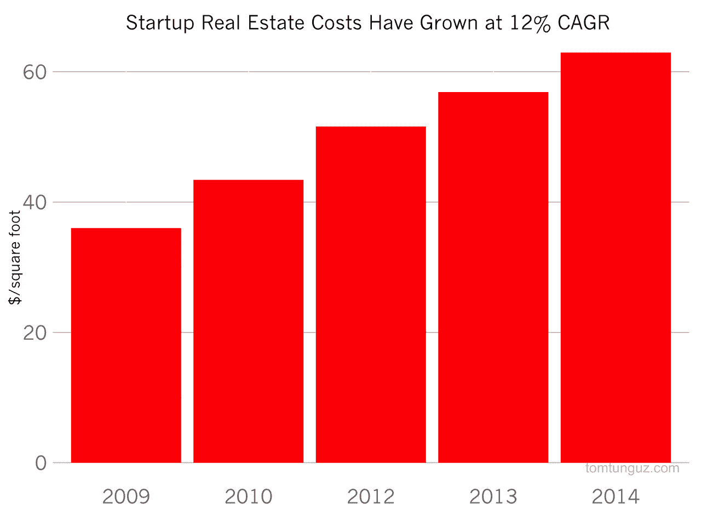
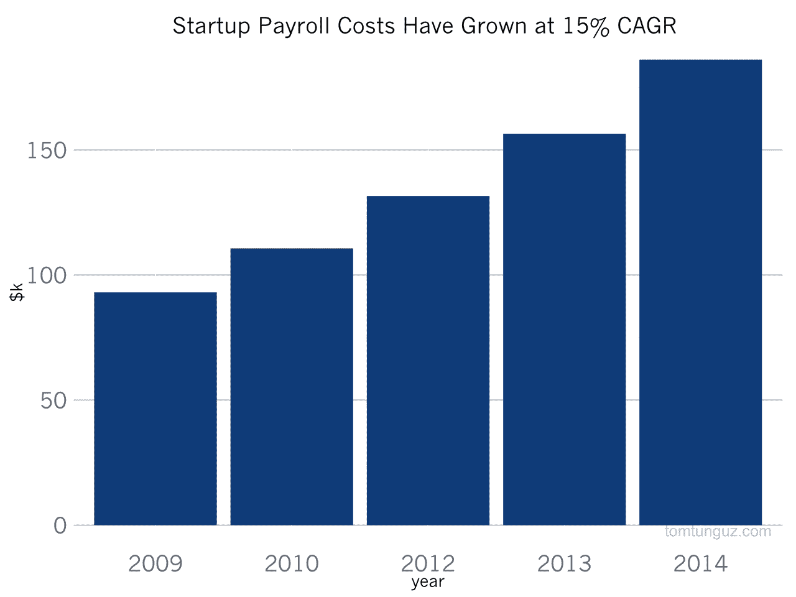
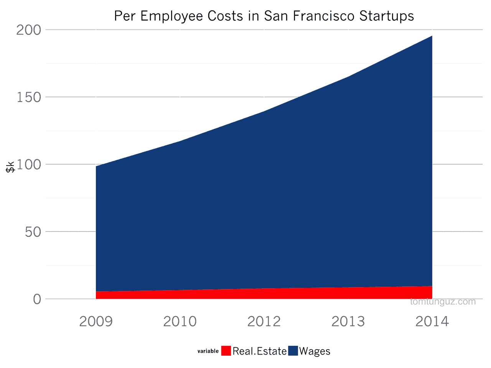
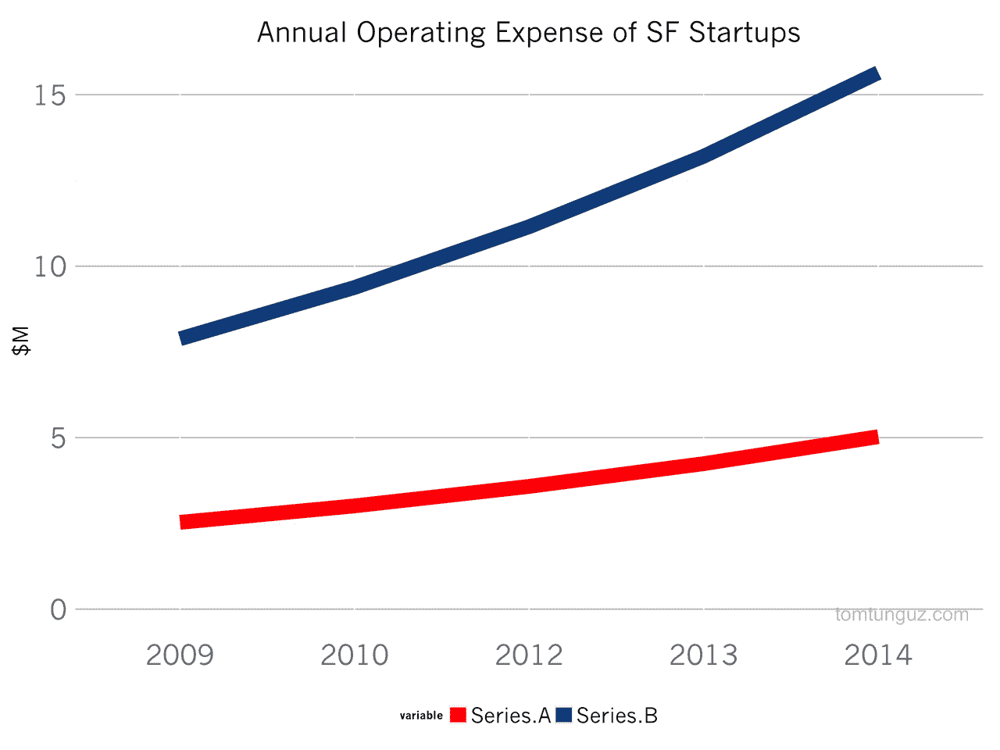

# 扩大创业规模的成本上升

> 原文：<http://tomtunguz.com/rising-costs-of-startups/?utm_source=wanqu.co&utm_campaign=Wanqu+Daily&utm_medium=website>

[T2】](https://res.cloudinary.com/dzawgnnlr/image/upload/q_auto/f_auto/w_auto/startup_real_estate_costs.png)

在旧金山扩大创业规模变得越来越昂贵。事实上，2014 年运营一家初创公司的成本是 2009 年的两倍。

根据仲量联行的数据，旧金山的写字楼价格在五年内几乎翻了一番，从每年每平方英尺 36 美元上涨到 63 美元。通常情况下，企业会给每个员工分配大约 150 平方英尺的办公空间。鉴于办公空间和年薪的市场价格，假设 20 人的 A 轮创业公司在 2015 年将在每个员工身上每年花费 20 万美元。

[T2】](https://res.cloudinary.com/dzawgnnlr/image/upload/q_auto/f_auto/w_auto/startup_wage_costs.png)

与此同时，在竞争日益激烈的就业市场上，初创公司和现任公司争夺人才，导致旧金山技术工人的工资中位数每年上涨 15%，从约 9 万美元升至 2014 年的 18 万美元以上。工资包括薪水、福利、股票期权和津贴。

[T2】](https://res.cloudinary.com/dzawgnnlr/image/upload/q_auto/f_auto/w_auto/per_employee_costs_startup.png)

工资构成了启动费用增长的主要部分。房地产成本仅占员工人均成本的 5%。

[T2】](https://res.cloudinary.com/dzawgnnlr/image/upload/q_auto/f_auto/w_auto/startup_opex.png)

房地产和工资成本的综合通胀对创业公司的运营支出产生了巨大的影响。上图比较了一家假设的 20 人 A 轮创业公司和一家假设的 80 人 B 轮创业公司过去五年的运营支出(不包括营销支出)。在这两个案例中，op-ex 数字分别从 250 万美元增加到 500 万美元，从 790 万美元增加到 1560 万美元。

初创公司从云计算基础设施或其他技术成本降低中实现的成本节约与劳动力成本的稳步上升相比相形见绌。做生意成本的增加或许可以解释创业融资规模增加的部分原因。

当然， [2014 年是十多年来风险融资最好的一年](http://www.wsj.com/articles/venture-capital-fundraising-jumped-62-in-2014-1421039104)，更多的风险资金在湾区寻求更多的创业机会，这意味着对顶尖人才的需求更大。很有可能风险资金大量注入生态系统正在创造增加启动成本的市场动态。因此，预计工资上涨和随之而来的更高的启动运营成本将持续下去并不是不合理的。