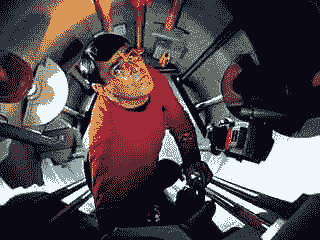

# 测试之美|通过运输学习

> 原文：<http://blog.learningbyshipping.com/2014/09/25/beauty-of-testing/?utm_source=wanqu.co&utm_campaign=Wanqu+Daily&utm_medium=website>

 在上周的一篇帖子中，@ [davewiner](http://twitter.com/davewiner) 描述了 *[软件测试失传的艺术](http://scripting.com/2014/09/21/theLostArtOfSoftwareTesting.html)* 。我喜欢这篇文章和它所表达的关于测试的想法(Dave 更关注场景和用户体验测试的细节，所以这篇文章将扩展测试的定义，包括场景和用户体验测试)。测试，以多种形式，是构建产品不可或缺的一部分。通常，如果项目晚了，或者抓紧时间学习，或者采用了敏捷方法，测试就是偷工减料的努力之一。测试，简单来说就是一个产品的良心。测试系统地确定产品的状态。测试人员是那些被委托让每个人在产品的 360 度范围内对项目状态保持完全诚实的人。

在你跳到 twitter 上纠正上述错误之前，我们都知道计划、敏捷、精益或其他方法根本不会排除或贬低测试。我绝对没有说这是事实(而且我肯定可以提出相反的观点)。然而，我要说的是，当你看到某个特定的工作方式所强调的内容时，你正在进行内在的权衡。如果你的目标是让产品进入市场开始学习，因为你知道事情会改变，那么几乎可以肯定的是，你对产品的适合度和光洁度、边缘条件或完整性也有不同的看法。如果您提前声明您将在每个时间间隔发布，并且过于激进地堆积特性工作，那么您将对测试如何适应一个紧凑的时间表有不同的看法。测试与设计和工程一样都是产品周期的一部分，就像那些你不能偷工减料并期待相同的结果。

很多时候，一些人认为测试主要是大型项目、成熟产品或大公司的功能。成长中的团队可以雇佣的最关键的人之一是第一个测试领导者。此人将承担开发和客户成功之间的桥梁角色，以及许多其他角色。当然，当你只有很少的现有代码和一个比萨饼大小的开发团队时，测试就有了不同的意义。甚至有可能是这样的情况，开发人员在编写代码的时候正在构建一个完整的测试基础设施，尽管这种情况非常罕见。

没有人会反对测试，当然也没有人想要一个被视为低质量的产品(或者一个没有经过彻底测试的产品，正如上面提到的帖子所描述的)。然而，我们现在处于软件开发的后半个世纪，我们仍然看到被称为有缺陷的产品和服务。注意:Dave 的帖子启发了我，而不是其他供应商最近面临的任何质量问题。

今天的产品真的比 10 年、15 年或 20 年前的产品更容易出问题吗？绝对不行。今天使用的几乎每一个软件总体上比几年前的任何软件质量都要高得多。如果厂商感到被迫，许多厂商可以用统计数据(基于遥测技术)证明，客户体验到比以往任何时候都更强大的产品。产品仍然很少崩溃(尽管这种影响大多只是麻烦而不是灾难性的数据丢失)，因此可见性似乎更高。就在不久前，主流产品还会经常(如果不是每天，也是每周)崩溃，工作会丢失，而行业媒体会焦急地等待下一次更新以消除错误。然而产品仍然有问题，有些是主要的，所有应该做的就是强调测试的作用。当然，质量问题越明显、越关键或越致命，我们就越可能注意到它。如果一个社交网络在 feed 中有一个 bug，或者无法上传一张照片，这可能与丢失你输入和创建的数据的工具有很大不同。

今天的产品和服务极大地受益于遥测技术，它告知产品的真实世界行为。许多人认为这些数据的存在在某种意义上会使测试自动化。正如我们经常看到的一些人认为会减少人类劳动的进步，挑战的规模扩大到需要一种新的劳动或理解和处理新的信息。

## 什么是测试？

在一个产品制造组织中，测试有许多不同的含义，但在这篇文章中，我们想把重点放在测试上，因为它涉及到验证一个产品是否做了它想要做的事情，并且做得优雅、高效、正确。*

有些人可能只是将测试归结为“找到所有的 bug”。我喜欢这一点，因为它为产品开发引入了两个重要的概念:

1.  **Bug。**bug 是指产品没有按照人们认为的方式运行的任何时候。这远远超出了崩溃、数据丢失和安全问题。毫不夸张地说，如果你的产品的客户/用户经历了意想不到的事情，那么你就有一个 bug，应该把它记录在某个数据库中。这意味着，根据定义，测试不是错误的唯一来源，但肯定是所有错误列表的收集和管理点。
2.  **规格。在实践中，决定一个 bug 是否需要产品改变意味着你有一个定义，或者一个产品在给定的环境中应该如何表现。当你决定对一个 bug 采取行动时，整个团队对产品应该做什么有了共同的理解。虽然通常被视为“老派”或者与经典的“瀑布”方法相关联，但是规格说明是产品团队如何获得一些“真理”的。随着团队规模的扩大，这变得越来越重要，因为许多不同的人会判断某个东西是否是 bug。**

测试也与产品生命周期相关，因为伟大的测试人员明白软件工程的一个基本规则——变化是质量的敌人。测试人员知道，当你有一个 bug，并且你改变了代码，你就给一个复杂的系统带来了风险。他们的工作是了解变更可能对整个产品产生的潜在影响，并根据已知/报告的问题进行权衡。好的测试人员不仅仅报告需要解决的问题，而且会因为潜在的影响而在错误的时间推迟过多的变更。从历史上看，每对一个稳定的产品进行 10 次更改，至少有一次会适得其反，导致事情以某种方式破裂。

这些概念一起解释了为什么测试是如此复杂和微妙的实践。这也解释了为什么它需要不同于产品经理或开发人员的视角。

## 政府机关彼此之间的相互制衡

制造任何规模的东西的艺术和科学是专业技能与这些技能之间的检查和平衡的仔细平衡。

测试是跨专业检查和平衡的一部分。他们通过确保每个人都清楚目标是什么，成功是什么，如何衡量成功，以及如何随着项目的进展重复这些措施来做到这一点。根据定义，测试并不能制造产品。这使他们处于成为产品良心的理想位置。测试的唯一议程是确保每个人注册要做的事情实际上正在发生，并且发生得很好。测试是产品真实性的来源。

有些人可能会说这是产品经理或开发/工程经理的角色(或者可能是设计或运营)。挑战在于，这些角色中的每一个都对产品负有其他责任，因此被要求既是自己工作的创造者又是评判者。正如产品经理能够驱动产品的整体设计和内聚性(以及其他)，而工程驱动架构和性能(以及其他)，我们通常不希望这些角色颠倒，当然也不希望由一个人来担任。

人们可以看到这是如何创建一个平衡的检查系统的:

*   开发人员编写代码。这是产品做什么的终极真理，但不一定是团队想要它做什么。开发是对代码的保护，并且对什么要改变，什么是代码的困难部分或者什么部分是容易的有一个观点。开发必须在拥有不同代码部分的工程师之间平衡代码的添加和更改。
*   运营部门运行实时产品/服务。与开发部门并肩工作(以 DevOps 的方式)的是那些向上和向外扩展产品的人。这也是关于编写管理服务所需的代码和工具。
*   产品管理“设计”产品。我说设计要比设计更广泛(交互、图形化等)。)并包括特性、目标客户和功能需求的选择。
*   产品设计定义了产品的感觉。设计决定了产品的外观和感觉，交互流程，以及用来表达特征的技术。
*   在许多学科中也是如此…

这也让考试成为一些人的一大心病。测试人员想要精确，但它可能不存在。测试人员本质上想在事情被了解之前了解它们。测试人员本质上更喜欢稳定而不是变化。测试人员本质上希望事情是可测量的，即使它们不能被测量。测试人员倾向于过程或程序性思维，而其他人可能倾向于非线性思维。我们都知道，工程师倾向于将事物提炼为 1 和 0。对于外行(或者不太令人惊讶的测试人员)来说，测试人员可能会遇到比二进制更多的二进制。

也就是说，你所需要的只是一次测试来拯救你自己，你就有了一个新的最好的朋友。

## 为什么我们(仍然)需要测试？

软件工程是一门独特的工程学科。事实上，在这个领域的整个历史中，不同的人认为计算机软件主要是一门计算科学，或者计算是一门手艺或艺术实践。我们不会在这里解决的。另一方面，公平地说，至少有两件事是真实的。首先，即使是艺术也可能有技术成分，需要类似工程的方法，例如制作电影或摄影。其次，软件是社会基础设施的重要组成部分，从电气到机械再到民用，我们需要这些学科的工程师。

软件有一个独特的特点，那就是实际上一个人可以有一个想法，编写代码，并分发使用。带上土木工程师！祝你自己设计和建造一座桥好运。由于软件的这一特性，人们希望以同样的方式扩展到大型项目。

了解软件 bug/缺陷的人都知道有两种方法可以减少 bug 的出现和成本。第一，根本不介绍。像极限编程或伙伴编程或代码审查这样的方法都是关于创建一个防止 bug 被键入的编码环境。

然而这些方法仍然会产生漏洞。因此，采用的另一种技术是试图让工程人员测试他们编写的所有代码，并将寻找 bug 的工作移到“上游”。也就是为产品编写一些新代码，然后编写测试代码的代码。这使得软件创造看起来更像其他形式的工程或产品创造。软件的魅力就在于它有多软——完全的重新设计只需要敲几下键盘，只需要耗费脑力和时间。这与修建道路、飞机、桥梁或建筑形成鲜明对比。在这种情况下，错误的代价是巨大的，而且可能非常危险。在建筑物的负荷计算上犯了一个错误，你必须拆掉它，重新开始(或者就像麻省理工学院的 Stata 中心一样，让建筑物几乎空无一人)。

因此，在过程的早期移动错误检测是所有工程工作要做的事情(尽管不总是成功的)。除了软件工程之外，实践的标准是雇佣工程师专门监督其他工程师。你甚至可以在实践中看到这一点，在建造房屋的基础上，你必须招募检查员来监督电气或钢铁或排水系统，即使工程师可能会尽一切努力避免错误。除此之外，还有定义最低标准的基本准则。软件缺少所有这些形式。

因此，软件项目中专门化测试的重要性是一种迫切的需求，这种需求通常被视为反文化的。由于缺乏物理约束，工程师们倾向于被其他工程中的常规质量实践所束缚。例如，如果没有详细的测量图纸，没有人能造出这么大的橱柜。然而，通常我们在软件中构建产品或功能时没有规格说明。

由于像传统工程师一样行事和努力保持单个受启发的工程师的速度之间的紧张关系，人们希望将测试结合到工程师的角色中，这可能允许更大的灵活性或移动 bug 发现到更上游。软件领域最大的变化之一是产品质量数据(遥测)的可用性，这可以用来通知项目团队事情的状态，也许是在产品被广泛使用之前。

最近有一些将测试和开发结合在一起的愿望，这就是 devops 运动。Devops 是关于在更接近工程的操作工作中滚动，以防止在 web 服务发展的早期使用的“把它扔到墙上”的方法。我觉得这个既相似又不同。devops 运动的大部分关注于开发和运营之间的沟通和协作，而不是规程的合并。很难反对更多的交流，当然根据我自己的经验，当开始规划、构建和运营服务时，我们对运营的看法是，它增加了 PM、开发、测试、设计等的席位。

真正的挑战是，测试远比工程师单独完成的任何事情都复杂。原因是工程师专注于添加新代码，并确保新代码按照他们编写的方式工作。这与在所有其他新代码、所有新硬件以及所有相关旧代码(兼容性)的环境中关注所有新代码是非常不同的。换句话说，当开发人员编写新代码时，真正的问题是开发人员在考虑所有其他事情的同时是否有可能在代码上取得进展。如果一个人真的试图做好所有这些工作，进步会很快停止。

此外，开发人员编写单元测试的角色已经确立，并且相当成功。历史上的挑战是随着时间的推移将它们保持在相同的功效水平。此外，超越单元测试，将自动化、配置、API 等等扩展到单个开发人员缺乏专业知识的领域，证明了在没有专门测试的情况下尝试操作的挑战。

我经常使用的一个类比是将软件项目比作电影(它们有很多相似之处)。对于电影，你会立即想到演员、导演、编剧以及摄像机、灯光、声音等工具。这些人相当于工程师和产品经理。把一杯冰茶放在一个演员的手里，背景是日落，突然有人不得不担心茶的高度、冷凝、冰块的体积以及太阳的高度和地平线上的鸟的数量。当然，演员和导演都知道那看起来是怎样的。电影很复杂——它们是无序拍摄、重拍、从多个角度拍摄的。所以电影布景雇佣人们来关注所有这些事情——财产主人，连续性，等等。虽然演员、导演或摄影师试图记住冰块大小的想法在智力上并不难理解，但在实践中，这些人有一大堆其他事情要担心。事实上，他们有太多的事情要担心，以至于他们没有办法记住所有的细节或者把电影中的大问题放在最前面和中心。那些冰块是设备兼容的。鸟类的数量代表与其他特征的兼容性。例如，太阳的高度代表了替代脚本或可访问性。所有这些都是需要在整个生产过程中以一致和易于理解的方式考虑的事情。根本没有办法让每个“演员”都做好所有的工作。

因此，像其他形式的工程一样，测试并不是一件可有可无的事情，因为人们可以想象软件仅仅由纯编码构成。随着时间的推移，测试是任何复杂程度的项目的自然结果。当我在 Windows 8 上运行 1990 年的 Excel 3 时，我认为这是一项工程成就，但我真的知道这是测试人员验证整个产品子系统的工作。

## 何时测试

无论是一个新项目还是一个现有的/大型的项目，你都可能过早地引入测试。当你在从产品管理中获得最终状态可能是什么样子之前就开始测试，那么测试就没有任何作用。测试是一门相对科学。测试人员根据产品的预期功能来验证产品。如果它应该做什么或者是未知的或者是不确定的，那么你最不希望看到的就是有人说它没有做对。这是让所有人沮丧的秘诀。发展被告知他们正在做错误的事情。产品会声称真相是不同的。因此，Dave 在他的帖子中描述的团队之间的紧张关系将会浮出水面。

事实上，微软历史上测试和工程的一个经典时代是建立在非常想在上游找到 bug 的基础上的，以至于当时的领导者迫使人们过早和急切地进行测试。其结果不亚于一场错误海啸，淹没了开发，项目陷入停顿。关于过早开始的宝贵经验被传承了下来——当什么都不起作用时，没有必要开始测试。

虽然有将测试向上游移动的愿望，但是在测试开始之前，还必须在完成足够的产品和足够的产品知识之间取得平衡。一旦你知道了这一点，你就不能偷工减料，你必须给测试规程时间，让他们用一个相对稳定的产品来完成他们的工作。

在开始测试之前，这个条件——让产品处于稳定状态——是紧张的来源。对许多人来说，这感觉像是一个不应该做的序列化。我工作过的团队总是谈论这个问题，任何项目的最后阶段都是团队效率最低的时候。本质上，整个团队都在验证代码，而不是修改代码。产品开发的速度似乎停滞不前。然而，这正是取得进展的时候，因为测试获得了产品做它应该做的事情的保证。

测试工具包括单元测试、API 测试、安全测试、特别测试、代码覆盖、UX 自动化、兼容性测试以及所有这些自动化，这些都是他们工作的方式。当基础设施不依赖于产品如何工作的细节时，项目的早期阶段可以花很多时间来创建和管理基础设施。格兰特·乔治是我有机会在 Windows 和 Office 上一起工作过的最棒的测试领导者，他曾称之为“工厂车间”。他将这一阶段比作制造生产线所需的机器，这将允许团队快速迭代每日构建，同时覆盖产品测试的全部范围。

你可以过早测试，也可以过晚测试。现代工程不是一个连续的过程。例如，测试人员一直与设计和产品管理部门沟通(就像 devops 过程所描述的那样)。如果你真的等到产品完成后再进行测试，你肯定会失去时间和/或耐心。可以这样想，测试人员会找到需要修复的东西——很多东西——而你只是需要时间来修复它们。

在当今这个时代，测试并没有随着产品的发布而结束。从真实世界传入的遥测数据总是通知整个团队产品的质量。

## 遥感勘测

我经历过的最神奇的时光之一是将遥测技术引入产品开发过程。最近是那项创新(称为“沃森”)的周年纪念日，早在 20 世纪 90 年代末，最初的发明者之一 Kirk Glerum 在脸书上这样写道。我只是想分享一下这个故事，因为它展示了测试如何发展的一个反直觉的概念。(见柯克的脸书[帖子)。这并不意味着是一个完整的历史。](https://www.Facebook.com/Kirk.Glerum/posts/10203500358691827)

在 1998 年左右开发 Office 2000 时，Kirk 有了一个卓越的见解:当一个程序崩溃时，人们可以使用*internet*获得一些关键诊断的快照，并将其上传到微软进行调试。以前，我们实际上要么没有数据，要么有人会打电话给电话支持，并在屏幕上显示一些随机的十六进制数字。像 Eric LeVine 这样的人在我们的法律部门穿针引线，努力提供所需的所有正确的匿名化、选择加入和披露。因此，Kirk 的洞察力让微软了解了几乎所有发生的崩溃，而不是在特定或已知的机器上运行崩溃的样本。很快，Windows 和 Office 开始协同工作，Windows XP 和 Office 2000 成为第一批支持这一功能的产品。

一个决定性的时刻是第三方的一个知名应用程序发布了一个补丁。许多人通过一些自动方法得到通知，并下载和安装了补丁。除了补丁导致 Word 崩溃。我们立即发现在同一个地方发生的崩溃数量激增，并很快发现发生了什么，并与 ISV 取得了联系。ISV 完全没有意识到潜在的问题，因此开始在行业范围内推动这种遥测技术，并使用 Windows 平台的这一方面。更重要的是，补丁很快就发布了。

早期的反应是，这种遥测技术将淘汰许多测试。我们可以简单地让足够多的人运行产品，以找到崩溃或缓慢的部分(后来遥测技术的进步)。当然，大多数错误并没有那么糟糕，但是即使假设它们是如此，这种自动化测试也是一种真实的想法。

但相反，测试很快成为了这种遥测数据的最佳用户。他们在分析代码库时使用它，了解代码最脆弱的地方，并想办法收集更多信息。发展也是如此。信不信由你，有些人担心开发会变得草率，更经常地引入错误，因为他们知道如果一个错误足够糟糕，它就会出现在遥测报告中。相反，开发人员痴迷于遥测技术，这也成为他们过程中的一个常规部分。

结果就是更好更高质量的软件。正如我们的行业一次又一次证明的那样，工具的改进让人类能够专注于更高层次的工作，并更好地理解存在的复杂性。因此，遥测技术已经成为测试不可或缺的一部分，就像语言的进步帮助开发人员或更好的 UX 工具包帮助设计一样。

## 它需要一个村庄

Dave 关于测试的帖子促使我写了这篇文章。这些年来，我也写过一些关于设计、产品管理、综合管理等方面的文章。随着“软件吞噬世界”和软件继续定义社会的关键基础设施，我们将需要越来越多的专业技能。这是工程学的自然课程。

当您想到建造房屋的所有专业时，软件项目将需要越来越多的专业化就不足为奇了。我们不仅需要前端或后端开发人员、项目经理、设计师等等。我们将继续关注安全性、操作、语言、可访问性等等。随着软件的成熟，这些将不再是短暂的专业化，而是独立的学科。

工具将继续发展，这将使个人做越来越多的事情。十年前，要建立一个 web 服务，你的初创公司需要具备技能的人来获取和部署服务器、存储网络和路由器。今天，你可以在笔记本电脑上使用 AWS。但是现在你的产品有一个服务 API，并与十几个其他服务集成，一个人无法持续集成、测试和验证所有这些，同时仍然推动产品向前发展。

我们的职业不断升级，但复杂性只会增加，而客户对不断改善的体验的需求却丝毫未减。

史蒂文

PS:我一直以来最喜欢的关于工程的书是亨利·彼得罗斯基的《工程师是人类的 T2》。它谈到了著名的工程“失败”,以及工程是如何与迭代和学习相关的。对于任何曾经发布过 bug 的人来说，这应该是有意义的(提示，那是我们每一个人)。

### 像这样:

像 装...

### *相关*