# 面向非设计师的网页排版| Presslabs

> 原文：<https://www.presslabs.com/blog/web-typography-for-non-designers/?utm_source=wanqu.co&utm_campaign=Wanqu+Daily&utm_medium=website>

## [#](#why-is-web-typography-so-important) 为什么网页排版如此重要？

尽管今天的许多网络内容是高度互动和基于图像的，但语言——以及文字——仍然是几乎每一个网页的基本表达方式。标题、句子、页面、段落、专栏的层次结构，都证明了这样一个事实:这场盛宴的主菜不是别的，正是文本。每个美食评论家都知道，展示很重要，尤其是当你点主菜的时候。

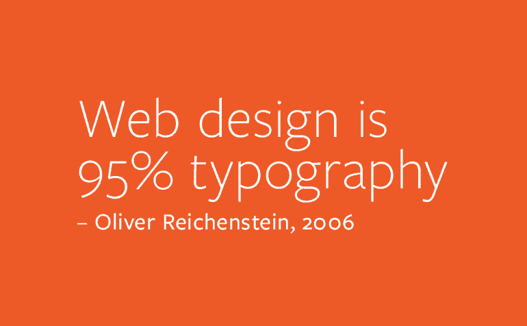

既然网页的主要设计语言是文本，那么每个网页设计师都应该首先理解排版艺术。如果你想在这一领域取得成功，你必须超越选择一个漂亮的字体；排版意味着最大化文字内容的表现力，这是可以做到的——而且通常是这样做的——不管使用什么字体。

总的来说，这些都是这篇关于网页排版的伟大文章中的观点，我强烈建议你阅读。它基本上告诉我们，就其目标而言，印刷艺术一点也没有改变；排版仍然是确保阅读文本尽可能的令人愉快。

以下绝不是一个全面的网页排版入门课程。然而，这是一种努力，为那些理解或想知道为什么文字可以如此美丽，有时又如此丑陋的人，为那些想在这一领域起步的人，为那些需要一个赌注以理顺他们的成长的人创造一个尺度。

## [#](#why-a-type-first-approach-is-better) 为什么类型优先的方法更好

每个人都试图让他们的网页设计具有响应性。这是新趋势。容器、图像、菜单，所有的东西都需要扩展到最小的设备，这样消费者才能有愉快的体验。但是如果你仔细想想，这个消费者是一个非常特殊的类型——他是一个读者。他访问该网页的首要原因是阅读该网页上的文本，而不管他在什么设备上阅读。那么，当一个人可以更好地瞄准对他的用户真正重要的东西时，他为什么要在设计网页时考虑特定的设备范围呢？

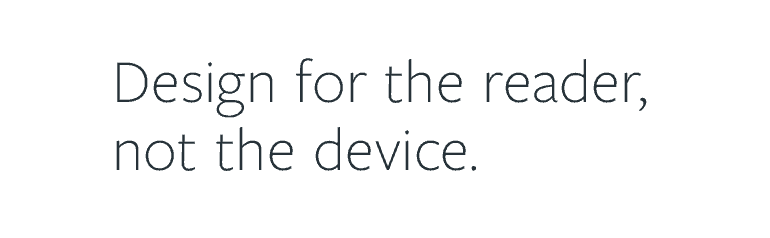

网页排版是几乎所有其他网页的支柱——这一事实使得用未稀释的字体开始任何设计都是明智的。不这样做很可能会导致你牺牲易读性而追求可用性。

## [#](#type-anatomy) 解剖型

为了让你对字体的制作有个概念，这里有一个全面的剖析。每一个部分都是一个参数，并受到创造性思维的影响，同时最大限度地保持可读性。这就是为什么创造字体需要掌握:你的创造力是同一类型的有限性和多样性。

一些术语将在本文的剩余部分使用，但是你不应该太担心记住它们。

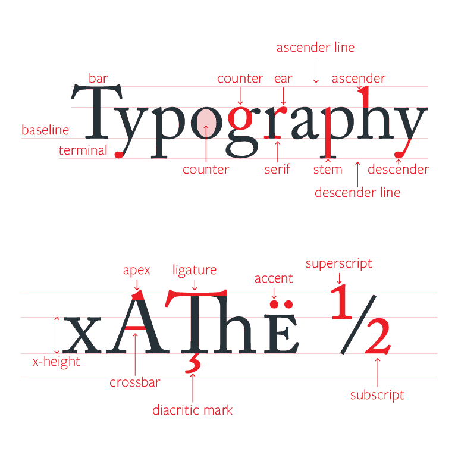

## [#](#type-kinds) 类型种类

有四种基本的类型类别可供选择，每一种都有自己特定的用例。有衬线，无衬线或无衬线，脚本，和新奇。衬线字体是更正式的经典字体。San 用于更现代和非正式的情况。脚本和新奇的字体不应该在网页上使用，因为它们不强调可读性。

## [#](#typesetting) 排版

排版是字体的组合。这是它们的大小和位置相互配合的方式，以便更好地向读者传达意思。

它本身也是一门艺术，它的一些规则将在下面的章节中提到。

### [#](#leading) 领先

行距是基线之间的空间。这里的想法是找到正确的价值观并坚持下去。使用太小的引导，段落很难阅读。如果太大，你的读者将很难跳到下一行。任何介于 120%和 150%之间的字体大小都可以很好地适应大多数字体。

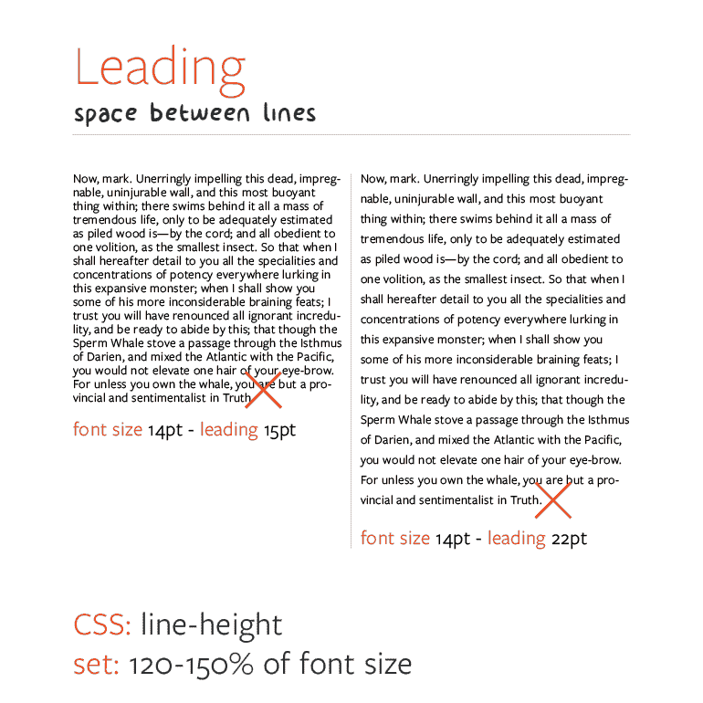

### [#](#measure) 测量

就像在 leading 的例子中一样，measure，也就是一行的长度，也有一个甜蜜点。这个最佳位置意味着每行 45-75 个字符，这个值可以帮助读者在阅读时保持愉快和自然的速度，而不会经常被换行符打断，或者因为行长而不耐烦地到达行尾。

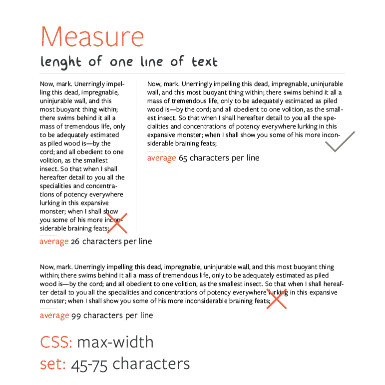

### [#](#kerning) 字距调整

字距是单个字母对之间的间距，而不是所有字母之间的总间距。字距调整之所以重要，是因为有时成对的字母在一起效果不佳，它们可能会重叠，或者看起来像一个完全不同的字母。字距调整通过手动调整这些字对之间的间距来解决这个问题，以便不传达错误的意思。

下面你可以找到一些最典型的字距调整失败的例子，以及在做网页设计时不要忘记它的好理由。

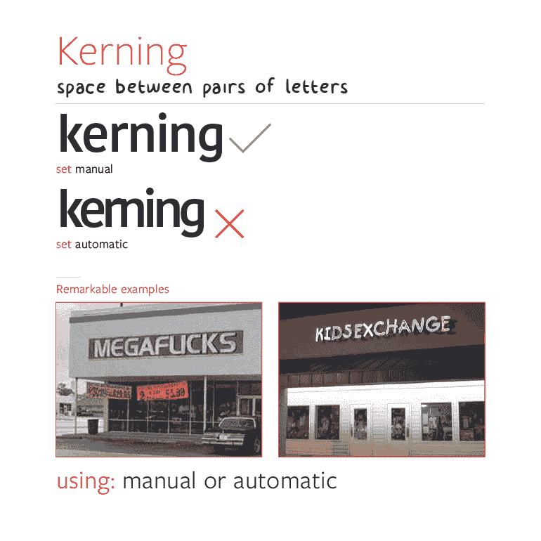

### [#](#tracking) 追踪

跟踪是所有字母之间的空间，这是另一个你可以在某些特殊情况下大大提高易读性的领域。这通常也是好的排版和伟大的排版的区别之一。

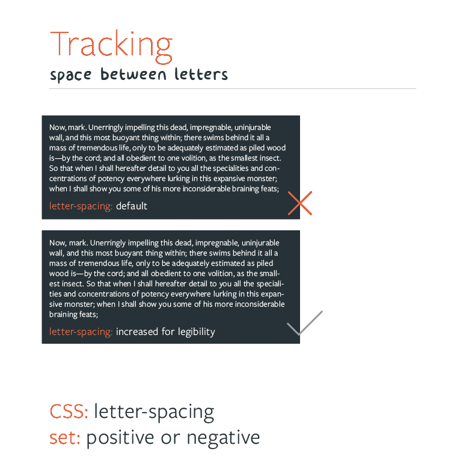

### [#](#alignment) 对齐

文本的对齐对网页的结构很有帮助。几乎每个现代网页都使用至少两到三种不同的对齐样式来增强其结构。例如，您可以将大标题向右对齐，基于网格的文本应该居中，常用段落可以左对齐或两端对齐。

### [#](#size) 尺寸

每一个网页都应该有一套文本大小。让这些值一起很好地工作不是一件容易的事情，但是一个想法可能是使用连续尺寸之间的黄金比例，并在必要时手动调整。

一个自然的、令人愉悦的尺寸变化会使网页本身变得漂亮，同时保持所有的东西都美观易读。

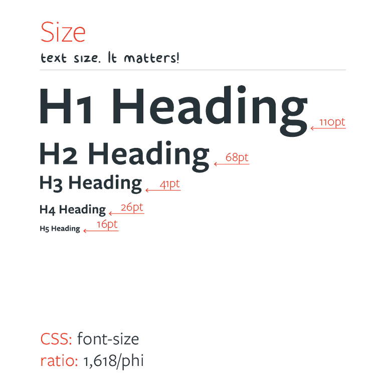

## [#](#capital-sins-of-type-setting) 罪大恶极式的设定

*   文本大小
*   标题和副标题的懒惰处理
*   没有被分割成足够小的、可扫描的、可理解的部分的文本块
*   难以分辨的联系
*   文本不被视为界面，而是装饰
*   花哨的导航从实际内容中吸引注意力
*   缺少活动空白

正如你所看到的，排版可以成就一个网页，也可以毁掉一个网页，但是如果你做得好，你就有了一个坚实的基础。

## [#](#how-to-choose-fonts) 如何选择字体

为特定任务选择字体可能是一件很难的事情。每种字体都以不同的方式交流，用自己的声音讲述故事。

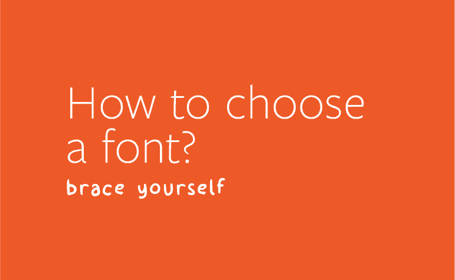

### [#](#the-webfont-jungle) 网络丛林

一个好的起点可以是一个网络字体库。它们真的很容易集成，不需要花费很多钱(因此不是一项可能出错的投资)，而且它们绝对是多样化的。这就是为什么这样的库不会出错，也是为什么它对那些没有完全投入到字体艺术中的人来说如此方便。

另一方面，一个人可能会在这个字体的丛林中不知所措，为一个网站做一个完整的彩虹般的组合。这不是目的。印刷术是一种温和的艺术，一种优雅的艺术。

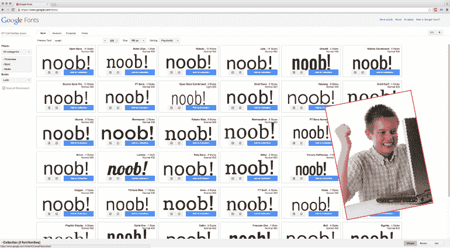

### [#](#what-to-do) 做什么？

这里有一些实用的技巧，可以帮助你开始使用网络字体库。

*   不要不知所措
*   保持简单
*   依靠优质字体
*   创建您自己的调色板
*   特权阶层和超级家庭
*   准备一些文本并阅读——你喜欢你所看到的吗？
*   征求第二种意见

## [#](#workhorses-and-super-families) 老黄牛和超级家族

当谈到字体，工作狂风靡一时。他们就像 AK47s 的字体。不管环境多么恶劣，他们仍然会做好自己的工作，而且看起来很优雅。

它们很棒，还因为它们有各种各样的粗细和样式(粗体、斜体等)。)使您摆脱了寻找好看字体组合的艰巨任务；你可以通过调整重量和款式来增加多样性，同时也要确定它们是否完美地搭配在一起。

这里有两种最流行的网络字体。它们是如此多样和完整，你不仅可以用它们创建一个完整的网站，还可以围绕它们创建一个完整的品牌标识。Open Sans 在 Google 字体上是免费的，而 Proxima Nova 需要订阅 Adobe Typekit。

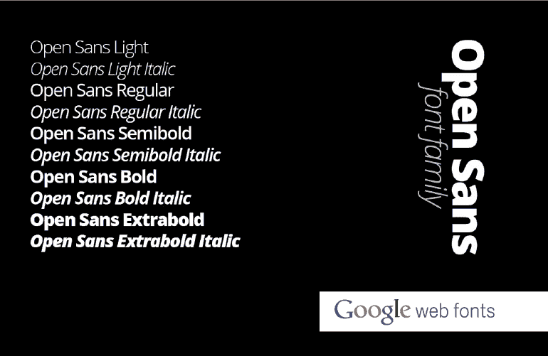

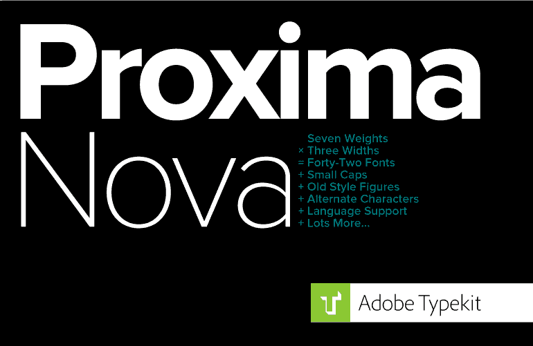