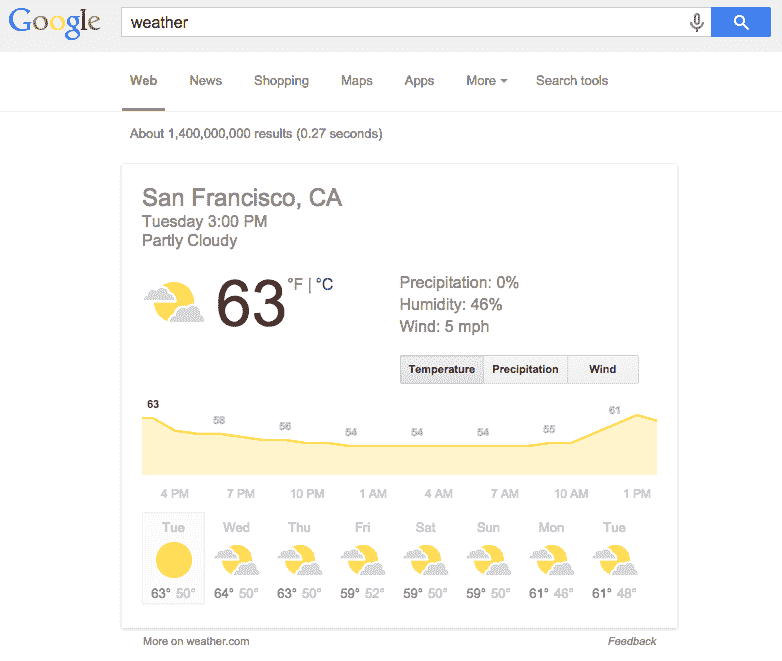
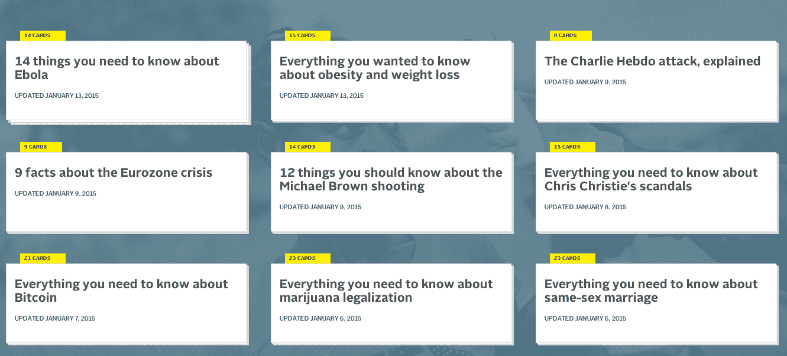
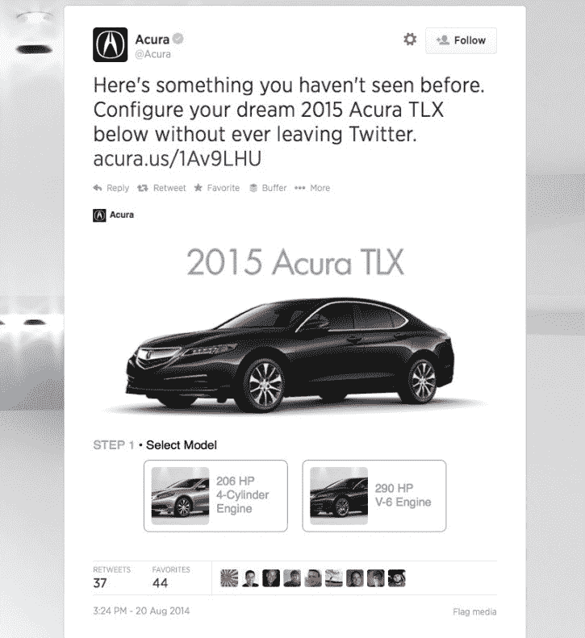

# 卡片如何悄然改变网络 TechCrunch

> 原文：<http://techcrunch.com/2015/02/27/cards-transforming-web/?utm_source=wanqu.co&utm_campaign=Wanqu+Daily&utm_medium=website>

**编者按:** *Robert Fan 是 [Sharethrough](http://sharethrough.com/) 的联合创始人兼 CTO。*

一天将近三个小时。这是 2014 年你和我每天花在手机上的平均时间。我们对移动设备获取信息的依赖已经迫使网络的设计发生改变。网民们已经开始期待移动内容得到优化，给他们带来他们正在寻找的前沿和中心。

卡片，一种将在线内容压缩成数字容器以便快速轻松消费的技术，诞生于这一转变，并开始了跨越网络的变革，这将在整个 2015 年产生新的赢家和输家。

## 领跑者:谷歌和 Vox 媒体

Web 出版商们已经争斗了多年，但是最终的奖品仍然是一样的东西:访问者和参与度。人们在一个网站或应用上花费的时间越多，他们从访客变成拥护者的可能性就越大。反过来，一个网站能让人们浏览的时间越长，就会有更多的广告被提供、看到和转化。

谷歌高于平均水平的留存率在很多方面是卡作为其最近创新的基础的副产品。当人们的注意力迅速从一件事情转移到另一件事情时，卡片有助于固定人们穿越 T2 T3 T4 T5 网络的欲望。它们是为了满足即时需求而设计的快捷方式，节省时间，以易于理解的格式提供信息，同时让人们在他们所在的地方保持参与。

在一个人们饱受信息过载之苦的世界里，卡片正被用来降低复杂性。例如，Vox Media 开发了卡片堆栈，将一般趋势新闻故事和主题简化为一组易于消化的文章。的设计简单、干净、直观，每张卡片都为新闻揭开了不同的“层”。

通过卡叠，Vox 能够提高参与度和保持度。例如，用户可以简单地点击箭头浏览记者关于某个主题的全部文章，而不是仅仅阅读一篇文章然后去不同的网站。这使得 Vox 成为许多主题信息的“T4 站”,最终让读者在网站上停留更长时间。

## 后起之秀:广告商和社交平台

虽然 Vox Media 和谷歌一直专注于使用卡片来增加参与度，但卡片功能正在快速发展，一些广告商开始试水，特别是在feed 中。卡片很适合在应用程序中做广告，而不是用横幅广告或弹出窗口打断用户体验。技术允许开发者创造尊重受众的无缝、不间断的货币化。

例如，讴歌最近与 Twitter 的合作允许消费者配置他们的 2015 款 TLX，而无需离开推文。通过将的整个互动保留在用户的 feed 中，讴歌不会失去的50%的用户，如果被迫点击他们的网站，这些用户就会流失。卡片让平台变得更加通用，这对于拥有不断增长的多样化内容库的品牌来说非常重要。

## 落后者:公用事业网站和应用

不久前，消费者还会访问一个天气网站来了解天气。现在，一个简单的搜索“天气”将会在谷歌的卡片里提供七天的天气预报。像 Weather.com 和 Fandango.com 这样在早期 web 时期崛起的公用事业网站现在正在为相关性打一场硬仗，那些在和时间的一小部分内提供相同价值的卡将迫使它们适应或者死亡。

甚至就在五年前，人们还在下载“应用程序”,但一切都变了。根据尼尔森的研究，大多数人每天使用不到 10 个应用程序，而在同一调查中，55%的人每天在 T2 使用 1 到 4 个应用程序。消费者的行为已经从想要应用程序转变为想要答案。卡片比免费下载更快，更容易，也更少承诺。

## 到处都是卡片

随着人们面对海量的内容，卡片的实用作用至关重要。像脸书和谷歌这样的早期先驱已经用它们来简化我们的生活，让相关信息触手可及。他们的成功已经鼓舞了广告商和出版商，他们希望利用卡片的可能性。

今年，我们将看到卡片开始从一个相对不为人知的技术转变为移动和网络设计的基石。很快，消费者将会预订旅游目的地、购买演出门票、查询价格——所有这些都不需要离开出版物、社交网站或显示卡内信息的应用程序，最终将改变我们使用互联网的方式。