# 我们如何升级实时数据中心-服务器故障博客

> 原文：<http://blog.serverfault.com/2015/03/05/how-we-upgrade-a-live-data-center/?utm_source=wanqu.co&utm_campaign=Wanqu+Daily&utm_medium=website>

几周前，我们升级了纽约数据中心的许多核心基础设施(好吧，现在真的在新泽西，但不要告诉任何人)。我们喜欢公开我们所做的一切(包括基础设施)，并真的认为这是我们拥有的最好的工作津贴之一。以下是我们升级数据中心的方式和原因。首先，[花点时间来看看什么栈溢出作为](http://blog.stackoverflow.com/2009/12/stack-overflow-rack-glamour-shots/)开始。五年过去了，硬件已经有了长足的进步。

### 为什么？

直到 2 个月前，自从从原始 Stack Overflow web stack 升级以来，我们还没有更换过任何服务器[。自从我们第一次搬到纽约数据中心](http://blog.stackoverflow.com/2009/01/new-stack-overflow-servers-ready/)(2010 年 10 月 23 日—**四年多前**)以来，就再也没有这种需求[。我们总是在尽可能地重组、调优、检查分配以及优化代码和基础设施。我们这样做主要是为了页面加载性能；web 层上较低的 CPU 和内存使用率通常是一个(受欢迎的)副作用。](http://blog.stackoverflow.com/2010/10/datacenter-migration-oct-23/)

发生了什么事？我们开了个会。去年 10 月，所有 Stack Exchange 工程人员聚集在我们的丹佛办公室，我们做出了一些决定。其中一个决策是从生命周期和财务角度考虑如何处理基础设施硬件。我们决定从现在开始:硬件在大约 4 年内是有效的。之后，我们将:淘汰它，更换它，或破例延长它的保修期。这让我们从管理角度简化了许多事情，例如:我们限制自己在任何给定时间只能使用两代服务器，并且除了例外情况外，我们不参与保修续订业务*。我们可以提前订购所有硬件，简单的目标是 4 年寿命和 4 年保修。*

为什么是 4 年？这似乎很武断。剧透警告:的确如此。我们当时运行的是 4 年前的硬件，到目前为止运行良好。说真的，就是这样:做对你有用的事。大多数公司在 3 年内对硬件进行折旧，提出诸如“我们如何处理旧服务器？”简单多了。对于那些不熟悉的人来说，贬值的硬件实际上意味着“不入账”我们可以在生产之外重新利用它，捐赠它，让员工发疯，等等。如果你没听说，[我们最近筹集了一点资金](http://blog.stackoverflow.com/2015/01/andreessen-horowitz-invests-in-stack-exchange/)。当我们在丹佛参加公司会议时，最终金额还没有确定，但我们知道我们想让 2015 年成为投资年，并为未来 4 年加强硬件。

在接下来的 2 个月里，我们评估了超过 4 年的时间和接近 4 年的时间。事实证明，我们几乎所有的戴尔第 11 代硬件(包括 web 层)都符合这些标准，因此更换整个一代硬件并消除一系列特定于管理的问题是非常有意义的。仅管理第 12 代和第 13 代硬件和软件会让生活变得轻松许多，而第 12 代硬件的大部分软件将在 2015 年 4 月左右升级到接近第 13 代的水平。

### 什么得到了爱

在这两个月中，我们意识到我们运行在许多旧服务器上(其中大部分是 2010 年 5 月的):

*   Web 层(11 台服务器)
*   重定向服务器(2 台服务器)
*   第二个 SQL 集群(3 台服务器–1 台在俄勒冈州)
*   文件服务器
*   实用服务器
*   虚拟机服务器(5 台服务器)
*   标签引擎服务器(2 台服务器)
*   SQL 日志数据库

我们还可以使用更多的[空间](http://youtu.be/xeKMS62GrTI?t=48s)，所以让我们添加:

*   额外的 SAN
*   备份服务器的附加 DAS

这意味着大量服务器被替换。多少？这许多: [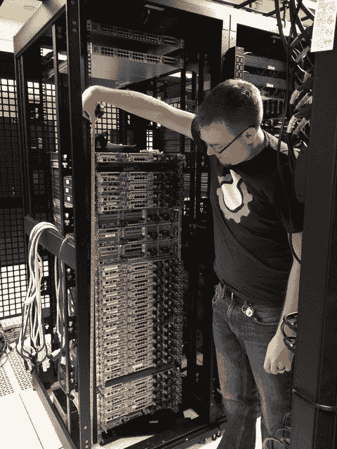](http://imgur.com/fp4aCYP)

### 升级

我知道您在想什么:“Nick，您是如何着手制造这么一堆精美的服务器的？”很高兴你问了。下面是实时数据中心中**如何进行堆栈交换基础架构升级。我们选择不为此升级进行故障转移；相反，我们在实时数据中心使用多点冗余来升级它，同时所有流量都从那里流出。**

**第三天(1 月 22 日，星期四):**我们的升级计划完成了(总共花了大约 1.5 天)，包括我们能想到的一切。我们在现场的时间有限，所以为了充分利用这一点，我们提前逐项计划了所有的升级(*大部分*成功完成，请继续阅读)。[你可以在这里找到阅读完整的升级计划](https://docs.google.com/document/d/1loi8aB7bLSZ04Ggs1Moc62ZKCKum6nEgq_8FhsrFQu0)。

**第 0 天(1 月 25 日，星期日):**本次升级的现场系统管理员有[乔治·比奇](https://twitter.com/GABeech)、[格雷戈·布雷](https://twitter.com/GBrayUT)和[尼克·克拉弗](https://twitter.com/Nick_Craver)(注:几位*远程*系统管理员也大量参与了本次升级:[乔夫·达尔加斯](https://twitter.com/SuperDalgas)在线，来自科瓦利斯，或者[谢恩·马登](https://twitter.com/shanemadden)，在线，来自科罗拉多州丹佛[汤姆·利蒙塞利](https://twitter.com/yesthattom)[在飞机起飞前不久，我们得到了一些关于天气的令人不安的消息。我们收拾好雪地装备，前往纽约。](https://twitter.com/yesthattom)

**第一天(1 月 26 日，星期一):**虽然我们的办公室在曼哈顿下城，但数据中心现在位于哈德逊河对面的泽西城: [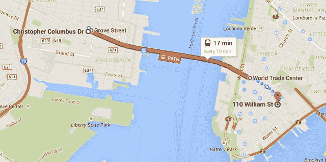](http://imgur.com/qCXPsRQ) 我们知道，无论天气好坏，我们在纽约的时间内都有很多事情要做。我们的想法是，如果我们跳过周一，我们可能无法在周二回到数据中心，如果路径(到新泽西的公共交通)关闭的话。这最终还是发生了。团队的决定是:出发。我们得到了过夜设备，然后前往数据中心。下面是等待安装的内容:

[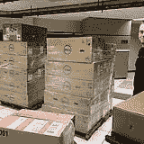](http://imgur.com/BUehVfZ)[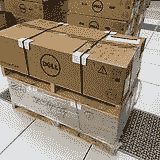](http://imgur.com/ianahmK)

是啊，我们也很兴奋。在我们开始升级服务器之前，我们首先必须解决 redis 服务器支持 24 小时内发布定向招聘广告的关键问题。这些机器最初是给卡珊德拉的(我们破坏了那个数据存储)，然后是 Elasticsearch ( [也破坏了那个](https://github.com/elasticsearch/elasticsearch/issues/2665)，最后是 [redis](http://redis.io/) 。好奇？ [Jason Punyon](https://twitter.com/JasonPunyon) 和 [Kevin Montrose](https://twitter.com/kevinmontrose) 在普罗维登斯[上有一个优秀的博客系列](http://kevinmontrose.com/2015/01/27/providence-machine-learning-at-stack-exchange/)，[你可以在这里](http://jasonpunyon.com/blog/2015/02/12/providence-failure-is-always-an-option/)找到 Punyon 关于每个数据仓库的爆料的帖子。

我们为这些当时冗余的系统订购的数据驱动器是三星 840 Pro 驱动器，后来发现它有一个严重的固件缺陷。这导致我们在双 10Gb 网络连接上的服务器到服务器拷贝达到了大约 **12MB/s** (哎哟)。考虑到这些 redis 实例中数百 GB 的内存，这实际上并不可行。因此，我们需要升级这些驱动器上的固件来恢复性能。这需要在线，让 RAID 10 阵列在我们进行的过程中重建。由于你不能通过大多数 USB 接口升级固件，我们拆开了这个可怜的小台式机来完成我们的任务:

[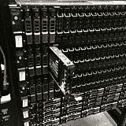](http://imgur.com/acSwKV4)[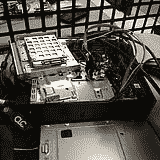](http://imgur.com/2Fc6KXO)[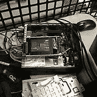](http://imgur.com/tK344O6)[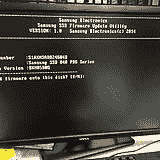T11】](http://imgur.com/n3ybxCR)

一旦开始，它就与其他工作并行运行(因为包含数据的 RAID 10s 需要几十分钟才能重建，即使使用固态硬盘也是如此)。最终结果是大大改善了 **100-200MB/s** 的文件副本(我们很快就会看到*新的*瓶颈——仍有许多调整要做)。现在好戏开始了。在机架 C 中(我们非常尊重我们的机架，它们获得了标题外壳)，我们希望从现有的 SFP+ 10Gb 连接以及 1Gb 上行链路(用于其他一切)迁移到单个双 10Gb BASE-T (RJ45 连接器)铜缆解决方案。这有几个原因:我们使用的 SFP+布线称为[双轴](http://en.wikipedia.org/wiki/Twinaxial_cabling)，它在电缆臂中更难使用，订购时具有不可预测的周长，并且不容易在这些戴尔服务器的网络子卡中获得。 [SFP+ FEXes](http://www.cisco.com/c/en/us/products/switches/nexus-2232pp-10ge-fabric-extender/index.html) 也不允许我们连接我们可能有的任何 1Gb BASE-T 项目(尽管这不适用于此机架中的*，但当它成为所有机架的标准时，就像我们的负载平衡器一样)。这是我们从机架 C 开始的内容:*

我们最终想要的是:

该计划旨在简化网络配置、布线、整体多样性，并在此过程中节省 4U。这是我们开始时机架顶部的样子:[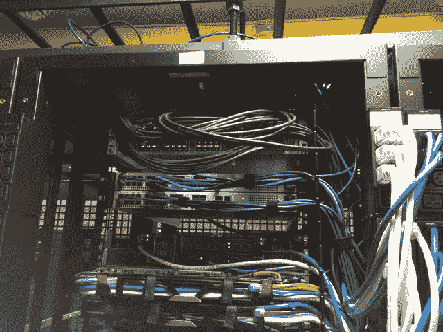](http://imgur.com/kcqzCCQ)…中间(电缆管理盖已经关闭): [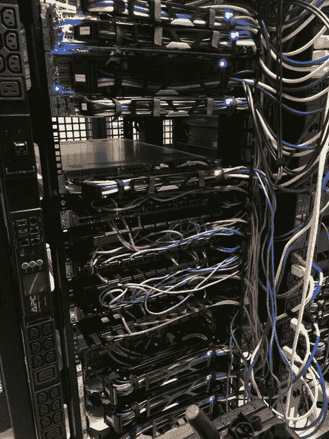](http://imgur.com/c3iiTvx)

让我们开始吧。首先，我们希望 KVM 在工作时保持在线，因此我们，嗯，将它们“临时重新定位”: [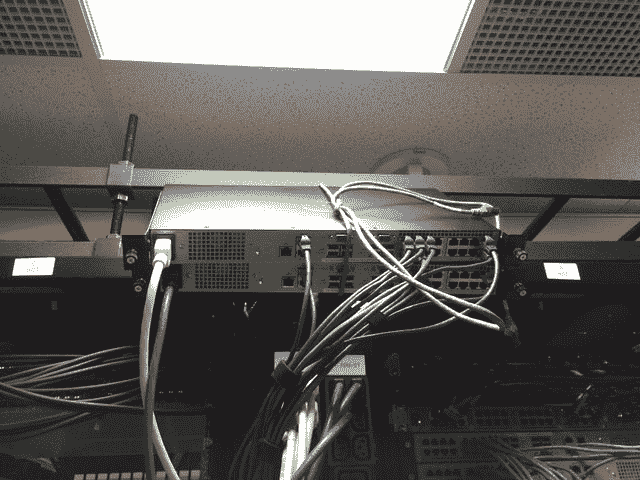](http://imgur.com/4zCr57P) 现在，这些都不碍事了，是时候将现有的 SFP+fexe 降至尽可能低的位置，以便在它们最终的家中安装新的 10Gb BASE-T fexe 了:[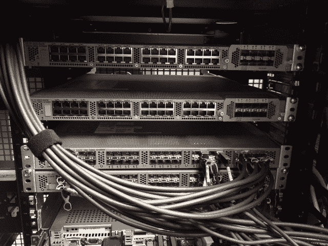](http://imgur.com/6kc6nNc)Nexus Fabric extender 的工作原理允许我们为每个 FEX 分配 1 到 8 个上行链路。这意味着我们可以在没有任何网络中断的情况下从每个 FEX 中拔出 4 个端口，将我们在 VPC(虚拟端口通道)中发现的 4 个端口从 VPC 中取出，并将其分配给新的 FEX。因此，随着我们通过升级从旧系统迁移到新系统，我们总体上从 8/0 到 4/4 再到 0/8。这个过程的中间步骤如下: [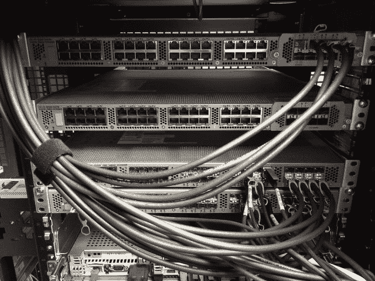](http://imgur.com/bsx8KGb) 新网络就绪后，我们可以开始更换一些服务器。我们已经淘汰了几台旧服务器，其中一台我们进行了虚拟化，另外两台我们不再需要。再加上清空我们的 NY-VM01 & NY-VM02 主机，我们通过机架腾出了 5U 的空间。在 NY-VM01 & 02 之上是电缆管理的 1Gb FEXes 和 1U 之一。对我们来说幸运的是，所有的东西都被插入到两个 FEXes 中，我们可以提前取出一个。这意味着我们可以比计划更快地启动新的虚拟机基础架构。是的，我们已经改变了计划。事情就是这样。我们用什么来替换这些老化的虚拟机服务器？很高兴你问了。这些坏男孩:

[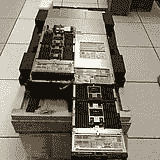 ](http://imgur.com/0qPFc3y) [ 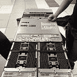](http://imgur.com/tTj1Y3P)

有 2 个这样的 [Dell PowerEdge FX2s 刀片式服务器机箱](http://www.dell.com/us/business/p/poweredge-fx/pd)，每个机箱带有 2 个 [FC630 刀片式服务器](http://www.dell.com/learn/us/en/04/shared-content~data-sheets~en/documents~dell-poweredge-fc630-spec-sheet.pdf)。每个刀片都有两个英特尔 E5-2698v3 18 核处理器和 768GB 内存(这只是容量的一半)。通过双 4x 10Gb IOA 模块，每个机箱都有 80Gbps 的上行链路容量。它们安装在这里:

[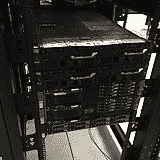 ](http://imgur.com/rsFQaIf) [ 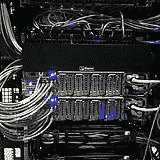](http://imgur.com/6PYvyGL)

两个半满机箱的分离带给我们两件事:容量加倍扩展，以及避免 VM 主机的任何单点故障。很简单，对吧？我们没有计划的是当天的网络部分，结果是后面的那些 [IO 聚合器](http://www.dell.com/us/business/p/fn-io-aggregator/pd)几乎是全交换机，每个都有 4 个外部 10Gbps 端口和 8 个内部 10Gbps(每个刀片 2 个)端口。一旦我们弄清楚他们能做什么和不能做什么，我们就有了纽带，新的主机就运转起来了。

这里需要注意的是，在网络上线后，数据中心的任何人都没有在构建这个虚拟机体系结构。我们设置好了谢恩·马登可以远程操作这一切。一旦他让新的 NY-VM01 & 02 上线(现在是刀片式服务器)，我们就将所有的**虚拟机迁移到这 2 台主机上，并能够拆除旧的 NY-VM03-05 服务器以腾出更多空间。当我们把东西拿出来的时候，谢恩能够旋转最后两个刀片，让我们的新野兽完全上线。这次升级的最终结果是*大幅*增加了 CPU 和内存(总体从 528GB 增加到 3,072GB)以及网络连接。每台旧主机都有 4 个 1Gb(中继)用于对 SAN 的大部分访问，2 个 10Gb 用于对 SAN 的 iSCSI 访问。新的刀片式主机每台都有 20Gb 的中继访问所有网络，以便根据需要进行拆分。**

但是我们还没完。下面是新的 [EqualLogic PS6210 SAN](http://www.dell.com/us/business/p/equallogic-ps6210-series/pd) (这也是下面要介绍的 NY-LOGSQL01):

[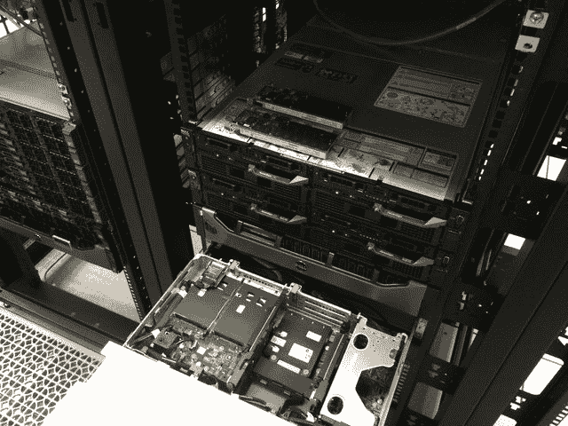](http://imgur.com/zjPk27t) 我们以前的 SAN 是 PS6200，配有 24 个 900GB 10k 驱动器，仅支持 SFP+。这是一个较新的 10Gb BASE-T 24x 1.2TB 10k 版本，速度更快，空间更大，并且能够与现有 SAN 实现主动/主动连接。沿着 SAN，我们还安装了这款新的 NY-LOGSQL01 服务器(取代了陈旧的戴尔 R510 *never* 设计为 SQL 服务器，它是作为 NAS 购买的):

[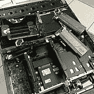 ](http://imgur.com/LUOvTLF) [ 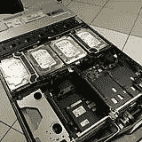](http://imgur.com/j0lto7V)

其他虚拟机主机释放的额外空间让我们可以安装新的文件和应用服务器:

[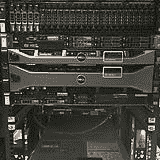 ](http://imgur.com/aggWhhU) [ 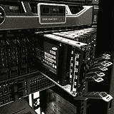](http://imgur.com/3eOxMFB)

这里要注意的是:NY-UTIL02 实用程序服务器有许多驱动器托架，因此我们可以在 RAID 0 中安装 8 个 Samsung 840 Pros，以便恢复和测试我们每天晚上进行的 SQL 备份。对于空间来说，这是 RAID 0，因为所有的数据都是每晚从零开始加载的——没有任何损失。我们去年学到的一个重要教训是，840 Pros】没有内置电容器，如果它们处于活动状态，断电将导致数据丢失，因为它们在板上有一点 DIMM 用于写缓存。鉴于这一信息，我们选择将生产 SQL server 升级中的一些英特尔 S3700 800GB 驱动器放入我们的 NY-DEVSQL01 机箱，并将弹性较低的 840 移动到这个恢复服务器，在这里*真的*无关紧要。

好吧，让我们回到暴雪的现实。此时，公共交通已经关闭，所有在(暴雪)步行距离内的酒店都被预订一空。虽然我们一到达现场就开始检查住宿条件，但我们没有找到任何酒店。尽管这场暴风雪远没有预测的那么严重，但它仍然强大到足以让一切都停止运转。所以，我们决定尽可能晚地去，提前完成计划。需要澄清的是:这是现场人员的决定，而不是管理层的决定。在 Stack Exchange，人们相信员工能够完成工作，但是他们最清楚如何去做。这是我们热爱这份工作的原因。

如果生活递给你柠檬，忽略那些愚蠢的柠檬，去安装闪亮的新硬件。

这就是我们必须向[我们的数据中心 QTS](http://www.qtsdatacenters.com/) 大声疾呼的地方。这些家伙让办公室经理帮我们找到任何我们能找到的酒店，为我们准备了额外的帆布床供我们过夜，甚至叫了额外的披萨和饮料，这样我们就不会挨饿。这些都是没有经过询问的——它们总是很棒，我们会毫不犹豫地把它们推荐给任何想要托管的人。

在启动了所有虚拟机、配置了 SAN 并拆除了一些额外的布线之后，我们在周二上午 9:30 左右结束了工作，此时公共交通系统正在恢复运行。为了结束这个漫长的夜晚，这是我们结束的几乎心脏病发作，一台机器在: [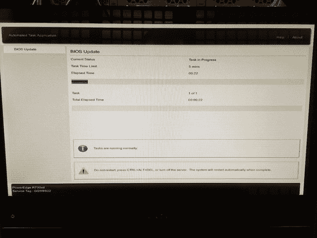](http://imgur.com/4igDDvf) 锁定，结果是一个电源[太可怕了](http://imgur.com/FgwmoSk)，需要更换。BIOS 升级成功，有缺陷的电源被移除，我们在一周前得到了一个替代品。注:我们订购了一个新的，而不是 RMA 旧的(我们后来做了)。我们为数据中心的每个瓦数级别保留一个备用电源，并尽量少用不同的级别。

第二天(1 月 27 日，星期二):我们睡了一会儿，吃了点东西，大约在晚上 8 点到达目的地。首先启动 web 层(滚动构建):

[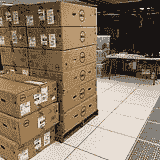](http://imgur.com/uLuoqLo)[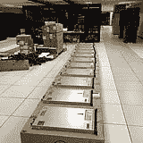](http://imgur.com/Gtpokv2)[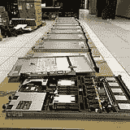](http://imgur.com/YxhjQyl)[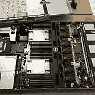T11】](http://imgur.com/MqjfKX0)

我们一次轮换 3 台服务器，以便在新硬件上进行重建，同时我们还将一些现有的 R620 服务器从 4x 1Gb 网络子卡升级到 2x 10Gb+2x 1Gb NDC。以下是 NY-SERVICE03 的情况:

[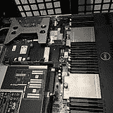](http://imgur.com/0DF70VL)[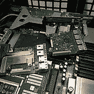](http://imgur.com/VYn4UFy)

web 层重建让我们有机会清理一些布线。还记得那两个 SFP+fex 吗？它们*几乎*空了: [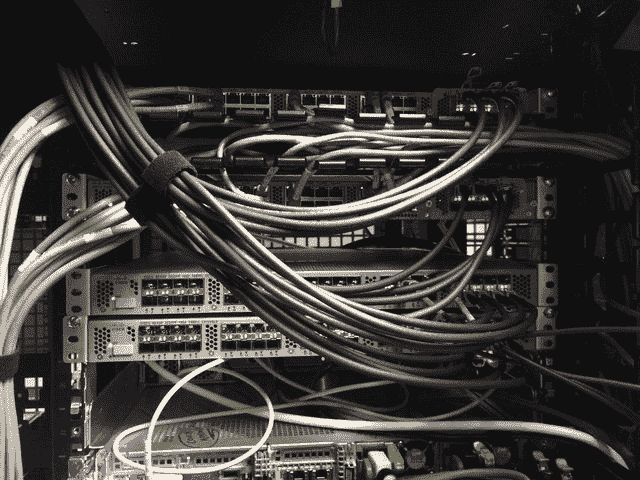](http://imgur.com/k5BCrcG) 最后两项是旧的 SAN 和老化的 R510 NAS/SQL 服务器。这就是我们计划中第一个大问题发生的地方。我们计划在此图所示的备份服务器中安装第三个 PCIe 卡: [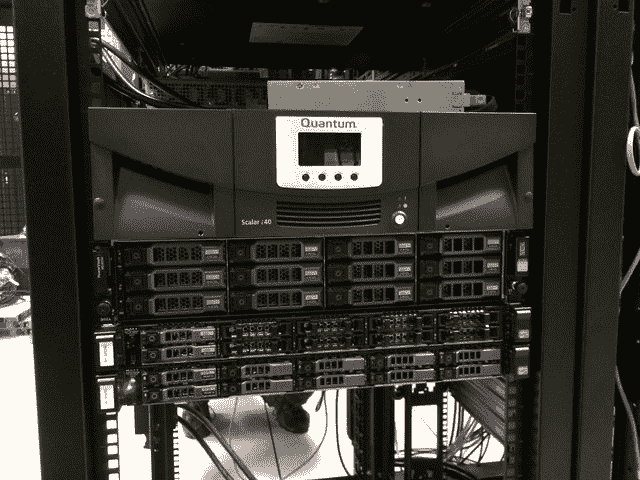](http://imgur.com/UVq7KFp) 我们知道这是一个戴尔 R620 10 托架机箱，具有 3 个半高 PCIe 卡。我们知道它有一个用于现有 DAS 的 SAS 控制器和一个用于 SFP+ 10Gb 连接的 PCIe 卡(它位于带有核心的网络机架中，其中所有 96 个端口都是 10Gb SFP+)。哦，嘿，看那个，它连接到一个磁带机，需要[另一个 SAS 控制器，我们忘记了](http://imgur.com/zgUCINN)。*废话*。好吧，这是常有的事。新计划。

我们手头有额外的 10Gb 网络子卡(NDC ),因此我们决定升级备份服务器中的 NDC，移除 SFP+ PCIe 卡，并替换为新的 12Gb SAS 控制器。我们还忘了带新卡的半高安装支架，不得不创造性地用一些金属剪片(编辑:原来它从来没有带一个-我们现在对此感觉不那么愚蠢了)。那么，我们如何将新 10Gb BASE-T 卡插入网络核心呢？我们不能。至少不是 10Gb。C 架中的最后 2 件 SFP+产品也需要一个家，因此我们决定进行交易。整个备份设置(包括新的 MD1400 DAS)都非常喜欢他们的新 Rack C home:

[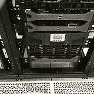](http://imgur.com/2gamNmW)[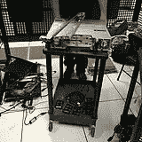](http://imgur.com/qa7wAw0)[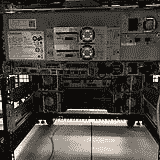](http://imgur.com/XaOI5vn)[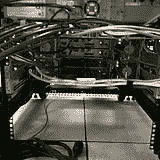T11】](http://imgur.com/r7Sf6Ei)

然后，我们最终可以移除这些 SFP+fex，使这些 KVM 恢复正常，并清理机架 C 中的东西:

[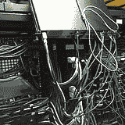](http://imgur.com/b1VOuEj)[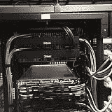](http://imgur.com/R9s6P7V)[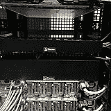](http://imgur.com/uem4Qxh)

看到了吗？一直都有一个计划。今天最后一个进入机架 C 的项目是 NY-GIT02，这是我们新推出的 Gitlab 和 TeamCity 服务器:

[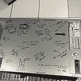 ](http://imgur.com/RAK3x8h) [ 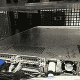](http://imgur.com/npaTkPN)

注意:我们曾经在 NY-WEB11 的 Windows 上运行过 [TeamCity](https://www.jetbrains.com/teamcity/) 。杰夫·达尔加斯(Geoff Dalgas)在升级移动到硬件的过程中抛出了这个想法:NY-GIT02 盒子。因为它们是如此紧密的依赖关系(两者都有一个异地备份)，所以将它们结合起来实际上是有意义的。它给了 TeamCity 更大的能力，甚至更快的磁盘访问(它做了很多 XML 文件…的事情)，同时使 web 层更加同质。这也使得 NY-WEB11 的停机时间(即将到来)的影响要小得多。这很有意义，所以我们改变了计划并继续下去。更具体地说，达尔加斯同意了，并从俄勒冈远程设置了这一切。当这一切发生时，Greg 正在与我们的 web 层上关于 git 的 DSC 安装挂起进行斗争: [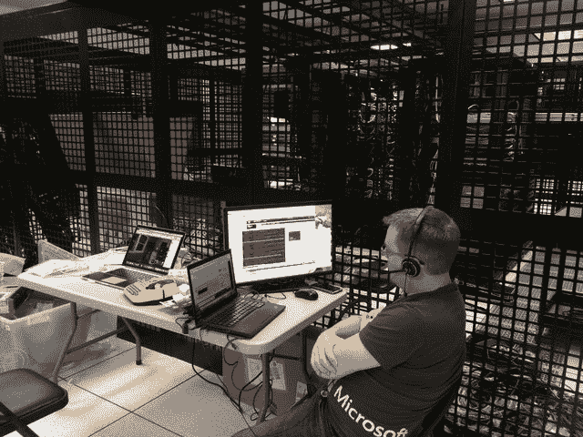](http://imgur.com/ZpiOXNP) 哇，这么多红色，我想知道谁会赢。这是达尔加斯在我的笔记本电脑上的一个视频，嗨，达尔加斯！由于 web 层构建是一个相对较新的流程，我们花时间解决了一些最近的布线变化。KVM 是在此之前不久匆忙安装的，因为我们知道要重新布线。例如，在机架 A 中，我们将顶部的 10Gb FEX 上移了一个 U，以将电缆管理扩展到 2U，并在 KVM 之间增加了 1U 管理空间。流程是这样的:

[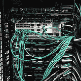](http://imgur.com/Qc9R94Q)[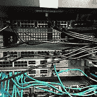](http://imgur.com/1e3Hi6V)[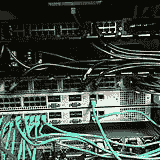](http://imgur.com/0JUTMKv)[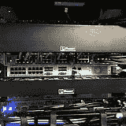T11】](http://imgur.com/4NN4QpL)

由于我们必须将 A & B 机架中的 1Gb 中间 fexe(4 个都被移除)重新连接到 10Gb 架顶式 fexe，因此我们移动了一些东西。底部 web 层下方的 CloudFlare 负载平衡器向上移动到最近虚拟化的 DNS 服务器释放的位置，以加入其他 2 个公共负载平衡器。作为全 10Gb 改造的一部分，1Gb FEXes 的移除意味着 A & B 的中间机架有了更多的可用空间，以下是改造前后的情况:

[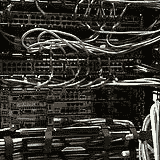 ](http://imgur.com/Ax4YbW4) [ 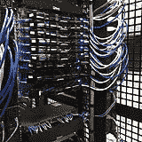](http://imgur.com/TEb0jiP)

在 2 批网络服务器、电缆清理和网络设备移除之后，我们在早上 8:30 左右停下来休息一下。事情进展顺利，我们只剩下一半的 web 层、布线和一些其他服务器需要更换。

**第 3 天(1 月 28 日，星期三):**我们在下午 5 点前回到数据中心，做好准备，准备出发。最后被取代的非网络服务器是 redis 和“服务”(tag engine，elasticsearch indexing 等)。)框:

[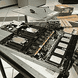 ](http://imgur.com/YWjYE6c) [ 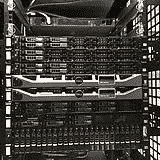](http://imgur.com/Jgg4Csl)

我们在纽约数据中心有 3 个标记引擎箱(纯粹是为了重载暂停和最佳并发性，而不是负载)和 2 个 redis 服务器。其中一个标签引擎盒是更新的 R620，(这个早些时候升级了 10Gb)，没有被替换。剩下 NY-SERVICE04、NY-SERVICE05、NY-REDIS01 和 NY-REDIS02。在服务盒上，这个过程非常简单，尽管我们确实学到了一些有趣的东西:如果您将 R610 中的 RAID 10 操作系统阵列的两个驱动器都放入新的 R630 中，它会一直引导到 Windows 2012，没有任何问题。这让我们困惑了一会儿，因为我们不记得在最后 3 分钟内构建了它。重建很简单:通过我们的映像+更新+ DSC 放下 Windows 2012 R2，然后安装他们做的工作。StackServer(从系统管理员的角度来看)只是一个 windows 服务——我们的 TeamCity build 处理安装等工作，它实际上只是一个参数标志。这些机器也为内部服务运行一个小的 IIS 实例，但这也是一个简单的构建。他们执行的最后一项任务是托管一个 DFS 共享，我们希望缩减并简化其拓扑结构，因此我们将他们作为 DFS 目标禁用，并在接下来的一周内解决这一问题—我们让 NY-SERVICE03 轮流管理这些共享，并且可以完全远程执行此类工作。对于 redis，我们总是有一个从属链发生，它看起来像这样: [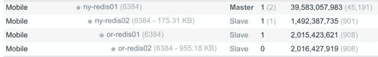](http://imgur.com/eu09S8C) 这意味着我们可以在完全不中断服务的情况下进行升级/故障转移/升级。在所有这些构建之后，下面是安装的超级漂亮的新 web 层:

 

为了了解硬件差异的规模，旧的 web 层是戴尔 R610s，配有双[英特尔 E5640 处理器](http://ark.intel.com/products/47923)和 48GB 内存(多年来一直在升级)。新的 web 层拥有双[英特尔 2687W v3 处理器](http://ark.intel.com/products/81909)和 64GB DDR 4 内存。我们为操作系统 RAID 1 重新使用了相同的双英特尔 320 300GB 固态硬盘。如果你对所有这些硬件的规格感兴趣，我们将在下一篇文章中详细描述我们当前的基础设施，包括确切的规格。

**第 4 天(1 月 29 日，星期四):**我和集群机架 d 吵了一架。今天大部分时间都花在了改造集群机架上，因为我们已经*了我们需要的大部分*电缆。当它第一次上架时，我们需要的零件还没有到达。事实证明，正如你在照片中看到的，我们仍然缺少一些猫和电源电缆，但我们能够实现 98%的目标。

[T11】](http://imgur.com/ic9usig)

我们花了一段时间才使这个机架成形，因为我们在缺少的地方添加了电缆臂，更换了大部分电缆，并且对我们做事的方式相当挑剔。例如:你怎么知道东西插入了正确的端口，以及电缆的另一端通向哪里？标签。很多很多标签。我们在每根电缆的两端和两端的每台服务器上都贴了标签。它现在增加了一点时间，但它节省了时间和以后的错误。

[T11】](http://imgur.com/NCp6Z6v)

当我们这次旅行的时间用完时，这些架子最终看起来是这样的:

[T11】](http://imgur.com/ZFvRqgk)

[T11】](http://imgur.com/BXBpAKl)

它并不完美，因为我们用完了几根颜色和长度都合适的电缆。我们已经点了，乔治会把最后几样收拾好。

我知道你在想什么。我们认为这也不够吸引服务器的眼球。

**[这里是我们搬家](http://imgur.com/a/X1HoY)** 的完整专辑。

**[这里是#SnowOps twitter 流，它有更多的](https://twitter.com/search?f=realtime&q=%23SnowOps&src=typd)** 。

### 哪里出了问题

*   如果说一切进展顺利，那是彻头彻尾的谎言。这种规模的硬件升级从来不会发生。期待吧。为此做好计划。留出时间。
*   还记得我们在 2010 年升级到这些新的数据库服务器时，性能[没有达到我们的预期](http://blog.stackoverflow.com/2010/10/database-upgrade/)吗？是啊，那个。我们目前正在帮助戴尔追踪这些系统的 1.0.4/1.1.4 BIOS 中的一个错误，该错误似乎不尊重您的任何性能设置。对于 Windows，自定义性能配置文件会禁用 C 状态，以保持最佳性能。在 CentOS 7 中，它不会，但禁用英特尔 PState 驱动程序会。我们甚至订购并刚刚安装了一个最小的 R630 来测试和调试此类问题，并从裸机测试我们的部署，以不断改进我们的构建自动化。无论这些设置没有得到尊重是什么问题，我们的目标是让该供应商发布一个解决该问题的更新，以便其他人不会得到同样令人讨厌的惊喜。
*   我们在部署我们的 web 层时遇到了一个问题，DSC 在某次重新启动时被锁定，认为需要重新启动才能完成，但在无限循环中重新启动后又出现了相同的状态。我们在这些机器上部署 git 客户机时也遇到了问题。
*   我们了解到，意外地将一个除了裸露的 IIS 什么都没有的服务器加入到循环中是非常糟糕的。很抱歉。
*   我们了解到，如果您将 RAID 阵列中的驱动器从 R610 移动到 R630，并且没有捕捉到 PXE 启动提示，服务器将会自动启动到操作系统。
*   我们了解了戴尔 FX2 IOA 体系结构的优缺点，以及它们如何成为独立的交换机。
*   我们了解到 FX2 机箱上的 CMC(管理)端口实际上是一个交换机。我们知道它们适合菊花链用途。然而，我们很快就忘记了这一点，将它们都插入以实现冗余，并创建了一个交换环路，以重置我们管理网络上的生成树。哎呀。
*   我们了解到，推特上那个对一个倒置的盒子感到强迫症的人是对的。在将服务器上下颠倒打开并移除一些关键的机箱支撑后，翻转它是一件痛苦的事情。
*   我们没有提到[这是一根只能充电的电缆](https://twitter.com/Nick_Craver/status/561298234468220930)。哇，那个激怒了推特。我们感谢#infosec 的关注！
*   我们严重低估了 twitter 对裸机服务器的喜爱程度。没关系，我们也是。
*   我们了解到，戴尔 MD1400 (13g 和 12Gb/s) DAS(直连存储)阵列不支持像我们的 R620 备份服务器那样连接到他们的第 12 代服务器。我们正在与他们合作解决这个问题。
*   我们了解到，戴尔硬件诊断甚至不检查电源，[即使服务器前面有一个橙色指示灯在抱怨电源问题](https://twitter.com/Nick_Craver/status/560079523816157184)。
*   我们了解到暴风雪是冷的，风更冷，睡眠是可选的。

### 回报

以下是问题页面的平均渲染时间，如果你仔细观察，你可以猜出升级发生的时间:  问题渲染时间的减少(从大约 30-35 毫秒减少到 10-15 毫秒)只是乐趣的一部分。本系列的下一篇文章将详细介绍我们升级后看到的许多其他显著的性能提升。请继续关注我们将在未来几周分享的许多真实世界的回报。

所有这些听起来有趣吗？

对我们来说，这很有趣。如果你也有同样的感觉，来和我们一起做吧。我们特别寻找有数据中心经验的系统管理员来纽约帮忙。我们目前招聘 2 个职位:

如果你真的很好奇，请在这里、Twitter 或任何你觉得最舒服的地方向我们提问。真的。我们热爱问答。