# 你最喜欢的应用在 Apple Watch 上是什么样子的(加上新的！)TechCrunch

> 原文：<http://techcrunch.com/2015/03/09/what-your-favorite-apps-look-like-on-apple-watch-plus-new-ones/?utm_source=wanqu.co&utm_campaign=Wanqu+Daily&utm_medium=website>

为了准备苹果的第一款可穿戴设备，移动开发人员一直忙于开发各种专为 Apple Watch 小屏幕设计的应用程序。这款手表被早期测试者称为非常有用，以至于他们发现他们不再经常拿出 iPhone，它允许你与各种应用程序和通知进行交互，从生产力应用程序到社交应用程序，再到旅游和交通应用程序，等等。

今天在库比蒂诺的新闻发布会上，苹果的舞台上公布了许多知名应用，但其他开发者正在使用苹果的可穿戴平台作为一种尝试新想法的方式，例如 Apple Watch 友好版的电子邮件，或者自动向朋友发送你的位置的状态更新。以下是苹果手表即将推出的一些新老应用，你可以从中了解一下即将推出的应用。

*(注意:这些应用中的一些之前是由[网站](https://beta.techcrunch.com/2015/03/03/curious-about-apple-watch-apps-watchaware-provides-interactive-previews/)聚合的，如 [WatchAware](http://watchaware.com/watch-apps) 或 [AppWatchList](http://www.appwatchlist.com/) ，它们试图在正式发布之前创建即将推出的应用的集合。其他的在今天的苹果发布会上公布，或者发布到苹果网站上。)*

## 生产率

[BetterWorks](http://www.betterworks.com/):Apple Watch 的 better works 应用程序将在可穿戴设备上显示实时目标数据，提供一种轻量级的方式向忙碌的高管和员工显示他们的目标进展，而不会中断手头的工作。该应用程序使员工能够轻松快速地了解当前目标，添加简短的签到，并为实现目标的同事加油。

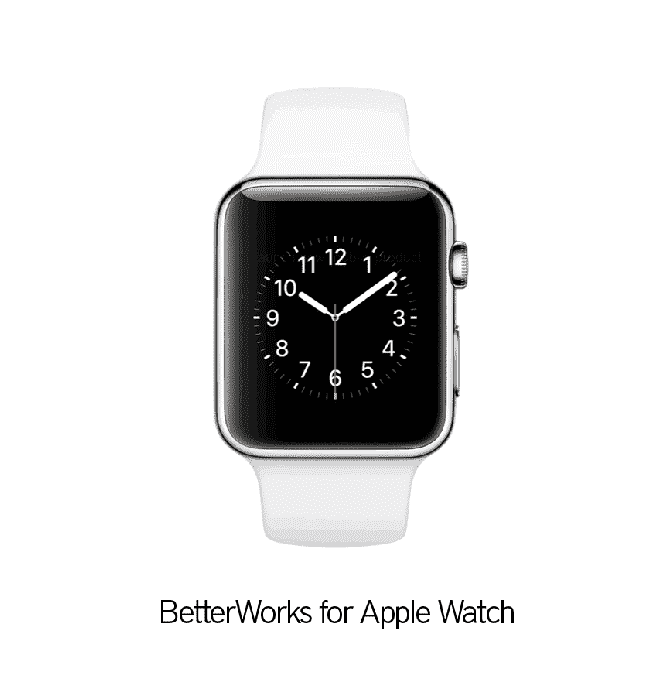

EasilyDo :一个包含有用通知的组织者应用

[Launch Center Pro](https://itunes.apple.com/us/app/launch-center-pro/id532016360?mt=8) :让您创建多步任务，然后通过触摸启动它们。

[邮箱](https://itunes.apple.com/us/app/mailbox/id576502633?mt=8):简单、可滑动的电子邮件分类应用即将登陆 Apple Watch。

[Todoist](https://itunes.apple.com/us/app/todoist-to-do-list-task-list/id572688855?mt=8) :待办事项应用程序，可以让你检查你的待办事项，并使用麦克风分配任务的截止日期。

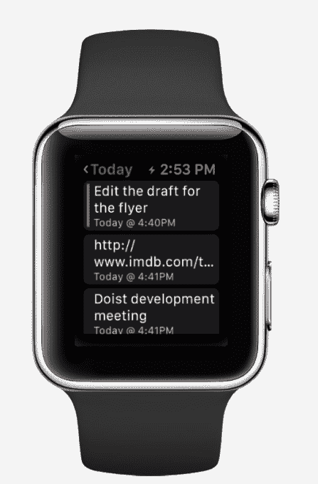

Jiffies :一个事件时钟应用程序，以 24 小时循环周期的圆形片段显示你所有即将发生的事件。

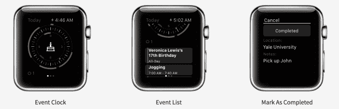

[Braintoss](https://itunes.apple.com/nl/app/braintoss/id576226036?l=en&mt=8) :这款应用可以让你使用 Apple Watch 将提醒和任务放入你的电子邮件收件箱。说出你想记住的内容，点击应用程序中的电子邮件地址，Braintoss 就会将这个想法发送到你的电子邮件中，这样你就不会忘记了。

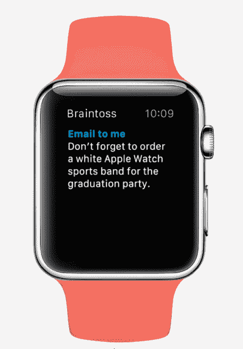

[Glimpse](http://app-enzeller.com/apps/glimpse/watch/) : Glimpse 可以让你定义网页的一小部分，保存到你的 Apple Watch 上。当你启动 Glimpse 时，它会更新网页的这一部分，只为你提供实时状态，而不必来回滚动。这是在手表的小屏幕上使用网络浏览器的一种替代方式。

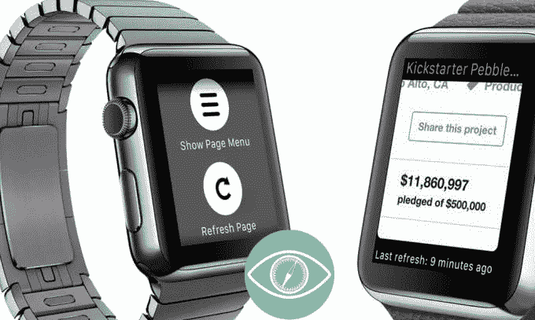

[TL；DR Email](http://gotldr.com/) :专为 iPhone 和 Apple Watch 打造的快速电子邮件体验，专注于快速阅读、处理和创建电子邮件。这个想法是利用手表的动态通知，为 Apple Watch 创造一种不同类型的电子邮件阅读体验。这意味着每一个到达手表的通知都可以根据其内容进行调整，以呈现不同的外观。

[YouTube https://www.youtube.com/watch?v=24Knfz7hMMI]

Evernote :这款笔记应用可以让你在手表上快速记录笔记，查看最近的笔记，设置提醒，查找你附近的笔记，以及查看与即将召开的会议相关的内容。

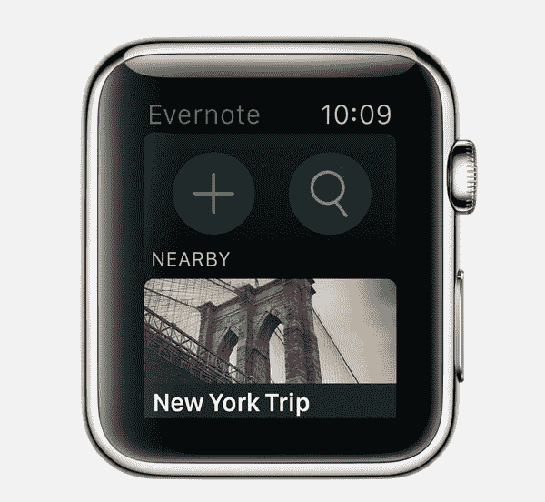

[24me](http://www.twentyfour.me/) :随身携带各种通知的个人助理:从账单支付提醒到基于交通状况的会议出发时间、会议提醒、朋友生日、日程安排等等。

Slated:Slated translation keyboard 的配套应用，这个应用是一种可定制的短语手册和通用翻译器。你说了什么，它会用你选择的语言说出来。

[sales force](http://www.salesforce.com/):Apple Watch 应用程序可以让你快速了解你的商业分析，比如你的公司或特定部门的前 10 大销售机会。

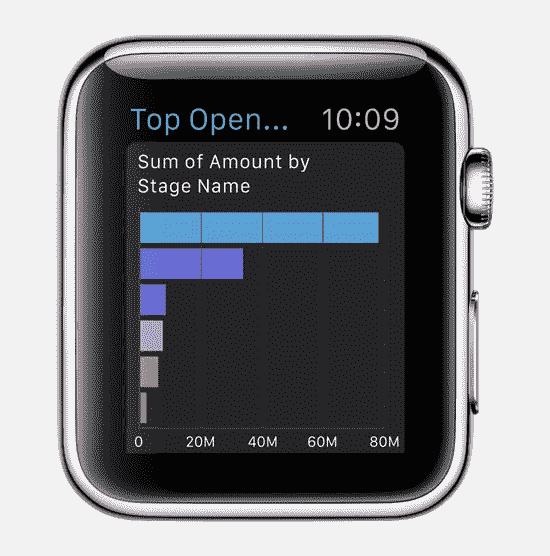

该公司之前为 iOS 开发了一款专注于设计的日历和任务管理应用，被苹果选为编辑的首选。新应用将带来类似的体验，但专为 Apple Watch 设计。

[工作流程](//itunes.apple.com/us/app/workflow-powerful-automation/id915249334?mt=8):功能强大的任务自动化 app 将在 Apple Watch 上提供。

[事情](//itunes.apple.com/us/app/things/id284971781?mt=8&at=11lPBU&ct=wlw):现在流行的任务管理和待办事项 app 要来 Apple Watch 了。

[Omnifocus](//itunes.apple.com/us/app/omnifocus-2-for-ipad/id904071710?mt=8) :另一款流行的 iOS 任务管理应用即将登陆 Apple Watch。

Trello :这个灵活的工具可以让你组织任何事情，从待办事项到清单等等。

## 金融

PortfolioWatch :这款应用可以让你监控自己的股票投资组合。一眼就能看到当天的总利润(或亏损)。您还可以深入查看单个股票的表现，管理您的持股以及查看图表。

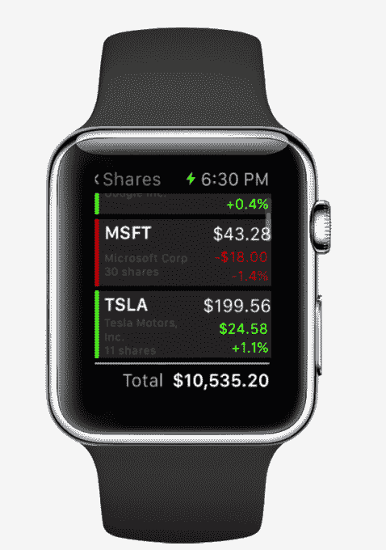

[未支出](http://unspentapp.com/):帮助你追踪你的支出，为不同的支出类别设置预算。

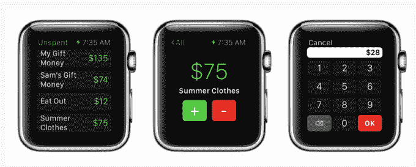

[Mint](https://itunes.apple.com/us/app/mint-money-manager-budget/id300238550?mt=8) :从你的 Apple Watch 上查看你的每月支出目标，并追踪你实现这些目标的进度。

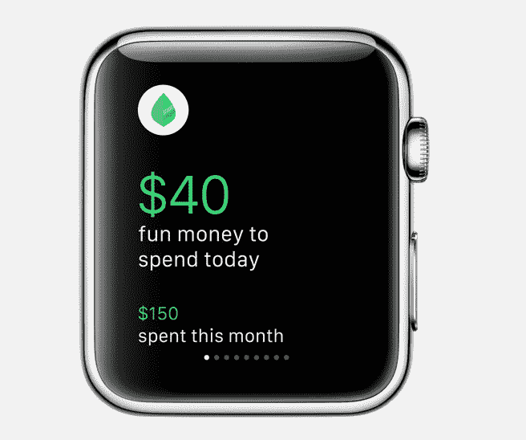

[花旗手机](https://itunes.apple.com/us/app/citi-mobile/id301724680?mt=8):查看你的支票、储蓄和信用卡余额，以及你最近的五笔交易。接收付款到期日的通知。

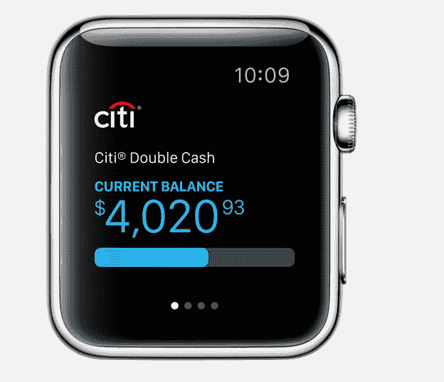

## 旅行/导航

[优步](//itunes.apple.com/us/app/uber/id368677368?mt=8&uo=8&at=11lPBU):一款苹果手表应用让你[从你的手腕上连接优步的按需用车服务](https://beta.techcrunch.com/2015/03/09/what-its-like-to-order-an-uber-from-your-apple-watch/)。这款应用可以让你打电话叫一辆优步，然后追踪它到达的时间。

[gallery ids="1129692，1129464，1129469，1129468，1129466，1129465"]

美国航空公司(American Airlines):这款美国航空公司的 Apple Watch 应用程序可以让你办理登机手续，查看航班是否准时，以及你的登机口还有多远。您还可以收到通知，提醒您什么时候该去机场，并且在飞行过程中，您可以查看剩余时间的地图。该应用程序还会告诉你行李认领终端的位置以及连接细节。

[gallery ids="1129624，1129625，1129626，1129627，1129628，1128905"]
[Citymapper](https://itunes.apple.com/gb/app/citymapper-ultimate-real-time/id469463298?mt=8) :该应用程序使用实时路线和时间表数据来显示您的巴士或火车何时到达。一个方便的功能是，当你快到站时，它会轻点你的手腕，这样你就不会错过了。

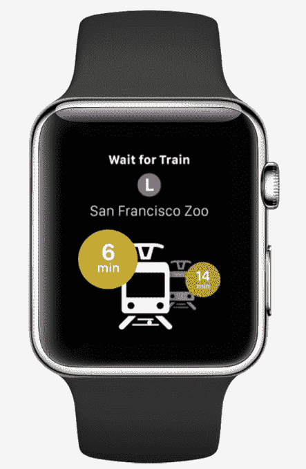

喜达屋 SPG :一款在喜达屋酒店&度假村全球范围内使用的应用。有了这个应用程序，客人可以查看他们的预订详情，获得他们的酒店的方向，查看星点余额等。但最酷的功能来自 SPG 的无钥匙技术，它可以让你登记入住和打开酒店房间的门——一切都从他们的手腕开始。

[gallery ids="1129615，1129613，1129612，1129611"]

RWY 围棋:一款为飞行员设计的苹果手表应用。该应用程序显示世界上每一个附近的机场，以及你的相对方位、距离和方位。

[YouTube https://www . YouTube . com/watch？v=h9pCUt1t3jE]

Expedia :这款应用可以让你查看即将到来的旅行路线，并获得详细的航班和酒店信息。这包括航班的登机口、航站楼、时间和座位分配，以及酒店的入住和退房时间、评级、位置、地址和电话号码。

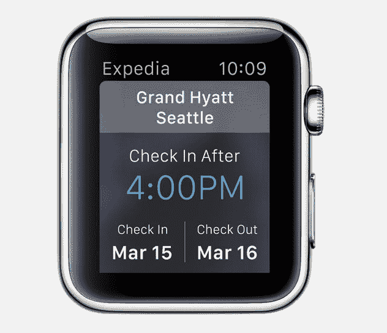

[ETA](http://madebyeastwood.com/eta) :在你的 App 上快速查看你最想去的地方的开车时间。Apple Watch 的应用程序还概述了路线上的交通状况，无论是好的、缓慢的还是非常糟糕的。开车时，这款应用会告诉你离目的地还有多远。

[毒地图](http://www.poison-maps.com/):从你的 Apple Watch 上找到最近的兴趣点，并存储起来，即使离线也可以访问。

[猫途鹰](https://itunes.apple.com/us/app/tripadvisor-hotels-flights/id284876795?mt=8):从你的 Apple Watch 上找到要做的事情，包括餐馆、景点和其他旅游目的地。

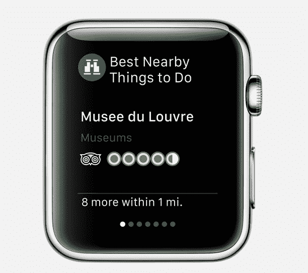

## 购物和餐饮

[Retale](http://www.retale.com/) :广受欢迎的基于位置的购物和储蓄应用，拥有超过 300 万用户，[将在发布后登陆 Apple Watch](http://www.retale.com/corporate/retale-to-launch-app-for-apple-watch/) 。Retale Apple Watch 包括一个“商店搜索器”，零售商广告和交易服务于用户的手腕，并允许用户在各种设备之间同步偏好、收藏夹、列表和操作。Retale 的 Apple Watch 应用程序还将引入新功能，帮助用户跟踪当地的商品和最佳交易，包括附近的零售商选项和地图路线。

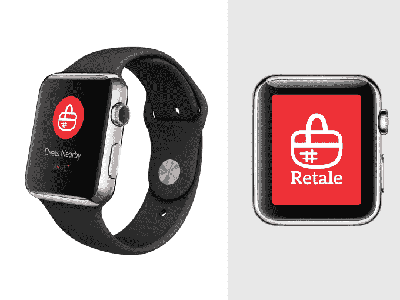

每日面包(Daily Bread):一个杂货清单应用程序，它会跟踪你最常购买的物品，并在它认为你不够时提醒你去拿。

[递送](https://itunes.apple.com/us/app/deliveries-a-package-tracker/id290986013?mt=8):这个包裹追踪应用程序可以让你知道你运送的物品什么时候会被送到。

[Fetch](https://itunes.apple.com/us/app/fetch-personal-buying-assistant/id867636554?mt=8):Apple Watch 的个人购买助手。你只需点击表盘，说出你想买的任何东西，然后一名(人类)购买助理就会去寻找最佳价格，并为你下单。Fetch 还支持任何按需服务——因此你可以使用手表来订购食品交付(DoorDash 等)、干洗取件(Washio)、杂货交付(Postmates、Wunwun、Instacart 等)。它也适用于旅行，所以你只需点击手表表面，然后说你需要乘坐下一班飞机去洛杉矶国际机场，或者你希望你的酒店预订延长一天。

[变色龙](http://www.chameleonapp.co/):有了这款应用，你的 Apple Watch 会知道你所在的商店最省钱的交易和优惠券。当你走进我们支持的任何一家零售商时，变色龙都能识别出来，并为该地点提供所有的促销活动。许多优惠券甚至可以从你的手腕上兑换，帮助购物者以最小的努力节省大量的钱。

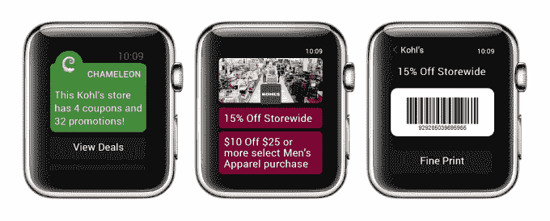

[目标](https://itunes.apple.com/us/app/target/id297430070?mt=8):由于使用了 iBeacons，零售商的移动应用程序将知道你在商店的哪个位置。这使得它能够智能地为你排序购物清单，引导你找到下一件商品。当你靠近列表上的某样东西时，你也会收到提醒提醒。

[gallery ids="1129621，1129622"]

[OpenTable](https://itunes.apple.com/us/app/opentable-restaurants-reservations/id296581815?mt=8) :查看您即将预订的详细信息，并通过地图找到去餐厅的路。

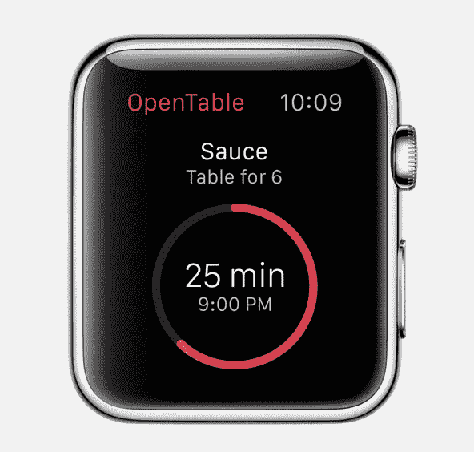

[易贝](https://itunes.apple.com/us/app/ebay/id282614216?mt=8):追踪你正在出价或观看的物品，接收出价高于他人的通知，等等。

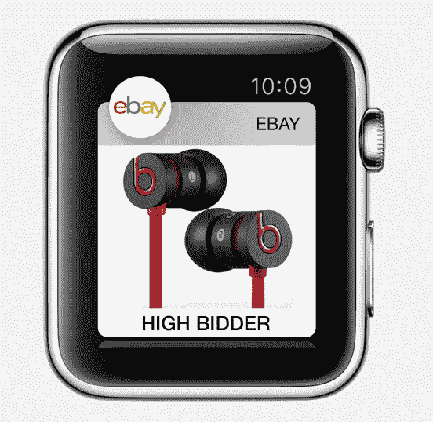

## 新闻/博客

CNN :用户将获得 12 个个性化类别的突发新闻，包括头条新闻、健康、娱乐、政治等等。你点击打开一个故事，并可以选择保存它或继续阅读你的 iPhone。你也可以在你的 iPhone 上启动 CNN 电视直播，就在你的手腕上。

[gallery ids="1129706，1129607"]

雅虎新闻摘要(Yahoo News Digest):与 iPhone 的 iOS 版类似，Apple Watch 应用每天会通知你两次世界各地的头条新闻。

[Gem News](http://www.gem.is/) :该应用程序允许人们以一种智能的方式在智能手表上访问信息，如新闻和博客。该公司的重点是为 Apple Watch 带来“真实”信息，如新闻和博客，同时充分利用 Apple Watch 的独特功能。这款应用使用 Apple Watch 独特的扫视功能，让新闻和博客“一目了然”。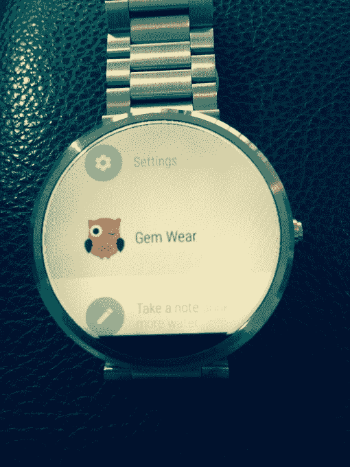

[NPR 一号](https://itunes.apple.com/us/app/npr-one/id874498884?mt=8):使用你的 Apple Watch 通过听写来搜索特定的节目，查看故事名称和剧集，并控制 iPhone 上播放列表的基本播放功能。

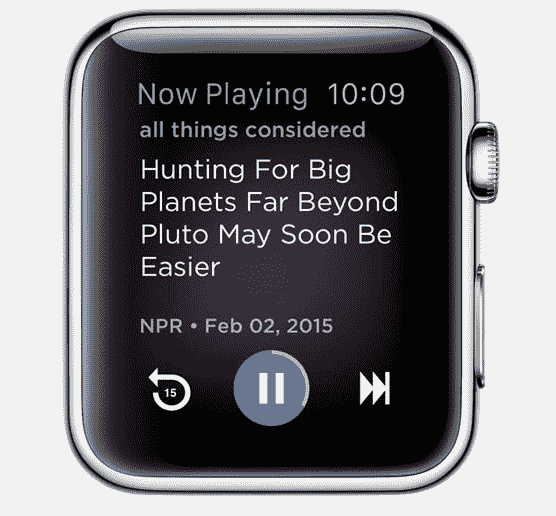

纽约时报(NYTimes):查看头条新闻，接收突发新闻，浏览新闻。

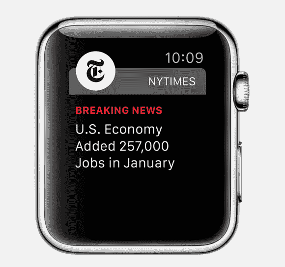

[FeedWrangler](https://feedwrangler.net/welcome.html) :一个 RSS 阅读器，可以让你浏览标题，将项目标记为已读，保存项目供以后阅读，甚至可以在应用程序中阅读整篇文章。

## 社会的

脸书:从你的手腕上获取新闻、状态和照片。

[gallery ids="1128911，1129428"]
[Instagram](https://itunes.apple.com/us/app/instagram/id389801252?mt=8) :查看和喜欢照片；对您的订阅源发表评论

[gallery ids="1129454，1129455，1129457，1129459，1129644，1129645"]

Pinterest :查看苹果手表的通知。

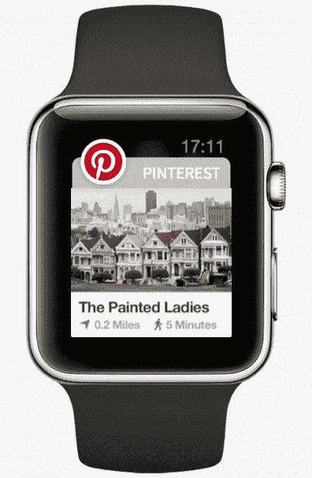

[Twitter](https://itunes.apple.com/us/app/twitter/id333903271?mt=8) :发推，查看你的 feed，回复推；查看趋势

[gallery ids="1129432，1128914"]
[微信](https://itunes.apple.com/us/app/wechat/id414478124?mt=8):来自 Apple Watch 的消息。

[gallery ids="1129439，1129441，1129442，1129443，1129444"]

[Match.com](//itunes.apple.com/us/app/match-dating-app-to-flirt/id305939712?mt=8):Match 的手机调情应用即将登陆 Apple Watch。

[Primary](http://thinktapwork.com/primary/) :让你从 Apple Watch 上浏览你的 Instagram feed。你可以“喜欢”照片或隐藏不想再看到的照片。您也可以关闭最小视图的标题。

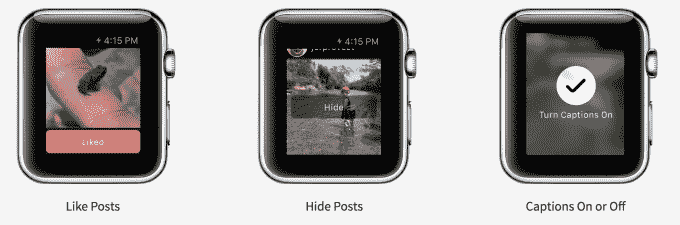

Waldo :根据您的位置和活动，自动向您的朋友和家人发送状态更新。由于状态更新是自动的，Waldo 允许你快速查看每个朋友的“卡片”,了解他们在哪里，他们在做什么——所有这些都可以从你的手腕上完成。

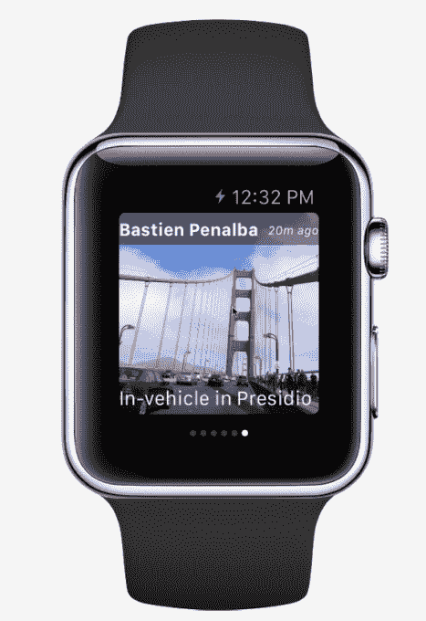

[伙计](http://watchaware.com/watch-apps/dude-context-aware-messaging):苹果手表上的情境感知信息。从附近地点列表中选择您的当前位置，并选择一个联系人或选择将其发布到推特上。该应用程序创建了一个基于一天中的时间&当前位置的上下文感知句子。

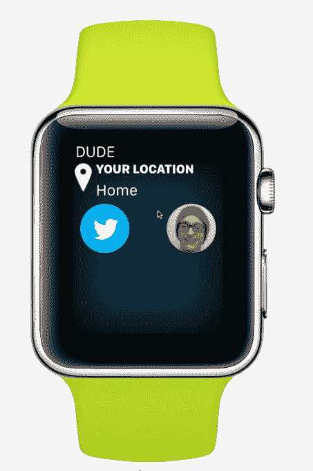

你可以用 Yo 或者你的位置或者照片来联系你的朋友。您还可以订阅 yostore.co 的项目，以便从 BuzzFeed、NBA、USA Today 等来源接收链接和照片。

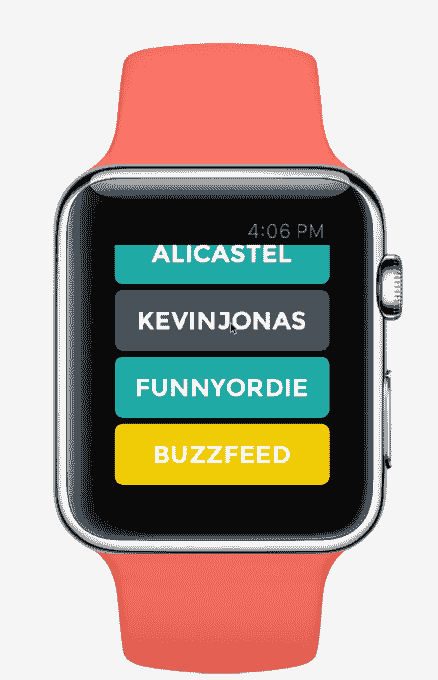

[Zello](http://www.zello.com) :将你的手表变成一个 Dick Tracy communicator，带有一键通话对讲机功能，让你可以使用 iPhone 或蓝牙耳机上的扬声器/麦克风与你的联系人实时聊天。

[gallery ids="1129757，1129758，1129760"]

Infinitweet :这款应用可以将任意大小的推文转换成图片，绕过了 Twitter 140 个字符的限制。主要的输入方法是语音。

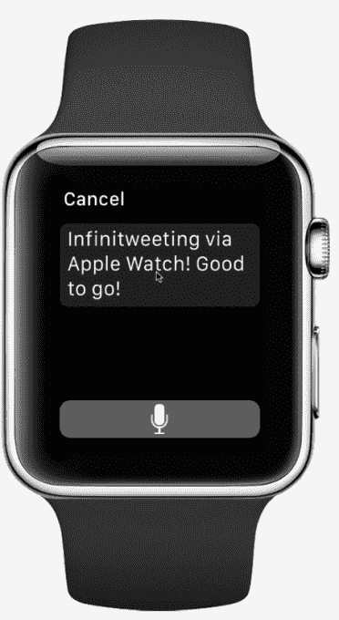

Pinner 是流行的社交书签网站 Pinboard 的全功能应用。用户可以通过手腕浏览、编辑、阅读和共享书签。最令人兴奋的功能是快速访问热门和最近的书签，并使用语音搜索标签。

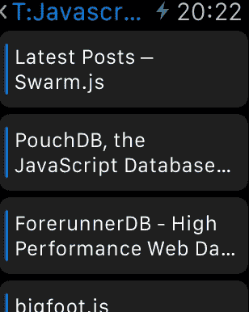

[Pop](http://hellopop.co/) :之前在 iOS 上推出的一款简单的视频短信应用将它的一些功能带到了 Apple Watch 上。这款手表没有摄像头，也没有视频播放功能。但是这款应用会在你收到信息时显示 GIF 图片，这是一个聪明的变通方法。

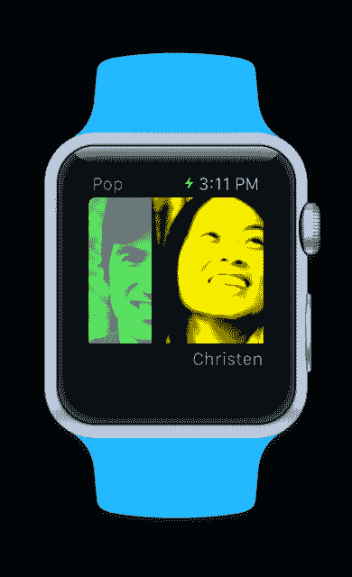

[Looksee](https://itunes.apple.com/us/app/looksee/id888457090?mt=8) :一张新照片，让你通过使用顶级 Instagrammers 创建的“looks”进行联系和协作。一个社区是围绕每一个独特的外观建立的，你可以将你的照片直接分享到 Instagram、Twitter、脸书等网站。滚动浏览您的 Looksee 手表订阅源以查看照片预览。轻按以查看全尺寸图像、位置、个人资料照片和使用的过滤器外观。长按喜欢照片。

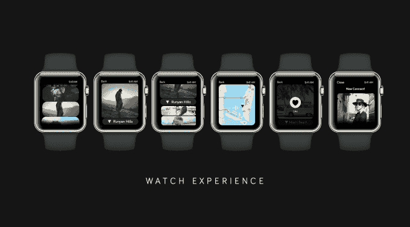

这款消息应用的用户将能够收到新消息的通知，并预览发送给他们的视频消息。他们还将能够对这些通知采取行动，并使用预定义的短信快速回复，而不必拿出他们的 iPhone。用户还可以查看他们收到的最后几条消息，并在 iPhone 上打开 Glide 直接进入该聊天，以记录他们的视频消息回复。

[YouTube https://www.youtube.com/watch?v=j5ZB_d_thuo&w=854&h=510]

## 健康与健身

[健身黑桃](https://beta.techcrunch.com/2015/02/19/pop-launches-an-app-that-makes-video-chat-as-easy-as-sms/):让你的锻炼多样化(这个想法不是做同样的锻炼程序，而是让用户抽卡来决定锻炼内容)

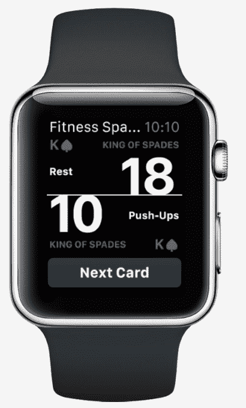
[Nike+ Running](https://itunes.apple.com/us/app/nike+-running/id387771637?mt=8) :这款跑步应用可以让你通过 Apple Watch 追踪你的距离、持续时间和配速。朋友们也可以为你加油，而且，使用蓝牙耳机，你可以在锻炼过程中无线听音乐。

[gallery ids="1129635，1129636，1129637，1129638，1129639，1129640"]

[Run 5K](http://radianttap.com/run-5k/) :一款“沙发到 5K”的健身 app，Run 5K 是一款语音指导的训练 app，帮助新手跑步。这个应用程序会告诉你什么时候慢跑，什么时候散步，什么时候休息。

[斜坡](http://getslopes.com/apple-watch.html):使用 GPS 追踪你的滑雪和单板滑雪速度以及其他数据。
Stepwise:计步器，卡路里和体重健身追踪器。逐步显示您的步数、行走距离以及相对于您的每日目标的成功百分比，并使用可视化进度指示器进行浏览。

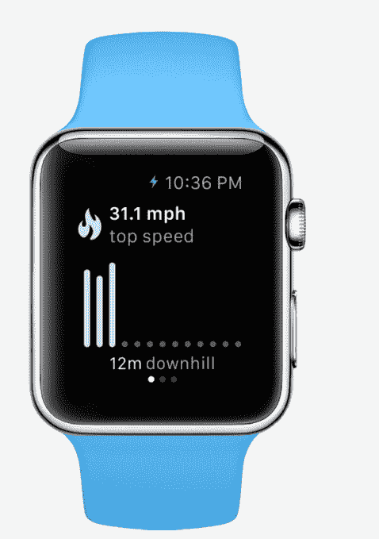

[截止日期](http://www.whatisyourdeadline.com/):这个应用程序使用你的健康数据和调查问卷，来估计你的寿命。提醒你生命短暂，你会看到你的死亡倒计时。

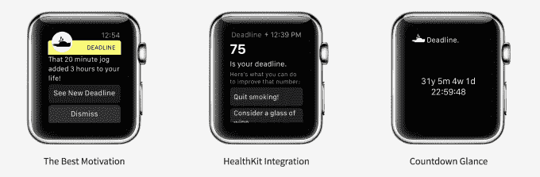

[Runtastic](https://itunes.apple.com/us/app/runtastic-gps-running-walking/id336599882?mt=8) :这个跑步应用程序显示你的速度、距离、持续时间、配速，以及你在手腕上燃烧了多少卡路里。

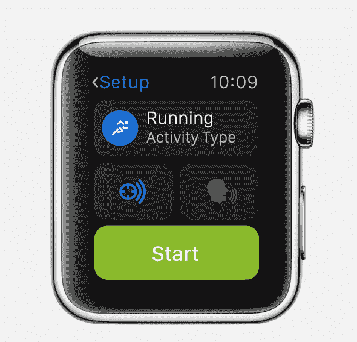

[Strava](https://itunes.apple.com/us/app/strava-running-cycling-gps/id426826309?mt=8) :查看骑行或跑步过程中的实时数据，如海拔增益、平均速度、距离和心率。

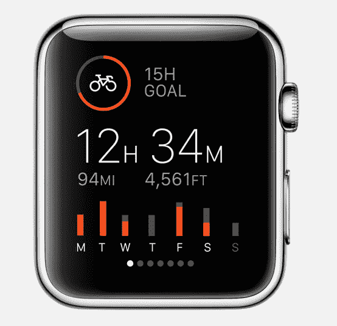

## 音乐和娱乐

[Highnote](http://www.openplanetsoftware.com/highnote/) :这款应用专为音乐家和舞者设计，让你在演奏时调整音乐库中曲目的速度和调。

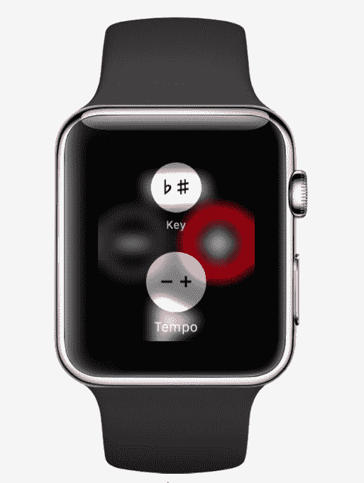

[Fandango](https://itunes.apple.com/us/app/fandango-movies-times-tickets/id307906541?mt=8) :在该服务上购买门票后，Apple Watch 应用程序会显示演出时间、影院位置和一张可以扫描的移动条形码门票，以便轻松进入观众席。

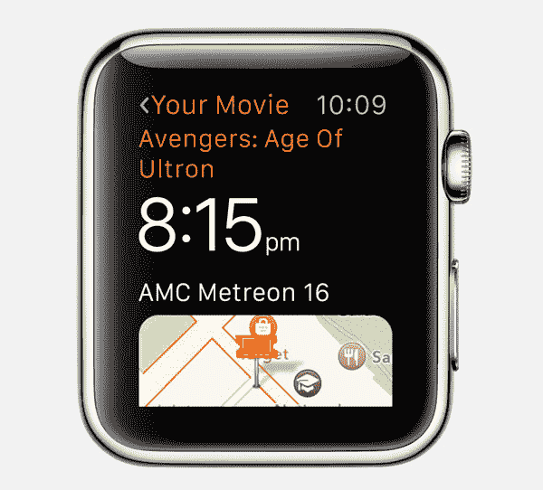

[Pacemaker DJ](https://itunes.apple.com/us/app/pacemaker-dj/id593873080?mt=8) :这款应用程序使用了 iPad 应用程序的自动驾驶 DJ 功能，可以快速混合你选择的曲目，因此一切都可以无缝融合。

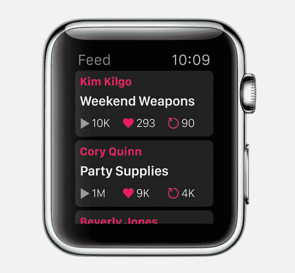

[Shazam](https://itunes.apple.com/us/app/shazam/id284993459?mt=8) :点击应用图标会提示你的 iPhone 去听正在播放的音乐。Apple Watch 随后会显示歌曲名称、艺术家和歌词。

[gallery ids="1129695，1129482，1129486，1129485，1129484，1129483"]

## 运动

ESPN:这款应用可以让你获得与体育相关的通知，比如你最喜欢的球队的比分。

[击球手 MLB.com](https://itunes.apple.com/us/app/mlb.com-at-bat/id493619333?mt=8):这款应用可以让你查看赛程，接收现场更新，包括每场比赛的更新，以及查看你最喜欢的球队的统计数据。你也可以查看联盟中球员的详细信息、亮点和得分。

[gallery ids="1129661，1129672，1129671"]

## 汽车

[BMW i Remote](https://itunes.apple.com/us/app/bmw-i-remote-north-america/id849188616?mt=8) :专为 BMW i 设计，这款应用会检查你的电动 BMW i 的充电状态，并在汽车充满电时收到通知。您还可以检查范围、门锁状态、服务提醒等，并通过手腕调节客舱温度。

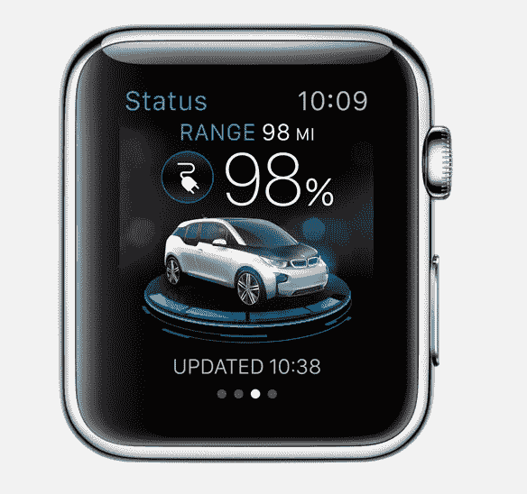

[现代 Blue Link](https://itunes.apple.com/us/app/hyundai-blue-link/id893514610?mt=8) :这个应用程序连接到你装备了 Blue Link 的现代汽车。

## 智能家居/家庭自动化

霍尼韦尔(Honeywell):这款应用将从你的 Apple Watch 上控制你的霍尼韦尔家庭系统。像“我不在”或“我要睡觉了”这样的预设让你的恒温器更有效率。你也可以切换到“出城”模式，以节省能源。

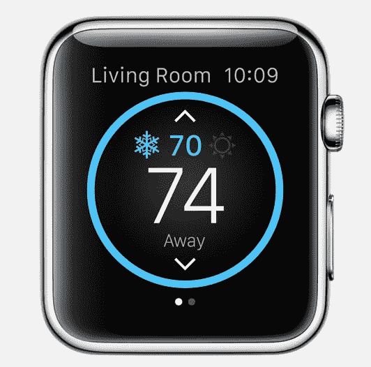

Lutron :这款应用可以让你控制家里的灯光、灯罩、温度和其他东西。

[OnSwitch](http://www.getonswitch.com/) :从你的 Apple Watch 上控制飞利浦 Hue 和 LIFX 智能灯泡。

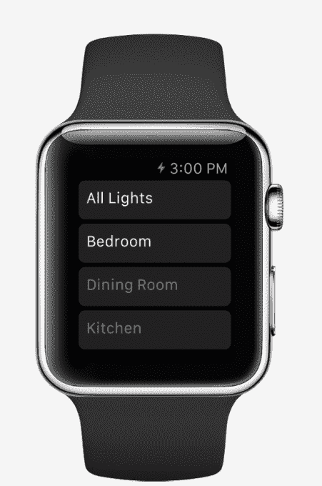

## 混杂的

[color drop](http://getcolordrop.com/):color drop 手表应用程序可以用来在更近的层面上比较颜色，并快速获得颜色代码和 RGB 值等信息。Colordrop 可以成为帮助选择、比较和了解颜色的有用工具。平面设计师可以使用 Colordrop 创建配色方案，而室内设计师可以为他们的工作创建调色板和配色方案。

StaySafe:这款紧急按钮应用将类似于该公司的 iOS 版本，但也将利用手表版本的心跳监视器。该应用程序将包括启动和停止跟踪会话的能力，延长会话，查看会话的剩余时间，并谨慎地触发紧急按钮警报。

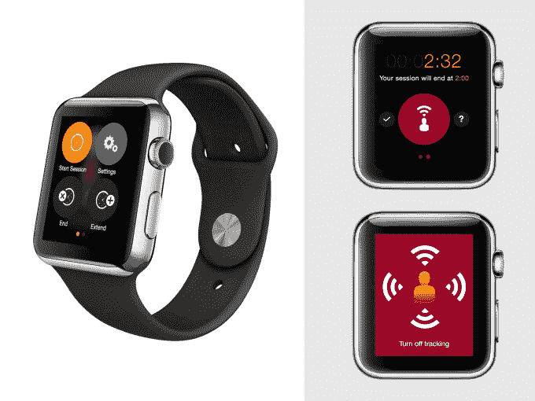

[贪吃蛇](http://www.snake.watch):因为没有这个经典的小屏幕游戏，手表就不完整。(还没有链接，但是正在建！)

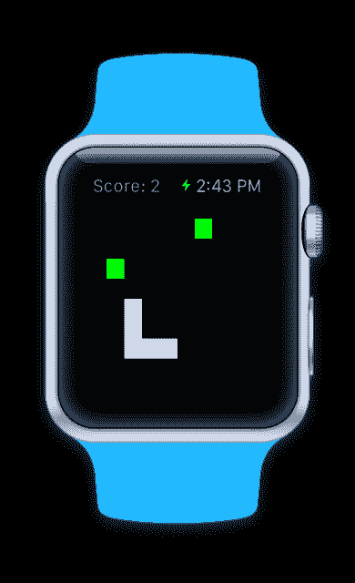

[T2】](https://beta.techcrunch.com/tag/watchlaunch/)