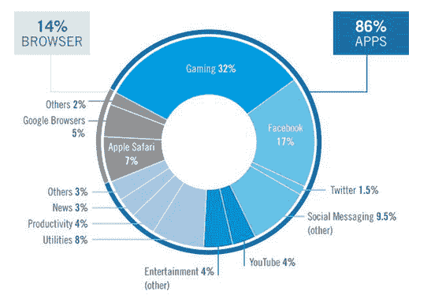

# 脸书、谷歌和时间经济学——大西洋

> 原文：<https://www.theatlantic.com/business/archive/2015/03/facebook-google-and-the-economics-of-time/387877/?utm_source=wanqu.co&utm_campaign=Wanqu+Daily&utm_medium=website>

2011 年，谷歌首席经济学家哈尔·瓦里安(Hal Varian)希望研究谷歌搜索节省的数百万小时。他的团队提出了一些问题，比如，使用黄油或人造黄油会影响烘烤饼干的大小吗？并比较了谷歌搜索结果和在食谱中离线搜索答案所花费的时间。

瓦里安的结论是，典型的谷歌问题节省了 15 分钟。(在这些问题上，你可以怀疑是否信任谷歌，但瓦里安是一位广受尊敬的经济学家，在这个问题上，我没有更好的数据，所以就顺其自然吧。埃里克·布林约尔松和安德鲁·迈克菲在他们的书《第二个机器时代》中写道:“当你把普通美国人使用美国人平均时薪进行的所有查询的时间差相乘，得出的结果是每个成年工人每年大约 500 美元。”。

2011 年，移动广告市场利润微薄。今天，这是一个 70 亿美元的产业，移动设备现在控制着

[20 percent of our attention](https://www.theatlantic.com/business/archive/2014/05/mobile-is-eating-the-worlds-attention-11-amazing-graphs-on-the-state-of-the-internet/371727/)

比广播和报纸加起来还多。谷歌利用其节省时间的漏斗底部优势，遥遥领先地成为移动广告领域最富有的公司。现在，它控制了 37%的小屏幕广告市场，这一领先地位随着该公司在搜索广告领域的统治地位而得到巩固。如果你去掉搜索，只专注于展示广告(横幅和视频，但不包括搜索)，那么脸书控制了超过三分之一的市场。这是谷歌份额的三倍，推特的五倍，苹果或潘多拉的七倍。

脸书也是消费者剩余的引擎，但是它通过货币化花费的时间而不是 T2 节省的时间来赚取巨额收入。一项对苹果和安卓移动设备上登录时间的全面统计发现，除去游戏和浏览器，脸书占据了我们在移动设备上大约三分之一的时间。更具垄断性的是，如今下载量最大的四个非游戏应用——Facebook Messenger、脸书、WhatsApp 和 insta gram——分别是由脸书创建的脸书，或被脸书收购。

* * *

**<big>人们如何在 iOS 和 Android 设备上打发时间？</big>T3】**

<picture></picture>

[MondayNote](http://www.mondaynote.com/2015/03/15/news-media-should-drop-native-apps/?utm_source=feedburner&utm_medium=feed&utm_campaign=Feed:+monday-note+(Monday+Note) | Data: Flurry Analytics, Comscore, NetMarketShare

* * *

由此可以得出一个简单的结论:脸书是移动的，移动是脸书，我们关注的未来属于马克·扎克伯格，晚安，好运。这不会是一个完全疯狂的结论。

但这一预测是基于时间货币化的理论，即更多的时间对所有媒体公司来说总是更有价值。这不一定是真的。移动领域最富有的公司谷歌，在不到一半的时间里，在移动广告上赚的钱是脸书的两倍多。这表明，移动创新仍有相当大的空间，即使是在媒体领域，这些创新旨在节省时间，而不是耗费时间——无论是找到最快的解释，最合适的建议，还是

[the best thing written on the Internet, in just a few seconds](http://this.cm)

。

你可能会说我在做错误的比较，因为脸书是一家媒体公司，而谷歌是一家搜索公司，前一类是

*all about*

吸收后一类节省的时间。但这种二分法具有误导性。毕竟，

[millions of people](https://www.google.com/url?sa=t&rct=j&q=&esrc=s&source=web&cd=1&ved=0CB4QFjAA&url=http%3A%2F%2Fwww.huffingtonpost.com%2F2014%2F07%2F17%2Ffacebook-study_n_5595890.html&ei=ZfsGVebeD_HnsATDtoHIAQ&usg=AFQjCNEA4fAnF_xYHyNBTdou3w1dmBc5sQ&sig2=2rv3DBscEMPhgc_mSlUrOw&bvm=bv.88198703,d.ZWU)

已经觉得他们在脸书身上花了太多时间。他们看着手机，寻找消遣或灵感，并被卷入一个让他们后悔自己拖延的漩涡。从短期来看，数十亿人将自我厌恶的停工期涌入脸书，对脸书来说是好事。但是它

[fears of the longer run](https://medium.com/backchannel/revealed-facebooks-project-to-find-out-what-people-really-want-in-their-news-feed-799dbfb2e8b1)

这促使该公司对其用户进行调查，以确定他们是否真的珍惜他们为新闻订阅贡献的时间。

当媒体公司寻找一个“上帝标准”向广告商炫耀时，他们中的许多人都在关注*参与时间。这是有充分理由的。人们花在一篇文章页面上的时间比原始的页面浏览量和投票数更能说明读者的集中注意力。但是时间是一场战争，脸书正在取得胜利。随着新闻提要证明自己是吸引注意力的最巧妙的引擎，也许竞争对手应该改变论点。即使拥有世界上所有的时间，我们中的大多数人仍然想节省一些。*

