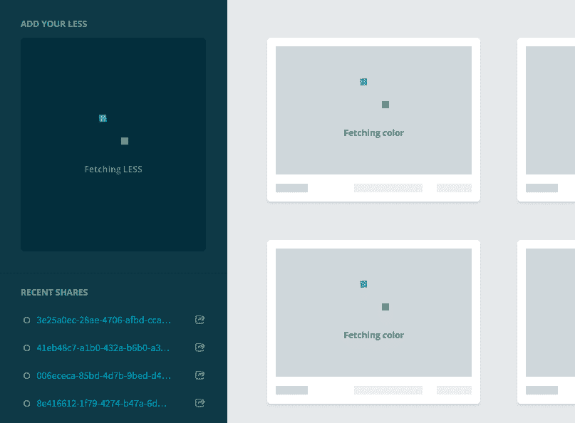
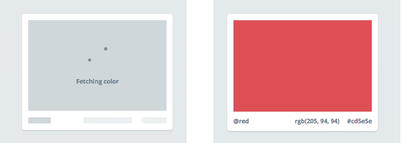
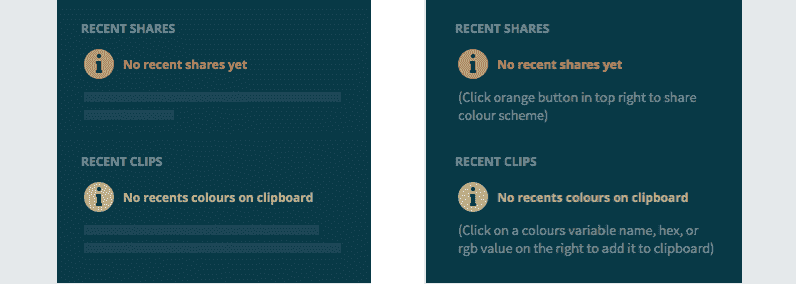

# 带有界面预览的非阻塞用户界面

> 原文：<http://www.callumhart.com/blog/non-blocking-uis-with-interface-previews?utm_source=wanqu.co&utm_campaign=Wanqu+Daily&utm_medium=website>

## 它们是什么 [#](#what-are-they)

我喜欢把非阻塞接口想象成在冰上滑冰，把阻塞接口想象成在泥泞中跋涉。无论网络速度如何，非阻塞界面都应该感觉快速、反应灵敏和连续。任何动作，比如加载一个新页面或者点击一个按钮，都应该有一个即时的反应，而不应该被搁置。

我称之为“界面预览”的一种技术，在设计非阻塞界面时非常有效。页面布局和占位符元素会在等待数据填充时立即呈现。这些占位符元素在某种程度上充当代理，尽管用图片来说明可能更好。

这张截图是脸书的网站首次加载时拍摄的。在这一点上，我们仍然在等待数据被发送下来，但我们可以看到页面布局和一些关键元素，如图像和文本将在哪里。将会是这里的关键部分，因为界面向我们展示了它在未来某个时刻的样子。

## 为什么他们好 [#](#why-they-are-good)

界面预览/框架屏幕产生了奇妙的用户体验。用户可以利用平时看白屏或 AJAX 微调器的时间来熟悉你的应用程序的布局。

更重要的是，用户可以开始使用你的网站中不依赖于服务器的部分。例如，在 [EffortLESS](http://EffortLESS.herokuapp.com/65e5f829-a015-46bd-93b7-36ff87f67cfa_18) 中，最近共享的链接存储在本地存储器中，因此可以直接显示给用户。用户可以立即点击其中一个链接；这意味着他们不会被迫等待整个页面加载后再离开。

非阻塞界面也增加了感知速度，即用户认为你的应用程序有多快，而不是它在纸上有多快。用户不关心终端中的性能统计，他们关心的是他们眼前看到的东西；这是你花了很长时间完善的界面。

## 你使用它们的程度 [#](#the-degree-to-which-you-use-them)

用户在一瞬间看到界面预览，在理想的世界里根本看不到。你花在上面的时间取决于时间限制、用例以及项目的性质。我将界面预览的实现程度分为三个等级:基本型、有抱负型和完美主义者。

### 裸露的骨骼 [#](#bare-bones)

影响最大的最少工作是显示页面布局和与服务器分离的元素。尽管被称为“裸机”,但这是非常有效的，因为它消除了白屏/ ajax 微调方法，对于大多数情况来说已经足够了。

### 有志 [#](#aspiring)

更细粒度的方法是显示占位符元素和文本。在 EffortLESS 中，每种颜色的框、共享按钮和帮助文本都有占位符状态，如下图所示。

### 完美主义者 [#](#perfectionist)

对于那些从不相信工作已经完成的人来说，有一种完美主义的方法。这些类型的细节是非常具体的，并且会因应用程序而异。

在 EffortLESS 中，我为共享按钮添加了占位符文本元素，并为最近的共享/剪辑添加了帮助文本。尽管不依赖于服务器，但在数据到达之前，文本没有意义。如果要共享的数据还在路上，你就不能共享任何东西，同样，如果剪贴板上没有颜色，你也不能添加颜色。

## 实施和一般建议 [#](#implementation-and-general-advice)

界面预览的本质意味着它们有一些先决条件。客户端渲染与框架，如骨干，角或反应是必须的。使用传统的服务器驱动方法很难实现。你的客户端 mv..无论什么都需要与服务器进行异步通信。承诺在这里起了拯救作用，因为它们可以在解决后更新视图(我是图书馆 q 的忠实粉丝)。更新:我已经建立了一个名为 [Preact](https://github.com/callum-hart/Preact) 的库，为 react 组件添加了界面预览。

除了架构和工具之外，我还发现了一些处理界面预览的便捷技术，同时构建起来毫不费力。

首先将占位符元素从它们所覆盖的真实元素中分离出来。通过分离，我的意思是有 2 个模板；一个用于占位符元素，另一个用于真实元素(当数据到达时显示)。最初，我使用了一个元素，并根据它是否处于预览状态来切换它的类。尽管这种方法可行，但也有一些缺点:

*   元素的结构通常因其两种状态而不同。因此，您实际上拥有一个包含两组标记的模板，这些标记是有条件地显示/隐藏的。
*   结果，视图逻辑变得有点复杂。
*   使用一个元素保存的任何标记都会丢失，因为需要额外的标记来禁用用户与占位符元素的任何交互。用户不应该能够点击或聚焦占位符按钮或表单输入，悬停状态需要被删除，因为它们具有误导性。

我毫不费力地遇到的另一个问题是知道应该显示多少种占位符颜色。如果有十个占位符，只有六种颜色到达，看起来会很垃圾。事实上，它看起来是破的，就好像四个在路上丢失了一样。占位符颜色只在共享的 url 中需要，所以在创建 URL 时给它加上颜色的数量就可以了。当 url 被访问时，在数据到达之前，我们就可以计算出要在客户端呈现多少占位符颜色(使用 substring)。

在我的工具箱中，网络链接调节器已经成为无价之宝。它允许你在不同的网速下测试你的设计，并且模拟缓慢的响应时间比在你的代码中加入一些超时要好得多。这是一个很好的入门指南。观察你的应用程序在慢速网络中的表现非常有用，不仅可以测试你的界面预览有多成功，还可以让你了解它们应该在多大程度上被使用。你现在可以在谷歌浏览器的控制台中使用[节流达到类似的效果。](https://developers.google.com/web/tools/chrome-devtools/network/network-conditions?hl=en)

Jakob Nielsen 建立的基准是网络链接调节器的一个很好的伙伴。在《可用性工程》一书中，他确定了三个时间限制，向我们展示了对速度的需求有多重要:

1.  **0.1 秒。**在 100 毫秒或更短时间内完成的操作对用户来说是瞬间完成的。这是你在优化网站时应该瞄准的黄金标准。
2.  **1 秒。**需要 1 秒钟完成的操作一般还可以，但是用户会感觉到停顿。如果你所有的操作只需要 1 秒钟就能完成，你的网站可能会感觉有点慢。
3.  **10 秒。**如果一个操作需要 10 秒或更长时间才能完成，你将很难保持用户的注意力。他们可能会切换到一个新的标签，或者完全放弃你的网站。当然这取决于正在完成什么操作。例如，如果用户刚刚在收银台提交了他们的卡的详细信息，他们比等待加载产品页面的用户更有可能留下来。

我刚刚开始玩界面预览，但是到目前为止还找不到不使用它们的借口！截至 2016 年，我已经在脸书、Medium、Pinterest、网飞和 Drupal 看到了骨架屏幕，当然还有曾经流行的《毫不费力》。

如果你喜欢这篇文章，想要更多，我建议看看:

另外，为我在《毫不费力》中使用的托比亚斯·阿林令人敬畏的 [CSS 旋转器](https://tobiasahlin.com/spinkit/)大声欢呼吧。

<nav aria-label="Pagination">

## 继续阅读

</nav>

## 关于作者

我是卡勒姆，肉豆蔻公司的前端工程师。以前我为 KAYAK、美国运通和戴尔写代码。下班后，我会发布博客帖子(就像这篇)和推特[精选](https://twitter.com/_callumhart/status/1367944053879406600)。

请随时关注我或在@ callum hart 的 Twitter 上给我发消息。