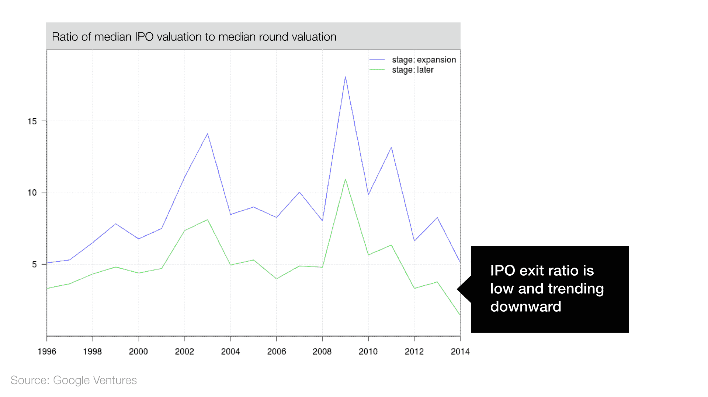

# 科技泡沫？也许是，也许不是 TechCrunch

> 原文：<http://techcrunch.com/2015/03/24/tech-bubble-maybe-maybe-not/?utm_source=wanqu.co&utm_campaign=Wanqu+Daily&utm_medium=website>

More posts by this contributor

编者按: *比尔·马里斯是谷歌风投公司的总裁兼管理合伙人。*

我听说有人怀疑我们的创业是否存在泡沫。有 2000 年网络泡沫那么严重吗？会不会真的更糟？我认为这是值得的，看看现有的数据，看看我们是否可以解决这个问题，而不仅仅是个人意见。因此，我请我们在谷歌风险投资公司的工程团队深入研究泡沫问题，并找出数据所说的内容。在这篇文章中，我将分享我所学到的。

早在 20 世纪 90 年代末，风险资本家就对互联网非常感兴趣。大量的资金被投入到一些失败的公司中，很多人损失惨重。

快进到 2015 年。如果你读了关于优步(我们投资组合中的一家公司)、Airbnb 和 Dropbox 等公司数十亿美元估值的头条新闻，就很容易明白为什么有些人会感到不安。是不是每个人都像 1999 年的人们一样，对新平台和经济模式感到非理性的兴奋？还是这个不一样？这件事有两个方面。

# 反对泡沫的理由

虽然数据显示风险投资正在增加，但它们也说明了与互联网泡沫的四个关键区别。

**1。公司上市速度较慢**

在 2000 年的泡沫时期，许多公司在获得任何收入之前就急于上市。如今，公司上市的时间越来越长:

**2。风险融资远低于 2000 年的峰值**

2000 年，资金涌入风险资本，风险资本用这些钱资助那些可能无法“达标”的公司——导致了一些引人注目的失败。如今，风险投资融资正在上升，但仍远低于 2000 年的水平:

**3。投资总数相当平稳**

2000 年，风投公司进行了创纪录的投资——仅那一年就超过了 2000 笔。与今天相比如何？可能感觉不像，但自 2007 年以来，风险投资的数量实际上一直相当平稳。这表明风投仍然是有选择性的:

**4。风投正在投入更多资金——但只有 2000 年峰值的一半**

风险资本投资在 2013 年和 2014 年飙升，但仍远低于互联网泡沫的水平:

在 2000 年的泡沫时期，更多的风投资金带来了更多的投资。如今，风险投资有所增加，但交易数量持平。这是怎么回事？正如我们将看到的，投资者正把资金集中在相对较少的几笔大交易上。

# 泡沫的理由

我们的数据分析揭示的不仅仅是阳光和棒棒糖。以下六个令人不安的迹象表明，我们可能正处于另一场科技泡沫之中。

**1。投资者将更多的钱投入到最后阶段**

如果你认为后期融资正在取代 IPO 筹资，这可能不是一个令人担忧的迹象。不过，很容易看出与 2000 年的相似之处:

**2。私营公司的估值正在上升**

到目前为止，我们的数据显示环境比 2000 年温和。今天的估值讲述了一个不同的故事:

**3。估值增长速度快于风险融资**

这是另一个令人担忧的图表:

**4。高端 IPO 估值大幅上升**

IPO 估值全面上升，但最成功的公司都以高得多的估值上市(或者他们只是在等待更长的时间)。

**5。后期融资正在取代退出**

后期估值和收购价格都在上涨。与此同时，IPO 估值正在下降。实际上，后期融资和收购正在取代 IPO。

**6。退出比率正在下降**

数据显示，IPO 估值的增长速度没有后期私人公司估值的增长速度快。事实上，如果我们看一下 IPO 估值与后期估值的比率，我们可以看到这个比率从 2009 年开始就一直在下降。这表明，后期投资者可能会期望比过去更低的回报。

当我们查看数据时，只有一件事是清楚的:2015 年与 2000 年确实不同。一些差异令人放心(例如，风险投资的总数保持不变)，而另一些则令人不安(例如，估值飙升和退出回报率下降)。

数据清楚地显示了后期融资的增加，但有几个方法可以解释这一点。一种假设是，风投和私募股权基金的大量后期融资导致公司保持私有，而不是上市或被收购。另一种观点认为，技术让公司增长得更快，后期融资增加了，以满足这些年轻(但规模大)的初创公司的需求。

底线呢？如果有泡沫，那也是另一种泡沫。这是有道理的，因为在过去的 15 年里，市场和技术领域发生了巨大的变化。

当然，公司仍然会失败，而在今天的巨大估值和随之而来的关注下，这些失败看起来会更大、更引人注目。但这并不意味着天要塌下来。当这些超高价值公司中的一家倒闭时——这是不可避免的——我们将不得不深吸一口气，问自己这是一种普遍现象，还是只是正常失败率的一部分。也许我们应该在按下紧急按钮之前先看看数据。