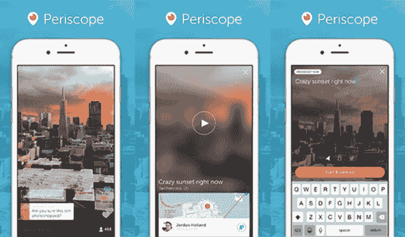
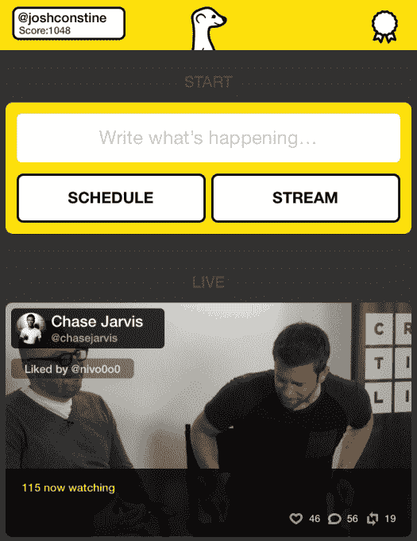

# 直播成为主流 TechCrunch

> 原文：<http://techcrunch.com/2015/03/27/the-livestream-goes-mainstream/?utm_source=wanqu.co&utm_campaign=Wanqu+Daily&utm_medium=website>

2011 年初， [Skype 收购了](https://beta.techcrunch.com/2011/01/06/confirmed-skype-buys-mobile-video-startup-qik/)一家名为 Qik 的移动视频初创公司，该公司开发了一款应用程序，让移动用户可以实时录制和流式传输视频，其他人可以[注意到](https://beta.techcrunch.com/2009/07/10/qik-launches-push-api-mobile-to-mobile-video-streaming/)然后观看。如果这种描述听起来类似于最近热门的直播应用 Meerkat 和 Periscope，那是因为当时引入的整体概念与这些新平台上今天发生的事情并没有太大的区别。但这一次不同的是这些应用程序有可能成为主流。

欢迎来到直播时代。

当 Qik 被收购时，该公司的用户群已经增长到了 500 万——在移动领域的早期，这是一个不坏的表现，在移动领域，应用程序迎合了更多的技术人群，尚未在祖母和青少年以及介于两者之间的所有人手中找到自己的方式。就像今天的直播应用一样，Qik 为用户提供了一种与他人即时分享世界的方式，但就像这个行业中涌现的许多东西一样，这是一个来得太早的概念。

Qik 当时面临着许多挑战，不仅是在扩大用户群方面，还必须克服技术障碍。例如，苹果甚至一度[屏蔽了](http://www.beta.techcrunch.com/2009/06/10/looking-forward-to-streaming-live-video-from-your-iphone-3g-s-not-so-fast/)所有正在进行实时视频录制的应用程序，如果你能相信的话，因为它们最初必须利用受限的屏幕捕捉 API 才能运行。与此同时，移动网络本身对 iPhone 传输的大量数据没有做好准备，这有时会导致共享数据流的[退化](https://beta.techcrunch.com/2009/12/23/qik-iphone-app-2/)。

技术进步已经解决了大部分与只需轻触一个按钮就能录制和分享现场视频的障碍相关的挑战。我们已经看到了结果，因为人们在占领抗议或阿拉伯之春等事件中举起了手机。

但这些新的直播服务再次推动了事情的发展。

他们不仅会成功，因为这项技术现在工作得更好。

## 我们喜欢在公共场合生活

更重要的是，我们的文化心态已经改变，我们已经准备好接受这种公开表演。与此同时，作为观众，智能手机的普及意味着我们都可以从任何地方轻松获取这些正在进行的信息流。

对于前一点，社交媒体多年来一直在训练我们，如果看不到感兴趣的东西，就没有动力去分享它。

无论是美丽的日落还是熊熊的大火，就像在 Periscope 发布日摧毁纽约一座建筑的那场大火一样，许多人的第一反应是拿出他们的智能手机。不仅仅是脸书和 Instagram 的“赞”，或者推文和转发导致了这种心理修复，尽管他们肯定也对这种行为有所贡献。而是这些应用程序让我们在这个世界上不再感到孤独——通过分享我们的生活，我们感觉与他人的联系更好了。有些人会认为寻求联系是人类生存的基石。

人们可能还会争辩说，动机有时会变得令人不寒而栗——我们拿出手机，记录我们应该提供帮助的时间。我们广播我们所看到的旁观者，镜头指向外面，而在这个过程中完全自我聚焦。当然，直播成为主流活动的举动可能会使这个问题比今天更糟，我们作为一个社会应该保持警惕，以打击我们的自恋倾向。

但是这些新应用程序的潜力，Periscope 和 Meerkat 以及其他类似的应用程序，超越了我们记录和分享的直接愿望。毕竟，我们有其他的方法，包括 YouTube、Vine 或 Instagram 等应用，以及 Twitter 本身和脸书。

## 重新想象的现场直播

有了直播，还有一种能够拿起电话立即反击现有机构的感觉，无论是[的暴行](http://www.bloomberg.com/news/articles/2015-03-18/uva-students-plan-protest-over-alleged-police-brutality-against-black-student)和[的警察军事化](https://www.aclu.org/blog/tag/militarization-police)，还是最近将悲惨事件变成耸人听闻的故事的传统新闻媒体。他们需要提供 24/7 的报道，这使得曾经值得信赖的新闻来源变成了权威人士、热门话题和错误信息的平台。

尤其是年轻一代，他们已经准备好接受其他获取新闻的方式，而不仅仅是收看“晚间广播”。直播只是一个例子。他们阅读社交订阅源中的故事——通过 NowThisNews 或 Snapchat Discover 等服务消化以一口大小的格式讲述的内容。新宣布的 HBO-VICE 交易，将为 HBO 频道带来每日新闻节目(该频道现在也正在摆脱与有线电视的联系)，是关于主播台的毁灭。

我们已经为新的新闻做好了准备，这是 Periscope、Meerkat 和其他任何未来产品的承诺。第一手消息:*这是我看到的，你也能看到*。传统的新闻记者不再参与其中。这是推文或推文照片之外的下一个逻辑步骤。在媒体车到达之前，有数百个潜在的摄像机在现场直播。这是[公民的权利记录](https://medium.com/@jcstearns/periscope-meerkat-and-the-right-to-record-9a9e4cc0baac)实现了。

## 在主流采用之前，软件需要改进

也就是说，目前的平台远非完美。没有好的方法在那些记录午餐的人中找到重要的信息流——Twitter 经常被引用的平庸和自我参与的名声再次抬起了它丑陋的头。Meerkat 上的流不提供重播按钮。你不能发链接到流。Periscope 的 web 视图只将人们指向一个应用程序下载。您不能按关键词搜索流。Streams 没有自己的“趋势”部分来帮助你找到什么在燃烧。推送通知铺天盖地，不可能。

换句话说，虽然早期的直播应用程序必须努力让他们的服务工作，同时面临通常基于硬件的技术挑战，但今天的应用程序必须让他们的系统在软件层面上工作。他们需要更好的用户界面，扩展但简化的功能集，并且他们的内容需要能够从任何平台访问，无论是开始时的直播流还是后来的录制视频。

然而，这些技术和设计挑战都阻碍了直播仅被早期采用者、高流动性人群使用，并成为主流活动，就像状态更新一样常见，制作起来也一样简单。而这些天，变化[发生](https://beta.techcrunch.com/2015/03/27/hunting-meerkats/)很快。