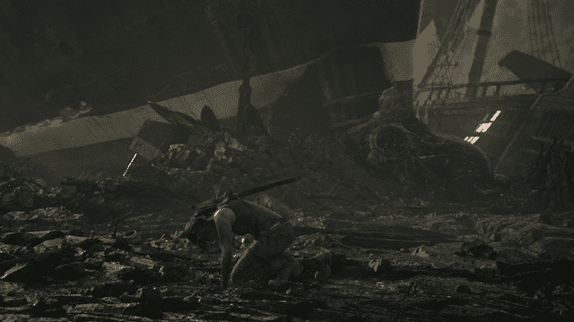
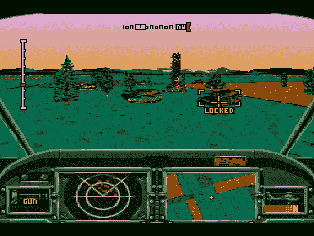
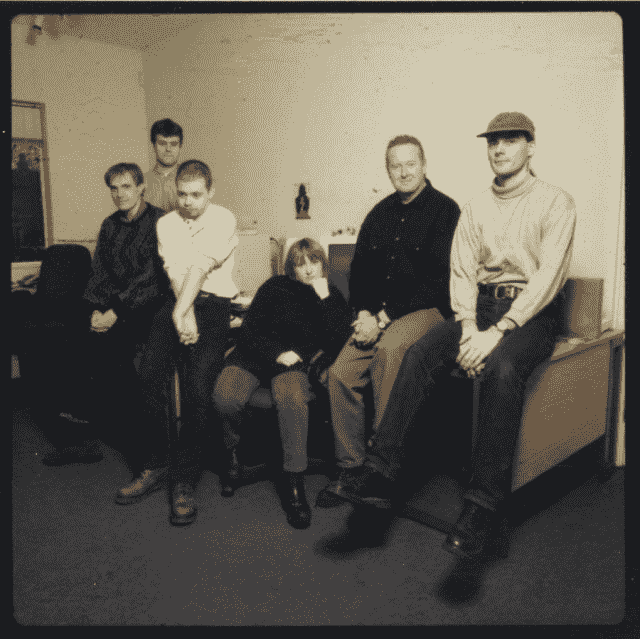

# 《感觉像抢劫》:古墓丽影和核心设计的没落

> 原文：<https://arstechnica.com/gaming/2015/03/it-felt-like-robbery-tomb-raider-and-the-fall-of-core-design/?utm_source=wanqu.co&utm_campaign=Wanqu+Daily&utm_medium=website>

就像《古墓丽影》系列本身一样，开发者核心设计的故事也有起伏。

建造《古墓丽影》的房子在 1998 年位于世界之巅。刚刚结束的两个帮派破坏排行榜最终积累了大约 1500 万英镑的销售额，Core Design 及其母公司 Eidos 准备为小明星萝拉·卡芙特发布第三次冒险——这是一个非常受欢迎的电子游戏角色，在推出一年内就家喻户晓。克罗夫特迅速成为一个图标，不仅是新兴的，成熟的游戏产业，也是流行文化。她登上了 [*《新闻周刊》*](http://www.newsweek.com/lara-croft-bit-girl-171024)*滚石*[*时代*](http://content.time.com/time/magazine/article/0,9171,992753,00.html) 等杂志的封面。她后来被搬上了银幕，由安吉丽娜·朱莉在两部大片中饰演。克罗夫特女士似乎无处不在。

《古墓丽影》的开发者核心设计在劳拉的带领下似乎无人能及，正是由于该系列的巨大成功，发行商 Eidos 在 1998 年世界经济论坛上被评为世界上发展最快的公司。但工作室的创意来源与公开交易的 Eidos 年复一年依赖*古墓丽影*品牌作为赚钱机器的做法发生了冲突。到 2003 年底——这一年，灾难性的、地狱般开发的《T4》第六部*古墓丽影* 在七年内被迫未完成——他们成了娱乐圈的笑柄。

由于颜面尽失，Eidos 让 Core Design 的联合创始人兼首席执行官杰里米·希斯-史密斯(Jeremy Heath-Smith)休了一年的园艺假(带薪停职),并把《古墓丽影》的特许经营权从家中撤出。这位英国女主角被送往美国《Kain 开发商晶体动力的*遗产，在那里，她可以说是在没有年度续集压力的情况下蓬勃发展。*

Core 很快一分为二，希斯-史密斯和他的兄弟阿德里安(他是二把手)带着大约 30 名员工去了 new venture Circle Studio。Eidos 派出了自己的人作为临时管理人员，许多人想知道这个名声扫地、失去了身份的工作室是否还能再活一年。

但是让我们打退堂鼓。在短短几年的时间里，一个游戏开发工作室是如何从世界之巅的不可触及变成穷乡僻壤的？核心设计到底哪里出了问题？

## 创意文化

抛开现代观念不谈，核心设计从来就不是“古墓丽影工作室”它于 1988 年在 Gremlin Graphics(后更名为 Gremlin Interactive) Derby 工作室的废墟上成立，最初是一个由艺术家和程序员组成的小型松散组织，他们为当时领先的家用电脑平台制作游戏，这些平台包括 Commodore 64、ZX Spectrum、Amiga、Atari ST 和 DOS。

早期的一个亮点是《危险的瑞克》，一个*风格的印第安纳·琼斯*游戏平台，可以被看作是*古墓丽影*和[洞穴探险和](http://arstechnica.com/gaming/2012/07/review-in-spelunky-death-makes-life-worth-playing/)的前身。其他包括 *Chuck Rock* ，一款带有一点英国闹剧味道的侧滚式平台游戏； *AH-3 雷霆一击* ( *雷鹰*北美以外)，评价很高的战斗直升机 sim 和*女妖*，一个交替历史为主题的街机风格的射击游戏。

AH-3 雷击，也被称为*雷鹰*，在 1992 年到 1993 年在世嘉 CD、Amiga 和 DOS 上被大肆宣扬。

该工作室获得了开发世嘉创世纪游戏的许可，比任何其他英国开发商都要早，并在 1990 年建立了自己的出版和发行业务。Core 很快成为 Amiga 和 Sega CD 游戏的强大生产商之一，这无疑是其 1994 年被 CentreGold 收购的一个因素。1996 年 4 月，Eidos 以 1760 万英镑的价格收购了 CentreGold，这比原版《古墓丽影》的发行早了 6 个月。

Core 的组织结构一直相当松散，所有权的变化对公司的自主权没有任何影响。“我们有很多自由，”从 1992 年到 2003 年分裂期间在 Core 工作的艺术家罗伯托·西里洛(Roberto Cirillo)说(他是少数几个从未参与过古墓丽影游戏的员工之一)。“对我来说，它真的更像是一个有才华的人聚集在一起展示他们在视频游戏开发方面的想法和技能的地方，而不是一个真正的‘工作办公室’"

Gavin Rummery 是 1995 年开始在 Core 工作的程序员，在 Smith 兄弟离开后担任工作室经理，他也有类似的回忆。他说，史密斯兄弟“就这样把我们丢下不管了”。“他们已经取得了足够的成功，杰里米知道，如果他抓住这些疯狂的家伙，让我们兴奋起来，让我们离开(这一切都会解决)。”

[Enlarge](https://cdn.arstechnica.net/wp-content/uploads/2015/03/original-tr-team.jpg) /

原版上的开发团队

*Tomb Raider*

。

加文·鲁默里

工作室内的气氛似乎更像是一群卧室程序员，而不是一个有办公室的专业公司，他们工作的大楼只是增加了这种感觉。“我听说它被描述成一座大厦，”Rummery 说。“这是一栋维多利亚时代的大房子……而且[它]已经被改造成了办公室。里面真的乱七八糟。所有的团队都在很小的房间里，所以我们不可能在[*古墓丽影*的房间里容纳超过六个人。”

1993 年至 1997 年在 Core 担任作曲家和声音设计师的内森·麦克里(也是《古墓丽影 3》的自由作曲家)指出，他们也不关心设计文档或任何真正的规划。“每个人都尽可能快地把东西扔进了游戏，不知何故，我们让一切都运转起来，”他说。

“没有真正的等级制度，”安迪·桑德汉姆说，他是《古墓丽影 III》到《T2 V》的关卡设计师和编剧。甚至测试人员也可以提出他们的想法并被倾听；桑德姆成功地将他的想法推销给了 *Blam！求职面试中的机器头。*

> “他们给我们的创作津贴的一个很好的例子是，我写了我杀死劳拉的剧本[在《古墓丽影 4:最后的启示》]，”桑德姆说。“实际上，我们想出了一个剧本，因为我们已经厌倦了出演《古墓丽影 4》(T5)中的《古墓丽影(T2)》(T3)。所以我们决定杀了劳拉。
> 
> “我不知道我们是否真的告诉了杰里米，但杰里米发现后非常高兴……我们被允许和这样一个标志性的人物有这么多自由，这太疯狂了。他们信任我们。他们信任我们的创造力。”

虽然气氛通常是宽松和随意的，但也可能是高度紧张的。“我看到几个人从那栋大楼里走出来，因为 72 小时没有睡觉，感觉很不舒服，看起来非常苍白，”麦克里说。“大楼周围的各个地方都有行军床，人们可以在那里睡觉。许多人在桌子底下或椅子上睡觉。

“甚至在橱柜里，”他继续说道，笑着回忆。"有一次我发现有人在橱柜里睡着了。"

没有太多的直接监督，团队往往会陷入计划混乱。“我们通常会在一个项目上做的事情是，我们会花六个月的时间每天晚上捣鼓到凌晨两三点——在那个年龄我们仍然可以这样做——然后我们会花大约四个月的时间四处闲逛(只是放松和为下一个游戏做研究)，”桑德汉姆回忆道。