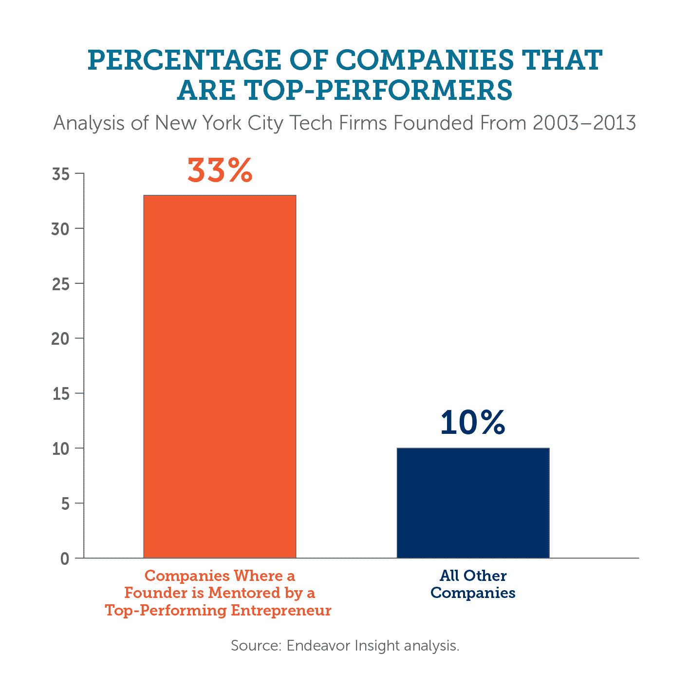

# 导师是成功创业的秘密武器 TechCrunch

> 原文：<http://techcrunch.com/2015/03/22/mentors-are-the-secret-weapons-of-successful-startups/?utm_source=wanqu.co&utm_campaign=Wanqu+Daily&utm_medium=website>

More posts by this contributor

**编者按:** *瑞德·莫瑞斯是 Endeavor Insight 的主管，Endeavor Insight 是 [Endeavor](http://www.endeavor.org/) 的研究部门，这是一家支持全球高影响力企业家的非营利组织。*

一位创始人最近告诉我，“我可能已经修改了 200 次投资者推介材料”。在上个月结束种子期之前，她已经会见了 50 多位潜在投资者。这可能听起来有些过分，但她的经历并不罕见。

企业家经常花费数百个小时从天使和风险资本投资者那里筹集资金。虽然这些活动显然很重要，但对创业公司新数据的分析表明，创始人也应该花大量时间做一些很多人忽略的事情:招募优秀的导师。这个简单的策略比其他任何方法都更能增加公司的成功几率。

## 发现最佳创始人的秘密

我们的团队去年研究了数千家科技企业。我们特别关注了纽约市科技行业的公司，这是 2003-2013 年增长最快的科技行业，现在是全球第二大科技中心。这项研究的目标是调查当地科技公司是如何变得如此成功的。

我们的分析师综合了 CrunchBase、AngelList 和 LinkedIn 的数据，采访了近 700 名创始人。(总的来说，纽约理工的创始人在这个项目上花了一个多月的时间。)这些资源使我们能够创建世界上最大的单一创业社区数据库。

我们发现，许多经常被强调为初创公司成功预测因素的特征——比如在大学期间创办公司—[—实际上并没有太大的影响](https://hbr.org/2015/01/the-myth-of-the-tech-whiz-who-quits-college-to-start-a-company)。虽然这些关于传统创业神话的结论很有趣，但我们通过研究最佳公司和创始人的习惯，发现了其他一些有趣的发现。

## 创造创业优势

我们的纽约科技公司数据集的规模允许我们做一些独特的事情。我们比较了由同一年成立、在同一城市和同一行业工作的初创公司组成的“同行群体”中的公司。在纽约科技公司的每个同行群体中，我们将满足以下一项或多项标准的公司视为“最佳表现者”:

*   重大收购:退出至少 1 亿美元
*   投资者吸引力:在筹集的股权融资金额方面，在同行中排名前 10%
*   内部规模:就员工数量而言，在同行中排名前 10%。

在这项研究中，只有 13%的纽约科技公司达到了一项或多项标准。这些表现最佳的公司包括 Gilt Groupe、赫芬顿邮报、MongoDB、Shutterstock 和 Tumblr。

我们对纽约科技行业表现最佳的公司的分析揭示了几个有趣的模式。我们发现，许多领导这些创业公司的企业家与其他成功公司的创始人有着密切的私人关系。

在我们的分析中发现的最强有力的联系之一是指导关系。Etsy 的 Chad Dickerson 和 Flatiron Health 的 Nat Turner 等表现出色的创始人得到了 Flickr 的 Caterina Fake 和 AppNexus 的 Brian O'Kelley 等其他成功企业家的指导。

像这样的关系是非常强大的。如下图所示，33%的创始人在成功企业家的指导下成为了顶尖的执行者。这比其他总部位于纽约的科技公司的表现要好三倍以上。

这种导师模式也可以在纽约以外的企业家身上看到。当史蒂夫·乔布斯去世时，马克·扎克伯格指出这位苹果创始人是一位无价的导师。Dropbox 的创始人德鲁·休斯顿和阿拉什·菲尔多西得到了阿里和哈迪·帕托维的指导，他们是硅谷两位成功的连续创业者。

导师制的好处不仅限于创业。其他领域的研究也表明，好的导师往往会提高他们的门徒的表现。然而，拥有成功导师的公司和缺乏成功导师的公司之间的表现差异表明，有效导师对初创公司的价值可能特别高。

## 充分利用导师和指导关系

Endeavor 已经为 20 多个国家的 1000 多名快速成长公司的企业家提供了支持。除了我们将这些创始人与投资者和培训项目联系起来的工作之外，我们还在我们的创始人和经验丰富的企业家和高管之间培养了数以千计的指导关系。这些导师已经帮助奋进网络中的公司达到了超过 60%的年平均增长率。其中一些公司已经上市或以超过 1 亿美元的价格出售。

这里有三条经验，创业者可以用来与导师建立有效的关系。

第一课:导师质量很重要。仅仅有导师是不够的。如果你想让你的公司成为最好的，你需要一个知道如何达到那个水平的导师。我们的分析表明，已经在科技行业取得成功的导师能够帮助年轻的科技创业公司比他们的同行高出三倍。质量较低的导师带来的好处要低得多。

第二课:良好的导师关系需要持续的关系。在我们的纽约研究中，表现最好的导师和门徒会在一起三次或更多次。在我们直接支持企业家的工作中，我们也看到持续的联系是至关重要的。事实上，所有加入 Endeavor 网络的新创业者都会收到由多名导师组成的顾问委员会，他们每个季度至少会与创业者会面一次。

第三课:优秀的导师关注关键的商业问题。最大限度地利用你导师的才能很重要。我们发现的优秀创始人之间的关系都集中在被保护人的公司面临的重大问题的讨论上。最好的导师都是非常忙碌的人。创始人应该把这些导师的时间和专业知识用在最能发挥作用的领域。

*更多详细信息，点击[此处](http://www.endeavor.org/blog/endeavor-insight-and-the-partnership-for-new-york-city-releases-the-power-of-entrepreneur-networks-study-of-nearly-700-industry-trailblazers/)。还要特别感谢 Mike Goodwin，他领导了我们对纽约科技行业的研究，以及全球创业研究网络的成员，他们为本项目提供了投入。*