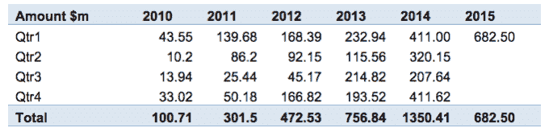

# 在 2015 年 Q1 科技博客 TechCrunch 上，伦敦的初创企业获得了高达 6.82 亿美元的风险投资

> 原文：<http://techcrunch.com/2015/04/02/londons-startups-hit-a-high-of-682m-in-vc-funding-in-q1-2015/?utm_source=wanqu.co&utm_campaign=Wanqu+Daily&utm_medium=website>

随着消费者和企业购买更多的在线服务，投资者蜂拥投资下一个大项目，科技世界的中心硅谷和整个美国的初创公司都看到了前所未有的投资金额。但是这种趋势的影响在其他地方也能感觉到。一份新的报告称，伦敦在今年前三个月获得了创纪录的 6.825 亿美元的投资，比一年前增长了 66%，并突破了去年第四季度创下的 4.1162 亿美元的纪录。

按照目前的速度，今年对伦敦初创企业的投资有望突破 20 亿美元。

由伦敦商业发展集团伦敦市长 London & Partners 跟踪的这些数据也表明了英国科技经济的不平衡。6.825 亿美元占 Q1 在英国所有风险投资(8.567 亿美元)的 80%。

但他们也指出了市场在更广阔的地域上的不平衡。2014 年，伦敦初创公司吸引了 13.5 亿美元的投资。相比之下，美国国家风险投资协会(National Venture Capital Association)表示，美国互联网公司在这一年获得了 119 亿美元的风险投资，而美国软件公司吸引了 198 亿美元的投资，两者都创下了历史新高。

换句话说，如果伦敦在欧洲初创公司的科技投资方面领先，那么在企业和愿意支持它们的人方面，欧洲在接近美国科技市场的规模之前还有很长的路要走。

然而，当你考虑到 2010 年伦敦初创公司仅筹集了 1.01 亿美元时，这个市场已经走过了漫长的道路。

London & Partners 利用 CB Insights 的数据表示，汇款初创公司 WorldRemit 是 Q1 筹集资金最多的公司，在 2 月份筹集了 1 亿美元。

“伦敦是创办金融科技公司的理想地点，因为它是一个技术中心和金融服务中心，”WorldRemit 的创始人兼首席执行官伊斯梅尔·艾哈迈德(Ismail Ahmed)在一份声明中表示。“这座城市有大量世界级的人才，便利的时区使我们能够在同一个工作日内与亚洲和美洲进行沟通，这是我们作为国际汇款服务的一个有吸引力的因素。”

事实上，随着伦敦主要金融中心的共存，金融科技初创公司已经成为伦敦最大的初创公司之一。其他公司包括 TransferWise，该公司本季度筹集了 5700 万美元，由安德森·霍洛维茨(Andreessen Horowitz)牵头，该公司还向开发人员可以用来创造虚拟现实体验的平台 implementable T3(T2)投资了 2000 万美元。

事实上，虚拟现实见证了两笔重大投资，Blippar 也在 Q1 募集了 4500 万美元。

另一个在伦敦表现强劲的领域是更广泛的电子商务，尤其是零售和时尚技术。其中，Farfetch 在 DST 的带领下获得了[8600 万美元的融资。](https://beta.techcrunch.com/2015/03/04/farfetch/)

风险投资公司 Passion Capital 的合伙人艾琳·伯比奇(Eileen Burbidge)在一份声明中说，“这是伦敦科技发展中最令人兴奋的一个季度，因为我们看到总部设在伦敦的公司吸引了一些世界上最懂科技、最有影响力的投资者的大量新投资。”。“伦敦是世界上最令人兴奋的科技中心之一，公司和投资者都被这座城市的理念和企业家精神，以及它的人才和市场准入吸引到这里来。”

伦敦科技行业的发展也催生了一股招聘热潮。