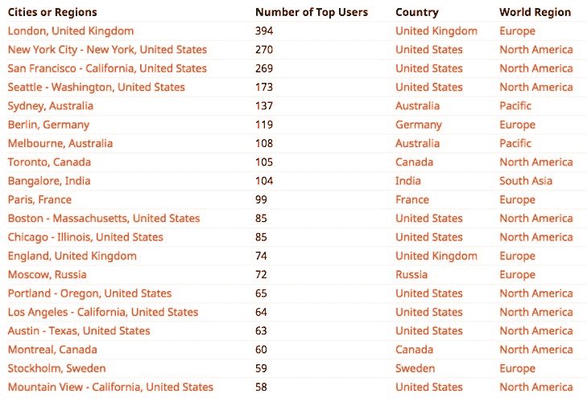
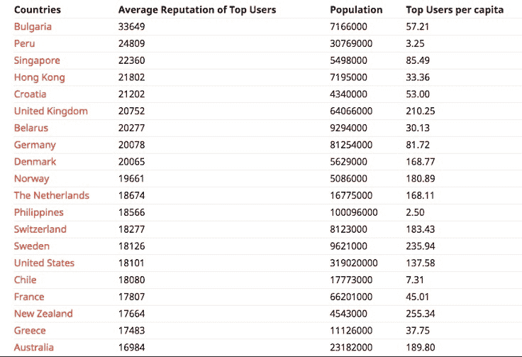
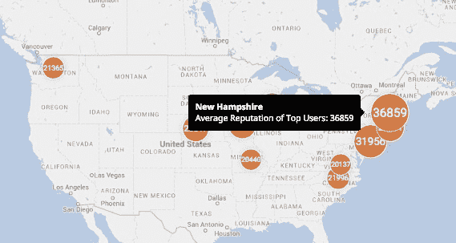

# 世界上最好的编程天才不在加利福尼亚

> 原文：<http://www.businessinsider.com/the-best-programming-talent-in-the-world-is-not-in-california-2015-4?utm_source=wanqu.co&utm_campaign=Wanqu+Daily&utm_medium=website>

 Sorry, San Francisco.

Flickr / David McSpadden

如果你必须说出世界上最能找到顶尖程序员的地方，你可能会说加利福尼亚，对吗？但是我们最近发现一些令人信服的数据表明事实并非如此。

事实上，不仅加州不是美国最有编程天赋的州，美国也不是最有编程天赋的国家。

为了找出顶尖人才真正集中的地方，我们分析了来自 [Stack Overflow](https://www.stackoverflow.com/) 的数据，这是一个占主导地位的 Q &程序员平台，拥有 350 万用户。(Alexa 将 Stack Overflow 列为全球第 53 大访问量网站，美国第 36 大最受欢迎网站。相比之下，Quora.com 的通用 Q & A 网站仅排名第 164。与 Stack Overflow 最接近的竞争对手之一 Sitepoint 排名全球第 1290 位。)

堆栈溢出是一个非常有趣的数据来源，可以了解世界各地不同编码人员的技能水平。该平台的用户对问题的答案进行投票，根据用户提供的答案和其他用户的排名，Stack Overflow 字面意思是 Stack 对其成员进行排名。这些排名大体上是公正的，由人群决定，并且仅仅基于对编码和系统问题答案的感知质量。

为了找出世界上最好的程序员集中在哪里，我们分析了 Stack Overflow 中前 14，898 名用户的个人资料——即所有声誉达到或超过 5000 的成员，这被认为是一个极高的成就水平。这是我们的发现。

## 伦敦拥有排名最高的 Stack Overflow 用户

虽然伦敦在科技领域享有盛誉，但在科技人才方面，它通常被认为无法与旧金山和湾区相提并论。然而，伦敦拥有最多的顶级堆栈溢出成员，有 394 个声誉超过 5000 英镑。纽约市也排在旧金山之前，分别有 270 名和 269 名用户。尽管如此，旧金山的人口只有伦敦和纽约的十分之一，所以按人均计算，这座海湾城市确实遥遥领先。然而，伦敦遥遥领先于纽约，尽管这两个超大城市的居民数量大致相同。结果如何？如果你想在大量的程序员中找到一个编码独角兽，SF 仍然是一个很好的选择，其次是伦敦。(警告:堆栈溢出用户自己声明他们的位置，所以我们在这里依赖他们的话)。

上图:来自 stackoverflow.silk.co 的数据

## 新西兰和瑞典在人均顶级用户方面领先世界

如果我们看国家而不是城市，我们会得到另一个非常有趣的画面。新西兰和瑞典赢得了人均排名最高用户的国家排名(假设我们排除了排名不到 10 名的国家，如小国圣马力诺)。英国、以色列和澳大利亚是排名前五的国家。美国甚至没有进入前 10 名。没错。在编码人才方面，这家科技巨头是个弱者。

查看国家数字的另一种方法是确定超过 5，000 评级阈值的堆栈溢出用户的平均国家排名。在此基础上，保加利亚在
世界顶级用户中平均口碑最高。具体做法如下:如果我们将 Stack Overflow 的顶级用户的口碑按国家进行汇总，再除以顶级用户数，就得到了每个县的“平均口碑”。保加利亚“只有”40 个用户拥有 5000+的声誉，但他们的总得分使其成为世界上平均声誉最高的国家。换句话说，如果你是保加利亚的顶级用户，你有可能成为一个总栈溢出 rockstar。

上图:来自 stackoverflow.silk.co 的数据

## 各州:加州再次落后

如果我们只关注美国，我们会得到另一个有趣的见解。令人惊讶的是，加州在顶尖 Stack Overflow 参与者的人均数量上没有占据首位。事实上，加州在这个基础上排在第五位，在华盛顿特区、华盛顿州、马萨诸塞州和俄勒冈州之后。

加州顶级栈溢出人才素质怎么样？根据同龄人的投票，加州编码员表现良好，但远远落后于其他州，如新罕布什尔州，爱荷华州和新泽西州。事实上，超过十几个州的平均用户排名比加州的顶级堆栈溢出船员还高。

 这一切的结局是什么？加州并不是一个特别适合代码人才的地方。软件工程师收入通常较低的许多其他地区，排名比黄金州高得多。有一种观点认为，旧金山是堆栈溢出独角兽数量极高的地方。但是国家和全球的数字也暗示着世界其他地方有大量的人才。抱歉，加州。你在软件业的日子可能很快就要结束了。

你可以在这里仔细查看所有的堆栈溢出数据[。T3】](http://stackoverflow.silk.co/)