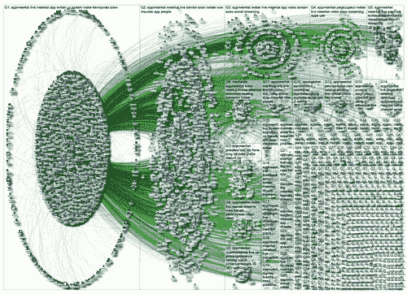

# 我们对猫鼬的工作原理了解多少？-高可扩展性-

> 原文：<http://highscalability.com/blog/2015/4/6/what-do-we-know-about-how-meerkat-works.html?utm_source=wanqu.co&utm_campaign=Wanqu+Daily&utm_medium=website>

“未来是活的。未来是实时的。未来就是现在。”我在 2010 年写过关于视频直播革新者[Justin . TV](http://highscalability.com/blog/2010/3/16/justintvs-live-video-broadcasting-architecture.html)(其中转述为[twitch . TV](http://en.wikipedia.org/wiki/Twitch.tv))。五年后，未来似乎又一次出现了。

[蒙哥](http://meerkatapp.co/) 以一种病毒式的复仇突然出现，于是我开始好奇。Meerkat 发布了大量现场视频。它一定是在早期融资阶段以惊人的速度吞噬现金。它是如何工作的？

不幸的是，在深入挖掘之后，我发现他们后端架构的具体细节很少。我们知道些什么？

*   燃烧现金的猜测似乎是正确的。蒙哥又获得了1200 万美元的资助。溪流将继续流淌。带宽比以前便宜了，但还是贵。Aether Wu 在 Quora 上做了一个 [的估算:那么我们来考虑一下 100 万用户同时在线的规模。每 20 分钟就要花费 100k 千兆字节，也就是说每小时 4k 美元/每天 96k 美元/每月 290 万美元。因此，如果我们将业务规模扩大 10 倍，每天大约需要 100 万美元？](http://www.quora.com/Meerkat-app-2/How-expensive-is-massive-live-streaming-video-nowadays-and-what-is-the-effect-on-Meerkat-now-that-traffic-seems-to-be-exploding/answer/Aether-Wu)

*   Meerkat 由一个由 11 名开发人员组成的以色列团队历时三年开发而成。

*   Meerkat 可以处理成千上万的直播流，同时保持良好的视频质量。也许在 Meerkat 会议上讨论了实现细节，但是，嗯，你知道。 [本·鲁宾](https://twitter.com/benrbn) ，这位深思熟虑且几乎无处不在的猫鼬创始人，在[product hun](http://www.producthunt.com/posts/meerkat)t 上写道“我爱上了 HLS。对于 Meerkat 用例，尽管有 10-15 秒的延迟，但 HLS 更好，因为它在稳定、清晰的质量方面有优势。我们可以用它来将视频流转换成音频，或者做各种各样的事情。”HLS 是 [HTTP 直播](http://en.wikipedia.org/wiki/HTTP_Live_Streaming) 。

大概就是这样。虽然后端架构仍然是一个谜，但我的发现仍然非常有趣。这是一个团队如何创造性地搜索和筛选一个空间，直到他们创造/找到让人们坠入爱河的完美融合的故事。Twitter 做到了。SnapChat 做到了。现在猫鼬做到了。他们是怎么做到的？

## 统计数据

*   Meerkat 在头三天注册了超过 15000 名用户，大约有 8000 个视频流。( [《华尔街日报》](http://blogs.wsj.com/venturecapital/2015/03/04/the-back-story-of-meerkat-a-side-project-that-took-off/) )。第一个月就有超过 50 万用户注册。

*   11 个开发者。开发团队在以色列。

*   1，500 人可以在不到 2 秒的时间内收听。

*   构建后端花费了两年多的时间。

*   8 周构建客户端。

*   吉米·法伦创下了同时观看 5000 多名观众的记录。

*   在 SXSW 之前，他们有 4 万用户，之后他们有 20 万用户。

*   约 19%的人每天花 2 小时观看，约 8%的人花 3 小时观看，约 5%的人花 4 小时观看。

## 平台

*   iOS。他们瞄准了旧金山的技术精英，所以 iOS 是他们的首选操作系统。

*   Twitter 最初用于其社交图和聊天平台。

*   [HTTP 直播](http://en.wikipedia.org/wiki/HTTP_Live_Streaming) (HLS)和 H.264\.

## 什么是猫鼬？

Meerkat 有点像 Twitch.tv，视频游戏直播观看平台，**只有正在观看的游戏才是你的真实生活**。Meerkat 让你专注于**你最喜欢的话题，当然是你**和你正在做的事情。

本·鲁宾在 ProductHunt 上的出柜 pitch [显示了蒙哥清晰简洁的眼光:](http://www.producthunt.com/posts/meerkat)

> Air here 的联合创始人。我希望得到一些关于我们正在开发的叫做 Meerkat 的新东西的反馈。- Meerkat 的使命是让直播流以推文的速度传播，因此它使用了最快的新闻发布网络 Twitter。
> 
> 最近，我们一直在思考世界各地发生的各种新闻事件和对话。无论是在弗格森抗议的民权问题，还是音乐家们在颁奖典礼上互相打断，我们都在想，我们是否能以一种更简单的方式获得这些时刻。
> 
> 我们想给你一个选择，只需按下一个按钮，就可以通过 Twitter 以尽可能无摩擦的方式播放实时视频。将直播中的对话无缝转移到 Twitter 上，反之亦然。
> 
> 这是 Twitter 上的一个“免手动”直播层，所以所有的连接都是在旅途中为你自动建立的。你不需要做任何事情，没有搜索/个人资料/饲料等。一旦你想直播某个东西，你在 Twitter 上的所有粉丝都会收到通知，你要直播了，他们可以开始关注你和你所看到的。
> 
> 最后，您还可以安排未来 24 小时内即将播放的视频流。
> 
> 把它想象成 Twitter 的一个视频直播按钮:)

Twitter 是猫鼬的第一个病人。要了解它的传播程度，请看这张来自 NodeXL 的惊人图表 [:](http://nodexlgraphgallery.org/Pages/Graph.aspx?graphID=41691)

T4】

## Meerkat 是早期 Twitter 的视频版

不同之处在于 Meercasters 可以实时向你展示他们早餐吃了什么，而不仅仅是写下来。奇怪的是，Periscope，Twitter 的 Meerkat，有一个东西正在发展，人们可以直播他们冰箱里的东西。是的，那是一件事。

这并不是与 Twitter 的唯一对比。蒙哥一开始是作为 [一个副业项目](http://blogs.wsj.com/venturecapital/2015/03/04/the-back-story-of-meerkat-a-side-project-that-took-off/) 。Twitter 本身一开始是 Odeo 中的一个副业项目 。因此，两人都是在做了大量工作后，有意无意地以惊人的相似方式挖到了金子。引用 [太空堡垒卡拉狄加](https://www.youtube.com/watch?v=6bOy3RNyWME) 的话:这一切都曾经发生过，所有的都将再次发生。

## 猫鼬的起源故事

> [@benrbn](https://twitter.com/benrbn/status/581140271473123330) :我们的团队在视频直播领域的建设已经快 3 年了。4 产品，裁员，关闭，&终于，空间觉醒了

与许多产品一样，Meerkat 经历了一段英雄之旅。它冒险出去，失败了，学到了很多，转变了，在这个过程中变得更好。

里欧·拉波特在最近的《三角测量》 的一集 [中对本·鲁宾进行了一次精彩的采访，生动详细地探索了这一旅程。](http://twit.tv/show/triangulation/194)

如果你认为猫鼬是某个幸运的家伙在他妈妈的地下室工作的产物，请再想想。本给人的印象是深思熟虑、有条不紊。这里有一个疯狂的方法，其他人可以借鉴。每段旅程都需要维吉尔。

打造 Meerkat 的公司叫做[Life On Air Inc .](http://getair.co/)出了特拉维夫。2013 年，他们推出了一款名为[yev VO](http://techcrunch.com/2013/08/08/yevvo-for-iphone-debuts-a-new-take-on-live-broadcasting/)([)的产品，获得了 400 万美元的 A 轮融资](http://techcrunch.com/2015/01/21/air-raises-3-6-million-for-an-app-that-lets-you-stream-live-video-to-friends/) ，这款应用为用户提供了一种在推特上发布视频直播链接的方式。Yevvo 是一个厨房水槽版本的一对多直播。它有太多的特点，所以很复杂，很难理解。

虽然 Yevvo 在一年后拥有超过 400，000 名用户，但他们并没有得到他们想要的关注。(Meerkat 于 2 月底发布，第一个月就有超过 50 万用户)。

因此，他们积累了他们在构建 Yevvo 时学到的所有知识，并在直播应用程序中进行了六个简单的实验。这些实验是**发现什么有效的一种方式。他们认为那里有东西，只是还不知道是什么。这些实验是一种梳理出。本将这一过程称为在 [产品迷宫](https://medium.com/lets-make-things/navigating-the-product-maze-f7dce97eeb34) 中导航。目标是每两个月推出一款产品。**

为了增加进行这些实验的资金，他们不得不解雇五个人。

他们开发了一款“一对一”的产品。我相信这款应用叫做 Air，发布于 2015 年。Air 有一个类似于 Meerkat 的功能，但它只接受邀请，想法是与现实生活中的朋友分享直播视频。

CTO 做了一个一对多的实验，这是 Twitter 的按钮直播视频。这是猫鼬。Meerkat 向用户的社交图开放了分享，而不是仅限于朋友。

正如命运安排的那样，猫鼬大受欢迎。实验结束。剩下的就是历史了，或者至少是你在短短几个月内可以写出的所有历史。我们将在文章的**部分讲述更多的经验教训。**

## Twitter 正在犯错吗？

Twitter 从 [Twitter 的社交图](http://www.pcworld.com/article/2896404/twitter-cuts-off-meerkat-wont-let-it-import-who-you-follow-on-twitter.html) 中切断了蒙哥。显然这是 Twitter 的权利，因为他们说你不能以竞争的方式使用他们的 API。没什么好争论的。

我想知道推特是不是目光短浅。他们的社交图谱有着巨大的价值，这使得它成为了完美的锁定游戏。Meerkat 中发生的一切都发生在 Twitter 上，因此它在 Twitter 上推动了巨大的参与度。它可能会吸引很多新用户来加入这个有趣的游戏。

这对推特来说不重要吗？Twitter 不想要更高的参与度和新用户吗？如果这是通过潜望镜发生的，真的有关系吗？Twitter 正在迫使 Meerkat 去 Tumblr、脸书或风暴中的任何其他港口。为什么把与开发者合作作为一个平台会有真正的胜利呢？开发者和他们的产品驱使用户使用你的产品。我错过了什么吗？

## 吸取的经验教训

*   **直播容易，聊天难** 。不幸的是，我不记得这句话出自哪里了。没错，Twitter 让 Meerkat 一度进入了它的社交网络，但人们可能没有注意到 Twitter 令人敬畏的聊天基础设施的价值。要了解让聊天大规模运作有多难，看看脸书以 190 亿美元收购的 WhatsApp 架构。为了让 Meerkat 发展得如此之快，他们需要可扩展的聊天。使用 Twitter 作为他们的聊天服务是一个明智的决定。它让开发者专注于他们的产品。

*   **做不规模化的事情** 。处理色情是个大问题。在 Meerkat 上，可以标记流。当有三个标志时，新的观察者将看不到流。然后，一个人看着被标记的流，然后决定是否保留它。这种方法显然无法扩展，但它确实允许 Meerkat 在不失去重点的情况下增长。

*   **利用别人的社交图** 。显而易见，但当一个应用程序被完美地调整以利用它时，这个想法在实践中的力量是惊人的。

*   **不要存放杂物** 。如果 Meerkat 必须存储他们正在处理的所有视频，那么 Meerkat 的经济效益将会完全不同。短暂性是一种内在可扩展的策略。这是 SnapChat 的教训。

*   **消除摩擦，使用户感到舒适** 。他们说昙花一现不是基于成本的决定。这是他们学到的一课。在通过简化应用程序按钮来消除摩擦后，他们希望确保在创建内容后你能控制内容，因为确保你按下按钮和流媒体时感觉舒适很重要，否则人们不会按下按钮。

*   **使用约定** 。没有匿名观看或评论 Meerkat，因为 Twitter 正在被使用。当个人品牌摆在桌面上时，广播公司和观众都致力于高质量的对话。

*   **斩深给自己时间想办法** 。他们不得不解雇员工，以便给自己足够的时间来找出有效的方法。这里的关键是他们有一个计划，一系列的实验，如何使用这些钱。这不仅仅是绝望之举。

*   **与众不同胜过** 。选择 Meerkat 作为名称是有风险的，但它与产品决策的其余部分协调一致。一切都合情合理，配合得很好。这是有道理的，因为猫鼬的行为方式。那是它的黄色有道理。它的建造方式对人们来说是有意义的。人们理解并接受它。没有公式。有一个对每个人都有意义的愿景，然后跟随你的直觉，互相指责。发展一种文化，让人们可以说这没用。

*   **简单胜过美好** 。在下载应用程序的几秒钟内，你就可以把所有内容上传到你的整个社交网络，应用程序会为你处理所有的事情。这很简单。

*   **失败几次后你会学到很多东西** 。失败帮助你了解什么可行，什么不可行。他们学到的一些知识:如何激活观看者，如何激活广播者，什么是直播流，为什么显示人脸很重要，为什么不保存视频很重要，如果流没有加载，什么时候会失去观看者。例如，抓取流的动画让用户知道应用程序正在为他们获取流，他们应该留在原地。他们从耶夫沃的失败中学到的一切使猫鼬成为可能。

*   **致力于愿景和社区** 。产品会随着时间而变化。如果有些东西不工作，你的社区将支持你通过产品的变化。如果你的产品很糟糕，你应该尝试其他的东西，这是你欠社区的。

*   **注意什么作品** 。让社区来带路。听他们说。这只有在你做东西的时候才会发生，但是一旦你做了，反馈会告诉你你的产品的哪一部分真正为用户服务。Justin.tv 学会了专注于游戏视频。猫鼬诞生于对耶夫沃使用的观察。有了 Yevvo，你就可以发微博直播了。人们会在 Lady Gaga 秀上直播，并放入一个超级粉丝会转发的标签。一个没有追随者的人会有 1000 人观看 Lady Gaga 的表演。这激发了 Twitter 按钮直播视频的想法。

*   **守楼而谓 BS 于己** 。如果你这样做，最终你会有所发现。也许吧。十年来一直有直播视频，但在一对多同步领域仍没有赢家。现在，每个人都带着一台功能强大的电脑和一个连接到社交网络的互联网摄像头四处走动。新产品是可能的。

*   **如果说过去十年是分享，那么未来十年就是参与** 。Meerkat 消除了视频直播制作和参与中的摩擦。这种结合在政治、教育和新闻业的垂直领域都会产生影响。参与者实际上可以给出他们的意见并改变内容。当你改变了内容，你就改变了现实。当 50，000 人在看某个节目，而他们的观点真的很重要时，会发生什么？关于从消费内容到参与内容的心态变化，还有很多东西需要学习。参与者和广播员之间的界限完全消失了。

*   **消息空间** 有四种:一对多同步(Meerkat、Periscope)、一对一同步(Skype、Facetime)、一对一异步(聊天)、一对多异步(脸书、Twitter、Snapchat Stories)。

*   **在每一个空间中至少有四个主要的垂直点** :美观、正式、非正式、直接。每个词的含义都没有定义。潜望镜是在美丽的垂直，因为它是一个华丽的设计。每个垂直领域总是有四家公司在竞争。一对多同步还是个孩子。有很多聪明的团队试图找出如何让这一切发挥作用，这是一件好事。

*   **有谋士** 。他们应该帮助你提炼产品的价值，想出一种谈论产品的语言，帮助团队理解他们试图做什么，如何沟通，以及如何执行愿景。

*   **人像是原生于手机** 。视频应该水平使用，除非这种媒体是在移动中贡献和/或使用的。唯一的方法是在手机上，因为手机是垂直的，所以纵向模式是正确的选择。如果你的工作是消除默认行为中的摩擦，那么垂直握着手机就是天生的。

*   **手机网络可以处理流媒体直播** 。移除了一个路障。

*   **计时事项** 。Justin.tv 为什么不火？几年就不同了。连接到社交网络的能力、移动快速手机网络的普遍存在、短暂性的出现和接受、自拍文化的兴起，所有这些力量创造了一个新的可利用的利基。

*   **收养已经职业化** 。我们现在知道如何快速适应事物。这对于那些能想出如何利用网络效应的少数精选应用来说非常好。可悲的是，大多数应用程序都被扔进了没人要的玩具世界。

## 相关文章