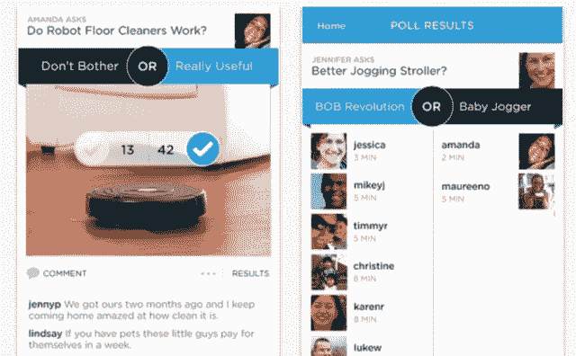
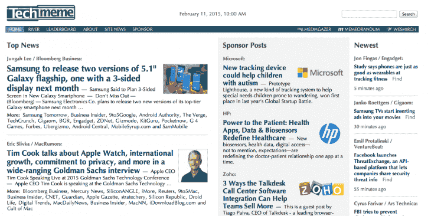
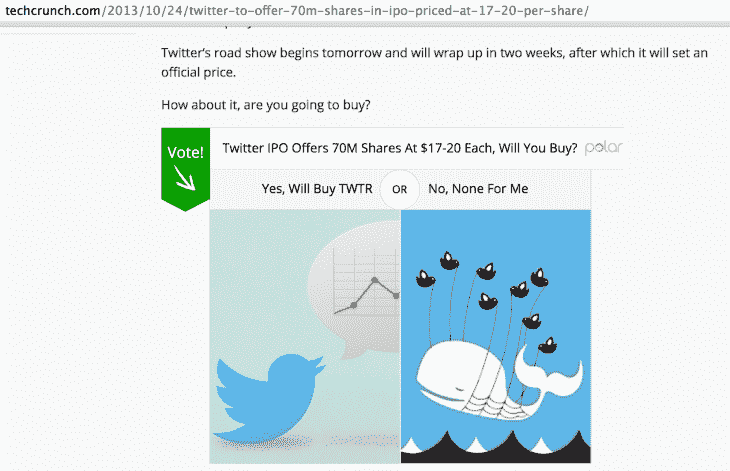
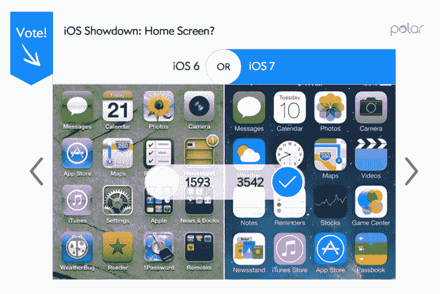

# 我如何帮助 Polar 获得超过 4000 万的浏览量

> 原文：<http://thenextweb.com/socialmedia/2015/02/21/took-startup-0-40m-pageviews-got-acquired-google/?utm_source=wanqu.co&utm_campaign=Wanqu+Daily&utm_medium=website>

德米特里德拉吉列夫是增长黑客咨询公司[的创始人，犯罪多产](http://criminallyprolific.com/)。他还经营 [JustReachOut](http://justreachout.io/) ，这是一项帮助初创公司被媒体报道的服务。

* * *

在我开始这篇文章之前，我想说卢克夫、*杰夫·科尔*和 Polar 的整个团队在建设和运营 Polar 方面做了令人难以置信的工作。我把 Polar 的成功完全归功于他们，归功于他们坚持不懈地把产品做到最好。我只是一个帮助他们摆脱困境的顾问。如果没有这样一个全明星团队，下面描述的大多数步骤都不可能实现。

于是你终于把自己的网站画龙点睛，推上了直播。该死，看起来太好了！你的企业现在可以向全世界展示了。然而没人会来。

或者，你把它推上直播，在第一个小时就有几百人注册。这是因为你把你的东西和媒体放在一起，并在发布会上收到一些关于你的业务的文章。所以你向更多的媒体推销，在第一个月就获得了 100 万的浏览量。

很难吗？当然可以。但是你能做到。你不需要雇佣公关公司来帮忙。我没有。

我自己做公关已经六年了，已经写了[1298 篇关于我推销的东西的报道。最近，我帮助了一家初创公司](https://delicious.com/dragilev)[，这家公司在成立两年后被谷歌](https://thenextweb.com/news/google-acquires-polar-google-will-close-polling-service-end-year)收购，我只是向媒体推销。

在我告诉你我是如何做到这一点的故事之前，我希望你记住一件事(如果这是你从这篇文章中记住的唯一一件事):无论何时你向媒体推销任何东西，确保提供与记者节奏相关的有价值的内容。注意粗体和下划线。

有价值的内容——这就是它的价值所在，它要么成就你的推销，要么毁掉你的推销，这也是媒体反应最强烈的地方。

### 每月浏览量从 0 增长到 4000 万

当我第一次加入 [Polar](http://polarb.com) 的时候，我们正在 iOS 上构建一个华丽的观点分享应用。当然，问题是，当我们获得苹果批准的应用程序时，我们没有用户。

[

<noscript></noscript>](https://thenextweb.com/wp-content/blogs.dir/1/files/2015/02/SCREEN0.jpeg) 

我的第一个想法是将民意调查与突发新闻文章结合起来。每一条突发新闻都应该有我们的民意调查；这将为投票吸引流量，让人们下载应用程序。

所以我问自己的问题是:我怎样才能接触到记者？为什么他们会回应我，看我的民意调查？这些民调对记者真的有价值吗？

我决定找到突发新闻故事，为这个故事做一个民意调查，并说服记者将民意调查嵌入文章中，以征求读者对所讨论主题的意见。

在向记者推销之前，问问自己:*为什么* *记者会嵌入我的调查？*

然后给自己一个诚实的答案: *T* *他的民意调查将允许更多的读者发表自己的意见，并参与记者所写的内容。*

这是我正在测试并试图向记者推销的一个大假设:*我们的民意调查推动了你的文章的更多参与。你会得到 200 票对 30 条评论。*

以下是我联系记者的步骤:

****1。研究该联系谁以及我为什么要联系他们****

[

<noscript></noscript>](https://thenextweb.com/wp-content/blogs.dir/1/files/2015/02/SCREEN1.png) 

对我来说，我追求的是突发新闻，所以我去了 [Techmeme](https://www.techmeme.com) 寻找顶级记者和媒体。我挑选了一个故事，列出了所有出版物以及这些出版物的作者。下面是[我的列表看起来的样子](https://docs.google.com/spreadsheets/d/10B-ut04he8eGBq6WLtCP62qsJRSy0r9FPsHStpyWFFE/edit#gid=0)。

**2。写邮件**

我的电子邮件超级短。我需要展示有价值的内容，让提问变得清晰。我的目标是用两句话来完成。下面是这些邮件的样子:

主题:给你一个投票:你更喜欢哪个 Foursquare 标志？

嘿，克里斯-

*为你的文章做了一个民意调查，问人们最喜欢哪个 Foursquare 的标志，看看吧，让你的读者更多地参与进来可能会很有趣，以便更多地回到文章:**[【http://polarb.com/polls/194407】](http://polarb.com/polls/194407)*

*以下是这些民调直播的样子:*[*http://guycodeblog . MTV . com/2014/03/21/vote-favorite-Melanie-Iglesias-photos/*](http://guycodeblog.mtv.com/2014/03/21/vote-favorite-melanie-iglesias-photos/)

*-德米特里*

这里的关键是我向记者的文章和兴趣展示/添加了有价值的内容。这和他们写的东西直接相关。

**3。猜猜他们的邮件**

大多数时候，电子邮件的格式要么是[【受电子邮件保护】](/cdn-cgi/l/email-protection)要么是[【受电子邮件保护】](/cdn-cgi/l/email-protection)要么是[【受电子邮件保护】](/cdn-cgi/l/email-protection)如果这些都不起作用，我喜欢用这些工具给我他们的电子邮件:

如果所有这些都失败了，有一个叫做[电子邮件格式](https://email-format.com)的网站会向你展示大多数域名的电子邮件格式。谨慎使用这些服务。不要滥用它们来获取你能找到的每一个记者的电子邮件，这样你就能让自己的名字出现在那里。目标是只向那些认为你的内容有价值的相关人士推销。

**4。伸出手并跟踪开口**

一旦我有了电子邮件地址和电子邮件副本，就该推销了。我使用了一个名为 [YesWare](https://chrome.google.com/webstore/detail/yesware-email-tracking/gkjnkapjmjfpipfcccnjbjcbgdnahpjp?hl=en) 的 Gmail 插件来跟踪收件人是否打开了我的邮件。跟踪记者是否打开了你的电子邮件，以判断你的主题是否有价值，这很有用。我在[的电子表格](https://docs.google.com/spreadsheets/d/10B-ut04he8eGBq6WLtCP62qsJRSy0r9FPsHStpyWFFE/edit#gid=0)中记录了我的状态和任何笔记。

有了这些信息，您可以修改主题行，以确保最佳的打开率。对于上面这封简单的邮件，我得到了大约 50%的回复率。

就是这样。通过展示参与价值、相关性和及时性，记者几乎不用费脑子就能在文章中加入民意调查。

一旦民意测验被嵌入，这里就是它的样子。

********

****[

<noscript></noscript>](https://thenextweb.com/wp-content/blogs.dir/1/files/2015/02/Screen-Shot-2015-02-20-at-12.54.22-PM.png)**** 

**T11】**

因为这些是突发新闻文章，Polar 在发布的头几个小时内就获得了巨大的流量，之后就逐渐消失了。我们的目标总是在文章一发表就进行投票。

我们不断地用我们的民意调查来追踪最热门的科技新闻。****T3】****

 **还记得 Snapchat 拒绝脸书 30 亿美元的收购吗？在一篇 [Mashable 文章](https://mashable.com/2013/11/13/snapchat-facebook-acquisition/)的投票中，我们获得了 38，000 多张选票。

还记得 WhatsApp 被收购的时候吗？在 TechCrunch 的一篇文章中，我们获得了近 6 万多张投票。

当 iOS 7 仍在工作中时，我们得到了他们发布的图标和重新设计，并创建了一系列投票，逐屏比较 iOS 6 和 iOS 7。BGR 主持了这次民意调查。

仅从这一集，我们就获得了超过 100 万的浏览量。结果实际上令人惊讶，因为当时大多数人讨厌 iOS 7，但根据我们的民意调查，iOS 7 是首选。TechCrunch 甚至写了一篇单独的文章[总结我们的结果](http://techcrunch.com/2013/06/24/despite-grumbles-most-actually-prefer-ios-7-icon-designs-to-ios-6-study-finds/)。**T3**T5】

[

<noscript></noscript>](https://thenextweb.com/wp-content/blogs.dir/1/files/2015/02/Screen-Shot-2015-02-20-at-1.09.36-PM.png) 

当 PS4 对 Xbox One 的战争正在进行时，我们对它进行了一系列的民意调查。这些变得如此受欢迎，以至于索尼的首席财务官在[的收益电话会议](https://www.gamespot.com/articles/sony-polls-show-80-percent-of-customers-prefer-ps4/1100-6412759/)上引用了我们的调查结果。

你明白了:每一条突发新闻或非常热门的文章都有我们的民意调查。我把网上最热门新闻背后的每个人都找了出来。****T3】****

 **你可能已经注意到了，我们的投票嵌入在右上角有一个极地标志。该标志链接到我们的网站，你可以注册，并为自己的网页创建一个嵌入式投票。本质上，我们从其他网站获取流量，并通过嵌入这些投票将其转移到我们的网站。

现在仅仅因为一篇热门文章的流量死了，并不意味着没有流量。这些文章中的每一篇都获得了不错的搜索流量，所以在最初被嵌入到一篇文章中后，我们会持续获得数月甚至数年的浏览量。很快，我们达到了每月 4000 万的浏览量。

### 同样的你可以怎么做

逐字照搬这种方法对大多数人来说是行不通的。然而，在你自己与记者和记者的接触中，改编部分内容可能会变得非常有用。

对于 Polar，我们专注于报道突发新闻的记者。在你的情况中找到一个记者必须回应的东西。它可以是你进行的一项有趣的研究，一个案例研究或你发现的发现。这可能是关于他们过去报道过的投资者或公司的最新消息。

请永远记住:

*   总是提供记者需要并感兴趣的有价值的内容
*   在研究该联系谁的时候，试着去找那些和你推销的主题完全相同的人
*   给出一个很好的理由，说明为什么记者会按照你的想法行事

当你到了电子邮件推介的部分，你可能需要比我在 Polar 上做的更多的解释。永远记住你是在给记者提供有价值的内容。

下面是我的一个非常好的朋友的一些很好的例子[Sapphire from The Art of Email](http://www.artofemails.com):

*你写了一篇关于企业家走极端的好文章(包括不怎么洗澡)*

*嘿【按下】，*

我在推特上看到你写了一篇关于企业家创业的极端文章。

我有一个好主意给你。当我四处游说投资者的时候，我实际上是睡在我的车里。

我的赌博(还有稍微少一点的淋浴！)得到了回报。我获得了 10 万美元的生命线，给了我的公司足够的起飞跑道。

很高兴提供一些关于如何决定这样的重大牺牲是否值得的深刻见解。

*如果有兴趣，我可以提供其余的细节，*

*签署*

或者…

关于约会偏好中激进偏见的有趣数据——感兴趣吗？

*嘿记者，*

关注你的博客有一段时间了，对社会趋势的深刻见解。 *我为你准备了一个有趣的。我们在 OkCupids 的专家们一直忙于处理一些数字，我们的数据描绘了一幅相当发人深省的在线约会种族偏见的画像。*

*亮点:*

**黑人女性收到的信息数量最少**

*亚裔和黑人男性收到的信息比白人男性少*

大多数种族仍然喜欢在他们的种族内约会

*这提出了一些有趣的问题:*

**这些模式在现实生活的约会选择中发挥出来了吗？*T3】*

或者是网上约会，也就是所谓的橱窗购物，有很多选择，更有选择性？

你认为这会很适合你的观众吗？附上报告的概述。

*签署*

Sapphire 和我准备了一份[精美的 PDF](https://my.leadpages.net/leadbox/1417f0b73f72a2%3A12868998ab46dc/5186613378285568/) 和[一整套](https://my.leadpages.net/leadbox/1417f0b73f72a2%3A12868998ab46dc/5186613378285568/)最好的电子邮件模板和推介角度，用于向记者推介。请随意尝试，并让我们知道您的体验如何。

**阅读下一篇:** [推介你的软件初创公司时要提到的 9 件关键事情](https://thenextweb.com/news/9-key-things-to-mention-when-pitching-your-software-startup)****