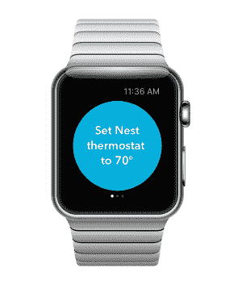
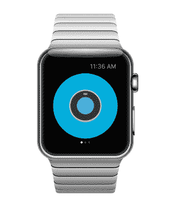
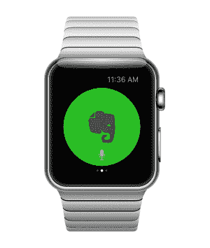
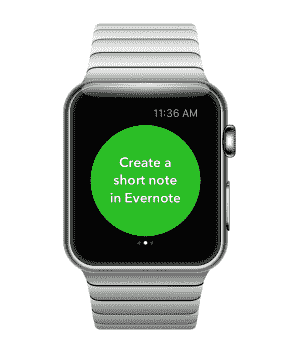

# IFTTT 将推出两款新的 Apple Watch 应用——Do Button 和 Do Note | VentureBeat

> 原文：<http://venturebeat.com/2015/04/15/ifttt-set-to-launch-a-pair-of-new-apple-watch-apps-do-button-and-do-note/?utm_source=wanqu.co&utm_campaign=Wanqu+Daily&utm_medium=website>

任务自动化服务公司 IFTTT 宣布已经为苹果手表开发了两个新的简单应用。IFTTT 表示，新的应用程序将于明天推出。

[Do 按钮](https://ifttt.com/products/do/button)和 [Do Note](https://ifttt.com/products/do/note) 应用程序让用户只需在手表上轻轻一点，就可以运行他们的 IFTTT 食谱(应用程序、服务或设备之间简单交互的指导)。

例如，手表的主人可以通过点击手表上的 Do 按钮将他们的 Nest 恒温器调到 70 度，或者打开或关闭灯。

[

<noscript></noscript>](https://venturebeat.com/wp-content/uploads/2015/04/Do-Button-for-Apple-Watch-Nest-Thermostat-02.png?strip=all) [

<noscript></noscript>

T11】](https://venturebeat.com/wp-content/uploads/2015/04/Do-Button-for-Apple-Watch-Nest-Thermostat.png?strip=all)

通过 Do Note，他们可以向手表应用程序发出语音请求，然后点击一个按钮来运行命令。例如，他们可能会在 Evernote 中创建一个笔记，或者在 Google Calendar 中创建一个事件。

[

<noscript></noscript>](https://venturebeat.com/wp-content/uploads/2015/04/Do-Note-for-Apple-Watch-Evernote.png?strip=all) [

<noscript></noscript>

T11】](https://venturebeat.com/wp-content/uploads/2015/04/Do-Note-for-Apple-Watch-Evernote-02.png?strip=all)

IFTTT 提供了两种主要类型的配方:Do 和 IF。

“Do”食谱让用户快速创建个性化的按钮、摄像头和记事本。

“如果”食谱在后台自动运行，并与“如果这样，那么那样”语句(该公司由此得名)建立强大的联系。这样的陈述可能看起来像这样:“如果我在 Instagram 上发布了一张照片，那么也将它保存到我的 Box 帐户。”

**VentureBeat 的使命**是成为技术决策者获取变革性企业技术知识和进行交易的数字城市广场。[发现我们的简报。](https://info.venturebeat.com/website-preference-center.html)

