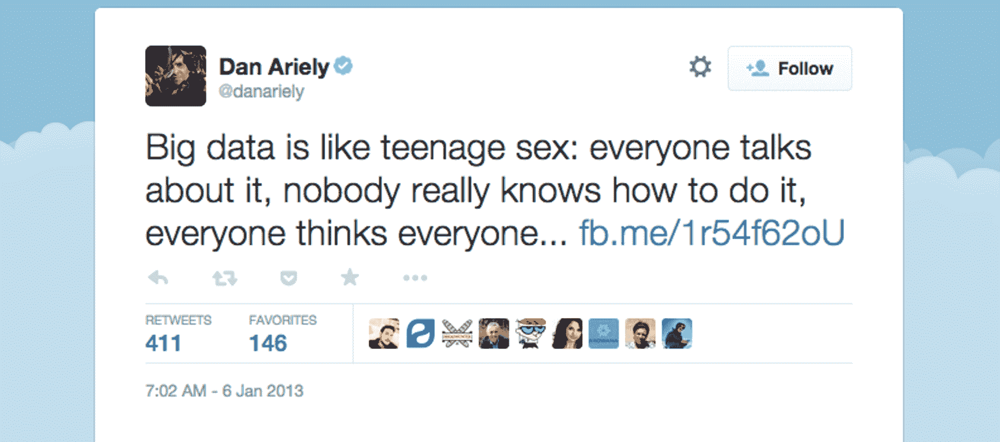
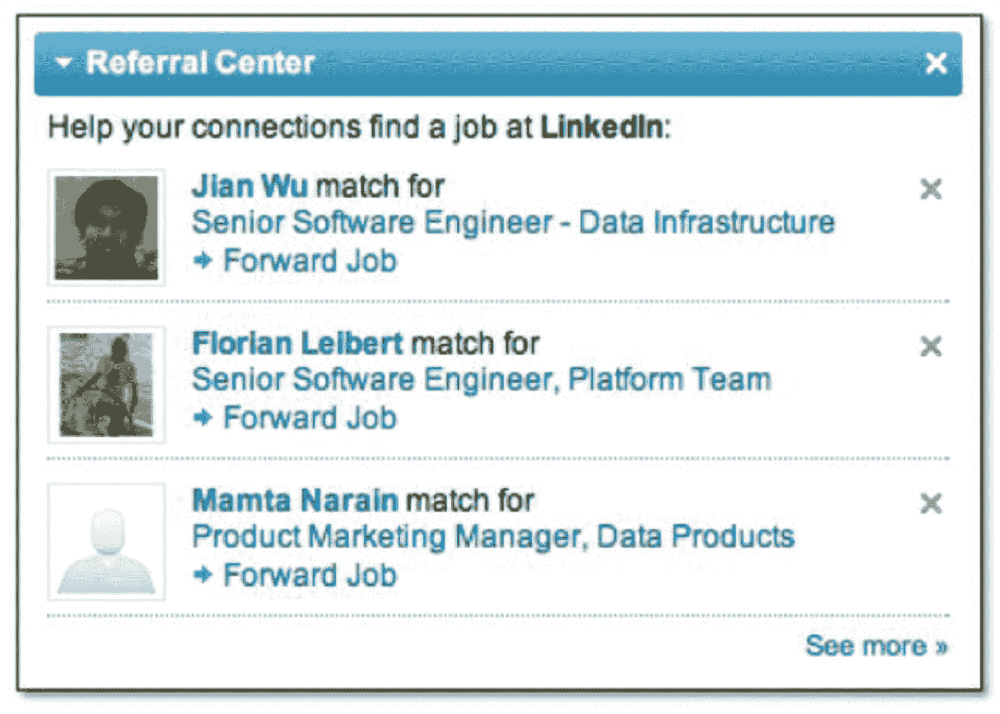
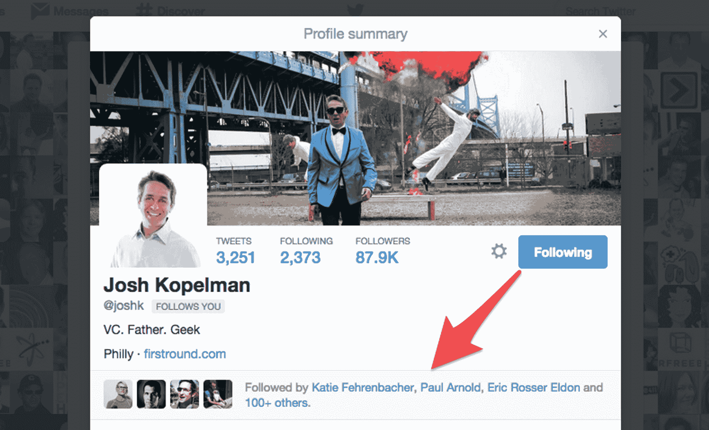
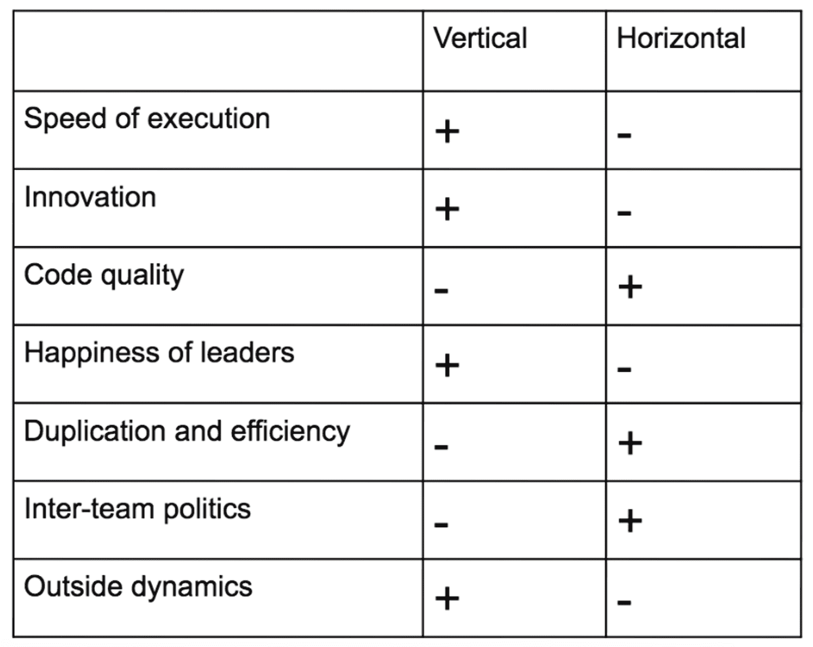
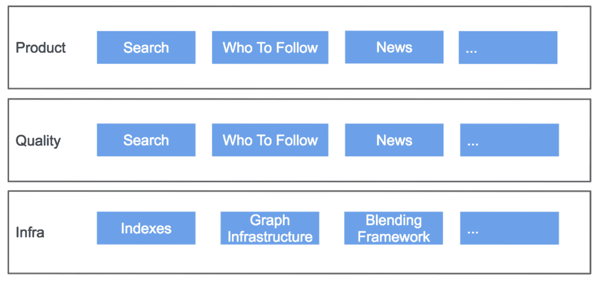

# 我们希望了解的关于构建数据产品的一切|第一轮回顾

> 原文：<http://firstround.com/review/everything-we-wish-wed-known-about-building-data-products/?utm_source=wanqu.co&utm_campaign=Wanqu+Daily&utm_medium=website>

“我们能说些什么来帮助您避免因系统故障和数据损坏而不得不忍受的痛苦、头痛和熬夜？”

这是 DJ 帕蒂尔 在第一轮最近的首席技术官峰会上开始他的会议的方式。前**[relatiq](https://www.relateiq.com/ "null")**产品副总裁，现 **[美国](https://www.whitehouse.gov/blog/2015/02/18/white-house-names-dr-dj-patil-first-us-chief-data-scientist "null")** 首席数据科学家，帕蒂尔说 20 分钟根本不够用来总结所有给他带来变革性教训的失误。在与 **[Ruslan Belkin](https://www.linkedin.com/in/rbelkin "null")** 【现为 [Salesforce](http://www.salesforce.com "null") 工程副总裁的台上，他说他们的目标是只分享与构建和发布数据产品相关的最重要、最显著的错误和经验。

这始于一个常见的错误，即“数据产品”一词仅指 Twitter 或 LinkedIn 等应用程序，在这些应用程序中，社交图就是一切。越来越多的产品落入这一保护伞之下，包括硬件、可穿戴设备和任何其他收集数据并使数据对用户有意义的产品。为此，贝尔金和帕蒂尔的建议适用于整个创业生态系统。

“当你更广泛地考虑数据产品时，你会开始意识到，即使是公司内部的仪表盘也很重要。帕蒂尔说:“突然间，你的视野开阔了，你可以开始创建流程，让你能够理解、大规模制造和销售东西。那么，为什么很少有公司谈论或强调构建有用的数据产品呢？为了回答这个问题，帕蒂尔引用了著名经济学教授丹·艾瑞里的话:

**实际上，这可以归结为一个事实，即构建大规模的数据产品非常困难**。在这里，Belkin 和 Patil 提供了一些他们艰难地学到的有见地的策略，以便其他人可以更轻松地开始创造大胆的新产品，这些产品将改变我们看待世界和与世界联系的方式。

# 数据产品需要以不同的方式构建

对于数据产品来说，将东西拼凑在一起并建立原型可能和其他产品一样简单。但是在大范围内，你会遇到一系列独特的挑战。你必须在头脑中有一个前进的弧线或计划。它们从来都不是一次性的或独立的产品。因此，你不能像过去那样，只是构建、测试、滚动和运行。

你必须从一个非常基本的想法开始:**数据超级乱**，数据清理将永远是字面上 80%的工作。换句话说，数据就是问题。

“如果你拿早期的 LinkedIn 来说，人们说他们在 IBM 工作的方式有 4000 种变化——IBM，IBM Research，Software Engineer，所有的缩写，等等。”帕蒂尔说。

如果你不从一开始就考虑如何保持你的数据整洁，你就完了。我保证。

"事后试图清理至少需要几个月的时间."

为了避免这种困境，你应该首先构建简单的产品——超级简单的东西，计数练习，像协作过滤器之类的东西，只是零和一。在大规模实施的情况下，所有这些事情都会变得更加困难。“如果你试图构建像机器学习这样疯狂而雄心勃勃的东西，你会失败的。把管道和其他东西做好，然后在此基础上进行建设。”

# 以强有力的方式反馈数据

这方面最好的例子之一也来自 LinkedIn。这个机制可以显示谁最近查看了你的个人资料。这种信息会将流量推回到你的网站，并保持它回来。

“这里常见的错误是，你看到了回馈数据是多么伟大，所以你想，‘让我们给予更多吧！“更多！”但是，向页面添加数据实际上与你获得的点击量成反比。你必须为你的观众找到合适的平衡点。"

当你添加更多数据时，你让你的用户陷入瘫痪。他们不知道该怎么办。

决定向人们公开什么样的数据不仅仅是关于多少，还与它说了什么有关。帕蒂尔和贝尔金的一个想法是向人们推销工作——比如，“嘿，你应该申请这份工作，因为它符合你的技能！”很快，他们意识到这种方法充满了危险。

“我们很有可能会不小心推荐一位更资深的人去申请实习，或者推荐一位已经确认是加州居民的人去爱达荷州工作。帕蒂尔说:“当这种事情发生时，人们会非常恼火，这会很快毁掉你的品牌。“你必须考虑当用户看到这个特定的功能时，他或她实际上会是什么样的。这就是你需要聪明的地方——在数据产品方面，聪明十有八九胜过聪明。

在这种情况下，聪明的解决办法是从一个不同的角度来处理工作建议。如果“Bill”是他们试图联系的用户，那么他们没有直接向 Bill 发送推荐的职位空缺，而是决定向他的网络发送简短通知:*推荐 Bill 担任此职务*。它使用完全相同的算法，但稍加改动，就解决了困难的相关性问题。

帕蒂尔说:“如果比尔从他的一个朋友那里听到他们认为他应该接受一份工作，他仍然可以说，‘是的，当然，伙计，你是个混蛋’，但这种情况比较少见，网站永远不会受到指责。”。“除此之外，我们开始收集所有允许使用的数据，以了解该功能的情况，并使其变得更好。”

# 我们没有时间把它做好，但我们有时间重新做一遍

这是贝尔金最喜欢说的一句话，强调把东西拿到门外，尝试一下，一旦有了更多的知识再迭代的重要性。

前阵子 LinkedIn 建了一个产品叫 Talent Match。这个想法是，一家公司应该能够发布一个职位空缺，并为符合描述的人获得最佳推荐。在他们尝试扩展它之前，它一直工作得很好，并且出现了各种各样的复杂性。

“事实证明，我们必须对所有这些系统进行迭代，直到我们能够理解正确的功能组合和正确的评估框架。帕蒂尔说:“在我们找到合适的材料之前，我们不知道如何大规模生产。”

许多数据产品需要时间来成熟，并产生您需要的信息来使它们变得更好。

“这可能很难，甚至像苹果这样的公司有时也不得不为质量差的数据产品向客户道歉，并推荐竞争对手的应用程序，”Belkin 说。这个问题影响到各种规模和技能水平的公司。

在 LinkedIn，“你可能认识的人”功能始于一名工程师笔记本电脑上的一个大 python 脚本。直到 2008 年，该功能推出两年后，它才开始推动该平台的合理增长。

Twitter 搜索也发生了同样的事情。它最初是作为 Twitter 用户的工具推出的。但直到 2013 年年中，它才成为流量和参与度的主要驱动力。

永远不要试图按照固定的时间表推出复杂的数据产品。

DJ Patil Speaking at CTO Summit in San Francisco.

# 从哪里开始建设

许多人选择通过对有问题的产品建模来开始构建。有些从特征发现或特征工程开始。其他人从构建基础设施开始，以提供大规模的结果。但是对于 Belkin 来说，数据产品只有一个正确的答案和起点:**了解你将如何评估性能并构建评估工具。**

“迄今为止，我工作过和交谈过的每一家公司都有同样的问题，没有一家例外——数据质量差，尤其是跟踪数据质量差，”他说。"要么有不完整的数据，丢失的跟踪数据，重复的跟踪数据."

要解决这个问题，必须投入大量的时间和精力监控数据质量。您需要像监控站点 SLA 一样仔细地监控和提醒。您需要将数据质量错误视为比第一优先更重要的事情。如果发现数据质量问题，不要害怕部署失败。但是根据贝尔金的说法，有一件事你一定不能做:

“如果你有数据质量问题，不要提交给苹果商店，”他说。“您必须确保您拥有完全正确的工具，确保您拥有针对所有正在跟踪的事件的可靠架构，以及可以集成到开发流程中的架构注册表。”

为了巩固这些经验，Belkin 在员工会议上首先快速回顾了一下仪表盘。他个人一天要看 20 多次，但是发现积极地讨论可以更快地发现问题和潜在的问题。结果，在他们有机会成为灾难之前，他们被更快地解决。

# 产品飞行前清单

在向用户发布数据产品之前，您应该按照以下清单进行操作:

*一-产品必须工作*

在职业生涯的早期，贝尔金曾在网景公司工作，他记得前联邦快递公司的首席执行官吉姆·巴克斯代尔说，“看，如果你每天错过投递 1%的包裹，在 100 天内，一个重要的客户群实际上会感到不安。”你需要考虑的是用户多久会看到不好的结果？

把它放在科技消费产品的背景下:“人们能接受每三个月在他们的新闻订阅中出现一次色情内容吗？六个月？九个月？”贝尔金说。"你必须弄清楚什么是可以接受的水平."

你会如何处理尴尬的内容和推荐？这是一个真正需要你关注的问题。“‘哎呀’时刻无论做什么都会发生。你会怎么做？会不会急着回滚软件？您会尝试通过在一个实时生产系统上更改数据库中的记录来纠正某些错误吗？通过从搜索索引中删除一些东西？通过在系统运行时再次提升排名？所有这些通常都不是好主意。你应该提前预料到这种可能性，并制定出可以立即部署的解决方案。”

*二——它必须为用户工作*

你必须把你在用户面前展示的任何东西放在他或她的参照系中。他们必须明白，他们看到信息是因为一些具体的东西——要么是因为他们关注了某个用户，要么是因为他们采取了某个行动，甚至可能是因为他们没有采取行动。

重要的是，你不能呈现与用户过去对你的品牌或产品的体验脱节的数据或信息。没有人希望事情随机发生或出现。暧昧会失去用户。

例如，将 Twitter 个人资料放在你已经认识的关注这个人的人的环境中，会让你更有可能关注他们。这是明确的下一步行动。

*第三——用户必须感到安全*

“这就是我所说的泰迪熊原则，”贝尔金说。“问问你自己，‘用户会觉得你的产品令人毛骨悚然或者对他们有害吗？’不一定，但用户对这些问题的看法会对你的平台造成长期损害。"

首先，你必须确保个人身份信息不会泄露。这不是开玩笑。由于产品设计或实现中的缺陷，这种情况总有可能发生。你可能会被黑。您的某些数据可能没有正确加密或匿名。这一切都很严重。你必须尽你所能，不仅要防止这种情况发生，还要通过良好的设计和可靠的用户体验传达你不会让这种情况发生。用户通过最细微的线索来决定他们是否应该信任一个产品。

*四人用户必须有掌控感*

你呈现用户设置的方式——尤其是当它们涉及隐私时——非常重要。你需要想出最好的方法来做到这一点，不要让人们不知所措，而是清楚地展示他们的选择，让他们觉得他们对何时与谁分享有完全的决定权。这往往就是一个人有没有回来的区别。

*五-有美国以外的用户*

数量惊人的人没有意识到他们的大多数用户生活在美国以外。“根据我的经验，多达 35 种语言可能与您的公司相关。在不同的语言中，数据和选择往往变得更加有限。许多用户会说多种语言。贝尔金说:“除非你做好计划，否则不付出额外的努力，你可能无法给每个人提供同样质量的体验。

即使你现在在一个小的初创公司，缺乏考虑国际化的带宽，这些都是你需要为解决问题打下基础的顾虑。你不可能拥有一个全英文的大型产品，然后突然决定它需要 35 种以上的语言。如果你有全球抱负，你必须在时机还不成熟的时候就开始考虑这个问题。

# 如何组织你的团队

Belkin 总是收到这样的问题:当你一次构建和迭代多个产品时，你如何组织你的产品和工程团队？人的正确配置是怎样的？

"这带来了一个古老的争论:你应该垂直还是水平？"正确答案是什么？

“没有一个通用的正确答案，但对于你所处的公司阶段，有一个正确的答案，”贝尔金说。我喜欢以功能矩阵的形式来考虑它，就像这样

“从这些方面评估你在做什么——执行速度、创新、代码质量、用户满意度有多重要？什么样的团队间动态需要为产品的构建和扩展而工作？”

一般来说，垂直整合的团队在执行速度或创新方面更胜一筹。人们更快乐，外部关系也更好，这仅仅是因为团队与业务目标更加一致。

横向团队通常会产生更高质量的产出。他们更有效率，通常更擅长团队间的互动。

真正的关键是不断试验和迭代，不仅仅是产品，还有如何构建它们。你不可能一下子解决你的工作方式。新的数据将会显示出来，你可以将它们引导回你的流程中。不要指望在拍摄中就能搞定——尤其不要指望随着你的观众和公司的增长，这种轻松程度会持续下去。

“构建数据产品有一个很好的比喻，”贝尔金说。“这很像爬山。在你之前有很多人来过，在你之后也会有很多人来。有些路还没有走过，但如果你一直盯着顶峰，并迈出一小步，你一定会到达那里。”