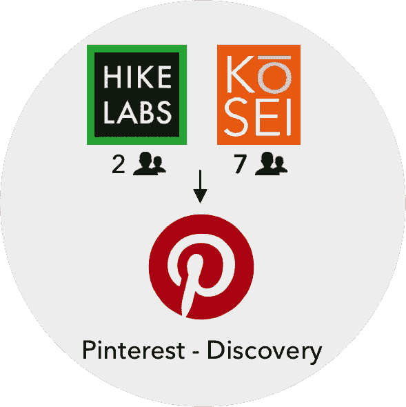
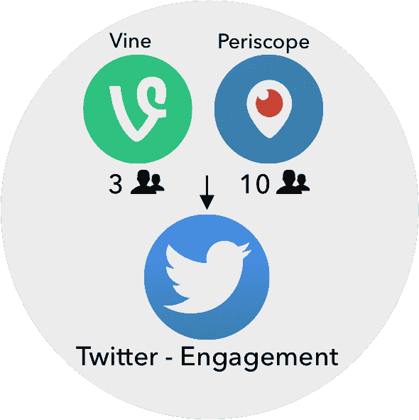
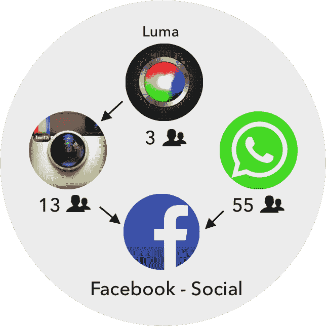
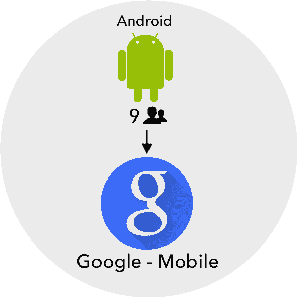

# 小型创业公司收购的兴起 TechCrunch

> 原文：<http://techcrunch.com/2015/04/15/rise-of-micro-startup-acquisitions/?utm_source=wanqu.co&utm_campaign=Wanqu+Daily&utm_medium=website>

阿米特·卡帕是谷歌的联合创始人兼首席产品官

[Fiddler Labs](https://www.fiddler.ai/)

，一个可解释的人工智能初创公司，使企业能够部署和扩展无风险和无偏见的人工智能应用程序。

More posts by this contributor

**编者按:** *阿米特·卡帕是[寓言](http://parable.it/)的联合创始人，这是一个为 [iOS](https://itunes.apple.com/us/app/parable/id908922457) 开发的创意图片网络。此前，他创建了 Flockish(被 StubHub-易贝收购)，在 PayPal 领导移动支付产品，并在微软担任产品开发职务。*

最近 Pinterest [收购一家两人创业公司](https://beta.techcrunch.com/2015/04/03/pinterest-acquires-team-from-hike-labs-including-google-reader-blogger-veteran-jason-shellen/)的消息可能让你们大多数人感到困惑。不应该。与 Kosei 一样，Hike Labs 也是一项专注的小额收购，旨在支持 Pinterest 的内容发现工作。更多的公司应该效仿他们的做法。

历史上，科技公司一直瞄准拥有成熟产品、成熟收入流以及数百名员工和数十亿资本的初创公司。然而，在过去的几年里，投资明显转向越来越小的团队，这种脱离纯粹收购的趋势正在加速。

脸书、谷歌、推特、苹果、LinkedIn 甚至易贝都是开拓者。经过多年专注于数十亿美元的交易后，重振旗鼓的微软最近通过收购 LiveLoop、Sunrise 和 completi 加入了这场竞争。

发布软件产品的成本一直在快速下降，而更多的分销渠道却在不断增加。例如，苹果特色的[寓言](https://itunes.apple.com/us/app/parable/id908922457)应用程序是由我们的两人团队在短短几个月内为全球观众推出的——这在十年前是不可能的任务。各公司也开始在路线图的早期主动评估补充产品，结果押注于产品尚未准备好的团队。

因此，我们正走向一个激动人心的*微型*团队收购时代。我称这些*收购为*收购*、*收购，因为它们的意图是用即将推出的、或许未经证实的产品和它们的创始团队来提升一个已建立的产品线。

更多的公司应该加入进来。

## 产品

虽然生产一个产品更容易，但是生产一个合适的产品更难。尝试在大公司开发新产品。即使公司进行试验，它们也可能上市较晚，缺乏成功的诀窍，或者在错误的想法上加倍下注。还记得 Google Wave 吗？

加入一个微型团队，其产品是公司产品组合的重要扩展。这个具有执行力的主题专家团队比公司内部的自助团队更好。更有商业意义的做法是将团队带入公司内部，并为其补充更多的资源。

Twitter 的两项引人注目的收购——潜望镜和 T2 藤蔓——都是在产品发布前完成的。以 Twitter 网络为发射台，三人 Vine 和 10 人 Periscope 团队发现其他人以前尝试过的想法获得了成功。作为回报，Twitter 以低廉的价格扩张到创意视频和直播领域，推出了重磅应用。

## 天赋

山谷中的人才大战是传奇。众所周知，在正确的时间拥有正确技能的正确的人可以加快企业的业务需求，例如，在易贝收购了我的初创公司 Flockish 后不久，我的移动机票预订量就从年化 3000 万美元增长了 10 倍。微型团队可以进一步成倍放大这种天赋的熟练程度。由于他们在开发产品时已经在该领域有所涉猎，你可以避免新员工典型的学习曲线。这种生产率乘数需要溢价。现在想象一下这个团队在收购方提供的所有资源下的生产量。

当 Instagram 收购 Luma 时，它组建了一个拥有新生视频稳定技术的小型 3 人团队。这个团队在[发布 Instagram 最好的新补充应用](https://beta.techcrunch.com/2014/08/26/instagram-hyperlapse/)Hyperlapse 中发挥了关键作用。

## 费用

拥有庞大团队的初创公司收购目标通常是融资超过 4000 万美元的 B 轮后公司——以这些估值，它们绝对不便宜。它们的规模也增加了业务和整合风险。

微型团队通常处于 B 轮融资之前，平均融资额不到 1000 万美元，种子期团队的融资额只有几百万美元。它们的小尺寸简化了产品和团队集成。你甚至可以从企业战略的角度合理化收购——如果你能防止它落入竞争对手手中，甚至在未来成为竞争对手，那就划算了。

更糟糕的情况是，如果产品失败，收购者会注销产品成本，这与内部制造没有什么不同；但是他们仍然可以保持一个伟大的团队。

## 态度

最后让我们谈谈态度的无形好处。初创公司的最初几个人是典型的冒险家，他们天生就有不同的思维方式；没有达不到的目标，没有克服不了的障碍。这种心态正是疲惫的团队定期需要的。

这种健康的灵感冲击可以为收购团队的士气和生产力创造奇迹。谁能忘记谷歌以 5000 万美元收购的安迪·鲁宾(Andy Rubin)和他不屈不挠的 8 人 Android 团队？安迪从他在 Danger 的经历中总结出的永不言败的态度，在动员谷歌对抗 OEM 方面发挥了重要作用，这些 OEM 推动了 Android 的统治地位。

有一点是肯定的:收购团队将不断变小。唯一的问题是，企业要多快才能在 M&A 战略工具包中增加新的收购项目，并在竞争对手之前开始培育有前景的交易流。