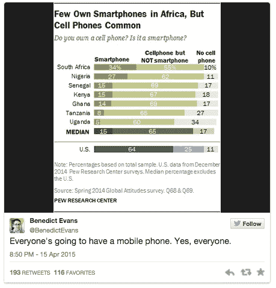
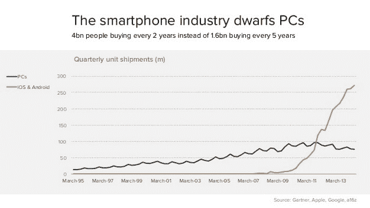
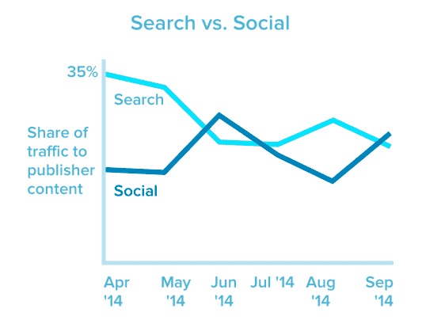
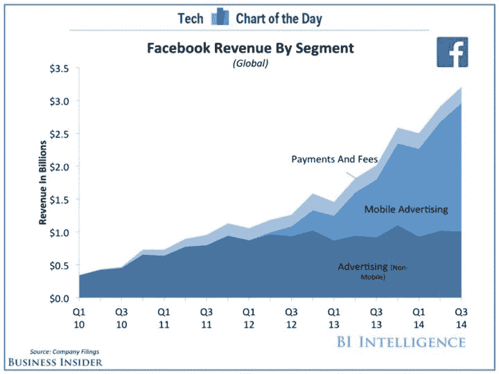
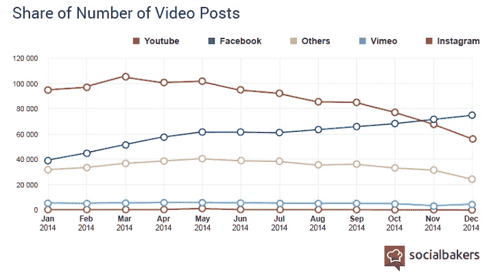
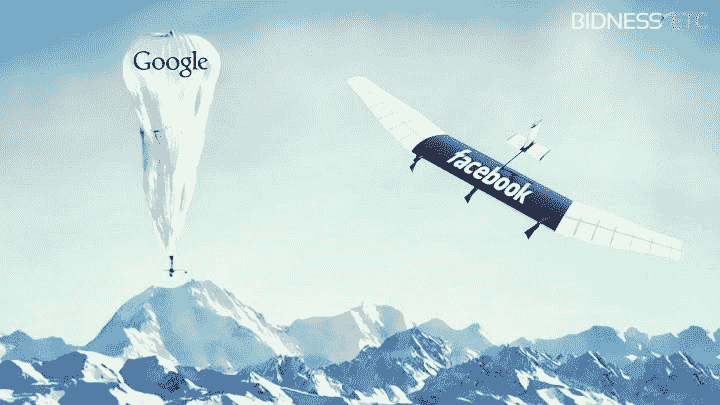
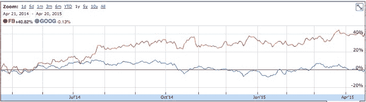

# 脸书杀死谷歌的秘密计划——并在此过程中成为第二个万亿美元的公司

> 原文：<http://venturebeat.com/2015/04/22/facebooks-secret-plan-to-kill-google-and-become-the-second-trillion-dollar-company-in-the-process/?utm_source=wanqu.co&utm_campaign=Wanqu+Daily&utm_medium=website>

你错过了明年 2022 年 GamesBeat 峰会的一个环节吗？所有会议现在都可以在我们的点播库中观看。[点击这里开始观看](https://attendees.bizzabo.com/412979/agenda?date=1666742400000)。

* * *

脸书想要杀死谷歌。好了，我说了。你可能认为我疯了，但有一堆宏观趋势聚集在一起，以及脸书的几个步骤是正确的。支持这个观点。但首先，声明:我是 AdEspresso 的联合创始人，这是一家脸书的合作伙伴，为 SMB 和 SME 管理广告。作为营销合作伙伴，我们确实可以访问未向公众披露的特许信息，以及对约 2.5 亿美元的脸书广告数据的更广泛数据集的看法，但接下来的分析并非基于上述任何内容，而是基于过去几周披露的公开信息以及思想领袖的公开见解。现在，让我们开始有趣的部分。

**1。手机的宏观趋势**
这是一个简单的问题。但是，如果你正忙着发微博、实时聊天或更新状态，你可能仍然需要复习一下……安德森·霍洛维茨公司的本尼迪克特·埃文斯在这方面做得最好:

[

<noscript></noscript>](https://venturebeat.com/wp-content/uploads/2015/04/cell-phones-in-Africa.jpg?resize=459%2C478&strip=all?strip=all) 
是的，南非没有手机的人口比例低于美国。印象深刻吧。这只是一个很小但意义重大的例子，说明了移动电话正在变得多么庞大。与个人电脑的采用情况相比，这一趋势更加令人印象深刻。同样，埃文斯从他几个月前的演讲“[移动正在吞噬世界](http://ben-evans.com/benedictevans/2014/10/28/presentation-mobile-is-eating-the-world)”中说道:

[

<noscript></noscript>](https://venturebeat.com/wp-content/uploads/2015/04/smartphones-vs.-pcs.jpg?resize=626%2C353&strip=all?strip=all) 

那是因为个人电脑不是真正的“个人”；它实际上是由一小部分人分享的。至少大部分时间是这样。然而，智能手机是非常个人化的，事实上，以至于 91%的美国公民在 24/7(T3)都可以接触到他们的移动设备。我猜你也是。

**2。消费者行为的无声转变**
想一想。你上一次在谷歌上搜索新闻是什么时候？如果你是一般人，那可能是前一段时间了。那是因为现在的新闻是通过社交媒体*在*发现的，而不是直接*搜索*获得的。如果你像我一样，你很少上新闻网站，你只是在你的新闻订阅上寻找新闻。这张来自 [Marketing Land](http://marketingland.com/social-passes-search-referral-traffic-109117) 的图表很好地展现了我们正在谈论的转变。

<noscript>T3】</noscript>

但比搜索新闻更重要的是，还有一个变化你可能还没有意识到:手机正在大幅减少你的搜索次数。你在手机上不搜索，你打开应用程序。让那件事过去一会儿。当你坐在电脑前时，几乎浏览器中的每一个动作都是从搜索开始的。在手机上？没有那么多。写东西又慢又没效率，这就是应用存在的原因。轻轻一敲就搞定了。鉴于谷歌的大部分收入来自搜索，这两种行为(移动发现与桌面搜索)的结合可能会对谷歌产生有史以来最大的威胁。

**3。脸书在手机和视频**
上大获全胜。让我们看看由[商业内幕](http://www.businessinsider.com/chart-of-the-day-facebook-growth-comes-from-mobile-ads-2014-10)发布的图表，该图表基于脸书 2014 财年第三季度的收益报告。脸书的收入增长实际上完全是由移动业务推动的。哇哦。(更新:脸书刚刚公布了 Q1 的季度业绩:[其 73%的收入来自移动广告，高于去年同期的 59%。](http://www.theverge.com/2015/4/22/8470633/facebook-q1-2015-earnings-report))

<noscript>T3】</noscript>

因此，虽然谷歌在台式机/笔记本电脑上的房地产(又名，它可以用来为你提供广告的空间)在未来几年不会显著增长，而且鉴于向移动设备的转移(这已经占了整体网络流量的大部分)，实际上还会减少，但脸书的房地产会。还有更多。说到视频，这个数字更令人印象深刻。YouTube(谷歌的财产)在 10 年内完成的事情，脸书在不到一年的时间内就完成了(据今日新闻报道，点击量达到每天 40 亿次)。哎呦。Socialbakers 在一月份写了一篇关于它的文章，说[脸书视频现在比 YouTube 上的品牌](http://www.socialbakers.com/blog/2335-facebook-video-is-now-bigger-than-youtube-for-brands)还要多，并附上了下面的图表。

[

<noscript></noscript>](https://venturebeat.com/wp-content/uploads/2015/04/Number-of-video-posts.jpg?resize=716%2C408&strip=all?strip=all) 
**4。然后是社交的未来**
哦，我没有提到谷歌已经试图通过 Google+进入社交，这很可能是继 Wave 之后第二糟糕的谷歌产品(你可能记得，也可能不记得)。当然，重点不在于尝试和失败，这很好，脸书也推出了数以吨计的产品，但没有任何进展(脸书信贷，有人吗？).但是，尽管脸书能够将这种方法融入到“黑客”文化中，迄今为止取得了回报，但谷歌已开始被视为一家同时做太多事情的公司——公平地说，其中一些事情非常令人印象深刻且具有前瞻性——但没有真正的方向。就在几天前，一些分析师甚至称之为“谷歌的微软时刻”(这里是[电讯](http://www.telegraph.co.uk/finance/newsbysector/mediatechnologyandtelecoms/digital-media/11545134/Google-faces-its-Microsoft-moment.html)，这里是[商业内幕](http://www.businessinsider.com/googles-microsoft-moment-2015-4))。如果你问我，我觉得这不算是赞美。

我还没有提到脸书和谷歌正在努力让下 20 亿人上网，一边是无人机，另一边是气球。当然，这是一种人道主义的努力，但它也有与商业相关的后果，因为这样做将意味着他们的总潜在市场翻一番，从而增加收入潜力。但在这两者之间，由于上述趋势，脸书是受益最大的一个。当然，脸书不只是在玩虚拟现实——它最终也进入了支付领域。真实的。

<noscript></noscript>

还有内容的未来呢？就在几天前，有消息透露，脸书似乎正在开发一个交换平台，不是为了广告，而是——等等——“社交网络平台之外的网站上的内容(如品牌的付费新闻文章或视频，也称为原生广告)现在猜测可能还为时过早，但尽管谷歌没能吃掉脸书的午餐，这可能是脸书(不那么)慢慢吃掉谷歌的一种方式。再加上付款，你就有了核武器。

**5。成为 1 万亿美元公司的途径**
让很多人感到惊讶的一件事是，脸书和谷歌的市值没有太大差别。截至上周末，脸书为 2260.9 亿美元，而谷歌为 3596.3 亿美元。脸书几乎是谷歌的三分之二——尽管差别很大。在过去的 12 个月里，脸书的市值同比增长了 41%，而谷歌几乎停滞不前。

[

<noscript></noscript>](https://venturebeat.com/wp-content/uploads/2015/04/Facebook-vs.-Google-market-cap.jpg?resize=718%2C201&strip=all?strip=all) 
如果全球市场有容纳一万亿美元公司的空间(苹果很快就会成为)，那么就有容纳一家以上公司的空间。如果脸书能够继续保持 25%至 33%的年增长率，它就有真正的机会在 5 至 7 年内达到 1 万亿美元的市值，从而成为第二家达到这一巨大里程碑的公司。

毕竟，脸书正在成为许多人的默认网络，特别是在千禧一代中(正如《独立报》在此指出的那样)，最终将自己定位为互联网的社交识别层，拥有一个蓬勃发展的生态系统，并且似乎根据 T2 上次 F8 主题演讲有一个非常清晰的未来 5-10 年的路线图。事实是，脸书拥有社交+拉动相关活动(发现、视频、活动、游戏)，而谷歌拥有商业+推动相关活动(搜索、日历、电子邮件、驱动)。从这个分析中得到什么取决于你——但是看着这个过程结束会很有趣。

*Armando Biondi 是 [AdEspresso](http://www.adespresso.com) 的联合创始人和首席运营官，这是一个脸书广告优化的 Saas 解决方案。此前，他与他人共同创立了五家科技和非科技公司。他也是 Mattermark 和 20 多家公司的天使投资人。他还是 500 Startups network 的成员，曾经是一名电台演讲者，偶尔也是一名导师。*

**VentureBeat 的使命**是成为技术决策者获取变革性企业技术知识和进行交易的数字城市广场。[发现我们的简报。](https://info.venturebeat.com/website-preference-center.html)