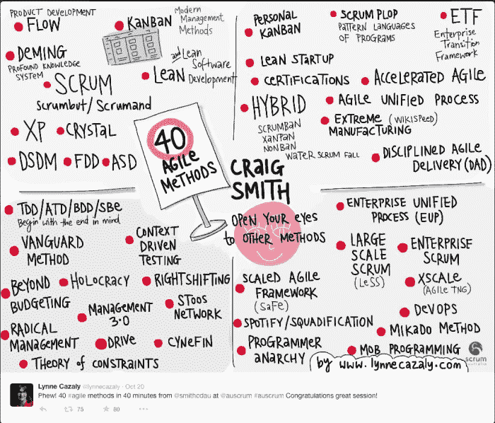
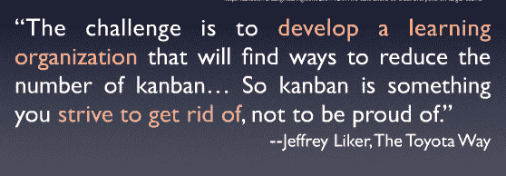
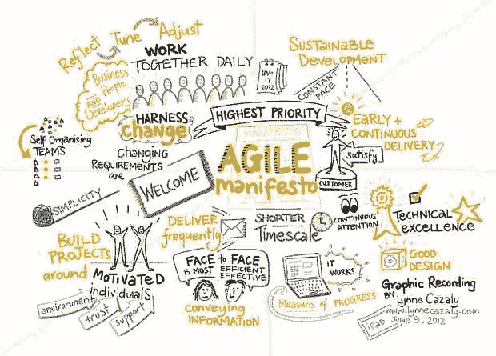
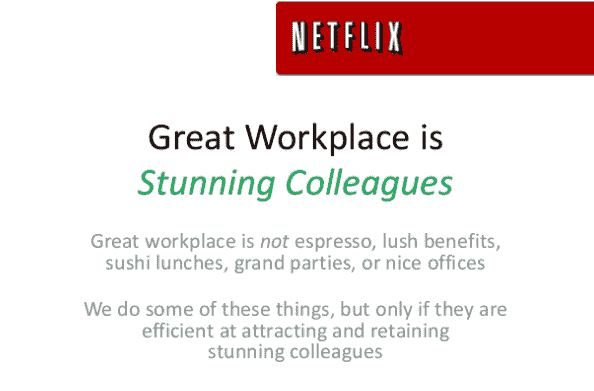
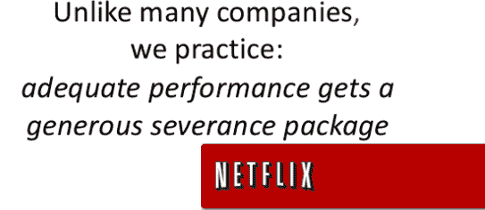

# 吸引优秀候选人的文化——递归博学

> 原文：<http://radianttiger.com/2015/04/20/a-culture-that-attracts-quality-candidates/?utm_source=wanqu.co&utm_campaign=Wanqu+Daily&utm_medium=website>

除了敌意面试的痛苦循环和理性面试的 T2 转变之外，下一次变革必须是创建一家人们愿意为之工作和吹嘘的公司。我们应该让开发人员敲门，从窗户往里看，希望在这样的地方工作。但是怎么做呢？

作为一名充满激情、积极参与的员工，我对雇主有太多的要求。任何组织如何才能在我需要的所有事情上表现出色，并让我真正实现目标？看看你作为一名软件开发人员需要的东西，以及雇主需要提供的东西，以成为一个令人满意的地方:

*   生产任务
*   健康的顾客
*   协作但不分散注意力的工作空间
*   创造性的想法和愿景
*   订婚的同事
*   一套可操作的工作实践
*   一个激励你的任务，让你不断受到鼓舞
*   技术和商业基础设施
*   关心你成长的支持型导师
*   自我实现和长期成长的机会
*   一个欢迎你加入的人类社区
*   对您健康的耐心、关心和经济支持

似乎很明显，对单个组织来说，所有这些要求都太多了，然而根据美国全职工作的结构，我们只能选择一个组织来满足大部分需求。

如果你想经营一家好公司，同时雇佣并留住优秀员工，你需要对所有这些需求都有答案。在吸引和雇用新员工的过程中，这些事情需要进行沟通，否则你会遇到和你所在街道和城市的其他企业一样的问题:找到“合格”的人。

## 优秀的经理

这里的一个重要因素是优秀的管理者。当涉及到简单的任务管理和交流时，软件工程师的技能水平相差很大。将文化因素和职业发展融入其中，你很难找到一个善于自我管理的优秀程序员。如果你进一步增加任何真正的组织障碍，即使是一个好的自我管理人员也不可能自己完成这项工作。不幸的是，大多数技术经理都是根据他们在工程团队之外推动任务进展的能力从外部任命的。培养员工这一更广泛的目标并不在授权范围之内。

> 当工程管理做得好的时候，你关注的是三件大事。你直接支持你团队中的人；你管理团队间的执行和协调；随着组织的成长，你会退后一步去观察和发展更广泛的组织及其流程…有两件事你应该始终考虑:人们的日常生活和他们的年复一年。
> 
> 杰西卡·麦克凯勒

一个经理需要成为勇气和使命的代言人，因为不是团队中的每个人都能勇敢和专注。

> 每个委员会或组织都至少有一个善意的人在推动事情变得更加平均。…而且，通过放大蜥蜴大脑的声音，他进入了我们的皮肤，我们后退了，至少后退了一点。我们让作品更平均一点，更差一点。
> 
> 塞斯·戈丁

传统的工程管理有一个缺点。开发我们产品的最佳决策通常是由执行实际实现的人做出的。他们对自己的选择有一种“老板”无法复制的承诺、洞察力和感觉。与此同时，团队需要履行的许多职责不一定是软件工程师的首要关注点，例如与其他团队进行清晰而冗余的沟通，组织高级路线图，担任教练/顾问/导师，创建开明招聘的框架，等等。

典型的以权威为基础的管理者被激励去“指挥”决策，尽管他们并不完全知情，同时把促进团队和文化的具体工作留给他的下属，因为这些任务有损他的尊严。

我们的经理不是我们的父母。他们的工作不是告诉我们打扫房间和吃菠菜。我们的经理应该是我们的教练，我们的导师，我们的修理者。老派的“房间里的成年人”管理者不会建立吸引和留住优秀工程师的团队。

> “管理”的世界是垂直的。它的自然栖息地包括纽约等地的高楼。它的思维模式也是垂直的。正如加里·哈默尔经常解释的那样，“战略是高层制定的”。“权力一点一点往下流。大领导任命小领导。个人竞争晋升。薪酬与级别相关。任务是分配的。经理评估绩效。规则严格限制了自由裁量权。这个垂直世界的目的是不言而喻的:为股东赚钱，包括高管。它的沟通是自上而下的。它的价值是效率和可预测性。在这个世界上成功的关键是严格控制。它的动力是保守的:保护过去的收益。它的劳动力士气低落。它很难创新。它的公司正受到系统性的干扰。它的经济——传统经济——正在衰落。
> 
> 史蒂夫·丹宁

在许多情况下，很容易看出，作为一名经理，薪酬方案的一部分是对下属行使权力、限制他们获取信息的特权，以及获得比他们更高的薪酬和更好的工作设施的满足感。一个以这种方式激励管理层，并吸引想要这种“报酬”的经理的组织，将很难让他们支付给工程师的报酬物有所值。

> “管理者通过向下属支付较低的薪酬来获得非金钱形式的福利，这种方式减少了企业的总产出，而让管理层同意不以这种方式获得薪酬存在协调和委托人/代理人问题”。
> 
> [flatmoney](https://news.ycombinator.com/item?id=9015214) (黑客新闻)

尽管如此，仅仅因为经理通常很穷并不意味着他们不是必需的。信息共享、目标设定和权力不平等是商业生活的事实，如果不是人类生活的话。必须有人对这些水域的消失负责。如果你不说出那个人的名字，你就没有消除权力的焦点，你只是让你更难找出谁掌握着这个焦点。

> “扁平”组织通常是隐藏真实权力结构的诱人谎言。如果鲍勃是一个每周工作 15 分钟的白痴也没关系；如果在谈到你对公司的价值时，首席执行官会相信鲍勃的话，而不是你的话，那么鲍勃就是你的老板。…为什么人们讨厌管理层:我们都意识到，管理层是为自己的利益服务的，而不是为员工或公司的利益服务的。所有这些都表明，“无管理”要么倾向于产生一个紧急的、更少责任的管理/警察力量，要么倾向于意味着权力集中在最高层。
> 
> 迈克尔·欧·丘奇

管理人员在工程团队中的另一个重要角色是最大限度地利用团队成员的特殊才能，同时弥补这些员工对平等团队的破坏。工程师类型如[自由电子](http://randsinrepose.com/archives/free-electron/)或[蜜獾](http://innocuous.org/articles/2015/03/28/identify-manage-honey-badger-developer/)需要特殊的适应。团队需要[马厩和意志派](http://randsinrepose.com/archives/stables-and-volatiles/)之间的谈判。外向者和善于社交的团队成员提供了很多显而易见的价值，因此管理者需要提升内向者的地位。

与所有这些不同类型的人打交道，同时持续、认真地努力为他们和公司实现最佳结果是一项真正的工作，它需要有才华、有奉献精神的人。创建或找到这些人超出了这篇文章的范围，但是 10 倍的开发人员和 10 倍的团队非常需要这种领导力。

> 当你做出一个关键的决定时，你必须明白从所有的角度来看它会被如何解读。不仅仅是你的观点，不仅仅是和你谈话的人，还有不在房间里的人，其他所有人。换句话说，在做出关键决策时，你必须能够从整个公司的角度来看待决策。你必须把每个员工的观点加起来，然后把它融入到你自己的观点中。否则，你的管理决策将会产生奇怪的副作用和潜在的危险后果。这是一件很难做的事情，因为当你做决定的时候，你经常会承受很大的压力。
> 
> 本·霍洛维茨

## 良好的文化

你对这些人的公司文化感到兴奋吗？

(http://www.youtube.com/watch?v=tILlZRLhBJE 的视频已被删除)

阿尔伯特

Ableton 围绕非常小的团队设计了他们的工作，关注质量，关注每个小团队的自定义流程。他们尝试了更大的团队和 Scrum，但是发现这并没有让创造力流动起来。Ableton 也有发展沙龙和音乐沙龙。开发人员被鼓励互相培训和分享技术。与此同时，他们被鼓励在商业领域工作——在这种情况下是音乐——并在那里分享他们的创造力。开发人员关心产品和任务，并控制完成事情的方式。

> “我们这里有这么多非常聪明、有创造力的人，捕捉他们的想法并鼓励他们的创造力非常重要，非常有价值，我无法想象这不是一个优秀开发团队的组成部分。”

一种授权的、相互联系的文化很难保持下去，尤其是当一家公司的发展超过了最初的 20 多岁的员工时。杰森·伊万尼什(Jason Evanish)最近在博客中讲述了一家公司在这个分水岭上经历的变化。这些问题包括:领导者失去了与所有员工直接接触的能力,“正在发生的事情”不再是普遍的信息，员工变得更加以政治和职业为导向，文化开始变得稳固。他引用了本·霍洛维茨的话:“也许首席执行官最重要的运营职责是为她的公司设计和实现通信架构。架构可能包括组织设计、会议、流程、电子邮件、yammer，甚至是与经理和员工的一对一会议。如果没有一个设计良好的沟通架构，信息和想法将会停滞不前，你的公司将会沦为一个糟糕的工作场所。”([本·霍洛维茨](http://www.bhorowitz.com/one_on_one))。

哦不。现在我做到了。我在网上找到了更多来自 Horowitz 的信息:

> 让我给你分析一下。在好的组织中，人们可以专注于他们的工作，并相信如果他们完成了工作，公司和他们个人都会有好的事情发生。在这样一个组织中工作是一件非常愉快的事情。每个人醒来时都知道他们所做的工作将是高效的，有效的，并对组织和他们自己都有影响。这些事情让他们的工作既有动力又有成就感。
> 
> 另一方面，在一个糟糕的组织中，人们花费大量时间对抗组织边界、内讧和破碎的流程。他们甚至不清楚自己的工作是什么，所以没有办法知道他们是否完成了工作。在奇迹般的情况下，他们工作了很长时间，完成了工作，但他们不知道这对公司或他们的职业生涯意味着什么。更糟糕的是，在伤口上撒盐，当他们最终鼓起勇气告诉管理层他们的情况有多糟糕时，管理层否认存在问题，然后维护现状，然后忽视问题。
> 
> [一定要去读那篇令人敬畏的咆哮](http://www.bhorowitz.com/a_good_place_to_work/)

文化需要一个领导者坚定的价值观声明，他首先考虑事情，做出决定，并持续坚持这些决定。网飞的雷德·哈斯汀斯做到了这一点，并记录了他想要保持的文化。

> 我经常看到首席执行官们明显在即兴发挥。他们缺乏真正的议程。他们使用的幻灯片显然是一小时前放在一起的，或者是从上一轮风投会议中回收的。员工会注意到这些事情，如果他们看到一个没有做好充分准备、依赖魅力、智商和即兴发挥的领导者，这也会影响他们的表现。如果你不模仿和奖励与这些目标一致的行为，那么阐述关于价值观和文化的想法就是浪费时间。
> 
> 帕蒂·麦考德

## 个人成长

> 她说:“你必须有意识地将职业发展融入未来更广泛的工程规划和项目执行中。真正困难的是，没有多少人清楚地知道他们想从工作中得到什么，即使他们知道，他们也不会向经理坦白。优秀的领导者是处理这类数据并使之可操作的专家。…要想与一名工程师建立长期关系，你必须对他们有足够的了解，以便提供一个框架来共同思考他们的职业发展。
> 
> 杰西卡·麦克凯勒

我很难理解我在一个组织工作的长期动机和目标是什么。我真的需要一个有清晰愿景的人来告诉我，企业想要我做什么，成功是什么样子，并帮助我制定策略，对我的贡献给予信任和认可。

> 建立一个官僚机构和围绕衡量绩效的复杂仪式通常不会改善它。
> 
> [网飞](https://hbr.org/2014/01/how-netflix-reinvented-hr/ar/1)

我同意这种观点，尽管我在更多的公司里已经完全放弃了绩效评估的想法。我猜没有评论总比差评好，但是真的不应该是结构化的…应该是有机的，持续的。

> 但是对于每一个“未经雕琢的钻石”，有 9 个同样便宜但定价正确(即不是很好)。在创业阶段，这些公司倾向于认为他们早期的技术雇佣是“绝望的雇佣”，一旦他们能够获得“真正的”工程师、设计师和管理层，就把他们扔到公共汽车下面。这种向上爬的动力——不断寻找比他们现有的“更好”的人——会持续多年，超过真正的创业阶段。
> …
> 高层人员的更替以及优先级和计划的不断变化意味着低层人员很少能完成很多工作。他们没有跑道。问一个在这样的公司工作了四年的老员工他完成了什么，他会告诉你所有不再使用的工作，项目在完成前三个月取消，因为一个新的首席技术官来了，以及这种波动性产生的乏味工作(即技术集成，由于人员流动而需要的维护)的瘴气，尽管这可能是保持公司运转所必需的，但没有显示出宏观速度。这并不能成为升职或晋升的理由。最终，权力大的人意识到，由于管理层的不稳定，他们什么也做不了，于是他们离开了。
> 
> 迈克尔·欧·丘奇

说真的。如果你想学习如何破坏你的工程师的个人成长(你可能正在这样做)，那么阅读上面的文章。如果你想成为一名更好的管理者，有上百万本关于这个主题的书，其中一些是由这篇文章中的人链接的。即使创建自己的系统和良好管理的哲学太难，也有软件可以帮你完成大部分工作。

## 合作完成的好任务

上班有什么好玩的？完成任务。核对清单上的项目就像毒品一样，对于愉快的工作来说是必不可少的。这是简单的部分。除了拥有任务并被允许完成任务的基本好处之外，还有“帮助我的团队”和[“相信别人会帮助我”](https://twitter.com/rands/status/584885495127121920)，以及创建和跟踪所有这些任务。

任务是他们自己的奖励，如果你在任务分配和完成之间有一个健康的关系，你不需要用[虚假的紧迫性](http://watercoolernewsletter.com/3-ways-your-company-culture-is-demotivating-your-people/#.VSQUyVxZTeJ)来挫伤你的人的积极性(尽管，正如在那里讨论的，完成的任务需要**做**一些事情并且有一些**值**)。

任务是发挥创造力的机会，它们与投入你的[小时](http://zachholman.com/posts/how-github-works-hours/)或完成你的工作日没有任何关系。打卡是当你无助地感觉到你的工作没有完成或没有增加价值时发生的事情。这与某些任务的得分相反。

令人惊讶的是，当敏捷过程本质上被设计为提供快速的完成、价值和完成周期时，有多少敏捷过程被“管理”成了永无止境的苦差事。敏捷过程是关于[旋转](http://geekswithblogs.net/theArchitectsNapkin/archive/2011/12/22/spinning-ndash-getting-agile-at-the-core.aspx)一堆可完成的任务！这是你给开发人员的奖励，因为他们忍受了你不断变化的业务需求。

好的任务是在工作之前、之中和之后的沟通过程中产生的。确保你已经尽一切可能让人们在工作时零摩擦地交流。Slack、Skype、IRC、屏幕演示软件都是这一过程中必不可少的开端。视频会议变得越来越容易实现，新的 T2 服务如雨后春笋般涌现，一些完全免费。有配对软件可以让你与屏幕上的两个光标同时共享屏幕。

当然，在你的 bug 追踪器和源代码控制系统中有一些内置的协作特性，但是人们在这个协作领域的创新非常快，如果你只是使用开箱即用的东西，你就落后了。像 Asana 或 [Yammer](https://about.yammer.com/who-we-are/) 这样的企业社交网络是可用的。像 [Peak](http://www.usepeak.com) 这样的工具监控你所有的云工具的活动，让整个团队知道你在做什么，而不需要你填写一份 TPS 报告。

通过了解富有成效的会议，你可以让你的会议变得更好。或者如果那太麻烦，就使用软件来训练你。会议中有很多未被记录的价值，因为人们不会创建议程或者[做会议记录](http://attentiv.com/#what-is-attentiv)。修好它。

一个好的会议应该产生一系列可行的任务，你需要在某个地方跟踪这些任务，对吗？让您的员工完全自由地跟踪他们的任务。尝试不同的任务跟踪系统是个人的乐趣，也是对生产力的投资，而且它在不断发展。没有一个统一的 Harrison Bergeron 解决方案能给你带来那些试图不断改进的有创造力的人所带来的好处。也就是说，有很多选择。您可以将任务列表签入源代码控制中，并将代码作为简单的文本文档。你可以给每个人买富兰克林策划者。Screenful 有大量的集成和漂亮的图形。其他工具将[构建项目和日历以及任务](https://hiveflux.com/tour.html)。一切都很好。使用工具，改变它们，找到有用的东西，不要碍手碍脚，让每个人都集中注意力。玩得开心。

具有待办事项整理、sprints 和任务板的敏捷流程是为了创建工程师们乐于完成的有价值的任务。它不是被创造出来的，也不应该被用来对工程师进行微观管理，以至于他们永远不能发明任何东西。如果你需要控制你的工程师，防止他们用他们的创造力伤害你……你雇错了人(或者你真的破产了)[或者两者都有]。

## 良好做法

良好的实践，包括沟通和文档、代码风格和单元测试、工作流程和评估，以及设计和架构，都是更容易完成工作和获得高质量结果的非常重要的部分。然而，与此同样重要的是，好的实践为团队中的工程师提供了一个发展精通的舞台。这些都是你可以毫无疑问地“擅长”的事情，并且会为此感到自豪和动力，即使当你遇到技术、政治或市场障碍而被拖垮的时候。

发展良好实践的一个很好的领域是远程工作。恶劣的办公环境是一种常见的考验，让任何一群人以任何频率在同一时间一致地呆在同一个地方都是一个挑战，远程工作的能力可能是一个巨大的优势。即使远程工作是例外，而不是常规，创造支持远程工作所需的技能和习惯确实可以提升您的开发实践。

> 自从我们远离了，结对变得非常流行。不与你的同事分享体味，我们只是戴着耳机分享我们的屏幕。我们互相学习，互相挑战。我们保持彼此诚实，远离兔子洞。当事情变得棘手时，我们抓住另一对进行快速群集。有戏谑，有乐趣，有对质量的强烈承诺。我们不断质疑我们的实践，倾听彼此的挫折。“我们是真的在创造真正需要的东西，还是只是让这些故事全面铺开？”
> 
> [打成一片](http://java.dzone.com/articles/what-does-collaborative-remote)

Zach Holman 谈了一点关于 GitHub 的异步和远程工作是什么样的。对于工程师来说，有一些非常自然的方式，通过你的计算机协作来减轻一起做事的开销。他的帖子中我喜欢的一点是，用*代码*和通过*源代码控制*交流可以取代白板和设计会议的需要。在你的结果会出现的媒体上交流，好吗？

无论你实际遵循哪种敏捷实践，学习精益和看板的词汇和工具都是非常值得的。非常聪明的人已经想了很多关于如何交流和组织软件工程的任务，以减少工作量和执行的浪费工作量。精益和看板可以成为让你的日常流程更加顺畅和提高质量的新见解的无尽源泉。

> 工程师不讨厌过程。他们讨厌无法为自己辩护的程序。…如果你想激怒我，如果你想让我大打折扣你的价值，这样做:当我问你一个影响我如何度过我最宝贵的时间的问题时，不要回答这个问题。这种不回答是一个工程师讨厌过程的根本原因。一个应该有助于给宇宙带来秩序的工具是一个在无知者手中煽动愤怒的钝器。
> 
> [Rands](http://randsinrepose.com/archives/the-process-myth/)

看板不仅仅是一块上面贴有便签的板，在板上移动卡片与减少浪费和消除延迟点的想法完全正交(James Shore 和 Arlo Belshee 在他们的[看板](http://www.infoq.com/presentations/Single-Piece-Flow-Kanban)演讲中的单件流中对此有许多见解)。工程看板也是为了[减少多任务](http://availagility.co.uk/2012/01/31/the-science-of-kanban-people/)和通过给你的工人[空闲时间](http://availagility.co.uk/2012/02/01/the-science-of-kanban-process/)更快地完成工作。

更短期的过程，具有真实的、持续的商业价值的交付，对于让团队在完成什么、谁在做、为什么当前的部分首先被完成方面达成一致是非常有用的。这在商业环境中是很重要的，在这种环境中，管理层有一种自然的倾向，在请求一个项目时想要提供一个大致的方向，然后立即要求一个评估。由于没有足够的信息和压力来承诺一个内在不可知的时间框架，与企业的沟通很可能会演变成[评估游戏](http://www.thomsett.com.au/library/item/estimation-games)，这种游戏会将糟糕评估的谎言封装在情绪化和政治的胶囊中，只会建立长期的不信任和功能障碍。

因此，冲刺或循环或迭代的短期规划过程有助于建立诚实、信任和沟通的水平。然而，这不能仅仅作为最终目标。如果一个组织中成熟过程的终点是 scrum，那么将永远不会有一个讨论策略的地方，也不会有一个让高级开发人员做真正证明他们的技能和薪水的研究的地方。永恒的 scrum 可能是令人沮丧的、微观管理的小任务，最终会挫伤你的团队的士气并摧毁你的公司。

> 只是不要太相信这样的想法，即通过正确地承担软件的责任，你会以某种方式减少所有业务功能障碍对你作为软件开发人员的影响。公司成熟过程的一部分是在清理软件过程的同时清理业务过程。
> 
> [乌迪·达汗](http://www.udidahan.com/2014/05/26/people-politics-and-the-single-responsibility-principle/)

## 健康

软件工程不是一个健康的职业。我不是说它会让你变得不健康，而是说工作的形式本身并不会促进健康。安静地坐着，思考和打字不会像体力劳动那样对你的身体健康有很大的帮助。为极度精神集中创造条件会对身体和心理都有影响。围绕软件工程创造一种优秀的文化意味着你必须以创新的方式将健康设计到你的文化中，有时这是有风险的。

健康改善的一个领域需要关注工作日的长度和性质。大量加班和长时间的紧张工作最终会适得其反，在某些明显的方面不利于工程师的健康。限制你的团队投入的工作时间是需要勇气的，即使有证据表明每天投入少于八小时[会改善结果](http://www.theatlantic.com/business/archive/2013/12/why-the-9-to-5-day-is-so-tough-on-creative-workers/282331/)。不同的人对工作时间有不同的需求，[成年人可以自我监督](http://zachholman.com/posts/how-github-works-hours/)。

你工作场所的布局是鼓励或破坏员工健康的另一个因素。众所周知，嘈杂的工作场所对知识工作者有害，然而隔间农场和开放式办公场所却是常态。我确信你和一些内向的人一起工作，因为软件工程是一个由很大比例内向的人组成的职业。暴露在许多几乎没有隐私的人面前的恐慌会[撕裂内向者的心灵](https://michaelochurch.wordpress.com/2015/03/02/open-plan-offices-panic-attacks-all-in-the-game/)，这种方式不可能以平方英尺所涉及的边际成本节约来证明。

解决麻烦的办公室环境的一个办法是远程工作。如果你有一个嘈杂、拥挤、非私人的办公室…至少你可以在家工作。斯坦福大学的研究表明，远程办公的员工效率更高，也更健康。像 [37signals](https://signalvnoise.com/posts/3657-37signals-works-remotely) 和 Github 这样的公司已经在积极的远程工作能力方面奠定了他们作为市场领导者的地位。

## 创造力

让一个大型团队专注于任务并满足完整功能的时间表所需的心态对于企业的成功非常重要。专注于任务和有限的范围对工程师来说也是有价值的，因为它提供了一种不断取得成功的方法，以及对出色完成工作的反馈。

然而，我想指出的是，可靠而快速地完成这些任务不仅仅是一项组装工作。它需要创造力和流畅。拥有一种像 [Github](http://zachholman.com/posts/how-github-works-creativity/) 一样的文化，颂扬并培养所需的创造力，对于团队取得成果非常重要。从长远来看，这也是保持这支不可替代的昂贵团队的关键。

## 好同事

> “我明白了，我宁愿独自工作，也不愿和表现不佳的人一起工作，”
> 
> [网飞员工](https://hbr.org/2014/01/how-netflix-reinvented-hr/ar/1)

你的公司就像是在那里工作的人的过滤器。你会过滤掉不好的人，把一个更好、更高质量的团队集中起来追求卓越吗？还是过滤掉优秀？

> 
> 
> 如果你小心翼翼地雇佣那些将公司利益放在第一位的人，那些理解并支持对高绩效工作场所的渴望的人，97%的员工都会做正确的事情。大多数公司花费无尽的时间和金钱来编写和执行人力资源政策，以处理其他 3%可能造成的问题。相反，我们非常努力地不雇佣这些人，如果事实证明我们犯了雇佣错误，我们就让他们走。
> 
> [网飞](https://hbr.org/2014/01/how-netflix-reinvented-hr/ar/1)

## 优秀的候选人

这是对公司文化领域的一些抱怨和机会的调查(绝非全面)。从事这方面的工作很难，但是如果你没有真正努力在这些领域工作，你就不应该抱怨找不到合适的人来填补你的空缺。优秀的人现在都有工作，如果你的文化对他们的幸福表现出半心半意的关心，他们就没有任何真正的动力来为你工作。

**资源:**
[http://www.culturecreationcanvas.com/](http://www.culturecreationcanvas.com/)