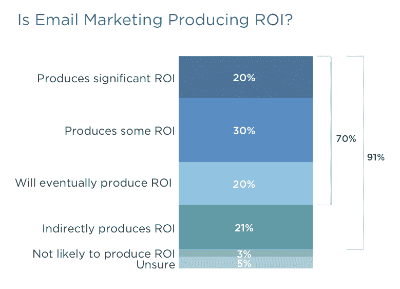

# Salesforce 的首份 B2B 营销报告:电子邮件仍然是一个强大的工具

> 原文：<http://venturebeat.com/2015/04/29/salesforces-first-b2b-marketing-report-finds-email-is-alive-and-kicking/?utm_source=wanqu.co&utm_campaign=Wanqu+Daily&utm_medium=website>

*查看来自低代码/无代码峰会的点播会议，了解如何通过提升和扩展公民开发者的技能来成功创新和实现效率。* [*现在看*](https://attendees.bizzabo.com/427958/agenda?date=1667952000000) *。*

* * *

套用幽默作家马克·吐温的话来说，电子邮件作为营销工具的消亡被大大夸大了。

这是根据今天发布的 [Salesforce](https://venturebeat.com/2015/04/29/salesforce-stock-price-spiked-12-on-news-that-it-hired-bankers-to-field-takeover-bids/) 的第一份[“B2B 营销状况”报告](https://medium.com/@salesforce/b2b-state-of-marketing-a423676a2381)得出的。全球约 2200 名全职 B2B 营销人员完成了该报告背后的调查。

虽然电子邮件不是 B2B 营销人员不断增长的武器库中最性感的选择，但它仍然被广泛使用。接受调查的营销人员中有一半使用它，其中多达 91%的人说它非常有效或有些效果。

该报告称，“尽管越来越多的 B2C 营销人员使用社交渠道与客户联系，但更多的 B2B 营销人员使用电子邮件等传统数字渠道。”

在网民中，唯一比电子邮件更广泛使用的渠道是公司网站，这对于 87%的人来说非常有效或有点有效。

这很有道理。至少在厌恶电子邮件的年轻一代成为 B2B 买家的主导一代之前，老一代定期检查电子邮件有助于保持其交付效率。它也是一种快速分类和归档的方式——至少是暂时的——每天必不可少的东西。

[

<noscript></noscript>](https://venturebeat.com/wp-content/uploads/2015/04/Salesforce-B2B-report.png?resize=779%2C562&strip=all?strip=all) 

上图:电子邮件营销仍在为 B2B 营销人员提供服务

对于近四分之三的受访者来说，电子邮件会产生显著或一定的投资回报，或者他们期望最终会这样。时事通讯是最受欢迎的电子邮件营销版本，尽管他们认为不常用的生日和手机选择加入活动是最有效的。

B2B 营销人员日益面临的关键困境在报告中只是间接提到。事实是，商业客户来到销售部门的门口时，他们的头脑要么已经拿定主意，要么只剩下几个选择。

原因是:他们已经做了功课。他们浏览网站，阅读白皮书，沉迷于评论和用户评论，权衡行业研究。

Salesforce 报告确实抓住了这一趋势，例如，发现支出增加最多的两个领域是内容营销和营销自动化，66%的人预计将增加他们在这些领域的投入。

内容营销创造了所有这些白皮书或以主题为中心的网站部分，供自助购买者欣赏。Salesforce 引用了 MarketingProfs 和内容营销研究所的一项研究，该研究发现 70%的营销人员现在比去年生产了更多的内容。

高级副总裁伍德森·马丁告诉我，这是他从报告中获得的最大收获。

营销自动化工具——与 Salesforce 提供的工具没有什么不同——被用来在购买者决策周期的正确时间将内容、推介和报价呈现在购买者面前。

* * *

VentureBeat 正在研究营销中的个性化…
[插话，我们将与你分享数据](https://www.surveymonkey.com/s/VBIPers)。

* * *

许多其他的发现不会引起很多人的惊讶。例如，新业务开发、销售线索质量以及需求和销售线索生成是三大业务挑战。

对于 B2B 营销人员来说，社交网络正变得越来越强大。64%的人计划明年在社交媒体广告和营销上花更多的钱。

但是 Salesforce 的报告有一些惊喜。例如，超过四分之一的受访者不知道人们是否在用移动设备阅读电子邮件。如果他们不知道你是通过智能手机的小窗口还是桌面显示器的大显示区域来看的，那就很难想象他们如何计划他们的活动。尽管在增加，但只有 40%的人在使用某种移动营销。

该报告还发现，三个“边缘渠道”——短信服务 [Line](http://en.wikipedia.org/wiki/Line_%28application%29) 、 [KakaoTalk](https://venturebeat.com/2014/02/20/as-facebook-buys-whatsapp-whats-the-future-of-koreas-top-messaging-app-kakao-talk/) 和[Mobage](http://en.wikipedia.org/wiki/Mobage)——被使用它们的营销人员“评为高效”。我们说的是分别有 85%、88%和 88%的营销人员发现它们是有效的，相比之下，比如说，脸书只有 57%。

三分之一的受访者信仰宗教，计划今年将预算从传统广告转向数字渠道。马丁说，一个不令人惊讶的大驱动力是数字是可追踪的。总体而言，84%的受访者将增加或保持今年的数字营销支出。

**VentureBeat 的使命**是成为技术决策者获取变革性企业技术知识和进行交易的数字城市广场。[发现我们的简报。](https://info.venturebeat.com/website-preference-center.html)