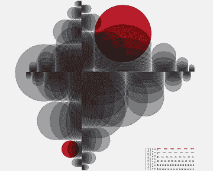

# 谷歌如何在管理上出卖其工程师

> 原文：<https://hbr.org/2013/12/how-google-sold-its-engineers-on-management/ar/1?utm_source=wanqu.co&utm_campaign=Wanqu+Daily&utm_medium=website>

作品: 查德哈根，图形构图 1 号，2009 年，数码

自谷歌早期以来，整个公司的人都在质疑经理的价值。这种怀疑源于高度技术官僚化的文化。正如一位软件工程师 Eric Flatt 所说，“我们是一家由工程师为工程师建立的公司。”而且大多数工程师，不仅仅是谷歌的工程师，都想把时间花在设计和调试上，而不是和老板交流或者监督其他工人的进度。在他们内心深处，他们一直认为管理弊大于利，是对“真正的工作”和有形的、有目标的任务的干扰。

公司成立几年后，创始人拉里·佩奇和谢尔盖·布林甚至怀疑谷歌是否真的需要经理。2002 年，他们尝试了一种完全扁平化的组织，取消了工程经理，以努力打破快速创意开发的障碍，并复制他们在研究生院享受的大学环境。这个实验只持续了几个月:当太多的人直接去问关于费用报告、人际冲突和其他细节问题时，他们变得温和了。随着公司的发展，创始人很快意识到经理们在许多其他重要的方面做出了贡献——例如，沟通战略，帮助员工优先考虑项目，促进合作，支持职业发展，以及确保流程和系统与公司目标一致。

谷歌现在有一些层次，但在一个超过 37，000 名员工的组织中，没有你想象的那么多:只有 5，000 名经理，1，000 名董事和 100 名副总裁。有 30 个直接下属的工程经理并不少见。Flatt 说这是为了防止微观管理而设计的。“当你的团队有 30 人时，你能管的事情就只有这么多了，所以你必须专注于为工程师创造最好的环境，让事情发生，”他指出。谷歌给予普通员工决策和创新的空间。伴随着这种自由而来的是对技术专长、解决问题的技巧和好主意的尊重，而不是头衔和正式的权威。考虑到人们对尊卑次序的普遍漠视，任何为公司变革辩护的人都需要提供令人信服的逻辑和丰富的支持数据。员工很少会毫无疑问地接受自上而下的指示。

谷歌淡化了等级制度，并在招聘工作中强调个人的力量，以实现正确的文化契合。该公司采用严格的数据驱动招聘流程，不遗余力地吸引年轻、雄心勃勃的自我激励者和原创思想家。它从候选人的简历中筛选标志，以显示出在那里出类拔萃的潜力——尤其是一般的认知能力。通过第一轮筛选的人会被仔细评估主动性、灵活性、合作精神、全面发展的证据以及其他使候选人成为“谷歌人”的因素。

因此，谷歌面临的挑战是:如果你精心挑选的高技能员工不重视管理，你怎么能有效地管理这个地方？你如何把怀疑者变成相信者，说服他们花时间管理他人？事实证明，通过运用你当初雇佣他们时所用的同样的分析严谨性和工具——他们在自己的工作中如此重视。你用数据来检验你对管理层优点的假设，然后提出你的理由。

## 分析柔软的东西

为了理解谷歌是如何开始证明经理们的价值的，让我们回到 2006 年，当时佩奇和布林请来了拉兹洛·博克来领导人力资源部门——恰当地称为人力运营，或 people ops。从一开始，people ops 就管理绩效评估，其中包括年度 360 度评估。它还帮助进行和解释了 Googlegeist 关于职业发展目标、津贴、福利和公司文化的员工调查。一年后，有了这个基础，Bock 从 Capital One 聘请了 Prasad Setty 来领导一个人员分析小组。他向 Setty 提出挑战，要求他用谷歌应用于其业务运营的经验法则来接近 HR。

塞蒂相信了他的话，招募了几名具有严肃研究背景的博士。这个新团队致力于领导组织变革。“我不希望我们的小组仅仅是一个报道机构，”Setty 回忆道。“组织可能会陷入所有这些数据中。相反，我希望我们以假设为导向，用数据帮助解决公司的问题。”

然后，People analytics 召集了一个小团队来解决与员工福利和生产力相关的问题。2009 年初，它向 Setty 提出了第一批研究问题。有一个问题很突出，因为自从公司成立以来，这个问题就反复出现:经理重要吗？

为了找到答案，谷歌启动了氧气项目，这是一项为期多年的研究计划。从那以后，它已经发展成为一个全面的项目，衡量关键的管理行为，并通过交流和培训来培养这些行为。到 2012 年 11 月，员工已经广泛采用了该计划，公司在管理效率和绩效的多个领域都取得了统计上的显著进步。

谷歌是以新方式应用分析的几家公司之一。直到最近，组织主要在产品开发、营销和定价中使用数据驱动的决策。但是现在，谷歌、宝洁、哈拉公司和其他公司在解决人力资源需求方面采取了同样的方法。(参见 2010 年 10 月 Thomas H. Davenport、Jeanne Harris 和 Jeremy Shapiro 在 HBR 举办的[“人才分析竞争”。)](/2010/10/competing-on-talent-analytics/ar/1)

不幸的是，学者们在帮助这些组织理解和改进日常管理实践方面做得还不够。与领导力相比，管理仍然没有得到足够的研究和重视——很大程度上是因为很难准确具体地描述管理者实际上在做什么。我们经常说他们通过其他人来完成事情，但是我们通常不会详细说明如何完成。相比之下，Project Oxygen 旨在提供细致的实践指导。它不只是抽象地识别出理想的管理特征；它指出了具体的、可衡量的行为，这些行为赋予了这些特质以生命。

“工程师讨厌在技术方面被微观管理，但喜欢在职业方面被紧密管理。”

这就是为什么谷歌的员工放下了他们的怀疑，开始着手这个项目。Project Oxygen 反映了他们的决策标准，尊重他们对严格分析的需求，并将其作为衡量影响的优先事项。谷歌发现，数据驱动的文化对数据驱动的变化反应良好。

## 制作案例

氧气项目的负责人尼尔·帕特尔回忆道:“我们知道团队必须小心谨慎。谷歌有很高的证据标准，即使是在其他地方可能被认为是显而易见的事实。简单的相关性是不够的。所以我们最终试图证明相反的情况——经理不重要。幸运的是，我们失败了。”

首先，帕特尔和他的团队回顾了离职面谈数据，以了解员工是否将管理问题列为离开谷歌的原因。尽管他们发现离职率和对经理的低满意度之间存在一些联系，但鉴于整体离职率较低，这些联系并不适用于更广泛的公司。调查结果也没有证明管理者造成了人员流失。

下一步，Patel 检查了 Googlegeist 的评级和半年度评论，比较了经理们的满意度和表现。对于这两个维度，他观察了最高和最低的得分者(最高和最低的四分位数)。

 #### 基本背景

Decision Making Feature

*   杰弗里·普费弗和罗伯特·萨顿

当你根据更好的逻辑和证据采取行动时，你的公司可以战胜竞争对手。

<stream-item class="stream-item" data-id="tag:hbr.org,1922-01-01:200601.53784-R0601E" data-title="Evidence-Based Management" data-url="/2006/01/evidence-based-management/ar/1" data-topic="Decision Making" data-image="" data-summary="When you act on better logic and evidence, your company can trump the competition." data-authors="Jeffrey Pfeffer and Robert I. Sutton" data-content-type="Magazine Article" data-item-selectable="false" data-item-activity="false"></stream-item>

“起初，”他说，“这些数字并不令人鼓舞。即使是得分低的经理也做得很好。当所有经理看起来都如此相似时，我们怎么能找到更好的管理很重要的证据呢？”解决方案来自应用复杂的多元统计技术，该技术表明，即使是“管理者素质的最小增量也是非常强大的。”

例如，在 2008 年，得分高的经理在他们的团队中比其他人的流动率更低——与资历、表现、任期或晋升相比，留住人才与经理的素质更有关系。数据还显示，经理的素质和员工的幸福感之间有着紧密的联系:老板得分高的员工在多个领域都表现出更高的满意度，包括创新、工作生活平衡和职业发展。

根据这项研究，氧气项目团队得出结论，管理者确实很重要。但要根据这一发现采取行动，谷歌首先必须弄清楚它最好的经理都做了些什么。因此，研究人员随后进行了双盲定性访谈，向高分和低分经理询问诸如“你多久与你的直接下属进行一次职业发展讨论？”以及“你如何为你的团队开发愿景？”谷歌三大职能部门(工程、全球业务、总务和行政)的经理参加了会议；他们来自各个阶层和地区。该团队还研究了来自 Googlegeist 调查、绩效评估和公司伟大经理奖提交材料的数千条定性评论。(每年，谷歌都会根据员工的提名，为这一奖项挑选大约 20 名经理。)编码和处理所有这些信息花了几个月的时间。

经过大量审查，Oxygen 确定了高分经理共有的八种行为。(完整列表见侧栏“谷歌最佳经理人做什么”。)尽管这些行为并不十分令人惊讶，但帕特尔的同事米歇尔·多诺万说:“我们希望这份名单会引起共鸣，因为它是基于谷歌的数据。这些属性与我们有关，由我们决定，也为我们服务。”

关键行为主要描述中小型团队的领导者，尤其与一级和二级经理相关。它们包括发展和激励直接下属，以及沟通战略和消除障碍——这些都是人们在日常工作中容易忽视的重要活动。

## 将研究结果付诸实践

这份行为清单在谷歌发挥了三个重要作用:为员工提供一个讨论管理的共享词汇，为他们提供改善管理的直接指导方针，以及概括所有的管理职责。虽然这个列表简单明了，但是用调查参与者自己的话来说，它被最佳实践的例子和描述丰富了。这些细节使总体原则更加具体，比如“授权给团队，不要微观管理”，并向经理们展示了实施这些原则的不同方式。(参见展览“谷歌如何定义一个关键行为。”)

八种行为的描述也允许相当大的裁剪。它们是包容性的指导方针，而不是僵化的公式。也就是说，很明显，经理们在采用新标准时需要帮助，因此 people ops 围绕 Oxygen 的发现建立了评估和培训计划。

为了提高接受率，该小组定制了调查工具，为行政和全球业务职能部门的员工创建了向上反馈调查(UFS ),为工程师创建了技术经理调查(TMS)。这两项评估都要求员工就一系列核心活动对他们的经理进行评估(使用五分制),例如定期提供可操作的反馈和清楚地传达团队目标，所有这些都与关键管理行为直接相关。

第一次调查于 2010 年 6 月进行——故意与 4 月和 9 月进行的绩效评估不同步。(谷歌最初曾考虑将分数与绩效评估挂钩，但认为这将增加对氧气项目的阻力，因为员工会认为这是自上而下强加的标准。People ops 强调保密性，并经常提醒说，这些调查完全是为了自我完善。“氧气项目一直是一个发展工具，而不是一个性能指标，”该部门的分析师玛丽·凯特·斯蒂姆勒说。“我们意识到，匿名调查并不总是公平的，低分背后往往有一个背景。”

虽然这些调查不是强制性的，但绝大多数员工都完成了。不久之后，经理们收到了带有数字分数和个人评论的报告——他们被敦促与团队分享反馈。(参见附件“一位经理的反馈”中的代表性样本。)这些报告明确地将个人得分与八种行为联系起来，包含了更多最佳实践信息的链接，并建议每位经理可以采取的改进措施。比如说，辅导成绩不好的人可能会被推荐参加一个关于如何提供个性化、平衡的反馈的课程。

People ops 将培训设计为动手操作并立即有用。例如，在“愿景”课程中，参与者练习为他们的部门或团队撰写愿景声明，并通过引人注目的故事将这些想法变为现实。2011 年，谷歌增加了 Start Right，这是一个为新经理举办的两小时研讨会，以及关于管理变革等热门话题的经理旗舰课程，这些课程在六个月内分为三个为期两天的模块。“我们有一个教师团队，”人力开发经理凯瑟琳·奥沙利文说，“我们正在试行在线谷歌社交课程，这样来自世界各地的经理都可以参与进来。”

经理们对报名参加这些课程并公开他们需要做出的改变几乎没有表示担忧。埃里克·克莱伯格就是其中之一，他发现自己的训练非常有价值。作为一名经验丰富的软件工程经理和连续创业者，Clayberg 在谷歌收购他的最新创业公司之前已经领导团队 18 年了。但他觉得，在为期 6 个月的氧气调查和人力运营课程中，他学到的管理知识比过去 20 年还多。“例如，”他说，“我担心谷歌扁平的组织结构；我知道很难帮助我团队中的人获得晋升。我在课堂上学到了如何提供晋升之外的职业发展。我现在花三分之一到一半的时间寻找帮助团队成员成长的方法。”令他惊讶的是，他的报告欢迎他的建议。“工程师讨厌在技术方面被微观管理，”他评论道，“但他们喜欢在职业方面被密切管理。”

为了补充培训，开发团队安排了小组讨论，由各职能部门的高分经理参加。通过这种方式，员工可以从他们尊敬的同事那里获得建议，而不仅仅是从人力资源部门。人力资源部还会向新经理发送自动电子邮件提醒，告诉他们如何在谷歌取得成功，链接到相关的氧气发现，以及他们没有参加的课程的信息。

谷歌奖励它努力推广的行为。该公司已经修改了伟大经理奖的评选标准，以反映八种氧气行为。员工在提交提名时会参考这些行为并举出具体的例子。克莱伯格获得了这个奖项，他认为这主要是因为他通过氧气训练获得的技能。奖品包括为期一周的目的地之旅，如夏威夷，在那里获胜者可以与高级管理人员共度时光。接受者也在公司里任职。“在最后一轮副总裁晋升中，”拉兹洛·博克说，“10%被提升的董事是伟大经理人奖的获得者。”

## 测量结果

people ops 团队通过检查总体调查数据和个人的定性输入，分析了 Oxygen 的影响。从 2010 年到 2012 年，UFS 和 TMS 的平均支持率从 83%上升到 88%。得分最低的经理进步最大，尤其是在教练和职业发展领域。这些改进在职能、调查类别、管理水平、控制范围和地理区域方面都是一致的。

在顶尖成就者的环境中，人们会认真对待低分。以副总裁塞巴斯蒂安·马罗特为例，他于 2011 年从甲骨文的高级销售职位加入谷歌。在谷歌的头六个月，马洛特专注于实现销售数字(而且做得很成功)，同时管理着一个 150 人的全球团队。然后，他收到了他的第一个 UFS 分数，这是一个震惊。“我问自己，‘我适合这家公司吗？我应该回到甲骨文公司吗？他说:“这似乎是一种脱节，因为我的经理在我的第一次绩效评估中对我的评价很好，但我的 UFS 分数却很糟糕。”然后，在一位人力资源部同事的帮助下，Marotte 后退一步，思考他可以做出哪些改变。他回忆道，“我们仔细阅读了所有的评论，然后想出了一个计划。我调整了与团队沟通的方式，并提高了我们长期战略的透明度。在两个调查周期内，我将我的支持率从 46%提高到了 86%。这很艰难，但非常值得。我来这里时是一名高级销售人员，但现在我感觉自己像一名总经理。"

总的来说，其他经理和马洛特一样积极地接受了反馈，并特别感谢它的特殊性。大公司销售总监、另一位杰出经理奖获得者斯蒂芬妮·戴维斯(Stephanie Davis)说，她从自己的第一份反馈报告中了解到:“我很惊讶，我的团队中有一个人认为我没有定期安排一对一的会议。我每天都见到这个人，但是调查帮助我认识到仅仅见到这个人与定期安排单独会面是不同的。我的团队也希望我花更多的时间来分享我的愿景。就我个人而言，我一直受到埃里克[施密特]、拉里和谢尔盖的启发；我认为我的团队也从他们那里感受到了公司的愿景。但是这个调查给了我的团队解释的机会，他们希望我为他们解释更高层次的愿景。所以我开始用另一只耳朵听公司的收益电话会议。我不只是带着说的话回到我的团队；我也分享了这对他们意味着什么。”

全球企业更新主管克里斯·洛克斯(Chris Loux)记得他对自己在 UFS 的低分感到沮丧。“我收到了一份绩效评估，显示我超出了预期，”他说，“但我的一位直接下属在 UFS 上说，他不会推荐我担任经理。这让我震惊，因为人们不会离开公司，他们会离开经理。”与此同时，Loux 还在纠结到底该给团队中表现较差的人多少压力。“很难给一种类型的人负面的反馈——一个一生中从未收到过负面反馈的人,”他解释道。“如果有人在 UFS 上获得了 95%的好评，我想知道这位经理是否在回避问题，没有就如何让他们变得更好的问题与报告进行艰难的对话。”

Loux 并不是唯一一位推测员工绩效评估和经理反馈分数之间联系的谷歌高管。这个问题在 Oxygen 推出期间出现了多次。为了解决这个问题，人员分析小组采用了一种久经考验的技术，即回到数据并进行正式分析，以确定给某人负面绩效评估的经理是否会收到该员工的低反馈评级。在查看了 2011 年两个季度的调查数据后，该小组发现，员工绩效评分的变化(向上和向下)占谷歌所有职能部门相应经理评分变化的不到 1%。

“设法通过测试”似乎也不是什么大风险。因为这八种行为植根于行动，所以经理们很难为了追求更高的评分而造假。在调查中，员工不会评估他们经理的动机、价值观或信仰；相反，他们会评估他们的经理展示每种行为的程度。要么这位经理按照建议的方式行事——始终如一且可信——要么她没有。没有哗众取宠或掩饰的余地。

“我们并没有试图改变在谷歌工作的人的本性，”博克说。“那将是放肆和危险的。相反，我们会说，“这里有几件事会让你被视为一名更好的管理者。”我们的经理可能不完全相信这些建议，但是当他们按照这些建议行动并获得更好的 UFS 和 TMS 分数后，他们可能最终会将这些行为内化。"

氧气计划确实有其局限性。对卓越管理的承诺可能很难长期保持。对可持续性的一个威胁是“评估超载”。UFS 和 TMS 依赖于员工的善意。谷歌员工每半年自愿回答一次，但他们也被要求完成许多其他调查。如果他们厌倦了填写调查问卷，该怎么办？回复率会触底吗？可持续性还取决于擅长八种行为的经理的持续有效性，以及这些行为与高级管理职位的相关性。最近被提升的副总裁中有不成比例的人数赢得了伟大经理奖，这反映了他们对 Oxygen 指导方针的遵循程度。但是，如果其他行为——那些与领导技能相关的行为——在高级职位上更重要呢？

此外，虽然调查分数衡量员工的满意度和对工作环境的看法，但尚不清楚这些无形资产对销售、生产率和盈利能力等底线指标有何影响。(即使对于谷歌的高级统计人员来说，这些因果关系也很难建立。)而且，如果这八种行为确实有益于组织绩效，它们也可能不会给谷歌带来持久的优势。具有类似竞争特征的公司——例如，同样由数据驱动的高科技公司——可以模仿谷歌的方法，因为这八种行为不是专有的。

因为这八种行为根植于行动，所以管理者很难作假。

尽管如此,“氧气计划”还是完成了它的既定目标:它不仅让持怀疑态度的谷歌观众相信经理很重要，还识别、描述了他们最基本的行为，并将其制度化。Oxygen 将数据驱动的持续改进概念直接应用于管理的软技能，并取得了成功。广泛采用对员工如何看待谷歌的生活产生了重大影响——特别是他们如何评价协作程度、绩效评估的透明度以及他们所在团队对创新和冒险的承诺。在像谷歌这样的公司里，员工几乎全是一流的，经理们扮演着一个复杂的、要求很高的角色。他们必须超越监督日常工作，支持员工的个人需求、发展和职业规划。这意味着提供明智、稳定的反馈，引导人们达到更高的成就水平——但要明智而温和地干预，因为高绩效的知识工作者重视自主性。这是一种微妙的平衡行为，既要通过热情的啦啦队让员工保持快乐和动力，又要通过延伸任务和精心调整的反馈帮助他们成长。当这个过程运行良好时，它会产生非凡的结果。

这就是为什么 Prasad Setty 希望继续以 Oxygen 关于有效管理实践的发现为基础。“我们将不得不开始思考还有什么推动人们从优秀走向卓越，”他说。他的团队已经开始根据性格类型分析经理的评估分数，寻找模式。“在氧气项目中，我们没有这些内生变量，”他补充道。“现在我们可以开始用更多的民族志方法来梳理它们。这实际上是关于观察——和人们呆在一起，研究他们的互动。我们没有能力追随大量的人，但我们在数量上的损失，会让我们对管理者和他们的团队的经历有更深入的了解。”

简而言之，这就是谷歌方法的核心原则:部署严格的数据收集和严格的分析——科学的工具——来揭示对管理艺术和工艺的更深刻的见解。

这篇文章的一个版本出现在

[December 2013](/archive-toc/BR1312)

发行

*Harvard Business Review*

。