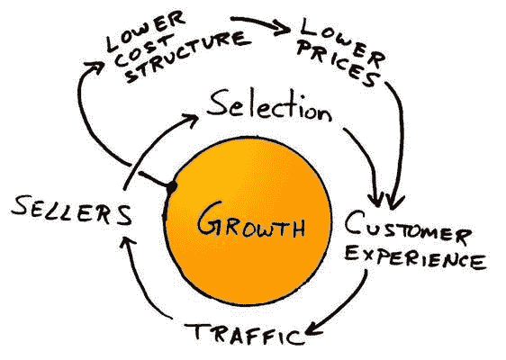

# AWS IPO——本·汤普森的策略

> 原文：<https://stratechery.com/2015/the-aws-ipo/?utm_source=wanqu.co&utm_campaign=Wanqu+Daily&utm_medium=website>

科技行业最大和最重要的 IPO 之一发生在上个月底，估值为 256 亿美元。这超过了谷歌，其 IPO 估值为 246 亿美元，当然也远远超过了亚马逊，后者在公开市场上市首日的估值为 4.38 亿美元。不过，不要为后者感到太难过:我所说的“首次公开募股”是指亚马逊网络服务，而它恰好仍由近 20 年前上市的同一家电子商务公司所有。

我显然是在开玩笑；AWS 没有真正的 IPO，只是亚马逊财务报告中的一个额外项目，最终公布了亚马逊九年前开创的云计算服务。不过，这个项目几乎肯定是推动亚马逊市值在一夜之间从 4 月 23 日的 1820 亿美元增长到 4 月 24 日的 2070 亿美元的主要因素。不仅仅是因为 AWS 在一个经济状况令人印象深刻的不断增长的市场中是一个强大的产品，它也可能最终成为实现 Amazon.com 自身潜力的关键。

#### 了解亚马逊，第 1 部分

对亚马逊的许多分析往往属于两个截然相反的阵营，这两个阵营奇怪地联合在一起，对推动亚马逊业务的经济学缺乏严谨和深入的理解。一方面是狂热的怀疑论者，他们认为亚马逊账面利润的减少是该公司被股票市场严重高估的初步证据；另一方是真正的信徒，他们指出亚马逊不断增长的营收数字同样明显地证明了该公司被*低估了*，并为更大更好的东西做好了准备。

一种更微妙的方法认为，亚马逊不是一个铁板一块的运营，而是一个共享资源的业务集合，包括渠道(Amazon.com)、物流和共同的技术基础。这些业务范围从书店到视频游戏商店到家庭家具到衣服到鞋子到消费电子产品到汽车配件…在这一点上清单是相当广泛的！诚然，消费者将所有这些不同的业务视为一个统一的 Amazon.com，但在公司内部，其中一些业务已经成熟(理论上)并正在产生现金，而其他业务则依赖投资来起步。

The Amazon business model as drawn by Jeff Bezos on a napkin

这种观点是对前面提到的牛市观点的更复杂的理解:不是亚马逊不赚钱，而是该公司正在把赚到的每一分钱再投资到不断增长的新业务中；如果公司停止投资，它将开始抛出现金。这正是杰夫·贝索斯代表公司的方式——当然，除了停止投资和抛出现金的部分。

#### 亚马逊为什么从书开始

在 [The Everything Store](http://www.amazon.com/The-Everything-Store-Bezos-Amazon-ebook/dp/B00BWQW73E) 中，布拉德·斯通解释说，虽然杰夫·贝索斯一直计划建立一个出售一切的网站，但他从书籍开始是出于一个非常特殊的原因:

> 贝佐斯的结论是，一个真正的万物商店是不切实际的——至少在开始阶段是这样。他列出了 20 种可能的产品类别，包括计算机软件、办公用品、服装和音乐。他最终发现书籍是最佳选择。它们是纯粹的商品；一家书店里的一本书和另一家书店里的一模一样，所以购买者总是知道他们买到的是什么。当时有两家主要的图书分销商，英格拉姆、贝克和泰勒，因此一家新的零售商不必单独接触成千上万的图书出版商。最重要的是，全世界有 300 万本书在印刷，远远超过巴诺书店或 Borders 超市的库存。
> 
> 如果他不能马上建立一个真正的“什么都有”商店，他至少可以在一个重要的产品类别中抓住它的精髓——无限的选择。贝佐斯说:“产品种类繁多，你可以在网上建立一个商店，这是其他任何方式都无法实现的。”。"你可以建立一个真正的超市，提供详尽的选择，顾客重视选择."

不过，还有一个更关键的因素，斯通只是在几章后才提到:尽管书籍是一种商品，但它们的价格非常高。对零售商来说，一本新书的标价包含 50%的加价，这意味着贝佐斯——几年后，他创造了著名的短语“你的利润就是我的机会”——可以以很大的折扣出售图书，同时仍能在每笔交易中赚钱(随着时间的推移，亚马逊不仅会绕过批发商，最终还会变得足够大，能够向出版商发号施令)。

此外，亚马逊的业务性质——客户立即用信用卡支付图书，而亚马逊在交付后几个月才支付图书批发商的发票——导致了一个负的现金转换周期，释放出比亚马逊利润率所能保证的更多的现金用于投资，亚马逊的增长率极大地放大了这一影响。

从长远来看，这使得书籍成为亚马逊真正有利可图的业务，该公司出于许多完全相同的原因在 CD、DVD 和视频游戏中重复了这一伎俩:传统上大量选择的商品以显著的加价出售，并在 90 天后付款，这使亚马逊能够有更好的选择*和*更低的价格*和*赚钱。 [3](#fn3-1636 "This was the foundation of my bullish article on Amazon in 2013 called <a href="https://stratechery.com/2013/amazons-dominant-strategy/">Amazon’s Dominant Strategy</a> ")

#### 了解亚马逊，第 2 部分

亚马逊牛市案例的问题在于，亚马逊的所有不同业务本质上都是一样的:卖书就像卖 DVD，卖衣服就像卖电视，等等。然而，虽然从基础设施的角度(相同的渠道、物流网络和技术栈)来看这可能是真的，但从经济角度来看绝对不是这样。

考虑一下书籍和电视:书籍的数量实际上是无限的，但电视的数量相对较少，这意味着竞争对手更有可能拥有相同的电视，从而导致价格下降和利润减少。电视也是相对不经常购买的产品，消费者可能会寻找最佳价格，这再次导致价格下降和利润率下降。此外，虽然一本书是一种商品，但同一本书与另一本书是高度不同的；电视就不一样了，最贵的电视仍然和便宜的电视完成同样的事情，这就给奢侈的 50%零售加价留下了很小的空间。这再次导致价格下降和利润减少。另一方面，虽然一本书就是一本书，所以你可以放心地在任何地方购买，但许多消费者认为一台电视值得亲自检查，而且运输成本很高。

也就是说，无论如何，相对于书籍而言，电视是昂贵的，电脑、家具、汽车配件以及亚马逊在过去十年中发展的所有其他业务也是如此。换句话说，亚马逊出售的所有这些东西都非常适合增加收入，但在产生利润方面却不太好(也就是说，负现金转换周期的好处也非常适用于这些商品；它们不是被白白添加的)。

这使得旧的备用产品——书籍、CD、DVD 和视频游戏——产生实际利润，为亚马逊想要建立的所有新业务提供资金，并且他们已经这样做了 20 年。然而，问题是显而易见的:这些类别中的每一个都正在被数字发行所取代，亚马逊只在图书和 Kindle 的情况下成功地获得了这一转变的好处(尽管它们在所有四个领域都与亚马逊音乐、亚马逊 Prime Video 和亚马逊应用商店竞争)。此外，数字分销的影响正在[财务结果](http://phx.corporate-ir.net/phoenix.zhtml?c=97664&p=irol-reportsother)中显现出来；亚马逊早就在他们的[财务报告](http://phx.corporate-ir.net/phoenix.zhtml?c=97664&p=irol-reportsother)中列出了“媒体”和“电子和普通商品”的销售额，上个季度“媒体”下降了 3%，而“电子和普通商品”增长了 20%。这给亚马逊提出了一个长期问题:如果“媒体”长期衰落，他们将如何推动对其业务的永恒投资，更不用说至少在理论上支撑其天价股价的虚构回报了？

#### 输入亚马逊网络服务

亚马逊网络服务令人难以置信的潜力是显而易见的，就像它在 2006 年最初的前景一样，嗯，是阴云密布。AWS 是在亚马逊试验了更多的全方位服务产品之后才出现的，比如为塔吉特百货(Target)或玩具反斗城(Toys-R-Us)、[【4】](#fn4-1636 "but ultimately, why help your competitors?")的网站供电，对于公司是否会将关键业务委托给第三方，有很多人持怀疑态度。然而，很快就变得很明显，经济性和简单性都压倒性地有利于公共云，亚马逊领先了所有人好几年。

如今，公共云是绝大多数企业的未来；亚马逊(及其最接近的竞争对手谷歌和微软)实现的规模经济是如此令人难以置信，以至于像网飞这样价值数十亿美元的公司认为，向亚马逊付费比建立自己的数据中心更有效。对于任何类型的初创公司来说，这种计算都更加明显:开始使用 AWS 要容易得多，也便宜得多，以至于购买自己的服务器基础设施的想法——在互联网泡沫时代，这笔支出消耗了大部分风险资本——是荒谬的。从亚马逊的角度来看，这很好:该公司实际上拥有几乎所有重要初创公司的股份，而且是免费的；如果公司成功了，亚马逊会得到丰厚的报酬，如果失败了，亚马逊会支付自己提供云服务的费用。

然而，关于 AWS 的一个大问题是，亚马逊是否能保持其领先地位。数据中心非常昂贵，亚马逊的现金少得多，更重要的是，利润比谷歌或微软少得多。如果任何一个竞争对手发起价格战，会发生什么:亚马逊有能力跟上吗？

可以肯定的是，有理由怀疑他们可以做到:首先，亚马逊已经有了更大的规模，这意味着他们的人均成本低于微软或谷歌。或许更重要的是源于“你的利润就是我的机会”思维模式的企业文化:亚马逊可以忍受核心业务几个百分点的利润，这比微软或谷歌舒服得多，这两家公司分别从软件和广告利润中获利颇丰。事实上，当谷歌在 2014 年春天大幅降价时，亚马逊立即做出了回应，并继续进一步降价，就像自 AWS 成立以来一样(回应谷歌的降价是该公司的第 42 次降价)。然而，问题仍然存在:这是可持续的吗？亚马逊有能力竞争吗？

这就是为什么亚马逊的最新收益如此重要:该公司第一次将 AWS 单列出来，不仅披露了其收入(以前可以梳理出来)，还披露了其盈利能力。而且，令许多人惊讶的是，尽管所有的降价，AWS 非常有利可图:仅上个季度的销售额就达到 15.7 亿美元，利润为 2.65 亿美元，令人印象深刻(对亚马逊来说！)17%的净利润率。

#### 亚马逊的新基础

AWS 的盈利能力本身就是一件大事，特别是考虑到云计算最终将成为财大气粗的公司的囊中之物。事实证明，相信 AWS 的所有理由都是正确的:亚马逊显然正在从成为最大的参与者中获得规模效益，他们拥有最完整和最便宜的产品的决心与他们之前在电子商务领域的战略相呼应。

此外，亚马逊聪明地找到了一种近似负现金转换周期技巧的方法:亚马逊不是在数据中心被用来赚取收入之前预先支付数十亿美元来建立数据中心，而是通过资本租赁来建立数据中心，这实际上让公司在使用数据中心时为数据中心付费。诚然，这是一个风险更大的策略，也给亚马逊的告诫蒙上了悲观的色彩，即投资者应该关注自由现金流， [5](#fn5-1636 "Amazon is now reporting “Free Cash Flow Less Finance Principal Lease Repayments and Capital Acquired Under Capital Leases” which is what their cash flow would be if they purchased data centers up-front; it’s significantly lower than the number the company trumpets publicly") 但这也是一个假设增长的策略，这是一个关于 AWS 的绝佳假设——前提是该公司的投资能够跟上。与我[最初的怀疑态度](https://stratechery.com/2015/daily-update-trouble-amazon-chinas-e-commerce-battle-asias-advantage/) ( *仅限会员*)相反，我认为资本租赁是双赢的。

然而，AWS 最大的影响可能是它对 Amazon.com 的影响。去年夏天，我对这家公司失去了耐心，不知道亚马逊什么时候会全力抓住这个看起来巨大的电子商务机会，而不是玩弄设备和视频。更重要的是，他们会在“媒体”赚钱列车失去动力之前这么做吗？

今天，这是一个有争议的问题:天空是 AWS 的极限，如果这项服务在目前的规模下是盈利的，我们应该对未来五年或十年有什么期望？更重要的是，随着时间的推移，这种盈利能力可以取代“媒体”在亚马逊引擎中的作用:用现金建立新的电子商务业务，或探索下一步是什么(a la AWS)，或以上两者兼而有之。或者，按照亚马逊投资者的幻想，为股东提供实际回报。 [6](#fn6-1636 "So yes! <a href="https://stratechery.com/2014/losing-amazon-religion/">As predicted</a>, I am changing my mind about Amazon. Again.")

* * *

在[战略论坛](https://forum.stratechery.com/t/the-aws-ipo/34)()讨论这篇文章

### *相关*