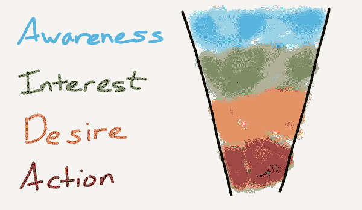
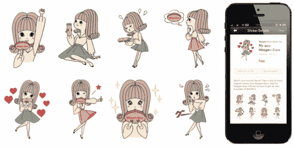
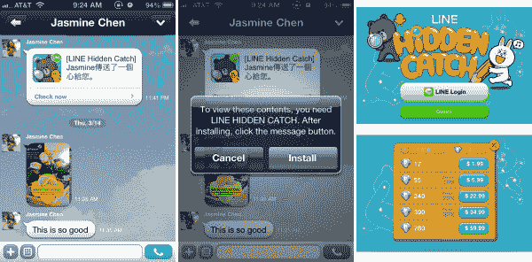
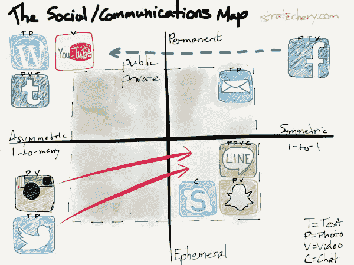

# 短信:手机的黑仔应用——策略

> 原文：<https://stratechery.com/2014/messaging-mobiles-killer-app/?utm_source=wanqu.co&utm_campaign=Wanqu+Daily&utm_medium=website>

互联网之前，通信的节点是房子，杀手级 app 是电话。假设你和我都在各自的房子里，我可以拨一个号码，我们可以谈谈。这是不可思议的，回想起来，原始；当实时成为唯一的交流方式时，它就没那么有趣了，也更受限制了。

20 世纪 70 年代末，计算机出现了，虽然它让我们的效率惊人地提高，但它并没有真正改变沟通的定义。那就是万维网和它的杀手级应用:浏览器。

现在，交流的节点是计算机，虽然实时仍然是可能的，但是是被动的交流定义了网络。我，连同地球上的每一个人和组织，可以创建一个网页，你可以在方便的时候浏览。不过，地点只在电脑旁。

七年前，计算机变得可以随身携带，但最初的用例是让信息的被动呈现不仅在观众方便的时候可以访问，而且可以在任何地方访问:网络现在无处不在。

然而，直到最近，这个时代的杀手级应用才变得显而易见，当通信的节点是智能手机时，它就是信息。虽然家庭电话实现了实时通信，而网络是被动通信，但消息传递实现了持续的通信。对话永远不会结束，朋友来来去去的速度不是由身体决定的，而是由注意力决定的。而且，考虑到我们都是人类，渴望人类的互动和关爱，我们非常乐意将大量的注意力放在信息传递上，放在那些对我们最重要的人身上，放在我们的口袋和钱包里。

只有在这种背景下——手机占据主导地位，因为我们的手机总是带在身边，而短信是其杀手级应用——你才能理解乐天以 9 亿美元[收购 Viber](http://techcrunch.com/2014/02/13/japanese-internet-giant-rakuten-acquires-viber-for-900m/) 的交易。或者，就此而言，理解为什么 LINE 正在为 T4 100 亿美元的首次公开募股做准备，或者为什么微信在去年帮助腾讯的股价翻了一番，或者为什么 Twitter 和脸书/Instagram 都在去年秋天推出了增强的消息产品。

* * *

然而，对关注的需求只是正在发生的事情的一部分。毕竟，虽然吸引注意力对于 Twitter 和脸书这样的广告公司来说至关重要，但对于乐天这样的电子商务巨头来说，这似乎没有那么重要。为此，乐天的联合创始人兼首席执行官三木谷浩史(Hiroshi Mikitani)在接受 Re/code 采访时非常简洁地讲述了他的动机:

> “消息应用正在接管世界，虽然搜索是最强大的平台之一，但通信领域正在发生的事情非常非常重要……”
> 
> 三木谷浩史表示:“我们有内容、游戏、商业、市场和服务，但他们需要能够接触到客户，并与他们交谈。“有了这个，我们可以让购物更安全，也更人性化。”

在我上面叙述的相同时期和背景下考虑商业:在地址和电话时代，大多数商业包括开车去商店。这是一个有目的和繁重的活动，就像一个预定的电话。在网络时代，电子商务成为一个词，但它仍然需要去电脑前，一个看似简单的旅程，但实际上往往远离购买的动机，购买的动机可能来自电视上看到的广告，或橱窗里的衣服，或朋友的推荐。不过，对于手机，尤其是消息传递，沟通渠道和购买渠道的无处不在意味着购买想法和实际购买之间的差距非常小。

* * *

购买途径通常以漏斗的形式呈现，如下所示:

[T2】](https://i0.wp.com/stratechery.com/wp-content/uploads/2014/02/funnel.jpg)

谷歌靠生活在漏斗的底部来发财:人们搜索他们已经想要的东西。在那个时候接触到他们意味着一个更短和更明显的行动路径，即购买，这对广告商来说是一个不可思议的价值。

不过，从绝对数量来看，知名度和兴趣构成了广告支出的最大部分。这并不令人惊讶；漏斗的概念就是顶部必须比底部宽得多。这也是科技公司最难以有意义的方式进入的领域；迄今为止，产生需求的主要手段一直是展示广告，但效果并不太好。然而，脸书在这方面正在大步前进，尤其是在移动领域(我在去年夏天的一篇名为[移动让脸书只是一个应用程序的文章中详细解释了原因；这是个好消息](http://stratechery.com/2013/mobile-makes-facebook-just-an-app-thats-great-news/)。

信息传递有可能产生影响的地方在中间:通过最古老、最可靠的广告形式之一——直接接触，将客户从兴趣转变为欲望，进而付诸行动。

在众议院的情况下，直接联系采取邮件的形式，而在计算机的情况下，电子邮件。这两者无疑都成为了垃圾邮件滥用的巨大目标，但那是因为直接营销奏效了。考虑您可能收到的一封合法营销邮件(模拟或数字):

*   你已经表明你喜欢某个商店或品牌，并给了他们你的联系方式。不需要昂贵和侵入性的瞄准。
*   很可能你以前已经购买过，减少了将来购买时的摩擦，特别是如果你的支付信息存储在公司的服务器上 [1](#fn1-685 "This is why companies won’t give up storing credit card details, no matter how many attempted hacks they may have to endure. The dropoff from a customer needing to enter a credit card number is far more expensive than the bad publicity that is the primary punishment")
*   在电子邮件的情况下，你可能在一个也能立即行动的环境中阅读营销信息；只需点击一个链接，商品就在你的购物车里了

所有这些积极因素都适用于信息传递。下面是一种工作方式(我将使用的所有例子都来自 LINE，但它们几乎都适用于微信):

[T2】](https://i0.wp.com/stratechery.com/wp-content/uploads/2014/02/haagendasz.jpg)

*   这是阿根-达斯的贴纸套装；他们向 LINE 支付了数万美元(因市场而异)来免费提供这套设备
*   要获得贴纸，用户必须关注阿根-达斯的官方账户
*   瞧，阿根-达斯现在拥有了与数百万用户直接沟通的渠道

或许今年夏天天气特别热的时候，阿根-达斯会向所有用户发放一张优惠券，购买一杯打折的冰淇淋。这些用户中的许多人都是户外活动的，很可能在阿根-达斯零售店附近(他们遍布亚洲)。就这样，客户开始行动了。

这是一个使用实体零售的例子，但电子商务的效果甚至更强大:无论你在哪里，只需点击一个链接，你就要行动了。为此，Line 一直在泰国试验 flash 销售，结果相当令人难以置信:在泰国的 2200 万 LINE 用户中，有 550 万用户参与其中。

然而，真正让这个频道大放异彩的是数字产品，尤其是应用程序。考虑这个用户流，再次从第行开始:

[T2】](https://i0.wp.com/stratechery.com/wp-content/uploads/2013/03/lineapps.png)

我的妻子给我发来了一个在线游戏的通知；要打开它，我需要下载应用程序，它通过了我的在线聊天应用程序的认证，我可以开始了。正如你所料，这款游戏简单、有趣，并带有应用内购买功能。这就是为什么游戏收入占该公司 2013 年在 4Q 1.2 亿美元收入的 60%，同比增长 450%(20%来自付费贴纸包，其余来自赞助，如阿根-达斯和商品系列角色是下一个 Hello Kitty)。

* * *

像这样的收入和增长数字，再加上移动商务的潜力，在某种程度上让 Viber 的 9 亿美元显得很便宜。但我不认为此次收购对乐天来说会比 Kobo 或 Buy.com(该公司多年来收购的其他二级资产)更好。Viber 确实拥有强大的用户数量，[声称](http://global.rakuten.com/corp/news/press/2014/0214_04.html)拥有 2.8 亿注册用户和 1 亿月活跃用户，这当然是这场战斗的一大部分，但创建一个有意义的*平台*是 Viber(和 WhatsApp)尚未采取的重要下一步。一个平台是关于多边市场的；LINE 和微信之所以如此有价值，是因为它们不仅拥有用户，还拥有广告商、商业网站和开发者。

因此，虽然我对乐天和 Viber 持怀疑态度，但对于 LINE 和微信来说，天空是无限的。两者都在 iOS 和 Android 的基础上有效地构建了平台，并正好处于我们生活中最有意义、也是最常用的部分:我们与我们认识和关心的人的交流和互动。

The Social/Communications Map

脸书将继续拥有人们对自己的公开展示，由此产生的窥淫癖很适合他们的展示广告。LINE 和微信同样符合它们的盈利模式:正如它们的互动更加亲密一样，营销人员和用户之间的联系也更加直接。他们可能是移动时代即将成熟的最重要的公司。

### *相关*