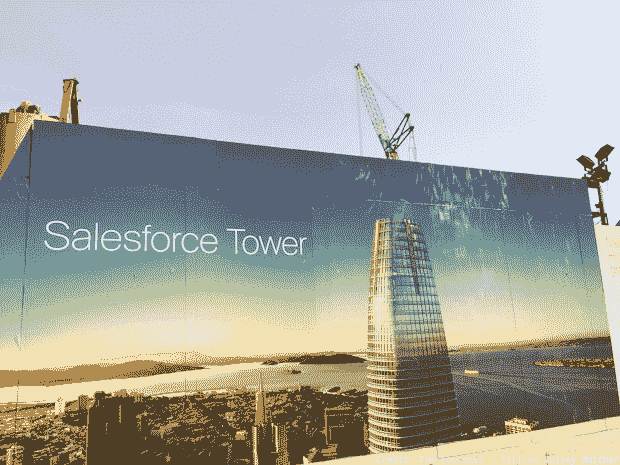

# Salesforce 销售——微软会超过旧金山吗？

> 原文：<http://www.siliconvalleywatcher.com/mt/archives/2015/05/salesforce_sale_will.php?utm_source=wanqu.co&utm_campaign=Wanqu+Daily&utm_medium=website>

旧金山 Salesforce 大楼建筑工地上的广告牌

据彭博报道，微软正在评估对 Salesforce 的出价，作为对一家未具名公司收购要约的回应。

**Foremski 的观点:** Salesforce 的市场估值约为 490 亿美元，因此这将是一个整合挑战，可能需要一个可拆卸的下巴来消化它。只有几个可能的追求者。

我希望 Salesforce 保持独立，因为它是旧金山最大的科技公司，首席执行官兼创始人马克·贝尼奥夫(Marc Benioff)有着慷慨的天性和与众不同的方式，这是这座城市的一部分，也是一个有着五代本地家族历史的人的一部分。

如果微软收购了 Salesforce，从文化的角度来看，那就太奇怪了。微软将成为旧金山最大的科技公司。感觉不太对。微软与潮湿的西北部的西雅图地区联系紧密。这是一种不同的感觉和不同的文化。

微软将真正凌驾于旧金山技术社区之上。Salesforce 正在旧金山市中心完成一座办公大楼的建设，这将是该市最高的办公大楼。如果申办成功，微软大厦将主宰旧金山的天际线。就像荷鲁斯的全视之眼一样，微软将能够俯瞰旧金山的所有科技公司，在无雾的日子里，从硅谷的大部分地方都能看到它。

我并不反对微软，但文化差异让它凌驾于这座城市之上让人心理不安。

贝尼奥夫是目标...

我赌甲骨文。任何收购 Salesforce 的人都会这么做，因为他们想要 Marc Benioff，业界最好的软件销售员之一。他将是拉里·埃里森的完美替代者，后者已不再是首席执行官，但仍是非常活跃的董事长。

贝尼奥夫和埃里森是一路货色，他分享着甲骨文文化。贝尼奥夫超乎寻常的个性还比不上埃里森，但它更适合甲骨文，而不是微软。甲骨文目前的联席首席执行官没有什么魅力，对于一个文化需要浮夸领导的公司来说，这是一个问题。

**重叠储蓄...**

这两家公司相互竞争主办旧金山最大的用户会议，关闭市中心街区，播放最好的音乐节目。合并这两个大型会议每年可能会节省 1 亿多美元。这对他们来说很好，但这会给这个城市的经济造成巨大的缺口。

出售 Salesforce 也会打击当地慈善机构。贝尼奥夫和 Salesforce 的员工以他们的慈善事业而闻名。贝尼奥夫花了 1 亿多美元建了一所儿童医院。我确信个人捐款将会继续，但是公司捐款将会被重新评估和调整。

我赌甲骨文是神秘买家。但最好的结果是 Salesforce 保持独立。

- - -

2008 年初，我发表了一篇文章，说甲骨文有兴趣收购 Salesforce。它来自一个非常可靠的来源。

我在周六晚上发表了这篇报道，因为我希望金融市场有时间对此进行评估，而不是对头条新闻做出反应，从而可能动摇整个行业。由于投资者对这个想法表示欢迎，周一 Salesforce 的市值增加了 5 亿美元。

这也凸显了在媒体价值受到质疑的时代，新闻报道的潜在价值。