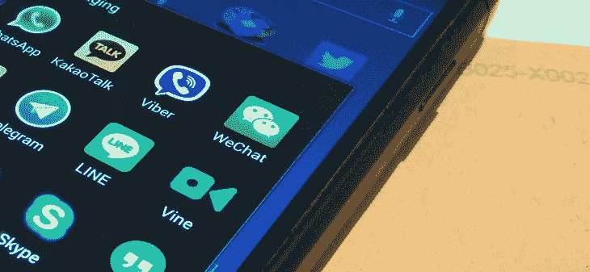
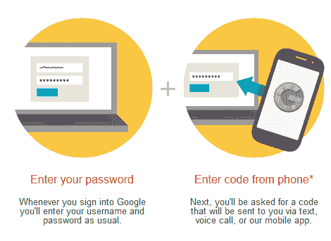

# 2015 年为什么还有人用短信？

> 原文：<http://thenextweb.com/future-of-communications/2015/02/16/people-still-using-sms-2015/?utm_source=wanqu.co&utm_campaign=Wanqu+Daily&utm_medium=website>

短消息服务(SMS)，俗称“文本”，是一种通过移动网络发送短消息的协议。第一条短信是 1992 年发的；到 2010 年，SMS 是使用最广泛的数据应用程序，80%的移动用户采用它。

然后，智能手机崛起了。

智能手机为消费者通过各种渠道进行沟通铺平了道路——从电子邮件和即时消息到内容丰富的消息应用程序。

然而，尽管其他通信渠道在增长，SMS 仍然被广泛使用，并且仍然是主要的通信渠道之一。为什么？这里有四个至关重要的原因。

### 短信是联系用户最有效的方式，几分钟内阅读率高达 90%

当谈到交付的及时性时，与电子邮件和 OTT 应用程序相比，短信保持了最高的参与率。

只要你有手机和服务计划，短信就可以使用。这使得它的全球影响力飙升，因为不需要预先存在的连接，例如接受好友请求或要求双方下载相同的应用程序。

较低的通信障碍使用户可以快速接收信息，这使它成为发送简短、时间敏感内容的理想选择。

### 短信是一种通用的解决方案，它让任何人(有手机号码的)都可以联系到

发送和接收短信的技术不依赖于高速互联网，本质上使现代社会中的任何人都可以联系到。

[

<noscript></noscript>](https://thenextweb.com/wp-content/blogs.dir/1/files/2014/06/Mobile-Messaging-Apps-General.jpg) 

WhatsApp、Facebook Messenger、Viber 和微信等高端消息应用程序只有在连接到网络时才能运行。不同的应用还需要不同的硬件和软件兼容性，淘汰了使用 OTT 应用不支持的功能手机或智能手机的用户。

例如，并非所有的 OTT 消息应用都可以在 Firefox OS、Windows、Blackberry 或 iOS 和 Android 的传统版本上使用。

相比之下，用户不需要连接到网络或拥有同一应用程序的成员资格就可以接收短信。

### A2P 部门的中断使得全球电信网络更容易进入

SMS 可以分为个人对个人(P2P) SMS，其中两个移动用户交换消息。

另一方面，应用程序对个人(A2P)短信允许应用程序向移动用户发送消息。A2P 短信的典型用例包括支付确认、约会提醒、银行账户更新、移动售票、航班更新等。

传统 A2P 短信服务的问题在于，该流程很笨重，而且公司部署起来成本高昂。传统方法要求公司在访问各种网络运营商的短信库存之前，与各种中间商联系，如短信聚合商、网关提供商、营销商和经销商。

如今，新一代云通信平台利用易于部署的技术来提高消息传递的质量。他们还将云服务的按使用付费成本模式与简单的电话应用程序接口(API)工具相结合，使开发人员能够轻松集成到他们的应用程序中，同时保持较低的运营成本。

实际上，这绕过了对中间商的需求。通过直接访问全球电信网络，公司获得了更快的交付时间和更好的服务可靠性。

这使得更多的公司——尤其是初创公司——和应用程序开发人员可以使用 A2P 短信，这些人以前受到传统途径所需的人力和财力资源的限制。

### 通过 SMS 实现双因素身份验证和安全性的增长

[

<noscript></noscript>](https://thenextweb.com/wp-content/blogs.dir/1/files/2015/02/google-2fa.png) 

随着移动设备的激增，越来越多的个人数据通过网络传输。为了增加一层安全性，双因素身份认证已成为公司保护其用户的首选方法。

使用 SMS 作为认证方法越来越受欢迎，因为用户几乎总是在任何给定时间拥有移动设备。发送短信的成本也非常低，而其 2FA 的语音通话的便利性使短信更适合当今快节奏的社会。

使用短信作为双重认证(如果激活的话)步骤的公司包括谷歌、苹果、脸书、Twitter、Dropbox、PayPal 和 LinkedIn。

今天，短信可能被视为过时的技术，但事实是，短信在连接大多数现代技术方面发挥着关键作用。从它的高用户参与率和 2FA 的好处，到它在 A2P 市场的颠覆性，我们不会看到 SMS 很快消失。

**阅读下一篇:** [短信 vs .推送通知 vs .邮件:你的 app 应该什么时候用什么？](https://thenextweb.com/news/sms-vs-push-vs-email)