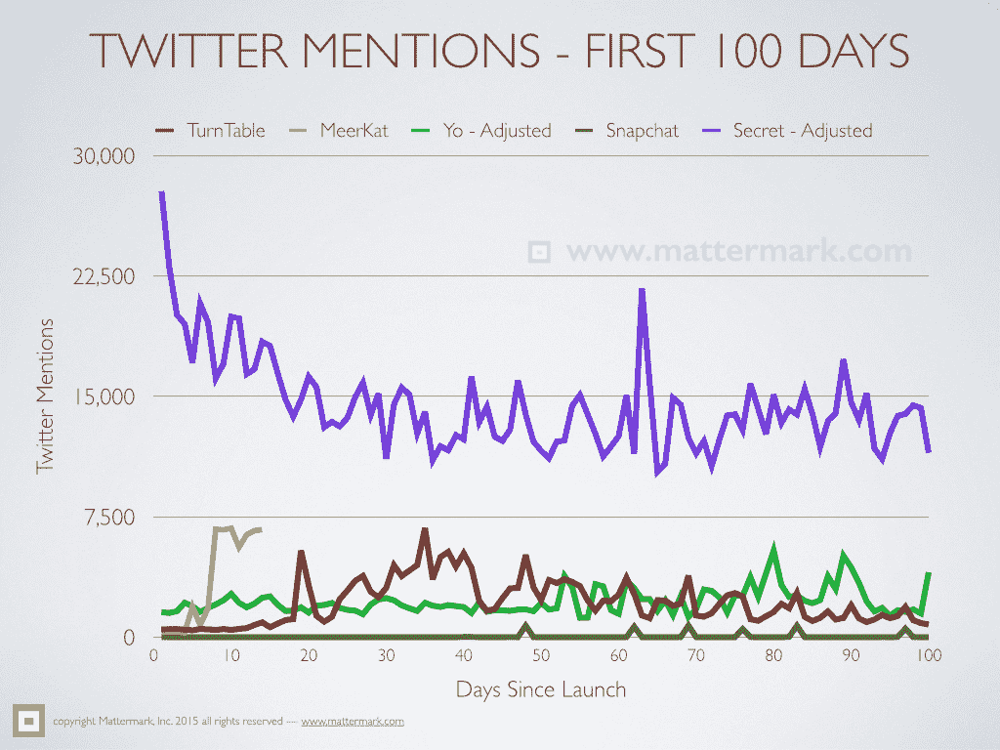

# Mattermark 午餐时间数据点心:Meerkat vs. TurnTable 的前 14 天，哟，Snapchat & Secret - Mattermark

> 原文：<http://mattermark.com/mattermark-lunchtime-data-snack-the-first-14-days-of-meerkat-vs-turntable-yo-snapchat-secret/?utm_source=wanqu.co&utm_campaign=Wanqu+Daily&utm_medium=website>

我们很高兴地宣布 Mattermark 重新成为一家独立公司！

[Learn More →](https://mattermark.com/blog)

<main id="site-body">

我相信你们很多人已经看到了，我对移动生活流媒体应用程序 [Meerkat](http://meerkatapp.co/download) 非常着迷，我已经分享了几乎所有的东西——从办公室的小狗到我们的公司会议，在旧金山美丽的地方散步，以及在我最喜欢的地方吃早午餐。

我很好奇 Meerkat 前两周在 Twitter 上的提及次数与其他受欢迎的消费产品相比如何。以下是五家模式迥异的公司推出的前 100 个产品的明细。

copyright Mattermark © 2015 (Source: Mattermark Research, Source: Crunchbase, Source: AngelList)

在@Mattermark 上发推文给我们，让我们知道你的想法 Meerkat 会像 Snapchat 一样大还是会走转盘的路？他们会在 SXSW 称霸，会有分水岭时刻吗？

</main>