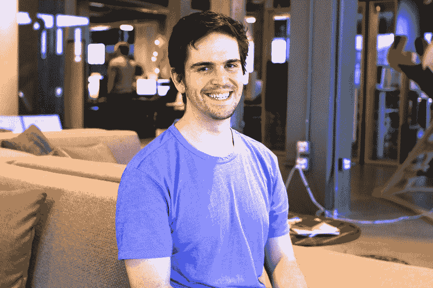
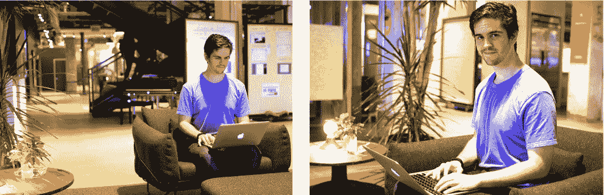
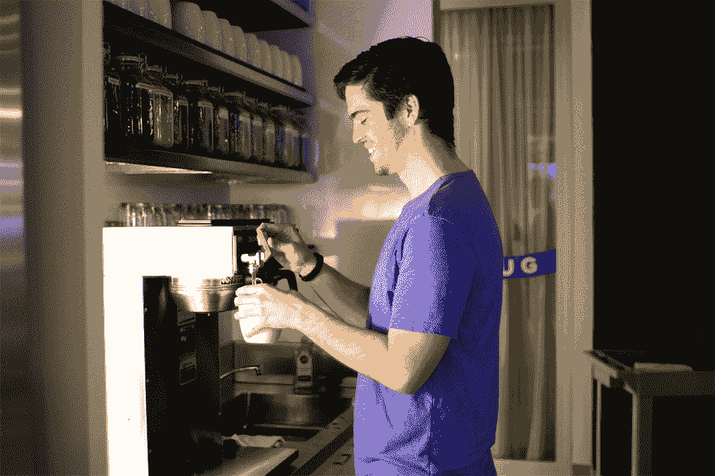
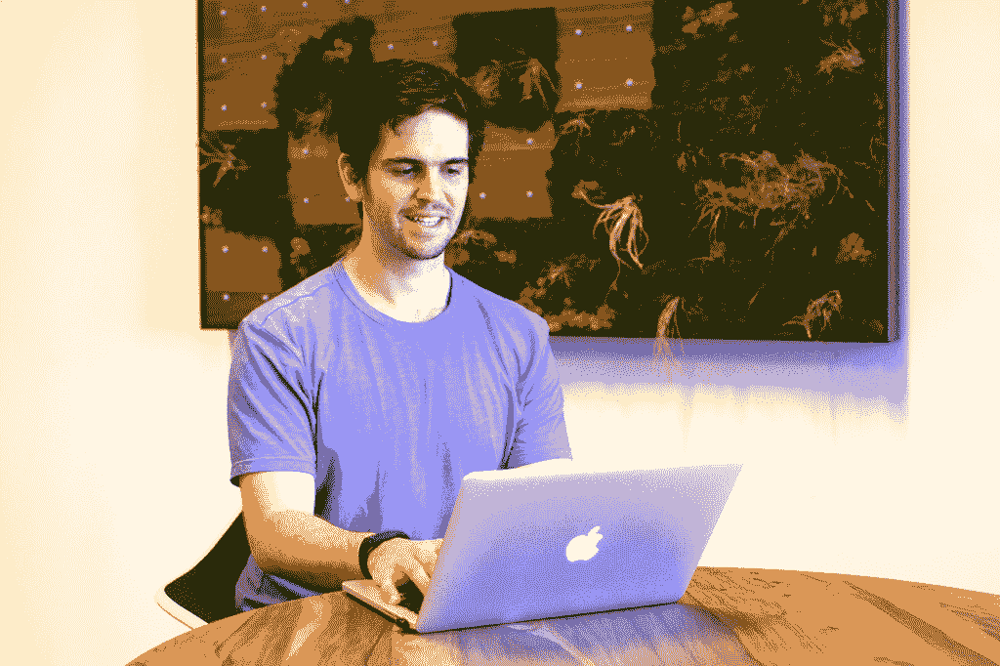

# 提高 Asana 的开发人员生产力:Phips Peter

> 原文：<https://blog.asana.com/2015/05/phips/?utm_source=wanqu.co&utm_campaign=Wanqu+Daily&utm_medium=website>

这篇文章是系列文章的一部分，旨在让你深入了解那些让阿萨纳成为[工作](https://asana.com/jobs)的特殊场所的人们的日常生活。我们之前给你介绍过[耶夫](https://blog.asana.com/2015/03/meet-yev-helping-customers-succeed-with-asana/)和[弗兰克](https://blog.asana.com/2015/03/sales-frank-mayfield/)。

Phips Peter 是从东海岸移居到旧金山的人，目前在我们的 web 技术团队工作(并在[工程博客](https://eng.asana.com/2014/11/asana-switching-typescript/)上写了相关内容)。自从近两年前加入 Asana 以来，他已经在我们工程组织的三个不同团队中工作过，包括通信、性能和网络技术。我们坐下来和他聊了聊作为一名产品工程师的日常生活，他的角色与传统的工程角色有何不同，以及一次跨国公路旅行如何让他来到了硅谷。

## 开始:菲普斯的阿萨纳之路

### 你什么时候学会编程的？

实际上，有点意外。从小到大，我的父母都在银行工作，尽管我妈妈实际上知道如何编程。我在成长过程中多少接触到了编程，并最终在高中自学了编程。

### 你在大学学什么？

当我上大学的时候，我认为成为一名工程师不是一条合理的职业道路(事后看来这很有趣)。我一开始是经济学专业，最终转到了政治学，到了大二的春天，我又加了一个 cs 的双学位。

### 你是怎么去西海岸的？

在一所医学院实习后，我的老板告诉我，我在软件开发方面似乎相当不错，应该申请其他地方，于是我去了硅谷。我找到了一份实习工作，从那以后我一直在技术部门工作。

### 你为什么决定加入 Asana？

这是各种因素的结合:任务、人员，而且总体感觉不错。

首先，我们试图解决的问题似乎真的很有趣:我曾尝试制作自己的任务跟踪应用程序，所以我真的理解其中的哲学，并相信这项任务。我也用过这款产品，觉得它的技术很酷。当我来到现场，感受这里的气氛和人们时，感觉很好。尽管如此，我的面试中有一部分真正打动了我。

### 那是什么？

在我对基础设施工程师阿莱士·史密斯的最后一次采访中(那是在一个周五的深夜)，我们谈了两个小时。我觉得我通过面试学到了很多东西——不仅仅是他在拷问我。就在那时，我意识到，如果我加入 Asana，我将比在其他任何地方学到更多。

[T2】](http://blog.asana.com/wp-content/post-images/phips3-e1429658791446.jpg)

### 你第一周的亮点是什么？

能够在我的第一天签入代码并在生产中看到它是非常酷的。我也被这种文化震撼了。我第一天上班时，产品工程师杰克·哈特(Jack Heart)穿着连帽衫和牛仔裤，穿着粉色芭蕾短裙，穿着中世纪盔甲，戴着长耳环，肩膀上坐着一只猫。我记得我在想，“猫坐在你的肩膀上？！真是疯了！”现在我知道猫通常不会坐在人们的肩膀上，但第一天真的让我觉得和我的团队在一起很舒服。

## 像体式一样成长

### 自从你加入这个团队后，你的角色有什么变化？

自从加入以来，我一直都是两人一组:很长一段时间和我的导师贝拉·卡兹韦尔一起，然后是约什·史密斯，现在是凯文·德。

在 Asana 开始我的职业生涯，和 Bella 一起工作帮助我以一种积极的方式学习和成长。我学会了成为一名更好的工程师。有原始的工程天赋(产生代码的能力)，然后是产生的代码的质量，她真的帮助提高了我产生的代码的质量。当我开始的时候，她刚休完产假回来，这很有趣。她也在学习东西，但她有更多的背景——感觉我们在一起学习，这很好。

和 Josh 一起工作很不一样，更像和同龄人一起工作，因为我们几乎同龄。作为一名工程师，乔希同样出色，但他的技能与我不同。我们在性能团队工作，我了解了我们框架的所有优点和缺点。我们还意识到，在我们现有的框架上，我们无法实现我们想要的性能，这让我想到了我现在正在与 Kevin 一起做的事情。****T3】****

 **现在我和凯文一起工作，这很棒——他有很多做类似工作的经验，所以我学到了很多。

[T2】](http://blog.asana.com/wp-content/post-images/phips4-e1429659161433.jpg)

### 你现在做的工作和你过去做的有什么不同？

我现在不是接受工程培训，而是一名项目主管，这需要更多的项目管理。我在许多团队中工作，促进协作，并从依赖于我的项目的所有移动部分收集反馈——就好像我是使用框架的工程师的项目经理。

### 每天来上班有什么让你兴奋的？

我希望 Asana 更快，我希望我们的开发人员有一个惊人的经验建设 Asana。投资开发人员的生产力对公司非常有利。能够在一个快速、易于维护和测试的稳定框架上更快地发布更高质量的特性，不仅让我们的开发人员受益，也让我们的客户受益。这就是让我兴奋的地方。

### 你认为是什么让我们的工程文化与众不同？

有很多不同点，但首先想到的是正念。我们在快速行动和不至于让我们的工程师筋疲力尽之间取得了很好的平衡。

每个人也是一个真正强大的工程师，并愿意教和学。我可能很有经验，但我觉得和我一起工作的每个人都有东西可以教我。在这里工作的最大好处是，我可以向所有这些出色的工程师寻求建议和帮助，甚至是我们的联合创始人贾斯汀&达斯汀，他们非常乐于助人。

年轻雇员也有很多机会。我们的 [AoR 系统](https://blog.asana.com/2014/12/workstyle-aors/)鼓励多样化的职责，因此新员工在早期就被分配了职责。例如，我在从这里开始的 3 天内就有了下拉菜单。**T3**T5】

### 你在 Asana 的成功之路是怎样的？

现在，成功将完成我目前的项目。在开始这项工作之前，我想我会想回去做一名产品工程师，但我真的很喜欢在整个过程中与许多团队和开发人员合作，所以我想保留这一元素。我不知道接下来会发生什么，但我肯定会有其他挑战，我会继续重新定义成功对我的意义。这是整个过程的一部分，想想就令人兴奋。

### 你对种植体式有什么看法？

我很兴奋。我们正在迅速而谨慎地发展公司，试图增加人手，但不只是为了招人而招人。我认为，现在我们的产品管道中有很多东西将帮助我们获得用户并增长得更快，这将把我们推向新的高度。

## 工作方式和生活方式

[T2】](http://blog.asana.com/wp-content/post-images/phips1.jpg)

### 你通常如何开始你的一天？

当我醒来时，我总是在去健身房之前先清理我的收件箱。在健身房，我收件箱里的所有东西都解决了，我可以在不同的环境中思考问题。之后，我通常在 9:30 或 10:00 前往办公室吃早餐。

### 你在白天遵循一个惯例吗？

我每天早上与其他团队合作、协调和支持。凯文和我与我们支持的团队坐在一起工作，我们与全公司的团队开会，了解他们的需求，让他们知道我们这边发生了什么。这是一个非常合作的过程。

在傍晚和晚上，当人们更好地准备好他们需要的东西时，我专注于我个人的贡献者任务，比如编码。

当我结束工作时，我通常回家和我的女朋友一起吃晚餐。

### 你最喜欢的体式传统是什么？

我真的很喜欢这面旗帜，它象征着同伴的认可，在全体会议上得到通过。拥有旗帜的人可以根据他们最近做出的贡献或完成的事情，选择一个人或团队来传递旗帜。我认为它很好地提高了团队对产品或公司不太显眼部分的认识。每个人都付出了很多努力，很高兴看到这一点得到了认可。****T3】****

 **### 哪个[体式价值观](https://asana.com/company)最能引起你的共鸣？

整合和平衡对立面。我喜欢收集一堆想法，并试图务实地将它们结合起来。这引起了共鸣，尤其是因为我们的框架没有教条地结合了所有事物的最佳部分。我们用自己的方式让它工作，这很酷。

[T2】](http://blog.asana.com/wp-content/post-images/phips5.jpg)****