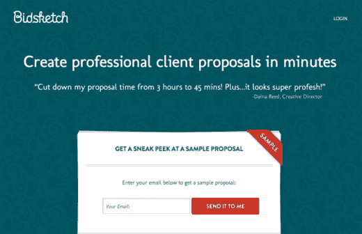
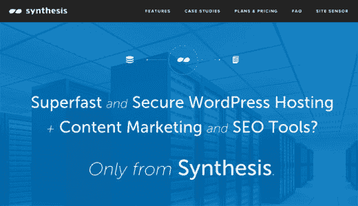
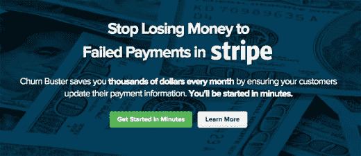
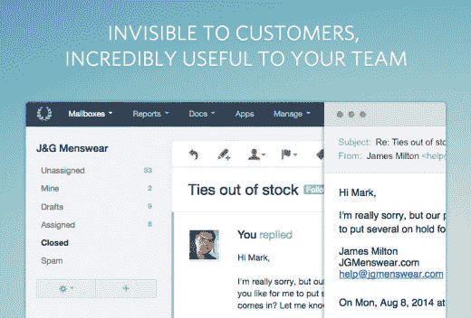

# 撰写有效的价值主张

> 原文：<http://thenextweb.com/insider/2015/05/15/writing-value-propositions-that-work/?utm_source=wanqu.co&utm_campaign=Wanqu+Daily&utm_medium=website>

一个定义明确的问题就解决了一半。但是到达那里比你想象的要困难。

进入价值主张的世界。从公司的角度来看，提出“这就是为什么你应该从我们这里购买”似乎很容易:它已经了解自己的产品，可能高估了感知的好处。现实是有各种各样的惯性需要克服。

沟通是困难的，如果你想有说服力，它需要逐级传递到每一个层面。编造一个新的标题不算数。

让我们来看看是什么。

### 当简单被高估时

“[bland advertising](http://contentverve.com/blandvertising-how-to-move-beyond-wallpaper-copywriting/)”通过最佳实践回音室发生，而不是实际了解客户的成功结果是什么样的。

相对于复杂，我们通常更喜欢简单，但这并不意味着*简单*最受关注，或者甚至与客户期望的结果不符。前[关于营销实验的案例研究](http://www.marketingexperiments.com/site-optimization/radical-redesign.html)展示了一个确实如此的测试。下面两个标题进行了对比测试:

*   吹头垫圈的简单固定
*   仅在一小时内修复破裂的封头垫圈

还做了其他有意义的改变(交流是全方位的)，但第二个例子使转化率提高了 58%。“修复”的复杂性毫无意义；在一小时内完成是值得注意的。

布兰德总是破产。从确定你的客户想要实现什么开始。什么样的具体结果听起来像成功？与他们交谈，很好地定义它，并清楚地陈述它——这对他们来说就是音乐。

### 认真销售

一个引人注目的价值主张有许多责任。

令人震惊的是，告诉你的客户“只管去做”并不在其中。当你有十亿美元的广告预算时，标语是很好的会议室材料。对我们其他人来说就不是了。

这是你想要的:

*   **相关结果:**引人注目的上下文。提醒客户他们当前的头疼问题，并解释他们的情况将如何改善。展示其他客户是如何通过你的产品获得成功的，并展示清晰的前后对比——这种对比让人感觉可以实现，并能说明他们想要的结果。
*   **明确的好处**:变得具体意味着没有多少想象空间。代替销售“简单的提案软件”， [Bidsketch](https://www.bidsketch.com/) 承诺帮助你“在*分钟*内创建专业的客户提案”

[

<noscript></noscript>](https://thenextweb.com/wp-content/blogs.dir/1/files/2015/05/bidsketch-value-prop.jpg) 

### 定义实际价值

价值是客户得到的东西，为了很好地说明这一点，你必须理解客户为什么使用你的产品。你的报告是用来挖掘数据还是给老板一个令人信服的演示？这会影响你向潜在客户展示的方式。

优先考虑你的不同点，这就是为什么你的解决方案在某些方面优于竞争对手的原因。您的解决方案能做哪些别人做不到的事情？[综合](http://websynthesis.com/)吹捧其他网站主机没有的发布工具。

[

<noscript></noscript>](https://thenextweb.com/wp-content/blogs.dir/1/files/2015/05/synthesis-value-prop.jpg) 

表达你的观点需要抓住并保持客户的注意力。让我们谈谈那个。

### 让它明明白白

“我在哪里？这是什么？”这是每个访问你网站的新访客的起点。难怪眼球追踪研究一直显示标题优先；它们是潜在客户下一步想去哪里的路标。

对于页面的大部分内容来说，电梯间距可能很大，但折叠上方的信息必须比纽约市的行人移动得更快。在网上，人们甚至会对他们关心的事情加速。你能向街上走过的人传达价值吗？

[

<noscript></noscript>](https://thenextweb.com/wp-content/blogs.dir/1/files/2015/05/churnbusterio.jpg) 

细节很重要。每个元素都有所贡献，这意味着“几分钟内开始”通常会胜过一般的“注册”按钮。

是的，客户会滚动，但你唯一的保证是上面的项目，做所有繁重的工作。不要过分强调银子弹，而是要让拼图的每一块都有价值。

### 为什么是这个而不是那个？

在市场营销中，“动机”通常被认为等于感知收益减去感知成本。差异化在这里很有帮助，但只有当你在某种程度上与众不同，符合客户想要做的工作时。

顾客完全看不见。我们在我们的网站上广泛展示这一功能，因为它让我们的客户在处理电子邮件支持时不会失去个人风格，这通常是他们最希望从帮助台获得的。

[

<noscript></noscript>](https://thenextweb.com/wp-content/blogs.dir/1/files/2015/05/help-scout-differentiate.jpg) 

另一方面，平价点是基于预期销售的，也就是你的客户希望看到的特性。你可以背诵“特征说明一切，利益驱动一切”直到你脸色发青，但是有时候扳手就是扳手。工具也可以根据它们的特性来判断。

[我们有一个“所有功能”](https://www.helpscout.net/features/all-features/)页面，供那些需要标出被视为入门费用的功能的用户使用。行业标准的提及是好的，但是一般的功能也就到此为止(“我们的铅笔是带橡皮的！”).

[

<noscript></noscript>](https://thenextweb.com/wp-content/blogs.dir/1/files/2015/05/help-scout-all-features.jpg) 

在帮助台保存回复不仅是常见的，也是意料之中的。在这些领域中，你可能与竞争对手不相上下，但是对于最重要的结果，你需要闪耀。

### 使用客户的语言

无所不包的语言是交流价值观的对立面。

我们的许多营销页面都提到了“电子邮件从缝隙中溜走”、“踩到对方的脚趾”和“使用 Gmail 令人头疼”。

我们使用这些短语是因为我们的客户使用这些短语。你首先围绕你期望听到的愿望和结果写文案；你根据你实际听到的愿望和结果修改它。你希望潜在客户说:“你好像读懂了我的心思！”

这一步是不能跳过的，所以要和你的客户交流。密切关注反馈是许多关键任务见解的起源，客户如何谈论他们的问题就是其中之一。

### 强化你的案例

在成为一个被过度使用的陈词滥调之前，“保证满意”是一个达成交易的承诺。当投射价值时，考虑一些不会失去光彩的关键支持者。

以下是一些永恒的方法:

**客户评价**
人们喜欢听到其他已经做出改变的人的意见。问题是相关的，结果是真实的。然而，使用不知名的、普通的引用会破坏这种潜力。大部分公司认输太早，用“XYZ 主机好快！”继续找。

保证
保证是看到一个可行的结果。本质上，你是在说，“即使一切都错了，这是让你恢复正常的方法。”不管那是不是意味着，“爱上它或者 30 天后寄回，不收费！”或者“有了 30 天的免费试用期，就没有风险了”，坚持展示他们会得到照顾。

**社交证明**
看看你的客户最关注的公司和他们最崇拜的公司。光环效应可能会为最受认可的客户辩护，但结果才是游戏的名称——你的客户喜欢模仿谁？

**微触元素**
最后进场。我最近注册了一个应用程序，它可以在结账时共享支持响应时间。这没有主页所需要的吸引人的说服力，但在完美的点上，它做了一些繁重的工作。

**做好沟通的责任**

营销清楚地表明了客户需要听到的真相。如果没有令人信服的价值主张，那些可能受益最大的人将会被忽略。

这项工作还没有完成，因为你已经建立了一个更新、更好的产品。除非感知的收益远远大于损失，否则客户将保持不变。你影响客户如何看待这些得失。展示价值的最好方式之一就是比任何人都清楚你的产品推出前后的生活是什么样的。你必须让客户相信结果是真实的，值得付出努力。

俗话说，价格是你付出的，价值是你得到的。

传达价值意味着清楚地定义他们应该购买的原因。

**阅读下一篇:** *[为什么沉默是创业杀手](https://thenextweb.com/news/why-silence-is-a-startup-killer)*

*图片来源:[Unsplash](https://unsplash.com)T3】*

*这篇文章最初出现在[help scout](https://www.helpscout.net/blog/value-proposition/)T3 上*